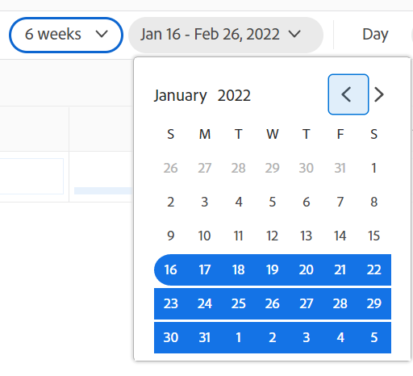
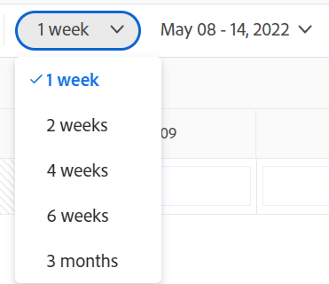
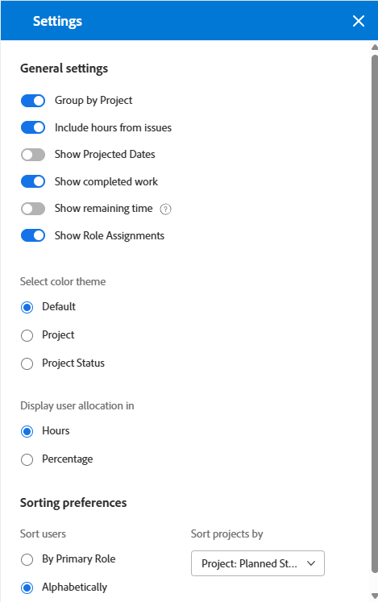
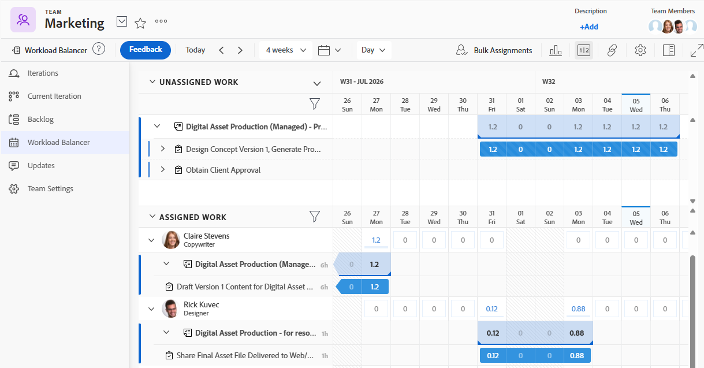

# 瀏覽工作負載平衡器

<!--Audited: 12/2024-->

使用Adobe Workfront中的工作負載平衡器，根據使用者的可用性將工作指派給使用者。 本文說明如何使用設定和選項瀏覽工作負載平衡器並顯示與您相關的資訊。 此處列出的其他文章說明如何使用工作負載平衡器管理您的資源及其配置以進行運作。

工作負載平衡器可在Adobe Workfront的多個區域使用。 導覽它在所有區域都類似。

如需工作負載平衡器所在位置的詳細資訊，請參閱[找到工作負載平衡器](https://experienceleague.adobe.com/en/docs/workfront/using/manage-resources/the-workload-balancer/locate-workload-balancer)。

## 存取權要求

+++ 展開以檢視這篇文章中所述功能的存取權要求。

<table style="table-layout:auto"> 
 <col> 
 <col> 
 <tbody> 
  <tr> 
   <td>Adobe Workfront 封裝</td> 
   <td>
任何
</td>
  </tr>
  <tr> 
   <td>Adobe Workfront授權</td> 
   <td>
標準

       
計畫：在資源區域使用工作負載平衡器；工作，使用團隊或專案的工作負載平衡器
</td>
  </tr>
  <tr> 
   <td>存取層級設定</td> 
   <td> 
檢視以下專案或更高存取權：
 
    <ul> 
     <li>資源管理</li> 
     <li>專案</li> 
     <li>任務</li> 
     <li>問題</li> 
    </ul>
   </td> 
  </tr> 
  <tr> 
   <td>物件許可權</td> 
   <td>檢視專案、任務和問題的許可權或更高</td> 
  </tr> 
 </tbody> 
</table>

如需詳細資訊，請參閱Workfront檔案中的[存取需求](/help/quicksilver/administration-and-setup/add-users/access-levels-and-object-permissions/access-level-requirements-in-documentation.md)。

+++

## 檢視工作負載平衡器中專案的考量事項

檢視工作負載平衡器時，請考量下列事項：

* 工作負載平衡器會根據其指派在兩個不同的區域顯示工作專案。 工作專案和使用者會顯示在下列區域中：

  * **未指派的工作**：沒有指派或僅指派給工作角色或團隊的專案。
  * **指派的工作**：至少指派給一個使用者的專案。 指派的專案會顯示在指派的使用者名稱下。

  >[!NOTE]
  >
  >* 指派給工作角色或團隊的工作專案，以及指派給使用者的工作專案，會顯示在「未指派的工作」區域中，並在「已指派的工作」區域中的已指派使用者名稱下方。
  >* 指派給使用者和工作角色的工作專案（工作角色被選取為專案的主要受指派者）會顯示在「未指派的工作」區域中。
  >* 指派給多個使用者的工作專案會顯示在「已指派的工作」區域中所有已指派使用者的名稱下。
  >* 啟用「顯示角色指派」設定時，角色指派會顯示在「未指派工作」區域的工作專案下。 如需詳細資訊，請參閱本文中的[自訂檢視](#customize-the-view)一節。

  如需詳細資訊，請參閱[工作負載平衡器](/help/quicksilver/resource-mgmt/workload-balancer/assign-work-in-workload-balancer.md)中指派工作的總覽[工作負載平衡器](/help/quicksilver/resource-mgmt/workload-balancer/assign-work-in-workload-balancer.md#assignment-areas-in-the-workload-balancer)中的指派區域。

* 當專案在一段時間內沒有任務時，專案層級的列在該時間內為空白。

  

* 當您沒有檢視特定專案的許可權時，它們會顯示為&#x200B;**無法存取的工作專案**&#x200B;或&#x200B;**無法存取的專案**。

  

* 工作專案的名稱會顯示在左側，而時間軸則會顯示在右側。
* 每個工作專案的計畫時數總計會顯示在工作專案名稱的右側，以及代表工作專案時間表之長條的左側。
* 每個專案的總計畫時數會顯示在專案名稱的右側，以及代表專案時間表之列的左側。

  專案的計畫時數資訊是工作負載平衡器所列之所有專案的計畫時數總計，而不是專案上的計畫時數總計。

如需有關在工作負載平衡器檢視資訊的詳細資訊，另請參閱以下文章：

* [找到工作負載平衡器](../workload-balancer/locate-workload-balancer.md)
* [在工作負載平衡器中篩選資訊](../workload-balancer/filter-information-workload-balancer.md)
* [使用連結共用工作負載平衡器](../workload-balancer/share-link-for-workload-balancer.md)
* 使用摘要[更新工作負載平衡器中的工作專案](../workload-balancer/update-items-in-summary-panel-in-workload-balancer.md)

如需有關使用工作負載平衡器管理資源的資訊，另請參閱下列文章：

* [在工作負載平衡器中指派工作的總覽](https://experienceleague.adobe.com/en/docs/workfront/using/manage-resources/the-workload-balancer/assign-work-in-workload-balancer)
* [在工作負載平衡器中管理使用者配置](https://experienceleague.adobe.com/en/docs/workfront/using/manage-resources/the-workload-balancer/manage-user-allocations-workload-balancer)

## 在資源區域瀏覽工作負載平衡器多個專案

瀏覽工作負載平衡器在您從中存取它的所有區域都類似。

以下小節說明如何在工作負載平衡器中檢視多個專案的資訊。

您可以調整工作負載平衡器中的一些設定和選項，以顯示您最需要關注的時間範圍內的資訊。

選取您要套用至檢視的設定後，工作負載平衡器會在您每次從任何瀏覽器或裝置存取它時記住這些設定。

### 存取工作負載平衡器資源區域中的多個專案

若要導覽多個專案的工作負載平衡器：

{{step1-to-resourcing}}

1. 按一下左側面板中的&#x200B;**工作負載平衡器**。

   

   工作負載平衡器顯示從本週開始的工作指派資訊，包括以下兩個區域：

   * **未指派的工作**&#x200B;區域會顯示下列工作專案：

     * 指派給角色、團隊或未指派的工作專案（任務和問題）會在您套用篩選器後顯示。
       依預設，「未指派的工作」區域不會顯示任何工作專案。 我們建議使用篩選器在此區域顯示您的相關資訊。

       如需有關使用篩選的資訊，請參閱工作負載平衡器](../workload-balancer/filter-information-workload-balancer.md)中的[篩選資訊。

     * 工作專案下的角色指派僅在您啟用「顯示角色指派」設定時顯示。 如需詳細資訊，請參閱本文中的[自訂檢視](#customize-the-view)一節。

     * 專案僅在您啟用依專案分組設定時顯示。 如需詳細資訊，請參閱本文中的[自訂檢視](#customize-the-view)一節。

   * **指派的工作**&#x200B;區域會顯示下列工作專案：

     * 依預設，系統中的所有作用中使用者都會顯示在此區域中。 我們建議使用篩選器來限制此區域的資訊量。 如果將使用者指派給專案，則工作專案也會顯示在他們的名稱下。

     * 指派給至少一個使用者的任務和問題會顯示在該使用者的名稱下。

       在「已指派的工作」區域中，使用者名稱下的工作專案會依下列條件排序，順序如下：

       1. 計劃開始日期（最舊日期在前）
       1. 計畫完成日期（最舊日期在前）
       1. 依專案字母順序（僅當前兩個條件對於多個工作專案相同時）

          >[!TIP]
          >
          >* 您可以從「排序專案依據」設定中選取選項，以自訂專案排序。
          >
          >* 專案僅在您啟用「依專案分組」設定時顯示。
          > 
          >如需自訂設定的相關資訊，請參閱本文中的[自訂檢視](#customize-the-view)一節。

1. （選擇性）在&#x200B;**指派的工作**&#x200B;區域中按一下&#x200B;**篩選器**&#x200B;圖示，然後在篩選器方塊的&#x200B;**建議**&#x200B;區域中選取&#x200B;**預設篩選器**。

   套用「預設」篩選器時，屬於您任何團隊的使用者及其工作專案都會顯示。 您可以編輯此篩選的復本。

   >[!TIP]
   >
   >預設篩選器僅在資源區域的工作負載平衡器中可用。

1. 繼續進行以下步驟以瀏覽工作負載平衡器：

   * [在工作負載平衡器中選取時間範圍](#select-a-time-frame-in-the-workload-balancer)
   * [自訂檢視](#customize-the-view)
   * [指派工作專案並調整使用者配置](#assign-work-items-and-adjust-user-allocations)
   * [在圖表中檢視配置](#view-allocations-in-a-chart)

### 在工作負載平衡器中選取時間範圍

1. 存取&#x200B;**資源**&#x200B;區域中的工作負載平衡器，如本文中[存取資源區域中的多個專案的工作負載平衡器](#access-the-workload-balancer-for-multiple-projects-in-the-resourcing-area)一節中所述。

   工作負載平衡器顯示從本週開始的工作指派資訊。

1. 使用水準捲動來檢視超出熒幕限制的工作專案時間軸。
1. 按一下左上角的&#x200B;**上一頁或下一頁**&#x200B;圖示以瀏覽時間軸，然後按一下&#x200B;**今天**&#x200B;以返回當週。
1. 按一下工具列上的&#x200B;**時間範圍下拉式功能表**，然後按一下您要顯示期間的開始日期。 依預設，在行事曆上選取的第一週是您導覽的目標周。

   

1. 從下列選項選取您要在工作負載平衡器中一次顯示的周數：
   * 1 週
   * 2 週
   * 4週。 這是預設設定。
   * 6 週
   * 3 個月

   

1. 按一下工具列中的下列選項之一，可依不同的時間範圍顯示資訊：
   * **Day**：依預設會依日期顯示從今天日期開始的4週資訊。
   * **周**：按周顯示資訊四周。
   * **月**：顯示三個月資訊（依月份）。

1. 繼續瀏覽工作負載平衡器，如以下小節所述。

### 自訂檢視

1. 存取&#x200B;**資源**&#x200B;區域中的工作負載平衡器，如本文中[存取資源區域中的多個專案的工作負載平衡器](#access-the-workload-balancer-for-multiple-projects-in-the-resourcing-area)一節中所述。

   工作專案的名稱會列在左側，並由工作負載平衡器右側的長條表示。 長條圖長度代表工作專案的時間表。

1. （選擇性和建議性）使用「未指派工作」和「已指派工作」區域中的篩選器，僅顯示與您相關的工作專案或使用者。

   如需詳細資訊，請參閱工作負載平衡器](../workload-balancer/filter-information-workload-balancer.md)中的[篩選器資訊。

   根據預設，藍色列代表專案和任務的時間表，而栗色列代表問題。

   當您選取符合專案的顏色主題時，可以變更專案和任務的長條顏色。 如需詳細資訊，請繼續閱讀此程式。

   「已指派的工作」區域中的工作專案會依下列條件依序依專案排序：
   1. 計劃開始日期（最舊日期在前）
   1. 計畫完成日期（最舊日期在前）
   1. 依專案字母順序（僅當前兩個條件對於多個工作專案相同時）

1. 按一下「未指派」或「已指派」區域左側的&#x200B;**向右箭頭**，以展開專案名稱（在「未指派」區域中）和使用者名稱（在「已指派」區域中）下的所有專案。

   >[!TIP]
   >
   >只有在啟用「依專案分組」設定時，工作專案才會列在「未指派」區域的專案名稱下。

1. 按一下「未指派」或「已指派」區域左側的&#x200B;**向下箭頭**，以收合專案名稱（在「未指派」區域中）和使用者名稱（在「已指派」區域中）下的所有專案。

1. 將滑鼠懸停在上方，然後將&#x200B;**分隔線**&#x200B;拖放到左側面板和時間軸區域之間，以調整左側面板的大小。

   

1. 按一下&#x200B;**設定**&#x200B;圖示。

   「設定」面板會顯示在右側。

   

   從下列選項中選取以更新您在工作負載平衡器中檢視的資訊，然後按一下「設定」方塊右上角的&#x200B;**X圖示**&#x200B;以關閉它。

   * **依專案分組**：選取此專案時，會依專案將「未指派」和「已指派」工作區域中的專案分組。 依預設會選取此選項。

   * **包含來自問題的時數**：選取此專案時，指派給使用者的問題會顯示在「已指派工作」區域中該使用者的名稱下，而未指派給使用者的問題會顯示在「未指派工作」區域中。 從問題到計畫時數的計畫時數，專案和已指派工作區域中的使用者。
   * **顯示預計日期**：選取此專案時，除了計畫時間表外，還會顯示工作專案的預計時間表。 請注意下列事項：
     * 專案、任務和問題的預計時間表會在任務、問題和專案列上方顯示為深藍色線條。
     * 在計畫時間表之外的投影時間表會以淺藍色顯示，即使您更新顏色主題也是如此，如下所述。
     * 您無權檢視之專案的投影時間表會以淺灰色顯示，下方有一條直線。
     * 當任務或問題在到期計畫完成日期前完成時，剩餘天數的配置數量會被刪除，且不計入使用者的配置。 唯有同時啟用「顯示預計日期」設定和「顯示配置」圖示時，才會顯示這個選項。

     >[!TIP]
     >
     >請注意，當工作專案的計畫或預計時間表（不一定同時發生）發生在所選的時間範圍時，工作專案會顯示在工作負載平衡器中。

   * **顯示已完成的工作**：啟用時，已完成的任務和問題會顯示在[指派的工作]區域中。 這預設為啟用。

     任務或問題列完成時，其右上角會顯示綠色核取記號圖示。 當專案所選時間範圍內的任務或問題完成時，專案會顯示相同的圖示。

     >[!NOTE]
     >
     >工作負載平衡器中的任務可見度由任務層級的完成驅動，而不是指派層級的完成。 如果任務有多個受指派人，且一個或多個受指派人選取「完成我的部分」，但整體任務狀態不是「完成」，則該任務會被視為未完成的工作。 當&#x200B;**顯示已完成的工作選項**&#x200B;關閉時，工作仍會顯示，因為它尚未完全完成。

   * **顯示剩餘時間**：啟用此功能後，Workfront會根據使用者的排程，顯示使用者每天可工作的時間，與使用者在指派的工作區域中所分配的時間之間的差異。 依預設會停用此專案，並依預設顯示配置時間。
   * **顯示角色指派**：啟用時，角色指派會顯示在未指派的工作區域中，在其指派的工作專案下。 這預設為啟用。

   * 在&#x200B;**選取顏色佈景主題**&#x200B;區段中，選取專案與工作列的所要顏色。

     >[!TIP]
     >
     >選取顏色主題的設定不會影響問題列的顏色。 問題一律會顯示在栗色列中。

     從下列選項中選取：
     * **預設**：所有專案及其工作專案的長條會以藍色顯示。
     * **專案**：與每個專案及其任務關聯的長條會隨著專案名稱而變更。 屬於專案的所有任務都會以符合專案顏色的長條顯示。 專案列會以較淺的陰影顯示，以區別於任務。 選擇不顯示配置時，專案列也會包含專案圖示。
     * **專案狀態**：與每個專案及其工作專案關聯的長條會變更為專案狀態的顏色。

       專案狀態是與專案群組相關聯的專案狀態。 如果「群組」沒有群組特定的狀態，則工作專案列的顏色即為系統層級專案狀態的顏色。 顯示系統和自訂狀態。 如需群組狀態的相關資訊，請參閱[建立或編輯群組狀態](../../administration-and-setup/manage-groups/manage-group-statuses/create-or-edit-a-group-status.md)。

   * 在&#x200B;**在**&#x200B;中顯示使用者配置區段中，從下列選項中選取：
     * **小時**：將配置的時間顯示為小時。 這是預設值。
     * **Percentage**：顯示配置時間佔全部可用時間的百分比
   * 在&#x200B;**排序偏好設定**&#x200B;區段中，選取您要在工作負載平衡器中排序專案的方式。 從下列選項中選取：
     * **依主要角色排序使用者**：使用者會依其主要角色的字母順序顯示在指派的工作區域中。
     * **依字母順序排序使用者**：使用者會依其名字的字母順序顯示在指派的工作區域中。
     * **專案排序依據**：從下拉式功能表中選取專案欄位，以在「未指派」或「已指派的工作」區域中，依該欄位的字母順序排序專案。

   >[!TIP]
   >
   >您必須啟用「依專案分組」設定，才能依專案排序。 否則，此設定會變暗。

1. （選擇性和條件性）將顏色主題變更為「專案狀態」時，將滑鼠移至左側專案名稱的上方，即可檢視專案狀態。

   

### 指派工作專案並調整使用者配置

1. 存取資源區域中的工作負載平衡器，如本文中[存取資源區域中的多個專案的工作負載平衡器](#access-the-workload-balancer-for-multiple-projects-in-the-resourcing-area)一節中所述。
1. 按一下&#x200B;**顯示分派圖示** 以檢視工作專案的每日或每週計畫時數。

   這會將工作專案列中的名稱替換為未指派和已指派工作區域中的每日或每週計畫時數。 此設定預設為停用。

   顯示過度分配的天數會以紅色顯示。

   >[!TIP]
   >
   >* 「顯示配置」選項只會影響專案、任務、問題和無法存取之專案的顯示內容。 預設會顯示使用者的每日計畫時數，而且無法隱藏。
   >* 您必須啟用依專案分組設定以顯示專案的每日計畫時數。
   >* 當您按周檢視工作負載平衡器時，顯示的時數是每週計畫時數。

1. （選用）將滑鼠指標暫留在使用者列中的已分配時間上，以瞭解使用者的容量和配置。 容量是根據使用者的排程提供使用者的可用性。

   

1. （選擇性）按一下&#x200B;**隱藏配置圖示** ，在工作專案的長條中顯示任務和問題的名稱。
1. 按一下任務、問題或角色名稱右側的&#x200B;**更多功能表**&#x200B;圖示，然後按一下下列其中一個選項。

   

   * **將此指派給**，然後開始在&#x200B;**搜尋人員、角色或團隊**&#x200B;欄位中輸入您要指派工作專案的使用者、角色或團隊名稱。

     按一下&#x200B;**進階**&#x200B;以存取工作專案的進階工作分派畫面。 如需詳細資訊，請參閱[建立進階工作分派](/help/quicksilver/manage-work/tasks/assign-tasks/create-advanced-assignments.md)。

     您也可以使用下列捷徑來指派任務或問題：

     * 在Windows中：按住CTRL鍵並按一下任務列或問題列。
     * 在Mac中： CMD按一下任務或問題列。

     如需有關在工作負載平衡器中指派工作專案給使用者的詳細資訊，請參閱在工作負載平衡器中指派工作的概述。

     >[!NOTE]
     >
     >啟用「顯示角色指派」設定時，角色指派僅顯示在「未指派工作」區域的工作專案下。 如需詳細資訊，請參閱本文中的[自訂檢視](#customize-the-view)一節。 角色指派在&#x200B;**更多功能表**&#x200B;中只有&#x200B;**將此指派給**&#x200B;選項。

     >[!TIP]
     >
     >如果您的Workfront或群組管理員在您的環境中啟用了委派，請使用「工作總攬」標籤將使用者指派給任務或問題。 如需委派工作的相關資訊，請參閱[委派任務和問題](../../manage-work/delegate-work/how-to-delegate-work.md)。

   * **編輯配置**，然後編輯使用者的每日或每週配置。 如需有關管理使用者配置的資訊，請參閱[在工作負載平衡器](../workload-balancer/manage-user-allocations-workload-balancer.md)中管理使用者配置。

   * **開啟摘要**。 「摘要」面板會在右側開啟，然後按一下「工作總攬」欄位，並在&#x200B;**搜尋人員、角色或團隊**&#x200B;欄位中開始輸入使用者、角色或團隊的名稱，以指派專案。 如需詳細資訊，請參閱本文中[顯示有關任務和問題的詳細資訊](#display-more-information-about-tasks-and-issues)一節。

1. （選擇性）在工作專案列中的使用者按兩下每日或每週配置，以編輯配置的時數，然後按一下&#x200B;**儲存**&#x200B;圖示以儲存配置，或按一下&#x200B;**取消**&#x200B;圖示以移除您調整的分配。

   >[!TIP]
   >
   >儲存和取消圖示會顯示在任務或問題的時間軸列的結尾。
   >
   >

   如需有關管理使用者配置的資訊，請參閱[在工作負載平衡器](../workload-balancer/manage-user-allocations-workload-balancer.md)中管理使用者配置。

1. 按一下&#x200B;**大量指派**&#x200B;以大量指派工作專案。

   如需詳細資訊，請參閱[使用工作負載平衡器](../workload-balancer/assign-work-in-workload-balancer-in-bulk.md)大量指派工作。
1. 從&#x200B;**未指派的工作**&#x200B;區域或使用者拖曳專案，並將它們拖放到其他使用者上以進行指派。

   如需詳細資訊，請參閱[透過拖放在工作負載平衡器中指派工作](../workload-balancer/assign-work-in-workload-balancer-by-drag-and-drop.md)。

### 在圖表中檢視配置

您可以在圖表中檢視分配，而不是以每日或每週數字檢視分配。

1. 存取資源區域中的工作負載平衡器，如本文中[存取資源區域中的多個專案的工作負載平衡器](#access-the-workload-balancer-for-multiple-projects-in-the-resourcing-area)一節中所述。
1. 按一下&#x200B;**圖表圖示** ，以圖表格式顯示使用者配置。

   使用者配置過度的天數顯示為紅色區塊，使用者配置不足或容量不足的天數則顯示為藍色區塊。

   區塊的大小表示配置的數量：方塊越大，使用者被配置給該天或該周的工作專案的時間就越多。

   

### 顯示更多關於任務和問題的資訊

您可以在工作負載平衡器中檢視有關任務和問題的詳細資訊。

1. 存取資源區域中的工作負載平衡器，如本文中[存取資源區域中的多個專案的工作負載平衡器](#access-the-workload-balancer-for-multiple-projects-in-the-resourcing-area)一節中所述。
1. 若要在「摘要」面板中檢視更多資訊，請執行下列任一項作業：

   * 按一下任務或問題列以開啟右側的「摘要」面板。
   * 按一下&#x200B;**開啟摘要**&#x200B;圖示，然後按一下任務或問題列以開啟摘要面板。
   * 按一下任務或問題右側的&#x200B;**更多**&#x200B;功能表，然後按一下&#x200B;**開啟摘要**。

   如需有關更新工作負載平衡器摘要中任務資訊的資訊，請參閱[使用摘要更新工作負載平衡器中的工作專案](../workload-balancer/update-items-in-summary-panel-in-workload-balancer.md)。

1. 將滑鼠懸停在任務或問題的名稱上可檢視其相關詳細資訊。 任務或問題上方會顯示一個方塊，其中包含下列資訊：

   * 任務或問題的名稱。
   * 專案名稱。
   * 計劃開始與完成日期。
   * 計畫時數。
   * 對於任務，則為前置任務編號。
   * 對於任務，位於方塊上角的指示器，指示任務是否準備好處理。

   

1. 按一下左側工作專案的名稱以存取它。 工作專案會在新的瀏覽器標籤中開啟。

### 以全熒幕顯示工作負載平衡器

1. 存取資源區域中的工作負載平衡器，如本文中[存取資源區域中的多個專案的工作負載平衡器](#access-the-workload-balancer-for-multiple-projects-in-the-resourcing-area)一節中所述。

1. 按一下&#x200B;**全熒幕**&#x200B;圖示以全熒幕顯示工作負載平衡器。

   工作負載平衡器佔據整個熒幕。 瀏覽器視窗和索引標籤會從檢視中排除。

1. 按一下&#x200B;**結束全熒幕**&#x200B;圖示以返回預設熒幕，並在瀏覽器索引標籤內檢視工作負載平衡器。

## 瀏覽團隊的工作負載平衡器

瀏覽團隊的工作負載平衡器類似於瀏覽多個專案的工作負載平衡器。 如需詳細資訊，請參閱本文中的[瀏覽多個專案的工作負載平衡器](#navigate-the-workload-balancer-for-multiple-projects-in-the-resourcing-area)一節。

{{step1-to-team}}

依預設，會顯示您的主團隊頁面。

1. 按一下左側面板中的&#x200B;**工作負載平衡器**。

   

   依預設，團隊的工作負載平衡器顯示以下資訊：

   * 在&#x200B;**未指派的工作**&#x200B;區域中：指派給團隊或團隊和工作角色的工作專案，以及未指派給使用者的工作專案。 啟用「顯示角色指派」設定時，角色指派會顯示在「未指派工作」區域的工作專案下。
   * 在&#x200B;**指派的工作**&#x200B;區域中：指派給使用者的工作專案會顯示在使用者的名稱下。

1. 繼續瀏覽團隊的工作負載平衡器，如本文的[瀏覽資源區域](#navigate-the-workload-balancer-for-multiple-projects-in-the-resourcing-area)區段中多個專案的工作負載平衡器。

## 瀏覽單一專案的工作負載平衡器

{{step1-to-projects}}

1. 按一下專案名稱以開啟專案頁面。
1. 按一下左側面板中的&#x200B;**工作負載平衡器**。

   

   預設情況下，專案的工作負載平衡器顯示以下資訊：

   * 在&#x200B;**未指派的工作**&#x200B;區域中：專案上已指派給角色或團隊且未指派給使用者的工作專案。 啟用「顯示角色指派」設定時，角色指派會顯示在「未指派工作」區域的工作專案下。
   * 在&#x200B;**已指派的工作**&#x200B;區域中：專案上已指派給至少一個使用者的工作專案。

   我們建議使用篩選器來只顯示對您重要的使用者。

   例如，您可以考慮只顯示屬於您團隊或群組的使用者。 如需詳細資訊，請參閱工作負載平衡器](../workload-balancer/filter-information-workload-balancer.md)中的[篩選器資訊。

1. （選擇性）按一下指派的工作區域中的&#x200B;**篩選器**&#x200B;圖示，然後從篩選器面板的&#x200B;**建議**&#x200B;區域選取&#x200B;**此專案的工作專案**&#x200B;選項。 預設會取消選取此篩選器。

   選取此選項時，只會顯示指定給選定專案上使用者的專案。

   如果未選取選項，則會顯示專案上指派給使用者的所有專案，無論專案屬於哪個專案。

1. （選用且建議使用）在指派的工作區域套用篩選器，以顯示對您而言重要但可能未指派給專案專案的使用者，然後按一下&#x200B;**顯示所有使用者**&#x200B;圖示。

   藉由顯示所有使用者，您可以在Workfront中顯示尚未指派給工作或專案中其他角色的所有使用者。

   您可以先套用篩選器，以減少顯示的使用者人數。

   例如，您可能想要先篩選屬於您團隊或群組的使用者，然後顯示所有這些使用者。

   如需有關如何建立篩選的資訊，請參閱工作負載平衡器](../workload-balancer/filter-information-workload-balancer.md)中的[篩選資訊。

   >[!NOTE]
   >
   > 顯示所有使用者選項僅適用於專案的工作負載平衡器。

1. （選擇性）按一下&#x200B;**顯示角色配置**&#x200B;圖示。

   「角色配置」面板隨即顯示。

   您可以檢視與專案上工作角色關聯的計畫時數，以及與連結至專案之方案相關的工作角色從「情境規劃工具」的相關資訊。

   如需詳細資訊，請參閱[協調專案與方案之間的資源配置總覽](../../scenario-planner/overview-reconcile-allocations-between-projects-initiatives.md)。

   >[!NOTE]
   >
   >如果您的組織尚未購買Workfront Scenario Planner的授權，便無法檢視方案工作角色資訊。 在此情況下，您只能檢視與專案上工作角色相關的計畫時數。 如需詳細資訊，請參閱[使用Scenario Planner所需的存取權](../../scenario-planner/access-needed-to-use-sp.md)。

1. 繼續瀏覽專案的工作負載平衡器，如本文的[瀏覽多個專案的工作負載平衡器](#navigate-the-workload-balancer-for-multiple-projects-in-the-resourcing-area)區段中所述。

## 瀏覽使用者的工作負載平衡器

您可以在自己的使用者設定檔上存取工作負載平衡器。

{{step1-click-profile-pic}}

1. 按一下左側面板中的&#x200B;**工作負載平衡器**。

   顯示使用者的工作負載平衡器。

   

   依預設，使用者的工作負載平衡器會依資訊顯示以下內容：

   * **指派的工作**：指派給特定使用者的任務和問題。

   >[!NOTE]
   >
   >使用者設定檔上的工作負載平衡器是唯讀的，指派和分配無法變更。

1. 繼續瀏覽使用者的工作負載平衡器，如本文的[瀏覽多個專案的工作負載平衡器](#navigate-the-workload-balancer-for-multiple-projects-in-the-resourcing-area)區段中所述。

