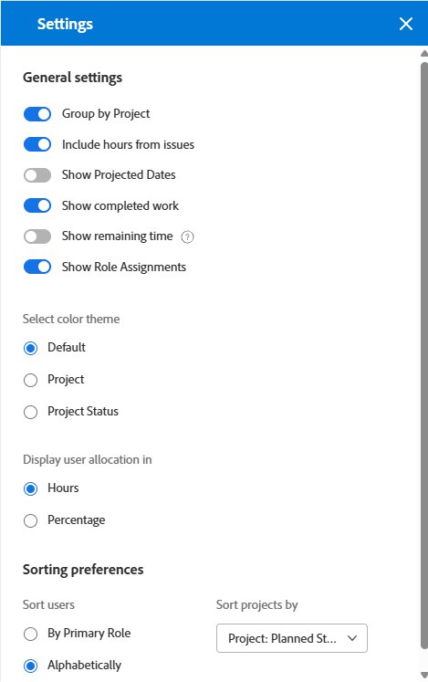

# 瀏覽工作負載平衡器

{{preview-fast-release-general}}

<!--Audited: 12/2024-->

使用Adobe Workfront中的工作負載平衡器，根據使用者的可用性將工作指派給使用者。 本文說明如何使用設定和選項瀏覽工作負載平衡器並顯示與您相關的資訊。 此處列出的其他文章說明如何使用工作負載平衡器管理您的資源及其配置以進行運作。

工作負載平衡器可在Adobe Workfront的多個區域使用。 導覽它在所有區域都類似。

如需工作負載平衡器所在位置的詳細資訊，請參閱[找到工作負載平衡器](https://experienceleague.adobe.com/en/docs/workfront/using/manage-resources/the-workload-balancer/locate-workload-balancer)。

## 存取需求

+++ 展開以檢視本文中功能的存取需求。

您必須具有下列存取權才能執行本文中的步驟：

<table style="table-layout:auto"> 
 <col> 
 <col> 
 <tbody> 
  <tr> 
   <td role="rowheader">Adobe Workfront計畫</td> 
   <td> 
任何 
 </td> 
  </tr> 
  <tr> 
   <td role="rowheader">Adobe Workfront授權</td> 
   <td>
新增：標準

       
或

       
目前：計畫，在資源區域使用工作負載平衡器時； 
       工作，使用團隊或專案的工作負載平衡器時
</td>
  </tr>
  <tr> 
   <td role="rowheader">存取層級設定</td> 
   <td> 
檢視以下專案或更高存取權：
 
    <ul> 
     <li>資源管理</li> 
     <li>專案</li> 
     <li>任務</li> 
     <li>問題</li> 
    </ul>
   </td> 
  </tr> 
  <tr> 
   <td role="rowheader">物件許可權</td> 
   <td>檢視專案、任務和問題的許可權或更高</td> 
  </tr> 
 </tbody> 
</table>

如需有關此表格的詳細資訊，請參閱Workfront檔案中的[存取需求](/help/quicksilver/administration-and-setup/add-users/access-levels-and-object-permissions/access-level-requirements-in-documentation.md)。

+++

## 檢視工作負載平衡器中專案的考量事項

檢視工作負載平衡器時，請考量下列事項：

* 工作負載平衡器會根據其指派在兩個不同的區域顯示工作專案。 工作專案和使用者會顯示在下列區域中：

   * **未指派的工作**：沒有指派或僅指派給工作角色或團隊的專案。
   * **指派的工作**：至少指派給一個使用者的專案。 指派的專案會顯示在指派的使用者名稱下。

  >[!NOTE]
  >
  >* 指派給工作角色或團隊的工作專案，以及指派給使用者的工作專案，會顯示在「未指派的工作」區域中，並在「已指派的工作」區域中的已指派使用者名稱下方。
  >* 指派給使用者和工作角色的工作專案（工作角色被選取為專案的主要受指派者）會顯示在「未指派的工作」區域中。
  >* 指派給多個使用者的工作專案會顯示在「已指派的工作」區域中所有已指派使用者的名稱下。
  >* 啟用[顯示角色指派]設定時，角色指派會顯示在[未指派的工作]區域的工作專案下。 如需詳細資訊，請參閱本文章的[自訂檢視](#customize-the-view)一節。

  如需詳細資訊，請參閱[工作負載平衡器](/help/quicksilver/resource-mgmt/workload-balancer/assign-work-in-workload-balancer.md#assignment-areas-in-the-workload-balancer)中指派工作的總覽[工作負載平衡器](/help/quicksilver/resource-mgmt/workload-balancer/assign-work-in-workload-balancer.md)中的指派區域。

* 當專案在一段時間內沒有任務時，專案層級的列在該時間內為空白。

  

* 當您沒有檢視特定專案的許可權時，它們會顯示為&#x200B;**無法存取的工作專案**&#x200B;或&#x200B;**無法存取的專案**。

  

* 工作專案的名稱會顯示在左側，而時間軸則會顯示在右側。
* 每個工作專案的計畫時數總計會顯示在工作專案名稱的右側，以及代表工作專案時間表之長條的左側。
* 每個專案的總計畫時數會顯示在專案名稱的右側，以及代表專案時間表之列的左側。

  專案的計畫時數資訊是工作負載平衡器所列之所有專案的計畫時數總計，而不是專案上的計畫時數總計。

如需有關在工作負載平衡器檢視資訊的詳細資訊，另請參閱以下文章：

* [找到工作負載平衡器](../workload-balancer/locate-workload-balancer.md)
* [在工作負載平衡器中篩選資訊](../workload-balancer/filter-information-workload-balancer.md)
* [使用連結共用工作負載平衡器](../workload-balancer/share-link-for-workload-balancer.md)
* 使用摘要[更新工作負載平衡器中的工作專案](../workload-balancer/update-items-in-summary-panel-in-workload-balancer.md)

如需有關使用工作負載平衡器管理資源的資訊，另請參閱下列文章：

* [在工作負載平衡器](https://experienceleague.adobe.com/en/docs/workfront/using/manage-resources/the-workload-balancer/assign-work-in-workload-balancer)中指派工作的總覽
* [在工作負載平衡器](https://experienceleague.adobe.com/en/docs/workfront/using/manage-resources/the-workload-balancer/manage-user-allocations-workload-balancer)中管理使用者配置

## 在資源區域瀏覽工作負載平衡器多個專案

瀏覽工作負載平衡器在您從中存取它的所有區域都類似。

以下小節說明如何在工作負載平衡器中檢視多個專案的資訊。

您可以調整工作負載平衡器中的一些設定和選項，以顯示您最需要關注的時間範圍內的資訊。

選取您要套用至檢視的設定後，工作負載平衡器會在您每次從任何瀏覽器或裝置存取它時記住這些設定。

### 存取工作負載平衡器資源區域中的多個專案

若要導覽多個專案的工作負載平衡器：

{{step1-to-resourcing}}

1. 按一下左側面板中的&#x200B;**工作負載平衡器**。

   

   工作負載平衡器顯示從本週開始的工作指派資訊，包括以下兩個區域：

   * **未指派的工作**&#x200B;區域會顯示下列工作專案：

      * 指派給角色、團隊或未指派的工作專案（任務和問題）會在您套用篩選器後顯示。
依預設，「未指派的工作」區域不會顯示任何工作專案。 我們建議使用篩選器在此區域顯示您的相關資訊。

        如需有關使用篩選的資訊，請參閱工作負載平衡器[中的](../workload-balancer/filter-information-workload-balancer.md)篩選資訊。

      * 工作專案下的角色指派只有在您啟用[顯示角色指派]設定時才會顯示。 如需詳細資訊，請參閱本文章的[自訂檢視](#customize-the-view)一節。

      * 專案僅在您啟用依專案分組設定時顯示。 如需詳細資訊，請參閱本文中的[自訂檢視](#customize-the-view)一節。

   * **指派的工作**&#x200B;區域會顯示下列工作專案：

      * 依預設，系統中的所有作用中使用者都會顯示在此區域中。 我們建議使用篩選器來限制此區域的資訊量。 如果將使用者指派給專案，則工作專案也會顯示在他們的名稱下。

      * 指派給至少一個使用者的任務和問題會顯示在該使用者的名稱下。

        在「已指派的工作」區域中，使用者名稱下的工作專案會依下列條件排序，順序如下：

         1. 計劃開始日期（最舊日期在前）
         1. 計畫完成日期（最舊日期在前）
         1. 依專案字母順序（僅當前兩個條件對於多個工作專案相同時）

            >[!TIP]
            >
            >* 您可以從「排序專案依據」設定中選取選項，以自訂專案排序。
            >
            >* 專案僅在您啟用「依專案分組」設定時顯示。
            > 
            >如需自訂設定的相關資訊，請參閱本文中的[自訂檢視](#customize-the-view)一節。

1. （選擇性）在&#x200B;**指派的工作**&#x200B;區域中按一下圖示&#x200B;**篩選器圖示**，然後在篩選器方塊的&#x200B;**建議**&#x200B;區域中選取&#x200B;**預設篩選器**。

   套用「預設」篩選器時，屬於您任何團隊的使用者及其工作專案都會顯示。 您可以編輯此篩選的復本。

   >[!TIP]
   >
   >預設篩選器僅在資源區域的工作負載平衡器中可用。

1. 繼續進行以下步驟以瀏覽工作負載平衡器：

   * [在工作負載平衡器中選取時間範圍](#select-a-time-frame-in-the-workload-balancer)
   * [自訂檢視](#customize-the-view)
   * [指派工作專案並調整使用者配置](#assign-work-items-and-adjust-user-allocations)
   * [在圖表中檢視配置](#view-allocations-in-a-chart)

### 在工作負載平衡器中選取時間範圍

1. 存取&#x200B;**資源**&#x200B;區域中的工作負載平衡器，如本文中[存取資源區域中的多個專案的工作負載平衡器](#access-the-workload-balancer-for-multiple-projects-in-the-resourcing-area)一節中所述。

   工作負載平衡器顯示從本週開始的工作指派資訊。

1. 使用水準捲動來檢視超出熒幕限制的工作專案時間軸。
1. 按一下左上角的&#x200B;**上一頁或下一頁**&#x200B;圖示以瀏覽時間軸，然後按一下&#x200B;**今天**&#x200B;以返回當週。
1. 按一下工具列上的&#x200B;**時間範圍下拉式功能表**，然後按一下您要顯示期間的開始日期。 依預設，在行事曆上選取的第一週是您導覽的目標周。

   

1. 從下列選項選取您要在工作負載平衡器中一次顯示的周數：
   * 1 週
   * 2 週
   * 4週。 這是預設設定。
   * 6 週
   * 3 個月

   

1. 按一下工具列中的下列選項之一，可依不同的時間範圍顯示資訊：
   * **Day**：依預設會依日期顯示從今天日期開始的4週資訊。
   * **周**：按周顯示資訊四周。
   * **月**：顯示三個月資訊（依月份）。

1. 繼續瀏覽工作負載平衡器，如以下小節所述。

### 自訂檢視

1. 存取&#x200B;**資源**&#x200B;區域中的工作負載平衡器，如本文中[存取資源區域中的多個專案的工作負載平衡器](#access-the-workload-balancer-for-multiple-projects-in-the-resourcing-area)一節中所述。

   工作專案的名稱會列在左側，並由工作負載平衡器右側的長條表示。 長條圖長度代表工作專案的時間表。

1. （選擇性和建議性）使用「未指派工作」和「已指派工作」區域中的篩選器，僅顯示與您相關的工作專案或使用者。

   如需詳細資訊，請參閱工作負載平衡器[中的](../workload-balancer/filter-information-workload-balancer.md)篩選器資訊。

   根據預設，藍色列代表專案和任務的時間表，而栗色列代表問題。

   當您選取符合專案的顏色主題時，可以變更專案和任務的長條顏色。 如需詳細資訊，請繼續閱讀此程式。

   「已指派的工作」區域中的工作專案會依下列條件依序依專案排序：
   1. 計劃開始日期（最舊日期在前）
   1. 計畫完成日期（最舊日期在前）
   1. 依專案字母順序（僅當前兩個條件對於多個工作專案相同時）

1. 按一下「未指派」或「已指派」區域左側的&#x200B;**向右箭頭**，以展開專案名稱（在「未指派」區域中）和使用者名稱（在「已指派」區域中）下的所有專案。

   >[!TIP]
   >
   >只有在啟用「依專案分組」設定時，工作專案才會列在「未指派」區域的專案名稱下。

1. 按一下「未指派」或「已指派」區域左側的&#x200B;**向下箭頭**，以收合專案名稱（在「未指派」區域中）和使用者名稱（在「已指派」區域中）下的所有專案。

1. 將滑鼠懸停在上方，然後將&#x200B;**分隔線**&#x200B;拖放到左側面板和時間軸區域之間，以調整左側面板的大小。

   

1. 按一下&#x200B;**設定**&#x200B;圖示。

   「設定」面板會顯示在右側。

   預覽環境中的範例影像：
   

   生產環境中的影像範例：
   

   從下列選項中選取以更新您在工作負載平衡器中檢視的資訊，然後按一下「設定」方塊右上角的&#x200B;**X圖示**&#x200B;以關閉它。

   * **依專案分組**：選取此專案時，會依專案將「未指派」和「已指派」工作區域中的專案分組。 依預設會選取此選項。

   * **包含來自問題的時數**：選取此專案時，指派給使用者的問題會顯示在「已指派工作」區域中該使用者的名稱下，而未指派給使用者的問題會顯示在「未指派工作」區域中。 從問題到計畫時數的計畫時數，專案和已指派工作區域中的使用者。
   * **顯示預計日期**：選取此專案時，除了計畫時間表外，還會顯示工作專案的預計時間表。 請注意下列事項：
      * 專案、任務和問題的預計時間表會在任務、問題和專案列上方顯示為深藍色線條。
      * 在計畫時間表之外的投影時間表會以淺藍色顯示，即使您更新顏色主題也是如此，如下所述。
      * 您無權檢視之專案的投影時間表會以淺灰色顯示，下方有一條直線。
      * 當任務或問題在到期計畫完成日期前完成時，剩餘天數的配置數量會被刪除，且不計入使用者的配置。 唯有同時啟用「顯示預計日期」設定和「顯示配置」圖示時，才會顯示這個選項。

     >[!TIP]
     >
     >請注意，當工作專案的計畫或預計時間表（不一定同時發生）發生在所選的時間範圍時，工作專案會顯示在工作負載平衡器中。

   * **顯示已完成的工作**：啟用時，已完成的任務和問題會顯示在[指派的工作]區域中。 這預設為啟用。

     任務或問題列完成時，其右上角會顯示綠色核取記號圖示。 當專案所選時間範圍內的任務或問題完成時，專案會顯示相同的圖示。
   * **顯示剩餘時間**：啟用此功能後，Workfront會根據使用者的排程，顯示使用者每天可工作的時間，與使用者在指派的工作區域中所分配的時間之間的差異。 依預設會停用此專案，並依預設顯示配置時間。
   * **顯示角色指派**：啟用時，角色指派會顯示在未指派的工作區域中，在其指派的工作專案下。 預設為啟用。

   * 在&#x200B;**選取顏色佈景主題**&#x200B;區段中，選取專案與工作列的所要顏色。

     >[!TIP]
     >
     >選取顏色主題的設定不會影響問題列的顏色。 問題一律會顯示在栗色列中。

     從下列選項中選取：
      * **預設**：所有專案及其工作專案的長條會以藍色顯示。
      * **專案**：與每個專案及其任務關聯的長條會隨著專案名稱而變更。 屬於專案的所有任務都會以符合專案顏色的長條顯示。 專案列會以較淺的陰影顯示，以區別於任務。 選擇不顯示配置時，專案列也會包含專案圖示。
      * **專案狀態**：與每個專案及其工作專案關聯的長條會變更為專案狀態的顏色。

        專案狀態是與專案群組相關聯的專案狀態。 如果「群組」沒有群組特定的狀態，則工作專案列的顏色即為系統層級專案狀態的顏色。 顯示系統和自訂狀態。 如需群組狀態的相關資訊，請參閱[建立或編輯群組狀態](../../administration-and-setup/manage-groups/manage-group-statuses/create-or-edit-a-group-status.md)。

   * 在&#x200B;**在**&#x200B;中顯示使用者配置區段中，從下列選項中選取：
      * **小時**：將配置的時間顯示為小時。 這是預設值。
      * **Percentage**：顯示配置時間佔全部可用時間的百分比
   * 在&#x200B;**排序偏好設定**&#x200B;區段中，選取您要在工作負載平衡器中排序專案的方式。 從下列選項中選取：
      * **依主要角色排序使用者**：使用者會依其主要角色的字母順序顯示在指派的工作區域中。
      * **依字母順序排序使用者**：使用者會依其名字的字母順序顯示在指派的工作區域中。
      * **專案排序依據**：從下拉式功能表中選取專案欄位，以在「未指派」或「已指派的工作」區域中，依該欄位的字母順序排序專案。

   >[!TIP]
   >
   >您必須啟用「依專案分組」設定，才能依專案排序。 否則，此設定會變暗。

1. （選擇性和條件性）將顏色主題變更為「專案狀態」時，將滑鼠移至左側專案名稱的上方，即可檢視專案狀態。

   

### 指派工作專案並調整使用者配置

1. 存取資源區域中的工作負載平衡器，如本文中[存取資源區域中的多個專案的工作負載平衡器](#access-the-workload-balancer-for-multiple-projects-in-the-resourcing-area)一節中所述。
1. 按一下&#x200B;**顯示分派圖示** 以檢視工作專案的每日或每週計畫時數。

   這會將工作專案列中的名稱替換為未指派和已指派工作區域中的每日或每週計畫時數。 此設定預設為停用。

   顯示過度分配的天數會以紅色顯示。

   >[!TIP]
   >
   >* 「顯示配置」選項只會影響專案、任務、問題和無法存取之專案的顯示內容。 預設會顯示使用者的每日計畫時數，而且無法隱藏。
   >* 您必須啟用依專案分組設定以顯示專案的每日計畫時數。
   >* 當您按周檢視工作負載平衡器時，顯示的時數是每週計畫時數。

1. （選用）將滑鼠指標暫留在使用者列中的已分配時間上，以瞭解使用者的容量和配置。 容量是根據使用者的排程提供使用者的可用性。

   

1. （選擇性）按一下&#x200B;**隱藏配置圖示** ，在工作專案的長條中顯示任務和問題的名稱。
1. 按一下任務、問題、**或角色**&#x200B;名稱右側的圖示更多圖示，然後按一下下列其中一個選項。

   

   * **將此指派給**，然後開始在&#x200B;**搜尋人員、角色或團隊**&#x200B;欄位中輸入您要指派工作專案的使用者、角色或團隊名稱。

     按一下&#x200B;**進階**&#x200B;以存取工作專案的進階工作分派畫面。 如需詳細資訊，請參閱[建立進階工作分派](/help/quicksilver/manage-work/tasks/assign-tasks/create-advanced-assignments.md)。

     您也可以使用下列捷徑來指派任務或問題：

      * 在Windows中：按住CTRL鍵並按一下任務列或問題列。
      * 在Mac中： CMD按一下任務或問題列。

     如需有關在工作負載平衡器中指派工作專案給使用者的詳細資訊，請參閱在工作負載平衡器中指派工作的概述。

     >[!NOTE]
     >
     >啟用[顯示角色指派]設定時，角色指派只會顯示在[未指派的工作]區域的工作專案下。 如需詳細資訊，請參閱本文中的[自訂檢視](#customize-the-view)一節。 角色指派在&#x200B;**更多功能表**.**中只有**&#x200B;將此指派給選項

     >[!TIP]
     >
     >如果您的Workfront或群組管理員在您的環境中啟用了委派，請使用「工作總攬」標籤將使用者指派給任務或問題。 如需委派工作的相關資訊，請參閱[委派任務和問題](../../manage-work/delegate-work/how-to-delegate-work.md)。

   * **編輯配置**，然後編輯使用者的每日或每週配置。 如需有關管理使用者配置的資訊，請參閱[在工作負載平衡器](../workload-balancer/manage-user-allocations-workload-balancer.md)中管理使用者配置。

   * **開啟摘要**。 「摘要」面板會在右側開啟，然後按一下「工作總攬」欄位，並在&#x200B;**搜尋人員、角色或團隊**&#x200B;欄位中開始輸入使用者、角色或團隊的名稱，以指派專案。 如需詳細資訊，請參閱本文中[顯示有關任務和問題的詳細資訊](#display-more-information-about-tasks-and-issues)一節。

1. （選擇性）在工作專案列中的使用者按兩下每日或每週配置，以編輯配置的時數，然後按一下&#x200B;**儲存**&#x200B;圖示以儲存配置，或按一下&#x200B;**取消**&#x200B;圖示以移除您調整的分配。

   >[!TIP]
   >
   >儲存和取消圖示會顯示在任務或問題的時間軸列的結尾。
   >
   >

   如需有關管理使用者配置的資訊，請參閱[在工作負載平衡器](../workload-balancer/manage-user-allocations-workload-balancer.md)中管理使用者配置。

1. 按一下&#x200B;**大量指派**&#x200B;以大量指派工作專案。

   如需詳細資訊，請參閱[使用工作負載平衡器](../workload-balancer/assign-work-in-workload-balancer-in-bulk.md)大量指派工作。
1. 從&#x200B;**未指派的工作**&#x200B;區域或使用者拖曳專案，並將它們拖放到其他使用者上以進行指派。

   如需詳細資訊，請參閱[透過拖放在工作負載平衡器中指派工作](../workload-balancer/assign-work-in-workload-balancer-by-drag-and-drop.md)。

### 在圖表中檢視配置

您可以在圖表中檢視分配，而不是以每日或每週數字檢視分配。

1. 存取資源區域中的工作負載平衡器，如本文中[存取資源區域中的多個專案的工作負載平衡器](#access-the-workload-balancer-for-multiple-projects-in-the-resourcing-area)一節中所述。
1. 按一下&#x200B;**圖表圖示** ，以圖表格式顯示使用者配置。

   使用者配置過度的天數顯示為紅色區塊，使用者配置不足或容量不足的天數則顯示為藍色區塊。

   區塊的大小表示配置的數量：方塊越大，使用者被配置給該天或該周的工作專案的時間就越多。

   

### 顯示更多關於任務和問題的資訊

您可以在工作負載平衡器中檢視有關任務和問題的詳細資訊。

1. 存取資源區域中的工作負載平衡器，如本文中[存取資源區域中的多個專案的工作負載平衡器](#access-the-workload-balancer-for-multiple-projects-in-the-resourcing-area)一節中所述。
1. 若要在「摘要」面板中檢視更多資訊，請執行下列任一項作業：

   * 按一下任務或問題列以開啟右側的「摘要」面板。
   * 按一下&#x200B;**開啟摘要**&#x200B;圖示，然後按一下任務或問題列以開啟摘要面板。
   * 按一下任務或問題右側的&#x200B;**更多**&#x200B;功能表，然後按一下&#x200B;**開啟摘要**。

   如需有關更新工作負載平衡器摘要中任務資訊的資訊，請參閱[使用摘要更新工作負載平衡器中的工作專案](../workload-balancer/update-items-in-summary-panel-in-workload-balancer.md)。

1. 將滑鼠懸停在任務或問題的名稱上可檢視其相關詳細資訊。 任務或問題上方會顯示一個方塊，其中包含下列資訊：

   * 任務或問題的名稱。
   * 專案名稱。
   * 計劃開始與完成日期。
   * 計畫時數。
   * 對於任務，則為前置任務編號。
   * 對於任務，位於方塊上角的指示器，指示任務是否準備好處理。

   

1. 按一下左側工作專案的名稱以存取它。 工作專案會在新的瀏覽器標籤中開啟。

### 以全熒幕顯示工作負載平衡器

1. 存取資源區域中的工作負載平衡器，如本文中[存取資源區域中的多個專案的工作負載平衡器](#access-the-workload-balancer-for-multiple-projects-in-the-resourcing-area)一節中所述。

1. 按一下&#x200B;**全熒幕**&#x200B;圖示以全熒幕顯示工作負載平衡器。

   工作負載平衡器佔據整個熒幕。 瀏覽器視窗和索引標籤會從檢視中排除。

1. 按一下&#x200B;**結束全熒幕**&#x200B;圖示以返回預設熒幕，並在瀏覽器索引標籤內檢視工作負載平衡器。

## 瀏覽團隊的工作負載平衡器

瀏覽團隊的工作負載平衡器類似於瀏覽多個專案的工作負載平衡器。 如需詳細資訊，請參閱本文中的[瀏覽多個專案的工作負載平衡器](#navigate-the-workload-balancer-for-multiple-projects-in-the-resourcing-area)一節。

{{step1-to-team}}

依預設，會顯示您的主團隊頁面。

1. 按一下左側面板中的&#x200B;**工作負載平衡器**。

   

   依預設，團隊的工作負載平衡器顯示以下資訊：

   * 在&#x200B;**未指派的工作**&#x200B;區域中：指派給團隊或團隊和工作角色的工作專案，以及未指派給使用者的工作專案。 啟用[顯示角色指派]設定時，角色指派會顯示在[未指派的工作]區域的工作專案下。
   * 在&#x200B;**指派的工作**&#x200B;區域中：指派給使用者的工作專案會顯示在使用者的名稱下。

1. 繼續瀏覽團隊的工作負載平衡器，如本文的[瀏覽資源區域](#navigate-the-workload-balancer-for-multiple-projects-in-the-resourcing-area)區段中多個專案的工作負載平衡器。

## 瀏覽單一專案的工作負載平衡器

{{step1-to-projects}}

1. 按一下專案名稱以開啟專案頁面。
1. 按一下左側面板中的&#x200B;**工作負載平衡器**。

   

   預設情況下，專案的工作負載平衡器顯示以下資訊：

   * 在&#x200B;**未指派的工作**&#x200B;區域中：專案上已指派給角色或團隊且未指派給使用者的工作專案。 啟用[顯示角色指派]設定時，角色指派會顯示在[未指派的工作]區域的工作專案下。
   * 在&#x200B;**已指派的工作**&#x200B;區域中：專案上已指派給至少一個使用者的工作專案。

   我們建議使用篩選器來只顯示對您重要的使用者。

   例如，您可以考慮只顯示屬於您團隊或群組的使用者。 如需詳細資訊，請參閱工作負載平衡器[中的](../workload-balancer/filter-information-workload-balancer.md)篩選器資訊。

1. （選擇性）按一下指派的工作區域中的&#x200B;**篩選器**&#x200B;圖示，然後從篩選器面板的&#x200B;**建議**&#x200B;區域選取&#x200B;**此專案的工作專案**&#x200B;選項。 預設會取消選取此篩選器。

   選取此選項時，只會顯示指定給選定專案上使用者的專案。

   如果未選取選項，則會顯示專案上指派給使用者的所有專案，無論專案屬於哪個專案。

1. （選用且建議使用）在指派的工作區域套用篩選器，以顯示對您而言重要但可能未指派給專案專案的使用者，然後按一下&#x200B;**顯示所有使用者**&#x200B;圖示。

   藉由顯示所有使用者，您可以在Workfront中顯示尚未指派給工作或專案中其他角色的所有使用者。

   您可以先套用篩選器，以減少顯示的使用者人數。

   例如，您可能想要先篩選屬於您團隊或群組的使用者，然後顯示所有這些使用者。

   如需有關如何建立篩選的資訊，請參閱工作負載平衡器[中的](../workload-balancer/filter-information-workload-balancer.md)篩選資訊。

   >[!NOTE]
   >
   > 顯示所有使用者選項僅適用於專案的工作負載平衡器。

1. （選擇性）按一下&#x200B;**顯示角色配置**&#x200B;圖示。

   「角色配置」面板隨即顯示。

   您可以檢視與專案上工作角色關聯的計畫時數，以及與連結至專案之方案相關的工作角色從「情境規劃工具」的相關資訊。

   如需詳細資訊，請參閱[協調專案與方案之間的資源配置總覽](../../scenario-planner/overview-reconcile-allocations-between-projects-initiatives.md)。

   >[!NOTE]
   >
   >如果您的組織尚未購買Workfront Scenario Planner的授權，便無法檢視方案工作角色資訊。 在此情況下，您只能檢視與專案上工作角色相關的計畫時數。 如需詳細資訊，請參閱[使用Scenario Planner所需的存取權](../../scenario-planner/access-needed-to-use-sp.md)。

1. 繼續瀏覽專案的工作負載平衡器，如本文的[瀏覽多個專案的工作負載平衡器](#navigate-the-workload-balancer-for-multiple-projects-in-the-resourcing-area)區段中所述。

### 瀏覽使用者的工作負載平衡器

您可以在自己的使用者設定檔上存取工作負載平衡器。

{{step1-click-profile-pic}}

1. 按一下左側面板中的&#x200B;**工作負載平衡器**。

   顯示使用者的工作負載平衡器。

   

   依預設，使用者的工作負載平衡器會依資訊顯示以下內容：

   * **指派的工作**：指派給特定使用者的任務和問題。

   >[!NOTE]
   >
   >使用者設定檔上的工作負載平衡器是唯讀的，指派和分配無法變更。

1. 繼續瀏覽使用者的工作負載平衡器，如本文的[瀏覽多個專案的工作負載平衡器](#navigate-the-workload-balancer-for-multiple-projects-in-the-resourcing-area)區段中所述。

<!--old content below - this used to be a one-large-procedure article - outdated, and rewrote it above with several smaller procedures: 

# Navigate the Workload Balancer

<!-drafted note for 22.4 release: remove all production/ preview references at Prod release>

The highlighted information on this page refers to functionality not yet generally available. It is available only in the Preview environment. 

Use the Workload Balancer to understand the availability of your resources as well as to assign work to your users. This article walks you through using the icons and settings available to update the view for and navigate the Workload Balancer.

>[!NOTE]
>
>The Workload Balancer is a resource scheduling tool that will eventually replace the current resource scheduling tools which are currently deprecated. 
>
>For more information about removing the resource scheduling tools and replacing them with the Workload Balancer, see [Deprecation of Resource Scheduling tools in Adobe Workfront](../../resource-mgmt/resource-mgmt-overview/deprecate-resource-scheduling.md).
>
>We recommend that you use the Workload Balancer for scheduling your resources.

The Workload Balancer is available in multiple areas of Adobe Workfront. Navigating it is similar in all areas. This article describes how to navigate the Workload Balancer for multiple projects in the Resourcing area. For more information about where the Workload Balancer is located, see [Locate the Workload Balancer](../../resource-mgmt/workload-balancer/locate-workload-balancer.md).

For information about managing resources using the Workload Balancer, also consider reading the following articles:

* [Overview of assigning work in the Workload Balancer](../../resource-mgmt/workload-balancer/assign-work-in-workload-balancer.md)
* [Manage user allocations in the Workload Balancer](../../resource-mgmt/workload-balancer/manage-user-allocations-workload-balancer.md)

## Access requirements

You must have the following access to perform the steps in this article:

<table style="table-layout:auto"> 
 <col> 
 <col> 
 <tbody> 
  <tr> 
   <td role="rowheader">Adobe Workfront plan*</td> 
   <td> 
Any 
 </td> 
  </tr> 
  <tr> 
   <td role="rowheader">Adobe Workfront license*</td> 
   <td> 
Plan, when using the Workload Balancer in all areas in the Production environment

   
Work, when using the Workload Balancer of a project, in the Preview environment 
 </td> 
  </tr> 
  <tr> 
   <td role="rowheader">Access level configurations*</td> 
   <td> 
View or higher access to the following:
 
    <ul> 
     <li> 
Resource Management
 </li> 
     <li> 
Projects
 </li> 
     <li> 
Tasks
 </li> 
     <li> 
Issues
 </li> 
    </ul> 
If you still don't have access, ask your Workfront administrator if they set additional restrictions in your access level. For information on how a Workfront administrator can change your access level, see <a href="../../administration-and-setup/add-users/configure-and-grant-access/create-modify-access-levels.md" class="MCXref xref">Create or modify custom access levels</a>.
 </td> 
  </tr> 
  <tr> 
   <td role="rowheader">Object permissions</td> 
   <td> 
View or higher permissions to the projects, tasks, and issues 
 
For information on requesting additional access, see <a href="../../workfront-basics/grant-and-request-access-to-objects/request-access.md" class="MCXref xref">Request access to objects </a>.
 </td> 
  </tr> 
 </tbody> 
</table>

*To find out what plan, license type, or access you have, contact your Workfront administrator.

## Considerations for viewing items in the Workload Balancer

Consider the following when viewing the Workload Balancer:

* Projects display in the Workload Balancer only when the Group by Project setting is enabled. This setting is enabled by default.
* Mousing over a task or an issue displays the following additional information about the task or issue:

  * Project name

  * Task or issue name

  * Parent task

  * Planned Start and Completion Dates

  * Number of Planned Hours

  * Ready to start or Not ready status

  

* When a project has no tasks during a period of time, the bar at the project level becomes a dimmed color.

  

* When you don't have permissions to see certain items, they display as **Inaccessible work items** or **Inaccessible projects**.

  

* The names of the work items display on the left and within the timeline selected on the right. 
* The total of Planned Hours for each work item displays to the right of the name of the work items on the left. 
* The total of the Planned Hours for each project displays to the right of the name of the project on the left.

  The Planned Hours information for the project is a total of Planned Hours from all items listed in the Workload Balancer, and not a total of Planned Hours on the project.

## Overview of the Unassigned Work and Assigned Work areas

The Workload Balancer displays work items in two separate areas, depending on their assignments.

The two areas of the Workload Balancer display the following information:

<table style="table-layout:auto"> 
 <col> 
 <col> 
 <tbody> 
  <tr> 
   <td role="rowheader">Unassigned Work</td> 
   <td> 
This area displays tasks and issues unassigned to users. 
 
Projects display when the Group by Project setting is enabled.
 
This area does not display any work items by default. We recommend using filters to display relevant information for you in this area.
 
After you apply a filter, this area displays the following work items:
 
    <ul> 
     <li>unassigned</li> 
     <li>assigned to a team </li> 
     <li>assigned to a job role</li> 
     <li> 
assigned to a team and a role at the same time
 </li> 
    </ul> 
Tip: Items assigned to a user as the primary assignee do not display in the Unassigned Work area. 
 </td> 
  </tr> 
  <tr> 
   <td role="rowheader">Assigned Work</td> 
   <td> 
 All active users in the system display in this area by default. We recommend using filters to limit the amount of information in this area.  
 
Both tasks and issues display in the Assigned Work area. 
 
Projects display when the Group by Project setting is enabled.
 
The work items that the users are assigned to display under their names. 
 
If a work item is assigned to multiple users, the item displays under each assigned user. 
 </td> 
  </tr> 
 </tbody> 
</table>

For information about applying a filter in the Workload Balancer, see [Filter information in the Workload Balancer](../../resource-mgmt/workload-balancer/filter-information-workload-balancer.md).

## Navigate the Workload Balancer

You can update the view in the Workload Balancer to display exactly the information you need to focus on in the time frame that makes the most sense to you.

After selecting the settings you want to apply to your view, the Workload Balancer remembers these settings every time you access it from any browser or device.

1. Click the **Main Menu** icon  in the upper-right corner of Workfront, then click **Resourcing**.
1. Click **Workload Balancer** in the left panel.

   The Workload Balancer displays work assignment information starting with the current week. The names of work items are listed on the left side as well as represented by bars on the right side of the of the Workload Balancer within their respective timelines. By default, blue bars represent the timelines of projects and tasks and maroon bars represent issues.

   >[!TIP]
   >
   >You can change the color of the bars for projects and tasks when you select your color scheme to match the project. For more information, continue reading this procedure.

   The work items that display under the name of users in the Workload Balancer are sorted by the following criteria, in this order:

   1. Planned Start Date (oldest first)
   1. Planned Completion Date (oldest first)
   1. Alphabetical by project (only when the first two criteria are identical for multiple work items)

1. Click the right-pointing arrow to the left of the Unassigned or Assigned areas to expand all items under the project names (in the Unassigned area) and under the user names (in the Assigned area).
1. Click the down-pointing arrow to the left of the Unassigned or Assigned areas to collapse all items under the project names (in the Unassigned area) and under the user names (in the Assigned area).
1. Use the horizontal scroll to navigate the timelines of work items that extends beyond the limits of the screen. 
1. Use the vertical scroll to display additional users and work items. 
1. Drag and drop the separation line between the left panel and the timeline areas to adjust the size of the left panel.

   

1. Click the **Filter icon**  in the upper-right corner of the **Unassigned Work** or the **Assigned Work** areas to select the type of information to display in the Workload Balancer.

   For information about filtering information in the Workload Balancer, see [Manage filters in the Workload Balancer](../../resource-mgmt/workload-balancer/filter-information-workload-balancer.md). 

1. Click the right-pointing arrow next to **Unassigned Work** to expand this area or the down-pointing arrow to collapse it.

   >[!TIP]
   >
   >No items display in this area by default. You must apply a filter to view unassigned work items.

1. Drag and drop the separation line between the **Unassigned Work** and **Assigned Work** areas to adjust their size.

   

1. Click the back or forward icons  to navigate the timeline, then click **Today** to return to the current week. 

1. Click the **time frame drop-down menu** on the toolbar, then click the beginning date of the period you want to display. By default, the first week selected on the calendar is the week you navigated to.

   

1. Click one of the following options in the toolbar to display information by different time frames:

   <table style="table-layout:auto"> 
    <col> 
    <col> 
    <tbody> 
     <tr> 
      <td role="rowheader">Day</td> 
      <td>Displays information by day for four weeks starting with today's date, by default. </td> 
     </tr> 
     <tr> 
      <td role="rowheader">Week</td> 
      <td>Displays information by week for four weeks. </td> 
     </tr> 
     <tr data-mc-conditions=""> 
      <td role="rowheader">Month</td> 
      <td> 
Displays information by month for three months. 
 </td> 
     </tr> 
    </tbody> 
   </table>

1. Select the number of weeks you want to display at one time in the Workload Balancer from the following options:

   * 1 week
   * 2 weeks
   * 4 weeks. This is the default setting.
   * 6 weeks
   * 3 months
        

1. Click the **Settings** icon .

   The Settings panel displays.

   

   Select from the options listed below to update the information you view in the Workload Balancer, then click the **X icon** in the upper-right of the Settings box to close it.

   * **Group by Project**: When this is selected, the items in the Unassigned and Assigned Work areas are grouped by project. This is selected by default.

     

   * **Include hours from issues**: When this is selected, issues assigned to users display under the user's name in the Assigned Work area and issues that are not assigned to users display in the Unassigned Work area. The Planned Hours from the issues count towards the Planned Hours for the project and for the user in the Assigned Work area. 

        

   
      * **Show Projected Dates**: When this is selected, the projected timeline of work items displays in addition to the planned timeline. Notice the following:

         * The projected timeline of project, tasks, and issues displays as a dark blue line above the task, issue, and project bars.
         * The projected timeline that is outside of the planned timeline displays in light blue, even when you update the color theme, as described below.
         * The projected timeline for the items that you have no access to view displays in light gray with a line underneath.
         * When a task or issue completes before the due Planned Completion Date the allocation numbers for the remaining days are struck through and do not count towards the user's allocation. This displays only when both the Show Projected Dates setting and the Show allocation icon are enabled.

         

         >[!TIP]
         >
         >Notice that work items display in the Workload Balancer when either their planned or the projected timelines (not necessarily both at the same time) occur during the timeframe selected.

   * **Show completed work**: When this is enabled, tasks and issues that are completed display in the Assigned Work area. This is enabled by default.

     A green checkmark icon  displays to the upper-right corner of a task or issue bar when they are completed. The same icon displays for a project when the tasks or issues for the selected time frame of the project are completed. 
   
   * **Show remaining time**: When this is enabled, Workfront displays the difference between the daily time for which the user is available to work based on their schedules and the hours for which they are allocated in the Assigned Work area for the users. This is disabled by default and allocated time displays by default.

   * In the **Select color theme** section, select the color that you want for the project and task bars.  

      >[!NOTE]
      >
      >The setting for selecting the color theme  does not affect the color of the issue bars. Issues always display in a maroon-color bar. 

      Select from the following:

      * **Default**: The bars for all projects and their work items display in blue.  
      * **Project**: The bars associated with each project and its tasks change according to the name of the project. All tasks that belong to the project display in bars that match the color of the project. The project bars display in a lighter shade to distinguish them from the tasks. The project bars also include a project icon when choosing not to display allocations.
      * **Project Status**: The bars associated with each project and its work items change to the color of the status of the project.

        >[!TIP]
        >
        >* The project status is that associated with the Group of the project. If the Group does not have group-specific statuses, the color of the work item bars is that of the system-level project status. Both system as well as custom statuses display. For information about group statuses, see [Create or edit a group status](../../administration-and-setup/manage-groups/manage-group-statuses/create-or-edit-a-group-status.md).
        
   * In the **Display user allocation in** section, select from the following:

      * **Hours**: Displays allocated time as hours. This is the default. 
      * **Percentage**: Displays allocated time as a percentage of the total available time

   * In the **Sorting preferences** section, select how you want the items to be sorted in the Workload Balancer. Select from the following options: 

      * **Sort users by Primary Role**: Users display in the alphabetical order of their Primary Roles in the Assigned Work area.

      * **Sort users alphabetically**: Users display in the alphabetical order of their first names in the Assigned Work area.

      * **Sort projects by**: Select a project field from the drop-down menu to sort projects alphabetically by that field in the Unassigned or Assigned Work areas. 

      >[!TIP]
      >
      >You can sort by projects only when the Group by Project setting is enabled. Otherwise, this setting is dimmed.

1. (Optional and conditional) If you changed the color theme to Project Status, hover over the name of a project on the left to view the status of the project.

   

1. (Conditional and recommended) In the Workload Balancer of a project, apply a filter in the Assigned Work area to display users that are important to you but might not be assigned to items on the project, then click the **Show all users** icon . This displays other users in the system that are not yet assigned on the project. For information about how to build a filter, see [Manage filters in the Workload Balancer](../workload-balancer/filter-information-workload-balancer.md).

 
   >[!TIP]
   >
   >The Show all users icon is available only for the Workload Balancer of a project. 

1. Click the **Chart icon**  to display the user allocation in a chart format. Days where the user is overallocated display as red blocks, and days where the user is underallocated or at capacity display as blue blocks. The size of the blocks indicates the amount of the allocation: the larger the box, the more time the user is allocated to work items for that day or week.

   

1. Click the **Show allocations icon**  to view the daily or weekly Planned Hours for work items.

   This replaces the name in the bars of the work items with the amount of daily or weekly Planned Hours in the Unassigned and Assigned Work areas. This setting is disabled by default.

   >[!TIP]
   >
   >* The Show allocations setting only affects what displays for projects, tasks, issues and inaccessible items. Daily Planned Hours for users display by default and cannot be hidden.
   >* You must enable the Group by Project setting to display daily Planned Hours for projects. 
   >* When you view the Workload Balancer by week, the hours displayed are the weekly Planned Hours. 

   Days that show overallocations display in red. 

1. (Optional) Hover over the allocated time in the user line to understand what the capacity and allocation of the user. The capacity is the availability of the user according to their schedule.

   

1. (Optional) Click the **Hide allocations icon**  to display the name of the tasks in the bars of the work items. 
1. Click the **More menu** icon  to the right of a task or issue name, then click one of options below. 

   

      * **Assign this to**, then start typing the name of a user, role, or team you want to assign the work item to in the **Search people, role, or teams** field.
    
      >[!TIP]
      >
      >You can also use the following shortcuts to assign tasks or issues:
      >
      >* In Windows: CTRL+click the task or issue bar.
      >* In Mac: CMD+click the task or issue bar.

      For more information about assigning work items to users in the Workload Balancer, see [Overview of assigning work in the Workload Balancer](../../resource-mgmt/workload-balancer/assign-work-in-workload-balancer.md). 

      >[!TIP]
      >
      >If your Workfront or group administrator enabled delegations in your environment, use the Assignments tab to assign users to the task or issue. For information about delegating work, see [Manage task and issue delegation](../../manage-work/delegate-work/how-to-delegate-work.md).

   * **Edit allocations**, then edit the daily or weekly allocations for the user. For information about managing user allocations, see [Manage user allocations in the Workload Balancer](../../resource-mgmt/workload-balancer/manage-user-allocations-workload-balancer.md).

1. Click the bar of a task or issue to open the Summary panel on the right

   Or

   Click **Open Summary** icon , then click the bar of a task or issue to open the Summary panel

   Or

   Click the **More** menu  to the right of a task or issue, then click **Open Summary**.

   For information about updating task information in the Summary in the Workload Balancer, see [Update work items in the Workload Balancer using the Summary](../../resource-mgmt/workload-balancer/update-items-in-summary-panel-in-workload-balancer.md).

    The Summary panel opens on the right. 

1. Click **Bulk Assignments** to assign work items in bulk.

   For more information, see [Assign work in bulk using the Workload Balancer](../../resource-mgmt/workload-balancer/assign-work-in-workload-balancer-in-bulk.md). 

1. Click the **Full screen** icon  to display the Workload Balancer in full screen, then click the **Exit full screen** icon  to return to the default screen. 
1. (Optional) Double-click a daily or weekly allocation for a user inside the bar of a work item to edit the number of allocated hours, then click the **Save** icon  to save the allocations or the **Cancel** icon  to remove the allocations you adjusted.

   >[!TIP]
   >
   >The Save and Cancel icons display towards the end of a task or an issue's timeline bar.

   For information about managing user allocations, see [Manage user allocations in the Workload Balancer](../../resource-mgmt/workload-balancer/manage-user-allocations-workload-balancer.md). 

1. Click the name of a work item on the left to access it. 
1. Click the **Shareable link icon**  to copy the direct URL for the Workload Balancer to your clipboard. 
1. (Optional) Share the link with any user who does not have direct access to the Workload Balancer.

   For information about sharing the Workload Balancer with a link, see [Share the Workload Balancer with a link](../../resource-mgmt/workload-balancer/share-link-for-workload-balancer.md). 

1. (Conditional) From the Workload Balancer of a project, click the **Show role allocations** icon .

   The Role Allocation panel displays. You can view information about Planned Hours associated with job roles on the project and job roles associated with initiatives from the Scenario Planner. For more information, see [Overview of reconciling resource allocations between projects and initiatives](../../scenario-planner/overview-reconcile-allocations-between-projects-initiatives.md).

   >[!TIP]
   >
   >You cannot view initiative job role information if your organization has not purchased a license for the Workfront Scenario Planner. In this case, you can only view the planned hours associated with job roles on the project. For more information, see [Access needed to use the Scenario Planner](../../scenario-planner/access-needed-to-use-sp.md).

-->
