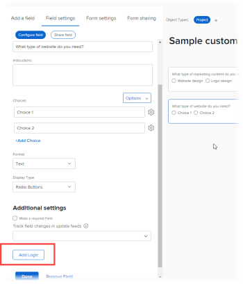

# 新增顯示邏輯並略過邏輯至自訂表單

您可以使用智慧規則，讓自訂表單動態，且與填寫表單的使用者更相關。 當使用者以特定方式回應表單上的多選欄位時，智慧規則會根據該回應，顯示您希望他們接下來查看的內容。

多選欄位類型包括下拉式清單、核取方塊和選項按鈕。

* **顯示邏輯**:在欄位、介面工具集或區段上設定顯示邏輯規則，讓使用者在先前的多選欄位中選取特定選項後，才能查看該規則。

   **範例：** 您正在建立「行銷內容請求」表單，供您組織中的人員請求新的標誌、網站更新、手冊或其他類型的行銷內容。 根據使用者想要的內容類型，您需要提示他們提供不同類型的詳細資訊，例如顏色和設計構想（如果他們需要徽標），或者產品功能清單（如果他們需要手冊）。

   在詢問新徽標的顏色和詳細資訊的欄位上，您可以添加顯示邏輯規則，該規則僅在用戶在第一個欄位中選擇徽標單選按鈕後才顯示該欄位。

   同樣地，在詢問產品功能的欄位上，您可以新增顯示邏輯規則，只有在使用者在第一個欄位中選取手冊選項按鈕後，才會顯示該欄位。

   

   您可以在多選欄位後面的任何自訂欄位、介面工具集或區段劃分設定顯示邏輯規則。

* **略過邏輯規則**:您可以設定此規則來隱藏使用者不需要的部分表單。 當使用者在前面的多選欄位中選取特定項目時，略過邏輯規則會將其略過至表單結尾，或跳至您希望他們看到的自訂欄位、介面工具集或區段。

   **範例：** 有人使用上述的「行銷內容要求」表單來要求提供白皮書（由「銷售」而非「行銷」提供）。 對於此用戶，跳過邏輯規則可以隱藏提示詳細資訊的問題，並跳到一行文本，將其引用到他們需要的部門。

   

   在這種情況下，您可以添加將用戶引向銷售部門的描述性文本欄位。 在第一個自訂欄位中，詢問使用者需要的行銷內容類型，您可以新增略過邏輯規則，當使用者在第一個欄位中選取「白皮書」選項按鈕時，此規則只會顯示文字行。

   如果您在標誌、網站更新和手冊等許多其他欄位中加入使用者不需要看到的內容，這個功能就會特別實用。
您只能將略過邏輯規則套用至自訂欄位，不能套用至介面工具集或區段。

如需自訂表單中自訂欄位和小工具的相關資訊，請參閱 [新增自訂欄位至自訂表單](../../administration-and-setup/customize-workfront/create-manage-custom-forms/add-a-custom-field-to-a-custom-form.md) 和 [在自訂表單中新增或編輯資產介面工具集](../../administration-and-setup/customize-workfront/create-manage-custom-forms/add-widget-or-edit-its-properties-in-a-custom-form.md).

## 存取需求

您必須具備下列條件才能執行本文所述步驟：

<table style="table-layout:auto"> 
 <col> 
 <col> 
 <tbody> 
  <tr data-mc-conditions=""> 
   <td role="rowheader"> 
Adobe Workfront計畫*
 </td> 
   <td>任何</td> 
  </tr> 
  <tr> 
   <td role="rowheader">Adobe Workfront授權*</td> 
   <td> 
計劃 
 </td> 
  </tr> 
  <tr data-mc-conditions=""> 
   <td role="rowheader">訪問級別配置*</td> 
   <td> 
管理對自訂表單的存取
 
如需Workfront管理員如何授予此存取權的詳細資訊，請參閱 <a href="../../administration-and-setup/add-users/configure-and-grant-access/grant-users-admin-access-certain-areas.md" class="MCXref xref">授予用戶對特定區域的管理訪問權限</a>.
 </td> 
  </tr>  
 </tbody> 
</table>

&#42;若要了解您擁有的計畫、授權類型或存取層級設定，請聯絡您的Workfront管理員。

## 建立具有顯示和略過邏輯的自訂表單範例

若要了解如何將顯示和略過邏輯新增至自訂表單，最佳方式是透過以下兩節中說明的實用範例：

* [顯示邏輯 — 實用範例](#display-logic-practical-example)
* [跳過邏輯 — 實用示例](#skip-logic-practical-example)

### 顯示邏輯 — 實用範例 {#display-logic-practical-example}

在此範例中，您將建立自訂表單，其中包含多選選項按鈕欄位。 然後，您將新增將此欄位連線至第二個欄位的顯示邏輯。

1. 按一下 **主菜單** 圖示  在Adobe Workfront的右上角，然後按一下 **設定** .

1. 在左側面板中，選取 **自訂Forms** .

1. 按一下 **新自訂表單**，選取 **專案** 在顯示的方塊中，然後選取 **繼續**.

1. 在 **表單標題** 文本框，文字 **自訂表單範例 — 學習顯示邏輯和略過邏輯** 來命名表單。

   

1. 在表單上新增第一個欄位：

   1. 開啟 **新增欄位** 標籤。

      

   1. 選取 **選項按鈕** 欄位類型，然後輸入 *您需要哪種行銷內容？* 作為 **標籤** 欄位。

   1. 在 **選擇**，取代 **選擇1** 和 **選擇2** 使用下列文字建立兩個選項，使用者可在欄位中選擇：

      *網站更新*

      *標誌設計*

1. 若要新增下一個自訂欄位，並新增顯示邏輯規則至該欄位：

   1. 開啟 **新增欄位** 頁簽，然後新增 **選項按鈕** 欄位 *您需要哪種類型的網站更新？*

      我們稍後將為此欄位添加選擇。

   1. 在 **其他設定** 部分，選擇 **新增邏輯**.

      

1. 在出現的方塊中，搭配 **顯示邏輯** 索引標籤開啟，設定第二個欄位，使其只顯示給已選取的使用者 *網站設計* 在第一個欄位中：

   1. 在第一個下拉式清單中，選取 **您需要哪種行銷內容？**
   1. 在第二個下拉式清單中，選取 **網站設計**.
   1. 將第三個下拉式清單保留為 **已選取**，選取 **儲存**.

   請注意帶有D的彩色小方塊，表示第二欄位與顯示邏輯連接，以連接用戶在第一欄位中的選擇：

   

1. 選擇 **預覽** 若要確認邏輯在表單上如您所要般運作，請選取 **結束預覽**.

1. 按一下 **儲存+關閉** 保存表單，然後繼續 [跳過邏輯 — 實用示例](#skip-logic-practical-example) 下方。

### 跳過邏輯 — 實用示例 {#skip-logic-practical-example}

略過邏輯函式與顯示邏輯類似，但作用相反：您不必根據先前的使用者選取項目來顯示特定的自訂多選欄位，而是決定應隱藏（略過）哪些欄位，因為這些欄位與使用者無關。

若要了解相關資訊，請繼續處理您在區段中建立的自訂表單範例 [顯示邏輯 — 實用範例](#display-logic-practical-example) 這篇文章。

1. 按一下 **主菜單** 圖示  在Adobe Workfront的右上角，然後按一下 **設定** .

1. 按一下 **自訂Forms**.
1. 按一下表單的名稱 **自訂表單範例 — 學習顯示邏輯和略過邏輯** 在上述步驟中建立，以開啟供編輯。
1. 選取您建立的下拉式欄位，名稱為 *您需要哪種網站類型？*，為欄位新增下列選項，然後按一下 **套用**:

   *電子商務*

   *手冊*

   *會籍*

1. 開啟 **新增欄位** 頁簽中，建立**Text欄位，其中Formatting **欄位稱為&#x200B;*網站的目標為何？*，然後按一下 **套用**.

   在此組織中，說明檔案網站是由技術撰寫團隊建立，而非由行銷部門建立。 因此，若使用者在第二個欄位中選取說明檔案，則不需要進一步的資訊。 我們將建立一行文字（描述性文字欄位），告訴他們改為看技術撰寫團隊。 我們會使用略過邏輯規則，將該使用者略過至該行文字。

1. 要建立文本行，請執行以下操作：

   1. 開啟 **新增欄位** 標籤，然後建立 **描述性文字欄位**.

   1. 若 **標籤**，類型 *請參閱技術撰寫團隊*.

   1. 若 **描述性文字**，類型 *請參閱技術撰寫團隊，了解如何建立線上說明檔案*.

   1. 選擇 **套用**.

1. 要建立跳過邏輯規則：

   1. 選取第二個下拉式欄位， *您需要哪種網站類型？*
   1. 在 **其他設定** s區段，選取 **編輯邏輯**.
   1. 在顯示的方塊中，開啟 **略過邏輯** 標籤。
   1. 將第一個下拉式清單設為 **說明檔案**，將第二個下拉式清單設為 **已選取**，並將第三個下拉式清單設為 **查看技術撰寫團隊**.
   1. 選擇 **儲存**.

   請注意小型略過邏輯會與S平方，表示在第二個欄位中選取特定選項後，使用者將略過某個項目。

   

1. 按一下 **預覽**  以確保邏輯能如您所願套用。
1. 按一下 **保存+關閉**.

在建立類似的表單時，您可以新增更多文字欄位，以提示在第二個欄位中選取電子商務或手冊之使用者的資訊。 這些欄位可能會詢問網站的目標對象、建立網站的目標、預算等。

而且，使用邏輯規則，您可以建立分支問題路徑。

例如，對於選擇電子商務的用戶，您可以建立欄位，詢問有關產品照片、說明、價格和付款選項的問題。 對於選擇手冊的用戶，您可以建立詢問內容的欄位。

選取說明檔案的使用者絕不會看到任何與他們無關的額外欄位。

>[!TIP]
>
>如果關於欄位的以下所有內容皆成立，您可以將顯示邏輯和略過邏輯新增至自訂欄位：
>
>* 它是多選欄位（選項按鈕、下拉式清單或核取方塊）
>* 前面有多選欄位
>* 後面接著另一個自訂欄位
>

<!--
<h2 data-mc-conditions="QuicksilverOrClassic.Draft mode">Multi-field display logic statements</h2>
-->

