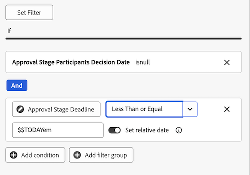
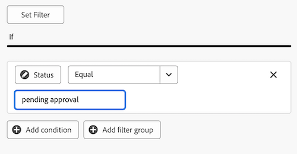

# 建立報表控制面板以供檢閱和核准

您可以在「畫布控制面板」區域中建立報告控制面板，以顯示有關具有整合式核准功能的檢閱和核准的高階資訊和詳細資訊。

>[!IMPORTANT]
>
>此功能僅適用於使用統一核准服務並註冊了畫布控制面板Beta版的客戶。 如需詳細資訊，請參閱[畫布控制面板Beta版資訊](/help/quicksilver/product-announcements/betas/canvas-dashboards-beta/canvas-dashboards-beta-information.md)。

## 建立儀表板

{{step1-to-dashboards}}

1. 在左側面板中，按一下&#x200B;**畫布控制面板**。
1. 按一下&#x200B;**新儀表板**。
1. 為您的儀表板命名。
1. （選用）新增說明。
1. 按一下「**建立**」。
   

建立控制面板後，您就可以開始新增KPI、圖表和表格。 如需詳細資訊，請參閱下列章節：

* [使用KPI和圖表新增高階檢閱和核准資訊](#add-high-level-review-and-approval-information-with-kpis-and-charts)
* [使用表格新增詳細的檢閱和核准資訊](#add-detailed-review-and-approval-information-with-tables)

## 使用KPI和圖表新增高階檢閱和核准資訊

您可以使用KPI和圖表檢視有關檔案核准的高階資訊。

如需詳細資訊，請參閱[建立KPI報告](/help/quicksilver/reports-and-dashboards/canvas-dashboards/add-reports/build-kpi-report.md)和[建立圖表報告](/help/quicksilver/reports-and-dashboards/canvas-dashboards/add-reports/build-chart-report.md)。

### KPI

#### 待處理的核准

1. [建立儀表板](#create-a-dashboard)，如上節所述。
1. 在儀表板詳細資訊頁面的右上角，按一下&#x200B;**新增報告**。

1. 在&#x200B;**新增報告**&#x200B;方塊中，選取&#x200B;**建立報告**。

1. 在左側，選取&#x200B;**KPI**。

1. 按一下右上角的&#x200B;**建立報告**。

1. 請依照下列步驟設定&#x200B;**詳細資料**&#x200B;區段：

   1. 在&#x200B;*名稱*&#x200B;欄位中輸入&#x200B;**擱置中**。
   1. 在&#x200B;*描述*&#x200B;欄位中輸入&#x200B;**擱置核准**。 這會在KPI值下方顯示為標題。

1. 請依照下列步驟設定&#x200B;**建置KPI**&#x200B;區段：

   1. 在左側面板中，按一下&#x200B;**建置KPI** 。

   1. 按一下&#x200B;**選取欄位**。

   1. 尋找並選取&#x200B;**檔案核准**&#x200B;資料夾。

   1. 選取&#x200B;**狀態**。

   1. 在&#x200B;**彙總型別**&#x200B;下拉式清單中，選取&#x200B;**計數**。

1. 請依照下列步驟設定&#x200B;**篩選器**&#x200B;區段：

   1. 在左側面板中，按一下&#x200B;**篩選器** 圖示。

   1. 選取&#x200B;**編輯篩選器**。

   1. 按一下&#x200B;**新增條件**。

   1. 按一下空白條件篩選，按一下&#x200B;**挑選欄位**，然後選擇&#x200B;**狀態**。
   1. 將運運算元保留為&#x200B;**Equal**，然後在文字方塊中輸入&#x200B;_擱置檢閱_。
      
1. 按一下熒幕右上角的&#x200B;**儲存**。

#### 逾期核准

1. [建立儀表板](#create-a-dashboard)，如上節所述。
1. 在儀表板詳細資訊頁面的右上角，按一下&#x200B;**新增報告**。

1. 在&#x200B;**新增報告**&#x200B;方塊中，選取&#x200B;**建立報告**。

1. 在左側，選取&#x200B;**KPI**。

1. 按一下右上角的&#x200B;**建立報告**。

1. 請依照下列步驟設定&#x200B;**詳細資料**&#x200B;區段：

   1. 在&#x200B;_名稱_&#x200B;欄位中輸入&#x200B;**過期**。
   1. 在&#x200B;_描述_&#x200B;欄位中輸入&#x200B;**過去**&#x200B;的核准階段期限。 此說明會顯示為KPI值下方的標題。

1. 請依照下列步驟設定&#x200B;**建置KPI**&#x200B;區段：

   1. 在左側面板中，按一下&#x200B;**建置KPI** 。

   1. 按一下&#x200B;**選取欄位**。

   1. 尋找並選取&#x200B;**檔案核准**&#x200B;資料夾。

   1. 選取&#x200B;**狀態**。

   1. 在&#x200B;**彙總型別**&#x200B;下拉式清單中，選取&#x200B;**計數**。

1. 請依照下列步驟設定&#x200B;**篩選器**&#x200B;區段：

   1. 在左側面板中，按一下&#x200B;**篩選器** 圖示。

   1. 選取&#x200B;**編輯篩選器**。

   1. 按一下&#x200B;**新增條件**。

   1. 按一下空白條件篩選，然後按一下&#x200B;**挑選欄位**。

   1. 選取&#x200B;**核准階段** > **截止日期**。
   1. 將運運算元變更為&#x200B;**小於**。
   1. 將&#x200B;**設定相對日期**&#x200B;切換為&#x200B;**ON**，然後在文字方塊中輸入&#x200B;_$$TODAY_。
      
   1. 按一下&#x200B;**新增條件**。
   1. 按一下空白條件篩選，然後按一下&#x200B;**挑選欄位**。
   1. 選取&#x200B;**狀態**。
   1. 將運運算元變更為&#x200B;**Not Contains**，然後在文字方塊中輸入&#x200B;_已核准_。
      
1. 按一下熒幕右上角的&#x200B;**儲存**。

#### 已完成的核准

1. [建立儀表板](#create-a-dashboard)，如上節所述。
1. 在儀表板詳細資訊頁面的右上角，按一下&#x200B;**新增報告**。

1. 在&#x200B;**新增報告**&#x200B;方塊中，選取&#x200B;**建立報告**。

1. 在左側，選取&#x200B;**KPI**。

1. 按一下右上角的&#x200B;**建立報告**。

1. 請依照下列步驟設定&#x200B;**詳細資料**&#x200B;區段：

   1. 在&#x200B;_Name_&#x200B;欄位中輸入&#x200B;**Completed**。
   1. 在&#x200B;_描述_&#x200B;欄位中輸入&#x200B;**核准狀態計數**。 此說明會顯示為KPI值下方的標題。

1. 請依照下列步驟設定&#x200B;**建置KPI**&#x200B;區段：

   1. 在左側面板中，按一下&#x200B;**建置KPI** 。

   1. 按一下&#x200B;**選取欄位**。

   1. 尋找並選取&#x200B;**檔案核准**&#x200B;資料夾。

   1. 選取&#x200B;**狀態**。

   1. 在&#x200B;**彙總型別**&#x200B;下拉式清單中，選取&#x200B;**計數**。

1. 請依照下列步驟設定&#x200B;**篩選器**&#x200B;區段：

   1. 在左側面板中，按一下&#x200B;**篩選器** 圖示。

   1. 選取&#x200B;**編輯篩選器**。

   1. 按一下&#x200B;**新增條件**。

   1. 按一下空白條件篩選，然後按一下&#x200B;**挑選欄位**。

   1. 選取&#x200B;**狀態**。

   1. 將運運算元變更為&#x200B;**包含**，並在文字方塊中輸入&#x200B;_已核准_。
      
   1. 按一下&#x200B;**新增條件**。
   1. 按一下&#x200B;**和**&#x200B;以將其變更為&#x200B;**或**。
   1. 按一下空白條件篩選，然後按一下&#x200B;**挑選欄位**。
   1. 選取&#x200B;**狀態**。
   1. 將運運算元變更為&#x200B;**等於**，然後在文字方塊中輸入&#x200B;_review_。
      
1. 按一下熒幕右上角的&#x200B;**儲存**。

#### 放棄的核准

1. [建立儀表板](#create-a-dashboard)，如上節所述。
1. 在儀表板詳細資訊頁面的右上角，按一下&#x200B;**新增報告**。

1. 在&#x200B;**新增報告**&#x200B;方塊中，選取&#x200B;**建立報告**。

1. 在左側，選取&#x200B;**KPI**。

1. 按一下右上角的&#x200B;**建立報告**。

1. 請依照下列步驟設定&#x200B;**詳細資料**&#x200B;區段：

   1. 在&#x200B;_名稱_&#x200B;欄位中輸入&#x200B;**放棄的**。
   1. 在&#x200B;_描述_&#x200B;欄位中輸入&#x200B;**超過2週的核准期限**。 此說明會顯示為KPI值下方的標題。

1. 請依照下列步驟設定&#x200B;**建置KPI**&#x200B;區段：

   1. 在左側面板中，按一下&#x200B;**建置KPI** 。

   1. 按一下&#x200B;**選取欄位**。

   1. 尋找並選取&#x200B;**檔案核准階段**&#x200B;資料夾。

   1. 選取&#x200B;**期限**。

   1. 在&#x200B;**彙總型別**&#x200B;下拉式清單中，選取&#x200B;**計數**。

1. 請依照下列步驟設定&#x200B;**篩選器**&#x200B;區段：

   1. 在左側面板中，按一下&#x200B;**篩選器** 圖示。

   1. 選取&#x200B;**編輯篩選器**。

   1. 按一下&#x200B;**新增條件**。

   1. 按一下進入空條件篩選器，按一下&#x200B;**挑選欄位**。

   1. 選取&#x200B;**狀態**。

   1. 將運運算元變更為&#x200B;**Not Contains**，並在文字方塊中輸入&#x200B;_已核准_。
      
   1. 按一下&#x200B;**新增條件**。
   1. 按一下空白條件篩選，然後按一下&#x200B;**挑選欄位**。
   1. 選取&#x200B;**期限**。
   1. 將運運算元變更為&#x200B;**小於**，然後將&#x200B;**設定相對日期**&#x200B;切換為&#x200B;**ON**。
   1. 在文字方塊中輸入&#x200B;_$$TODAY-2w_。
      
1. 按一下熒幕右上角的&#x200B;**儲存**。

### 圖表

#### 依決定長條圖的核准

1. [建立儀表板](#create-a-dashboard)，如上節所述。
1. 在儀表板詳細資訊頁面的右上角，按一下&#x200B;**新增報告**。

1. 在&#x200B;**新增報告**&#x200B;方塊中，選取&#x200B;**建立報告**。

1. 在左側，選取&#x200B;**圖表**。

1. 按一下右上角的&#x200B;**建立報告**。

1. 請依照下列步驟設定&#x200B;**詳細資料**&#x200B;區段：

   1. 在&#x200B;_名稱_&#x200B;欄位中，依決定&#x200B;**輸入**&#x200B;核准。
   1. （選擇性）在&#x200B;**描述**&#x200B;欄位中輸入描述。 此文字會在圖表名稱旁邊顯示為工具提示。
1. 請依照下列步驟設定&#x200B;**建置圖表**&#x200B;區段：

   1. 在左側面板中，按一下&#x200B;**建置圖表** 圖示。

   1. 在&#x200B;**圖表型別**&#x200B;下拉式功能表中，保留&#x200B;**長條圖**&#x200B;已選取。
   1. 在&#x200B;**列型別**&#x200B;下拉式功能表中，保留&#x200B;**簡單**&#x200B;已選取。
   1. 按一下&#x200B;**底部(X)軸**&#x200B;的&#x200B;**更新欄位**，然後選取&#x200B;**檔案核准** > **狀態**。
   1. 將&#x200B;**彙總型別**&#x200B;設定為&#x200B;**計數**。
   1. 按一下&#x200B;**左(Y)軸**&#x200B;的&#x200B;**更新欄位**，然後選取&#x200B;**狀態**。
1. 請依照下列步驟設定&#x200B;**篩選器**&#x200B;區段：
   1. 在左側面板中，按一下&#x200B;**篩選器** 圖示。
   1. 按一下&#x200B;**編輯篩選器**，然後按&#x200B;**新增條件**。
   1. 按一下空白條件篩選，然後按一下&#x200B;**挑選欄位**。
   1. 選取&#x200B;**檔案版本** > **版本**。
   1. 將運運算元變更為&#x200B;**Is Not Null**。
      
1. 按一下熒幕右上角的&#x200B;**儲存**。

#### 修訂橫條圖

1. [建立儀表板](#create-a-dashboard)，如上節所述。
1. 在儀表板詳細資訊頁面的右上角，按一下&#x200B;**新增報告**。

1. 在&#x200B;**新增報告**&#x200B;方塊中，選取&#x200B;**建立報告**。

1. 在左側，選取&#x200B;**圖表**。

1. 按一下右上角的&#x200B;**建立報告**。

1. 請依照下列步驟設定&#x200B;**詳細資料**&#x200B;區段：

   1. 在&#x200B;_名稱_&#x200B;欄位中輸入&#x200B;**修訂版本**。
   1. 在&#x200B;_描述_&#x200B;欄位中，針對本月底之前計畫之未完成決定的檔案輸入&#x200B;**修訂數目**。 此文字會在圖表名稱旁邊顯示為工具提示。

1. 請依照下列步驟設定&#x200B;**建置圖表**&#x200B;區段：

   1. 在左側面板中，按一下&#x200B;**建置圖表** 圖示。

   1. 在&#x200B;**圖表型別**&#x200B;下拉式功能表中，保留&#x200B;**長條圖**&#x200B;已選取。
   1. 在&#x200B;**列型別**&#x200B;下拉式功能表中，保留&#x200B;**簡單**&#x200B;已選取。
   1. 按一下&#x200B;**底部(X)軸**&#x200B;的&#x200B;**更新欄位**，然後選取&#x200B;**檔案核准** > **檔案版本** > **版本**。
   1. 將&#x200B;**彙總型別**&#x200B;設定為&#x200B;**計數**。
   1. 按一下&#x200B;**左(Y)軸**&#x200B;的&#x200B;**更新欄位**，然後選取&#x200B;**檔案核准** > **檔案版本** > **檔案** > **名稱**。

1. 請依照下列步驟設定&#x200B;**篩選器**&#x200B;區段：
   1. 在左側面板中，按一下&#x200B;**篩選器** 圖示。
   1. 按一下&#x200B;**編輯篩選器**，然後按&#x200B;**新增條件**。
   1. 按一下空白條件篩選，然後按一下&#x200B;**挑選欄位**。

   1. 選取&#x200B;**核准階段** > **核准階段參與者** > **決定日期**。

   1. 將運運算元變更為&#x200B;**Is Null**。
      
   1. 按一下&#x200B;**新增條件**。
   1. 按一下空白條件篩選，然後按一下&#x200B;**挑選欄位**。
   1. 選取&#x200B;**核准階段** > **截止日期**。
   1. 將運運算元變更為&#x200B;**小於或等於**，然後將&#x200B;**設定相對日期**&#x200B;切換為&#x200B;**ON**。
   1. 在文字方塊中輸入&#x200B;_$$TODAYem_。
      
1. 按一下熒幕右上角的&#x200B;**儲存**。

## 使用表格新增詳細的檢閱和核准資訊

如需建立表格報告的詳細資訊，請參閱[建立表格報告](/help/quicksilver/reports-and-dashboards/canvas-dashboards/add-reports/build-table-report.md)。

### 擱置核准清單

1. [建立儀表板](#create-a-dashboard)，如上節所述。
1. 在儀表板詳細資訊頁面的右上角，按一下&#x200B;**新增報告**。

1. 在&#x200B;**新增報告**&#x200B;方塊中，選取&#x200B;**建立報告**。

1. 在左側，選取&#x200B;**表格**。

1. 按一下右上角的&#x200B;**建立報告**。

1. 請依照下列步驟設定&#x200B;**詳細資料**&#x200B;區段：

   1. 在&#x200B;_名稱_&#x200B;欄位中輸入&#x200B;**擱置核准**。
   1. 在&#x200B;**描述**&#x200B;欄位中輸入描述。 此文字會在圖表名稱旁邊顯示為工具提示。

1. 請依照下列步驟設定&#x200B;**組建資料表**&#x200B;區段：

   1. 在左側面板中，按一下&#x200B;**表格欄** 圖示。
   1. 按一下&#x200B;**新增資料行**。
   1. 向下捲動並選取&#x200B;**檔案核准** > **狀態**。
   1. 新增下列欄：

   <table>
    <tr>
    <td><strong>專案名稱</strong></td>
    <td>檔案版本&gt;檔案&gt;專案&gt;名稱</td>
    </tr>
    <tr>
    <td><strong>文件名稱</strong></td>
    <td>檔案版本&gt;檔案&gt;在搜尋方塊中輸入<em>名稱</em>。</td>
    </tr>
    <tr>
    <td><strong>檔案版本</strong></td>
    <td>檔案版本&gt;檔案&gt;版本</td>
    </tr>
    <tr>
    <td><strong>截止日期</strong></td>
    <td>檔案核准&gt;核准階段&gt;期限</td>
    </tr>
    <tr>
    <td><strong>請求者</strong></td>
    <td>檔案核准&gt;核准階段&gt;核准階段參與者* &gt;請求者&gt;在搜尋方塊中輸入<em>名稱</em>。</td>
    </tr>
    <tr>
    <td><strong>請求的日期</strong></td>
    <td>檔案核准&gt;核准階段&gt;核准階段參與者* &gt;建立於</td>
    </tr>
    <tr>
    <td><strong>核准者</strong></td>
    <td>檔案核准&gt;核准階段&gt;核准階段參與者* &gt;參與者使用者&gt;在搜尋方塊中輸入<em>名稱</em>。</td>
    </tr>
    </table>

   *核准階段參與者被截斷為&#x200B;_核准階段Pa.._

1. 請依照下列步驟設定&#x200B;**篩選器**&#x200B;區段：
   1. 在左側面板中，按一下&#x200B;**篩選器** 圖示。
   1. 按一下&#x200B;**編輯篩選器**，然後按&#x200B;**新增條件**。
   1. 按一下空白條件篩選，然後按一下&#x200B;**挑選欄位**。
   1. 選取&#x200B;**狀態**。
   1. 將運運算元變更為&#x200B;**等於**，然後在文字方塊中輸入&#x200B;_擱置核准_。
      
   1. （選擇性）新增其他篩選器，如下方&#x200B;**選擇性篩選器**&#x200B;一節所述。
1. 按一下熒幕右上角的&#x200B;**儲存**。

**選用的篩選器**

若要根據您的使用案例檢視更具體的資訊，您可以新增其他篩選條件。 您可能會想要重新建立表格，並針對每個使用案例新增篩選條件。

+++ 展開以檢視其他篩選器選項

**我的專案**

1. 按一下&#x200B;**編輯篩選器** > **新增條件**：
   1. 按一下空白條件篩選，然後按一下&#x200B;**挑選欄位**。
   1. 選取&#x200B;**檔案版本** > **檔案** > **專案** > **所有者** >在搜尋方塊中輸入&#x200B;_名稱_。
   1. 將運運算元變更為&#x200B;**等於**，然後選擇&#x200B;**我（已登入的使用者）**以在Workfront中顯示您標示為專案所有者的專案。
      
1. 按一下熒幕右上角的&#x200B;**儲存**。

**我已提交的核准**

1. 按一下&#x200B;**編輯篩選器** > **新增條件**：
   1. 按一下進入空條件篩選器，按一下&#x200B;**挑選欄位**。
   1. 選取&#x200B;**核准階段** > **核准階段參與者** > **請求者** >在搜尋方塊中輸入&#x200B;_名稱_。
   1. 將運運算元變更為&#x200B;**等於**，然後選擇&#x200B;**我（已登入的使用者）**以在Workfront中顯示您標示為專案所有者的專案。
      
1. 按一下熒幕右上角的&#x200B;**儲存**。

+++

### 逾期核准清單

1. [建立儀表板](#create-a-dashboard)，如上節所述。

1. 在儀表板詳細資訊頁面的右上角，按一下&#x200B;**新增報告**。

1. 在&#x200B;**新增報告**&#x200B;方塊中，選取&#x200B;**建立報告**。

1. 在左側，選取&#x200B;**表格**。

1. 按一下右上角的&#x200B;**建立報告**。

1. 請依照下列步驟設定&#x200B;**詳細資料**&#x200B;區段：

   1. 在&#x200B;_名稱_&#x200B;欄位中輸入&#x200B;**逾期核准**。
   1. （選擇性）在&#x200B;**描述**&#x200B;欄位中輸入描述。 此文字會在圖表名稱旁邊顯示為工具提示。

1. 請依照下列步驟設定&#x200B;**組建資料表**&#x200B;區段：

   1. 在左側面板中，按一下&#x200B;**表格欄** 圖示。
   1. 按一下&#x200B;**新增資料行**。
   1. 向下捲動並選取&#x200B;**檔案核准** > **狀態**。
   1. 新增下列欄：

      <table>
        <tr>
        <td><strong>專案名稱</strong></td>
        <td>檔案版本&gt;檔案&gt;專案&gt;名稱</td>
        </tr>
        <tr>
        <td><strong>文件名稱</strong></td>
        <td>檔案版本&gt;檔案&gt;在搜尋方塊中輸入<em>名稱</em>。</td>
        </tr>
        <tr>
        <td><strong>檔案版本</strong></td>
        <td>檔案版本&gt;檔案&gt;版本</td>
        </tr>
        <tr>
        <td><strong>截止日期</strong></td>
        <td>檔案&gt;核准階段&gt;期限</td>
        </tr>
        <tr>
        <td><strong>請求者</strong></td>
        <td>檔案&gt;核准階段&gt;核准階段參與者* &gt;請求者&gt;在搜尋方塊中輸入<em>名稱</em>。</td>
        </tr>
        <tr>
        <td><strong>請求的日期</strong></td>
        <td>檔案&gt;核准階段&gt;核准階段參與者* &gt;建立於</td>
        </tr>
        <tr>
        <td><strong>核准者</strong></td>
        <td>檔案&gt;核准階段&gt;核准階段參與者* &gt;參與者使用者&gt;在搜尋方塊中輸入<em>名稱</em>。</td>
        </tr>
        </table>

      *核准階段參與者被截斷為&#x200B;_核准階段Pa.._

1. 請依照下列步驟設定&#x200B;**篩選器**&#x200B;區段：
   1. 在左側面板中，按一下&#x200B;**篩選器** 圖示。
   1. 按一下&#x200B;**編輯篩選器**，然後按&#x200B;**新增條件**。
   1. 按一下空白條件篩選，然後按一下&#x200B;**挑選欄位**。
   1. 選取&#x200B;**核准階段** > **截止日期**。
   1. 將運運算元變更為&#x200B;**小於**，然後將&#x200B;**設定相對日期**&#x200B;切換為&#x200B;**ON**。
   1. 在文字欄位中輸入&#x200B;_$$TODAY_。
      
   1. （選擇性）新增其他篩選器，如下方&#x200B;**選擇性篩選器**&#x200B;一節所述。
1. 按一下熒幕右上角的&#x200B;**儲存**。

**選用的篩選器**

若要根據您的使用案例檢視更具體的資訊，您可以新增其他篩選條件。 您可能會想要重新建立表格，並針對每個使用案例新增新的選用篩選條件。

+++ 展開以檢視其他篩選器選項

**我的專案**

1. 按一下&#x200B;**編輯篩選器** > **新增條件**：
   1. 按一下進入空條件篩選器，按一下&#x200B;**挑選欄位**。
   1. 選取&#x200B;**檔案版本** > **檔案** > **專案** > **所有者** >在搜尋方塊中輸入&#x200B;_名稱_。
   1. 將運運算元變更為&#x200B;**等於**，然後選擇&#x200B;**我（已登入的使用者）**以在Workfront中顯示您標示為專案所有者的專案。
      
1. 按一下熒幕右上角的&#x200B;**儲存**。

**我已提交的核准**

1. 按一下&#x200B;**編輯篩選器** > **新增條件**：
   1. 按一下進入空條件篩選器，按一下&#x200B;**挑選欄位**。
   1. 選取&#x200B;**核准階段** > **核准階段參與者** > **請求者** >在搜尋方塊中輸入&#x200B;_名稱_。
   1. 將運運算元變更為&#x200B;**等於**，然後選擇&#x200B;**我（已登入的使用者）**以在Workfront中顯示您標示為專案所有者的專案。
      
1. 按一下熒幕右上角的&#x200B;**儲存**。

**我的團隊**

1. 按一下&#x200B;**編輯篩選器** > **新增條件**：
   1. 按一下進入空條件篩選器，按一下&#x200B;**挑選欄位**。
   1. 選取&#x200B;**核准階段** > **核准階段參與者** > **參與者團隊** >在搜尋方塊中輸入&#x200B;_名稱_。
   1. 將運運算元變更為&#x200B;**等於**，然後選擇&#x200B;**我的預設團隊（登入使用者）**&#x200B;或&#x200B;**我的其他團隊（登入使用者）**以顯示指派給您的預設團隊或您所在的其他團隊的專案。
      
1. 按一下熒幕右上角的&#x200B;**儲存**。
+++
