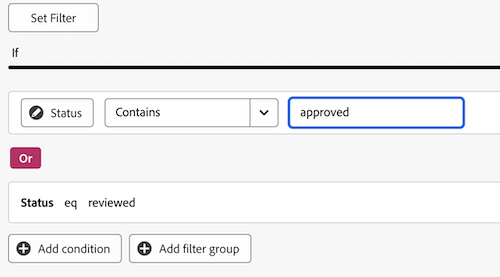

# 建立報表控制面板以供檢閱和核准

您可以在「畫布控制面板」區域中建立報告控制面板，以使用新檔案核准功能來顯示有關稽核與核准的高階資訊和詳細資訊。

>[!IMPORTANT]
>
>此功能僅適用於使用新檔案核准服務並註冊Canvas控制面板Beta版的客戶。

## 建立儀表板

{{step1-to-dashboards}}

1. 在左側面板中，按一下&#x200B;**畫布控制面板**。
1. 按一下&#x200B;**新儀表板**。
1. 為您的儀表板命名。
1. （選用）新增說明。
1. 按一下「**建立**」。
   

建立控制面板後，您就可以開始新增KPI、圖表和表格。 如需詳細資訊，請參閱下列章節：

* [使用KPI和圖表新增高階檢閱和核准資訊](#add-high-level-review-and-approval-information-with-kpis-and-charts)
* [使用表格新增詳細的檢閱和核准資訊](#add-detailed-review-and-approval-information-with-tables)

## 使用KPI和圖表新增高階檢閱和核准資訊

您可以使用KPI和圖表檢視有關檔案核准的高階資訊。 深入分析資訊目前在Beta版中無法使用。

### KPI

<!--
>>[!IMPORTANT]
>
>New document approvals data currently refreshes during the evenings in the US Mountain timezone. Real-time updates are planned and coming soon.-->

#### 待處理的核准

1. [建立儀表板](#create-a-dashboard)，如上節所述。
1. 在&#x200B;**KPI**&#x200B;卡片中，按一下&#x200B;**新增**。
1. 在&#x200B;**KPI標題**&#x200B;文字方塊中輸入&#x200B;_擱置中_。
1. 在&#x200B;**KPI標題**&#x200B;文字方塊中輸入&#x200B;_擱置中的核准_。 此文字說明KPI的顯示內容。
1. 按一下頁面頂端的&#x200B;**選取KPI欄位**。
1. 向下捲動並尋找&#x200B;**檔案核准資料夾**。
1. 選擇&#x200B;**狀態**，然後從下拉式功能表中選取&#x200B;**計數**。
1. 按一下&#x200B;**編輯篩選器** > **新增條件**。
   1. 按一下空白條件篩選，按一下&#x200B;**挑選欄位**，然後選擇&#x200B;**狀態**。
   1. 將運運算元保留為&#x200B;**Equal**，並在文字方塊中輸入&#x200B;_擱置的檢閱_。
      
1. 按一下熒幕右上角的&#x200B;**完成**。

#### 逾期核准

1. [建立儀表板](#create-a-dashboard)，如上節所述。
1. 在&#x200B;**KPI**&#x200B;卡片中，按一下&#x200B;**新增**。
1. 在&#x200B;**KPI標題**&#x200B;文字方塊中輸入&#x200B;_逾期_。
1. 在&#x200B;**KPI標題**&#x200B;文字方塊中，輸入&#x200B;_過去_&#x200B;的核准階段期限。 此文字說明KPI的顯示內容。
1. 按一下頁面頂端的&#x200B;**選取KPI欄位**。
1. 向下捲動並尋找&#x200B;**檔案核准資料夾**。
1. 選擇&#x200B;**狀態**，然後從下拉式功能表中選取&#x200B;**計數**。
1. 按一下&#x200B;**編輯篩選器** > **新增條件**：
   1. 按一下空白條件篩選，按一下&#x200B;**挑選欄位**，然後選擇&#x200B;**截止日期**。
   1. 將運運算元變更為&#x200B;**小於**，並切換「相對日期開啟」，然後在文字方塊中輸入&#x200B;_$$TODAY_。
      
1. 按一下&#x200B;**新增條件**：
   1. 按一下空白條件篩選，按一下&#x200B;**挑選欄位**，然後選擇&#x200B;**狀態**。
   1. 將運運算元變更為&#x200B;**Not Contains**，然後在文字方塊中輸入&#x200B;_已核准_。
      
1. 按一下熒幕右上角的&#x200B;**完成**。

#### 已完成的核准

1. [建立儀表板](#create-a-dashboard)，如上節所述。
1. 在&#x200B;**KPI**&#x200B;卡片中，按一下&#x200B;**新增**。
1. 在&#x200B;**KPI標題**&#x200B;文字方塊中輸入&#x200B;_已完成_。
1. 在&#x200B;**KPI標題**&#x200B;文字方塊中輸入&#x200B;_核准狀態計數_。 此文字說明KPI的顯示內容。
1. 按一下頁面頂端的&#x200B;**選取KPI欄位**。
1. 向下捲動並尋找&#x200B;**檔案核准資料夾**。
1. 選擇&#x200B;**狀態**，然後從下拉式功能表中選取&#x200B;**計數**。
1. 按一下&#x200B;**編輯篩選器** > **新增條件**：
   1. 按一下空白條件篩選，按一下&#x200B;**挑選欄位**，然後選擇&#x200B;**狀態**。
   1. 將運運算元變更為&#x200B;**包含**，並在文字方塊中輸入&#x200B;_已核准_。
      
1. 按一下&#x200B;**新增條件**：
   1. 按一下&#x200B;**和**&#x200B;以將其變更為&#x200B;**或**。
   1. 按一下空白條件篩選，按一下&#x200B;**挑選欄位**，然後選擇&#x200B;**狀態**。
   1. 將運運算元變更為&#x200B;**等於**，然後在文字方塊中輸入&#x200B;_已檢閱_。
      
1. 按一下熒幕右上角的&#x200B;**完成**。

#### 放棄的核准

1. [建立儀表板](#create-a-dashboard)，如上節所述。
1. 在&#x200B;**KPI**&#x200B;卡片中，按一下&#x200B;**新增**。
1. 在&#x200B;**KPI標題**&#x200B;文字方塊中輸入&#x200B;_放棄的_。
1. 在&#x200B;**KPI標題**&#x200B;文字方塊中，輸入&#x200B;_超過2週_&#x200B;的核准期限。 此文字說明KPI的顯示內容。
1. 按一下頁面頂端的&#x200B;**選取KPI欄位**。
1. 向下捲動並尋找&#x200B;**檔案核准階段資料夾**。
1. 選擇&#x200B;**截止日期**，然後從下拉式功能表中選取&#x200B;**計數**。
1. 按一下&#x200B;**編輯篩選器** > **新增條件**：
   1. 按一下空白條件篩選，按一下&#x200B;**挑選欄位**，然後選擇&#x200B;**狀態**。
   1. 將運運算元變更為&#x200B;**Not Contains**，並在文字方塊中輸入&#x200B;_已核准_。
      
1. 按一下&#x200B;**新增條件**：
   1. 按一下空白條件篩選，按一下&#x200B;**挑選欄位**，然後選擇&#x200B;**截止日期**。
   1. 將運運算元變更為&#x200B;**小於**，然後切換[相對日期開啟]，然後在文字方塊中輸入&#x200B;_$$TODAY-2w_。
      
1. 按一下熒幕右上角的&#x200B;**完成**。

### 圖表

#### 依決定長條圖的核准

1. [建立儀表板](#create-a-dashboard)，如上節所述。
1. 在&#x200B;**圖表**&#x200B;卡片中，按一下&#x200B;**新增**。
1. 在&#x200B;**名稱**&#x200B;文字方塊中，依決定&#x200B;_輸入_&#x200B;核准。
1. （選擇性）在&#x200B;**描述**&#x200B;文字方塊中輸入描述。 此文字會在圖表名稱旁邊顯示為工具提示。
1. 按一下&#x200B;**開啟圖表詳細資料**。
1. 在&#x200B;**圖表型別**&#x200B;下拉式功能表中，保留&#x200B;**長條圖**&#x200B;已選取。
1. 在&#x200B;**列型別**&#x200B;下拉式功能表中，保留&#x200B;**簡單**&#x200B;已選取。
1. 按一下&#x200B;**底部(X)軸**&#x200B;的&#x200B;**更新欄位**，然後選擇第一個&#x200B;**檔案核准**&#x200B;資料夾然後&#x200B;**狀態**。
1. 將彙總型別設定為&#x200B;**計數**。
1. 按一下&#x200B;**左(Y)軸**&#x200B;的&#x200B;**更新欄位**，然後選擇第一個&#x200B;**檔案核准**&#x200B;選項然後&#x200B;**狀態**。
1. 按一下「篩選」標籤。
1. 按一下&#x200B;**編輯篩選器** > **新增條件**：
   1. 按一下空白條件篩選，按一下&#x200B;**挑選欄位**，然後選擇&#x200B;**檔案版本版本**。
   1. 將運運算元變更為&#x200B;**Is Not Null**。
      
1. 按一下熒幕右上角的&#x200B;**完成**。

#### 修訂橫條圖

1. [建立儀表板](#create-a-dashboard)，如上節所述。
1. 在&#x200B;**圖表**&#x200B;卡片中，按一下&#x200B;**新增**。
1. 在&#x200B;**名稱**&#x200B;文字方塊中輸入&#x200B;_修訂版本_。
1. 在&#x200B;**描述**&#x200B;文字方塊中，針對本月底前計畫之未完成決策的檔案&#x200B;_輸入_&#x200B;修訂數目。 此文字會在圖表名稱旁邊顯示為工具提示。
1. 按一下&#x200B;**開啟圖表詳細資料**。
1. 在&#x200B;**圖表型別**&#x200B;下拉式功能表中，保留&#x200B;**長條圖**&#x200B;已選取。
1. 在&#x200B;**列型別**&#x200B;下拉式功能表中，保留&#x200B;**簡單**&#x200B;已選取。
1. 按一下&#x200B;**底部(X)座標軸**&#x200B;的&#x200B;**更新欄位**，然後選擇第一個&#x200B;**檔案核准**&#x200B;資料夾，然後&#x200B;**檔案版本** > **版本**。
1. 將彙總型別設定為&#x200B;**計數**。
1. 按一下&#x200B;**左(Y)軸**&#x200B;的&#x200B;**更新欄位**，然後選擇第一個&#x200B;**檔案核准**&#x200B;選項，然後&#x200B;**檔案版本** > **檔案** > **名稱**。
1. 按一下「篩選」標籤。
1. 按一下&#x200B;**編輯篩選器** > **新增條件**：
   1. 按一下空白條件篩選，按一下&#x200B;**挑選欄位**，然後選擇&#x200B;**核准階段參與者決定日期**。
   1. 將運運算元變更為&#x200B;**Is Null**。
      
1. 按一下&#x200B;**編輯篩選器** > **新增條件**：
   1. 按一下空白條件篩選，按一下&#x200B;**挑選欄位**，然後選擇&#x200B;**核准階段截止日期**。
   1. 將運運算元變更為&#x200B;**小於或等於**，然後將「設定相對日期為&#39;開啟&#39;並在文字方塊中輸入&#x200B;_$$TODAYem_。
      
1. 按一下熒幕右上角的&#x200B;**完成**。

## 使用表格新增詳細的檢閱和核准資訊

### 擱置核准清單

1. [建立儀表板](#create-a-dashboard)，如上節所述。
1. 在&#x200B;**表格**&#x200B;卡片中，按一下&#x200B;**新增**。
1. 在&#x200B;**名稱**&#x200B;文字方塊中輸入&#x200B;_擱置核准_。
1. （選擇性）在&#x200B;**描述**&#x200B;文字方塊中輸入描述。 此文字會在圖表名稱旁邊顯示為工具提示。
1. 按一下&#x200B;**開啟資料行設定**。
1. 按一下&#x200B;**新增欄**，向下捲動並按一下第一個&#x200B;**檔案核准**&#x200B;資料夾，然後選擇&#x200B;**狀態**。
1. 新增下列欄：

   <table>
    <tr>
    <td><strong>專案名稱</strong></td>
    <td>檔案版本&gt;檔案&gt;專案&gt;名稱</td>
    </tr>
    <tr>
    <td><strong>文件名稱</strong></td>
    <td>檔案版本&gt;檔案&gt;在搜尋方塊中輸入_Name_。</td>
    </tr>
    <tr>
    <td><strong>檔案版本</strong></td>
    <td>檔案版本&gt;檔案&gt;版本</td>
    </tr>
    <tr>
    <td><strong>截止日期</strong></td>
    <td>檔案&gt;核准階段&gt;期限</td>
    </tr>
    <tr>
    <td><strong>請求者</strong></td>
    <td>檔案&gt;核准階段&gt;核准階段參與者* &gt;請求者&gt;在搜尋方塊中輸入_Name_。</td>
    </tr>
     <tr>
    <td><strong>請求的日期</strong></td>
    <td>檔案&gt;核准階段&gt;核准階段參與者* &gt;建立於</td>
    </tr>
     <tr>
    <td><strong>核准者</strong></td>
    <td>檔案&gt;核准階段&gt;核准階段參與者* &gt;參與者使用者&gt;在搜尋方塊中輸入_Name_。</td>
    </tr>
    <table>

   *核准階段參與者將被截斷為核准階段Pa。

1. 繼續[在](#add-the-required-filter)底下新增必要的篩選器。

#### 新增必要的擱置核准篩選器

1. 按一下「篩選」標籤。
1. 按一下&#x200B;**編輯篩選器** > **新增條件**：
   1. 按一下空白條件篩選，按一下&#x200B;**挑選欄位**，然後選擇&#x200B;**狀態**。
   1. 將運運算元變更為&#x200B;**等於**，然後輸入&#x200B;_擱置核准_。
      
1. 新增如下所述的可選篩選器，或按一下畫面右上角的&#x200B;**完成**。

**選用的篩選器**

若要根據您的使用案例檢視更具體的資訊，您可以新增其他篩選條件。 您可能會想要重新建立表格，並針對每個使用案例新增篩選條件。

+++ 展開以檢視其他篩選器選項

**我的專案**

1. 按一下&#x200B;**編輯篩選器** > **新增條件**：
   1. 按一下空白條件篩選，按一下&#x200B;**挑選欄位**，然後在搜尋方塊中選擇&#x200B;**檔案版本** > **檔案** > **專案** > **所有者** >輸入&#x200B;_名稱_。
   1. 將運運算元變更為&#x200B;**等於**，然後選擇&#x200B;**我（已登入的使用者）**以在Workfront中顯示您標示為專案所有者的專案。
      
1. 按一下熒幕右上角的&#x200B;**完成**。

**我已提交的核准**

1. 按一下&#x200B;**編輯篩選器** > **新增條件**：
   1. 按一下空白條件篩選，按一下&#x200B;**挑選欄位**，然後在搜尋方塊中選擇&#x200B;**核准階段** > **核准階段參與者** > **請求者** >輸入&#x200B;_名稱_。
   1. 將運運算元變更為&#x200B;**等於**，然後選擇&#x200B;**我（已登入的使用者）**以在Workfront中顯示您標示為專案所有者的專案。
      
1. 按一下熒幕右上角的&#x200B;**完成**。

+++

### 逾期核准清單

1. [建立儀表板](#create-a-dashboard)，如上節所述。
1. 在[表格]卡片中，按一下[新增]。****
1. 在&#x200B;**名稱**&#x200B;文字方塊中輸入&#x200B;_逾期核准_。
1. （選擇性）在&#x200B;**描述**&#x200B;文字方塊中輸入描述。 此文字會在圖表名稱旁邊顯示為工具提示。
1. 按一下&#x200B;**開啟資料行設定**。
1. 按一下&#x200B;**新增欄**，向下捲動並按一下第一個&#x200B;**檔案核准**&#x200B;資料夾，然後選擇&#x200B;**狀態**。
1. 新增下列欄：

   <table>
    <tr>
    <td><strong>專案名稱</strong></td>
    <td>檔案版本&gt;檔案&gt;專案&gt;名稱</td>
    </tr>
    <tr>
    <td><strong>文件名稱</strong></td>
    <td>檔案版本&gt;檔案&gt;在搜尋方塊中輸入_Name_。</td>
    </tr>
    <tr>
    <td><strong>檔案版本</strong></td>
    <td>檔案版本&gt;檔案&gt;版本</td>
    </tr>
    <tr>
    <td><strong>截止日期</strong></td>
    <td>檔案&gt;核准階段&gt;期限</td>
    </tr>
    <tr>
    <td><strong>請求者</strong></td>
    <td>檔案&gt;核准階段&gt;核准階段參與者* &gt;請求者&gt;在搜尋方塊中輸入_Name_。</td>
    </tr>
     <tr>
    <td><strong>請求的日期</strong></td>
    <td>檔案&gt;核准階段&gt;核准階段參與者* &gt;建立於</td>
    </tr>
     <tr>
    <td><strong>核准者</strong></td>
    <td>檔案&gt;核准階段&gt;核准階段參與者* &gt;參與者使用者&gt;在搜尋方塊中輸入_Name_。</td>
    </tr>
    <table>

   *核准階段參與者將被截斷為核准階段Pa。

1. 繼續[在](#add-the-required-filter-1)底下新增必要的篩選器。

#### 新增必要的逾期核准篩選器

1. 按一下「篩選」標籤。
1. 按一下&#x200B;**編輯篩選器** > **新增條件**：
   1. 按一下空白條件篩選，按一下&#x200B;**挑選欄位**，然後選擇&#x200B;**核准階段** > **截止日期**。
   1. 將運運算元變更為&#x200B;**小於**，切換&#x200B;**設定相對日期**&#x200B;開啟，然後輸入&#x200B;_$$TODAY_。
      
1. 新增如下所述的可選篩選器，或按一下畫面右上角的&#x200B;**完成**。

**選用的篩選器**

若要根據您的使用案例檢視更具體的資訊，您可以新增其他篩選條件。 您可能會想要重新建立表格，並針對每個使用案例新增新的選用篩選條件。

+++ 展開以檢視其他篩選器選項

**我的專案**

1. 按一下&#x200B;**編輯篩選器** > **新增條件**：
   1. 按一下空白條件篩選，按一下&#x200B;**挑選欄位**，然後在搜尋方塊中選擇&#x200B;**檔案版本** > **檔案** > **專案** > **所有者** >輸入&#x200B;_名稱_。
   1. 將運運算元變更為&#x200B;**等於**，然後選擇&#x200B;**我（已登入的使用者）**以在Workfront中顯示您標示為專案所有者的專案。
      
1. 按一下熒幕右上角的&#x200B;**完成**。

**我已提交的核准**

1. 按一下&#x200B;**編輯篩選器** > **新增條件**：
   1. 按一下空白條件篩選，按一下&#x200B;**挑選欄位**，然後在搜尋方塊中選擇&#x200B;**核准階段** > **核准階段參與者** > **請求者** >輸入&#x200B;_名稱_。
   1. 將運運算元變更為&#x200B;**等於**，然後選擇&#x200B;**我（已登入的使用者）**以在Workfront中顯示您標示為專案所有者的專案。
      
1. 按一下熒幕右上角的&#x200B;**完成**。

**我的團隊**

1. 按一下&#x200B;**編輯篩選器** > **新增條件**：
   1. 按一下空白條件篩選，按一下&#x200B;**挑選欄位**，然後選擇&#x200B;**核准階段** > **核准階段參與者** > **參與者團隊** >在搜尋方塊中輸入&#x200B;_名稱_。
   1. 將運運算元變更為&#x200B;**等於**，然後選擇&#x200B;**我的預設團隊（登入使用者）**&#x200B;或&#x200B;**我的其他團隊（登入使用者）**以顯示指派給您的預設團隊或您所在的其他團隊的專案。
      
1. 按一下熒幕右上角的&#x200B;**完成**。
+++

