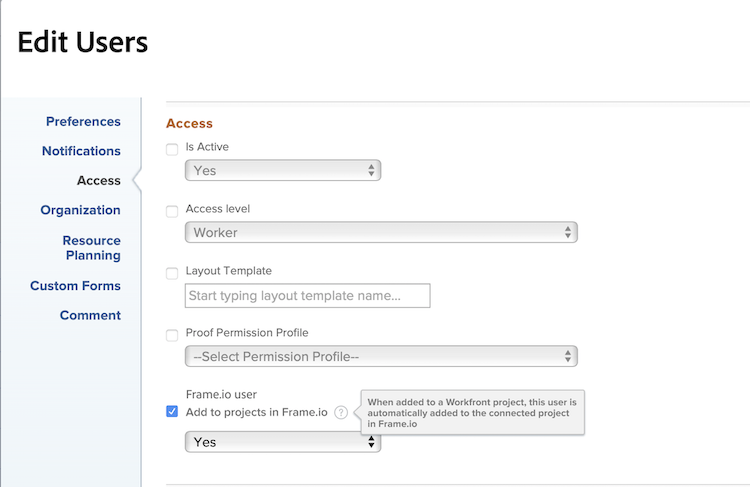

# 開始使用Frame.io進行資產檢閱和核准

新的資產檢閱和核准工作流程是圍繞Workfront與Frame.io之間的緊密整合而建置。 此整合可充分利用每個產品所提供的功能，並結合這些功能，創造一種體驗，讓每個參與內容建立的人，都能使用自己選擇的工具進行工作，同時存取評論、檔案和狀態更新，所有這些動作都可在兩個系統間即時同步。

如需Frame.io的詳細資訊，請參閱[開始使用Frame.io](https://support.frame.io/en/collections/49298-getting-started)。

## Workfront中的工作啟動和規劃

Workfront管理員可啟用Workfront與Frame.io之間的整合，方法是在「設定」區域中設定預設Frame.io帳戶，然後在Workfront中指定Frame.io使用者。 這允許協調員使用Workfront專案和正式的稽核及核准工作流程來計畫及啟動工作。

### 設定預設的Frame.io帳戶[!BADGE 即將推出]{type=Informative}

Workfront管理員會在Workfront的「設定」區域中新增預設Frame.io帳戶，以起始Workfront和Frame.io整合。 設定預設的Frame.io帳戶後，在Workfront中建立的任何專案都會在Frame.io中建立映象專案。

>[!IMPORTANT]
>
>此功能即將推出。 目前，Frame.io帳戶是由Workfront團隊手動新增。 請聯絡您的Adobe客戶代表以尋求協助。

<!--For more information, see [Configure the [!DNL Workfront] and [!DNL Frame.io] integration](/help/quicksilver/administration-and-setup/configure-integrations/configure-wf-and-frame.md).

 in procedure article we need to cover how groups work with projects and how the frame account is associated with a group. And that accounts other than the default can be added on a 1:1 basis using the dev token. -->

### 啟用Frame.io使用者（現在可用）

經常使用Frame.io的Workfront使用者應標示為Frame.io使用者。 Workfront管理員可以在Workfront使用者設定檔中指定Frame.io使用者。

>[!TIP]
>
>我們建議讓經常使用創意工具及上傳資產的使用者能夠以Frame.io使用者的身分檢閱和核准。

當使用者在Workfront中標示為Frame.io使用者並新增至專案時：

* 他們在Frame.io中新增為共同作業人員。
* 他們可以從Frame.io將資產傳送到Workfront以進行正式檢閱和核准。
* 他們可以從Workfront在單向同步資料夾中檢視資訊。 [!BADGE 即將推出]{type=Informative}

如需詳細資訊，請參閱[設定 [!DNL Workfront] 與 [!DNL Frame.io] 整合](/help/quicksilver/administration-and-setup/configure-integrations/configure-wf-and-frame.md)。

### 建立與Frame.io連線的專案

一旦新增預設Frame.io帳戶並指定Frame.io使用者後，專案專員即可建立與Frame.io連線的Workfront專案。 建立連線的專案時，您可以

* **將Frame.io使用者指派給工作**：啟用Frame.io的使用者被指派給Workfront工作時，會收到電子郵件通知，以通知有工作要完成。
* **與Frame.io使用者共用專案**：當專案與已啟用Frame.io的使用者共用時，他們可存取Workfront和Frame.io內的專案。
* **與Frame.io共用創意素材**：專案專員可使用單向同步專案資料夾，直接從Workfront傳送指示和素材給Frame.io中的創意使用者。 [!BADGE 即將推出]{type=Informative}
* **追蹤任務進度**：創意人員可以傳送完成的資產，並將任務標示為完成 — 全部無需離開Frame.io。

如需詳細資訊，請參閱[建立與Frame.io](/help/quicksilver/manage-work/projects/create-projects/create-frame-connected-project.md)連線的專案。

## 在Frame.io中建立內容與共同作業

創意人員可以留在他們選擇的工具中，並自由地在Frame.io中建立、迭代及執行對等稽核。

將創意內容新增至連線的專案時，他們可以在Frame.io中執行下列動作：

<!--* Access instructions from the project coordinator -->
* 進行非正式的同行評審
* 將完成的資產傳送到Workfront進行正式檢閱和核准
* 變更任務的狀態或將其標籤為完成
* 上傳新版本，然後重新提交以進行核准<!--do they have to send to frame.io again?-->

如需有關Frame.io的詳細資訊，請參閱[我被邀請在專案上共同作業](https://support.frame.io/en/articles/11125-i-ve-been-invited-to-collaborate-on-a-project)。

## 檢閱及核准資產

一旦創意內容從Frame.io將完成的資產傳送到Workfront，專案協調員就可以在Workfront中啟動正式的稽核和核准流程。

建立核准工作流程後，稽核者和核准者會返回Frame.io新增註解並標籤資產。 他們也可以在Frame.io檢視器中做出核准決定。

### 在Workfront中啟動正式稽核和核准

專案專員可建立一次性稽核和核准或可再次核准的範本。 Frame.io中的所有檢閱和核准活動也會記錄在Workfront中。

專案專員可選擇指派稽核者、核准者，或兩者的組合：

* **檢閱者**&#x200B;可以新增註解及標籤資產。 完成後，他們可以將其稽核標籤為完成。 資產不需要將稽核標籤為完成，才能在核准程式中前進。
* **核准者**&#x200B;可以新增註解及標籤資產。 他們必須決定推進核准程式。

#### 建立稽核和核准工作流程

可將稽核者和核准者新增至一次性核准工作流程或可重複使用的核准範本：

* **單次使用核准**：在資產所在的專案或任務中，專案協調員可以指派稽核者和核准者，並設定完成期限。 截止日期前72及24小時以及截止日期本身，會透過電子郵件提醒檢閱者和核准者。

  如需詳細資訊，請參閱* [建立Frame.io資產的檢閱或核准要求](/help/quicksilver/review-and-approve-work/document-reviews-and-approvals/manage-document-approvals/create-request-for-frame-asset.md)。

* **核准範本**：在Workfront設定區域中，專案專員可以建立可繼續使用的核准範本。 在範本中，使用者可以新增稽核者和核准者，並指定完成時間範圍。 將核准範本套用至資產時，截止日期是從指定的時間範圍計算。

  建立範本後，可將其套用至從Frame.io傳送的資產，以在Workfront中開始正式的稽核和核准流程。

  如需詳細資訊，請參閱[建立核准範本](/help/quicksilver/review-and-approve-work/document-reviews-and-approvals/manage-document-approvals/create-approval-template.md)

#### 存取Frame.io檢視器

使用者可透過下列方式存取Frame.io檢視器：

* Workfront電子郵件通知
* 新Workfront首頁區域中的等待我核准Widget
  

>[!NOTE]
>
>系統會透過電子郵件通知外部Workfront使用者，並要求他們建立Frame.io登入頁面，以檢閱和核准資產。

#### 新增評論及標籤資產

在Frame.io檢視器中所做的所有註解也會記錄在Workfront的「更新」標籤中。 在Workfront中進行的回覆不會出現在Frame.io中。 如果評論在Frame.io檢視器中標示為「僅限團隊」，則不會出現在Workfront的「更新」標籤中。

#### 做出決定

所有複查活動完成後，核准者必須執行下列其中一項決定：

* **核准**：資產不需要變更，而且已可供使用。
* **核准變更**：資產需要變更，而且變更完成後即可使用。 不需要額外核准。
* **需要工作**：資產需要變更，而且尚未準備好使用。 完成指定的變更後，必須將資產上傳為新版本，並經過另一輪核准。<!--is the same approval workflow automatically applied? Does the coordinator have to do anything to get the approval going? -->

檢閱者可以在Frame.io檢視器內將其檢閱標籤為完成，但這並非資產在核准程式中前進所必需的。

如需Workfront中決定的詳細資訊，請參閱[檔案決定狀態概觀](/help/quicksilver/review-and-approve-work/document-reviews-and-approvals/manage-document-approvals/document-approval-status.md)。

<!-- upload assets directly to workfront to be reviewed in Frame.io/ Will have to send manually at first

Reviewer/approver needs to go through email to get to frame vier
-->

### 追蹤檢閱和核准量度

專案專員可使用下列Widget在Workfront首頁區域監控所有執行中核准的進度：

* **所有核准**：顯示2個圖表，其中包含平均核准時間和決定的相關資訊，以及擱置和逾期核准的清單檢視。
  