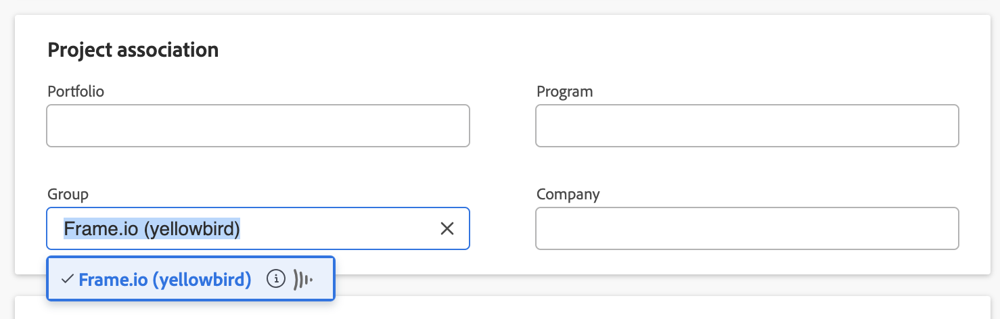

# 連線Workfront和Frame.io

>[!IMPORTANT]
>
>本文內容指的更新檔案核准功能僅適用於特定帳戶。 如需有關標準核准流程的資訊，請參閱下列文章： [工作核准](/help/quicksilver/review-and-approve-work/manage-approvals/manage-approvals.md).

Workfront在稽核和核准流程中使用Frame.io來會見他們想要工作的人。 專案管理和核准程式在Workfront中進行管理，而稽核程式在Frame.io中完成。 您必須完成下列所有章節，才能成功設定整合：

* [將Workfront群組連線到Frame.io群組](#connect-a-workfront-group-to-a-frameio-team)
* [建立Workfront專案並新增連線的群組](#create-a-workfront-project-and-add-a-connected-group)

## 存取需求

* 您的組織必須手動上線到測試版，請使用本文所述的功能。 如需詳細資訊，請參閱 [Adobe Workfront和Frame.io原生整合Beta版](/help/quicksilver/review-and-approve-work/Documents/wf-frame-alpha.md).

## 將Workfront群組連線到Frame.io群組

我們正積極改善此功能，於5月全面推出。

### 先決條件

* 建立Frame.io團隊以對應至Workfront群組。
* 尋找團隊的API開發人員權杖。 如需詳細資訊，請參閱 [開發人員權杖](https://developer.frame.io/docs/getting-started/authentication#developer-tokens) 在Frame.io開發人員網站上。

### 將Workfront群組連線到Frame.io群組

{{step-1-to-setup}}

1. 在左側面板中，按一下 **群組**.
1. 選擇現有群組，或按一下 **建立群組**.
1. 在左側面板中，按一下 **連線到Frame.io**.
   
1. 輸入API開發人員權杖。
1. 按一下 **啟動連線**.
1. （視條件而定）如果您是多個Frame.io帳戶的管理員，請選取您要使用的帳戶。

## 建立Workfront專案並新增連線的群組

將Workfront群組連線至Frame.io團隊後，您必須建立具有該連線群組的專案。

### 先決條件

* 您必須將Workfront群組連線至Frame.io團隊，如上一節所述。

### 建立Workfront專案並新增連線的群組

{{step1-to-projects}}

1. 從頭開始建立新專案或範本。 如需如何建立專案的詳細資訊，請參閱 [建立專案](/help/quicksilver/manage-work/projects/create-projects/create-project.md).

1. 在左側面板中尋找 **專案詳細資訊**.

1. 尋找 **群組** 欄位，並移除預設群組。

1. 在下拉式功能表中，尋找所需的群組。 與Frame.io連線的群組會顯示Frame.io圖示。
   

1. 進行任何其他專案組態變更。

1. 按一下「**儲存變更**」。

1. 繼續下一節。

### 新增任務並將整合狀態設定為「作用中」

>[!NOTE]
>
>連線的Frame.io專案目前不支援子任務。

1. 建立您需要填入Frame.io中的任務

1. 選取您需要的工作，然後按一下 **編輯**.

1. 捲動至 **自訂Forms** 區段，並尋找Frame.io整合表單。

   >[!IMPORTANT]
   >
   >必須在[專案詳細資料]區域中指定連線的Frame.io群組，才能顯示此表單。 如需詳細資訊，請參閱 [建立Workfront專案並新增連線的群組](#create-a-workfront-project-and-add-a-connected-group) 本文章內容。

1. 啟用 **此任務的整合狀態** 核取方塊，然後選擇 **作用中**.
   

1. 按一下 **儲存變更**. 專案名稱旁會顯示Frame.io圖示。

1. 將使用者或團隊指派給任務。

   >[!NOTE]
   >
   >新增至任務的使用者或團隊也會新增至Frame.io專案。

1. 在專案檔案區域中上傳任何檔案或創意簡介。

專案仍未連線，您必須繼續下一區段以完成整合。

### 在Frame.io中啟用專案

1. 變更專案狀態 **規劃** 至 **目前** 或等於目前狀態的自訂狀態。 如此即可完成整合，並在Frame.io中產生專案、任務及任何檔案。

專案名稱旁的Frame.io圖示會變成紫色，表示整合成功。 使用者會收到電子郵件邀請他們加入Frame.io專案。

>[!IMPORTANT]
>
>為Frame.io連線專案後，對專案群組所做的變更不會反映在Frame.io中。
