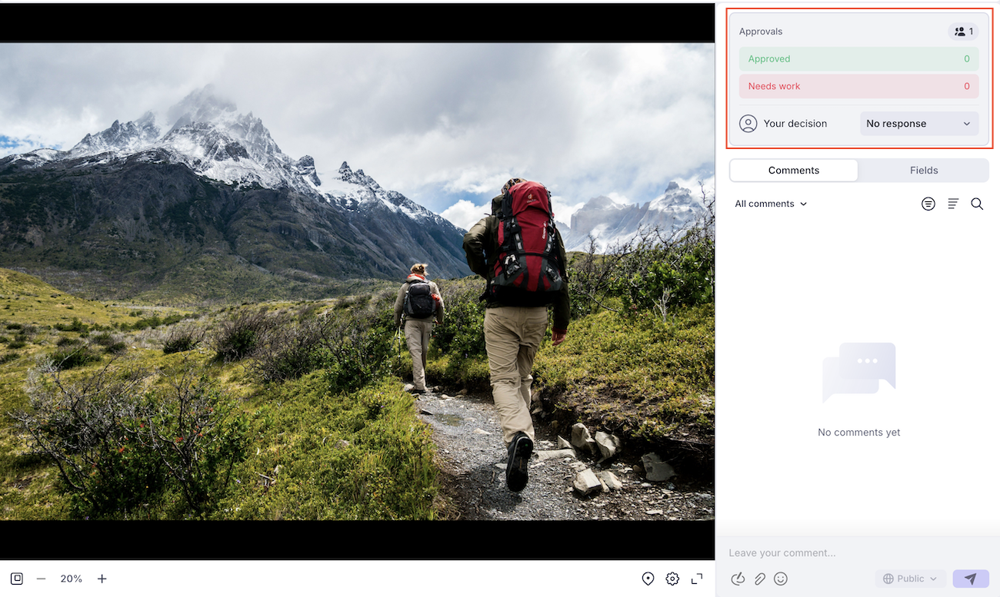

# 使用Frame.io檢視器檢閱並核准

您可以使用Frame.io檢視器在Workfront中檢閱和核准檔案。

使用Frame.io檢視器檢閱Workfront檔案，可讓您留下註解或標示檔案、影像或視訊的特定區段，以便與團隊有效率地合作，並確保意見清晰且易於操作。

如需有關Frame.io與Workfront整合的詳細資訊，請參閱[整合式稽核和核准總覽](/help/quicksilver/review-and-approve-work/document-reviews-and-approvals/document-approvals-overview.md)。

## 存取權要求

+++ 展開以檢視這篇文章中所述功能的存取權要求。

<table style="table-layout:auto"> 
 <col> 
 </col> 
 <col> 
 </col> 
 <tbody> 
  <tr> 
   <td role="rowheader">Adobe Workfront 封裝</td> 
   <td> 
使用舊版Workfront儲存空間管理核准的任何Workfront套件

使用Adobe雲端儲存空間管理核准的任何Workflow套件
 </td> 
  </tr> 
  <tr> 
   <td role="rowheader">Adobe Workfront 授權</td> 
   <td> 
要求或更高版本

   
投稿人或以上
 </td> 
  </tr> 
  <tr data-mc-conditions=""> 
   <td role="rowheader">存取層級設定</td> 
   <td> 
編輯檔案的存取權
 </td> 
  </tr> 
  <tr data-mc-conditions=""> 
   <td role="rowheader">物件許可權</td> 
   <td> 
編輯與檔案關聯之物件的存取權
 </td> 
  </tr> 
 </tbody> 
</table>

如需詳細資訊，請參閱Workfront檔案中的[存取需求](/help/quicksilver/administration-and-setup/add-users/access-levels-and-object-permissions/access-level-requirements-in-documentation.md)。

+++

## 先決條件

* 您必須在Workfront執行個體中設定Workfront和Frame.io整合。 如需詳細資訊，請參閱[整合式檢閱與核准總覽](/help/quicksilver/review-and-approve-work/document-reviews-and-approvals/document-approvals-overview.md#integration-requirements)。

## 檢閱檔案

身為檢閱者，您可以對資產新增註解及標示。 完成後，您可以在Workfront中將您的評論標籤為完成。 資產不需要將稽核標籤為完成，才能在核准程式中前進。

1. 移至您的檢閱電子郵件通知，然後按一下&#x200B;**移至檢閱**。
或
前往Workfront首頁，尋找「我的核准」Widget，然後按一下**開啟稽核**。

   >[!NOTE]
   > 
   >您可能需要將我的核准Widget新增到您的首頁。 如需詳細資訊，請參閱[新增、編輯或移除首頁中的Widget](/help/quicksilver/workfront-basics/using-home/using-the-home-area/add-edit-remove-widgets-in-new-home.md)。

1. 在Frame.io中，使用註解工具提供意見或提出問題。
註解與資產標籤只會顯示在Frame.io檢視器中。 評論不會顯示在Workfront中。 如需使用Frame.io檢視器的詳細資訊，請參閱[在您的媒體上發表評論](https://help.frame.io/en/articles/9105251-commenting-on-your-media)。
1. 在您滿意檔案後，請導覽回Workfront中的「檔案詳細資訊」頁面，並將您的檢閱標籤為完成。

   

## 核准檔案

核准者可以新增註解並標示為資產。 您必須決定是否要推進核准流程。

在所有指派的核准者選擇「已核准」之前，檔案不會移動到「已核准」狀態。

若要對檔案做出決定：

1. 移至您的檢閱電子郵件通知，然後按一下&#x200B;**移至檢閱**。
或
前往Workfront首頁，尋找「我的核准」Widget，然後按一下**開啟稽核**。

   >[!NOTE]
   > 
   >您可能需要將我的核准Widget新增到您的首頁。 如需詳細資訊，請參閱[新增、編輯或移除首頁中的Widget](/help/quicksilver/workfront-basics/using-home/using-the-home-area/add-edit-remove-widgets-in-new-home.md)。

1. 在Frame.io中，使用註解工具提供意見或提出問題。 註解與資產標示只會顯示在Frame.io檢視器中。 如需使用Frame.io檢視器的詳細資訊，請參閱[在您的媒體上發表評論](https://help.frame.io/en/articles/9105251-commenting-on-your-media)。
1. 一旦您對檔案滿意，就可以在Frame.io檢視器中選擇下列其中一項決定：

   * **核准**：資產不需要變更，而且已可供使用。
   * **需要工作**：資產需要變更，而且尚未準備好使用。 完成指定的變更後，必須將資產上傳為新版本，並經過另一輪核准。 如需詳細資訊，請參閱[上傳新檔案版本並請求核准](/help/quicksilver/review-and-approve-work/document-reviews-and-approvals/manage-document-approvals/upload-new-doc-version.md)。<!--do they need to tell someone it was uploaded via comment tagging?-->

   做出決定後，檔案所有者會透過電子郵件收到通知。

   如需Workfront中決定的詳細資訊，請參閱[檔案決定狀態概觀](/help/quicksilver/review-and-approve-work/document-reviews-and-approvals/manage-document-approvals/document-approval-status.md)。

   

<!--is document owner the correct term?-->
