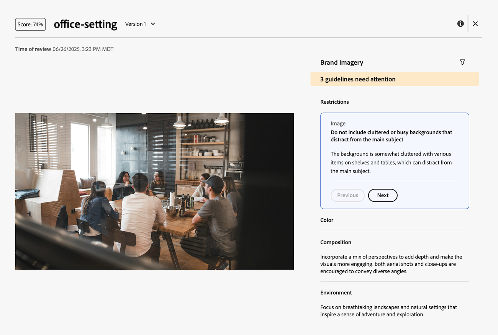

# 檢視AI檢閱者評分和意見反應

>[!NOTE]
>
>此功能目前處於Beta測試階段。

在您提交檢閱和核准請求數秒後，即可在「檔案摘要」面板中從AI檢閱者檢視分數和回饋。

AI檢閱者並非設計成檢閱和核准工作流程中的決策者。 它只會提供分數和建議，以讓資產符合指定的品牌需求。

## 檢視分數和意見反應

您可以從「檔案摘要」面板或「檔案詳細資訊」頁面上的「核准」索引標籤中檢視AI檢閱者的分數和回饋。

1. 在Workfront通知電子郵件中，按一下&#x200B;**前往檢閱**。
或
前往檔案上傳所在區域，然後開啟檔案摘要面板。
1. 按一下&#x200B;**分數**。
   

在評分和意見回饋視窗中，AI檢閱者會說明資產如何不符合指定的准則。

## 上傳新版本並再次新增AI檢閱者

如果您需要根據AI稽核者的意見調整資產，您可以上傳新版本並開始新的稽核。

如需詳細資訊，請參閱[上傳新檔案版本並請求核准](/help/quicksilver/review-and-approve-work/document-reviews-and-approvals/manage-document-approvals/upload-new-doc-version.md)。
