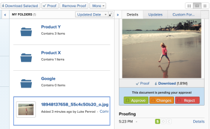

# 核准工作

<!--

(NOTE:&nbsp;From&nbsp;Courtney: Linked to Training sites/ articles , don't change title and link)

-->

如果您被設定為核准者，您應定期稽核等待您核准的工作。

如需有關建立核准流程的資訊，請參閱[建立工作專案的核准流程](../../administration-and-setup/customize-workfront/configure-approval-milestone-processes/create-approval-processes.md)。

如需將核准與Workfront中的工作建立關聯的資訊，請參閱[將新的或現有的核准程式與工作建立關聯](../../review-and-approve-work/manage-approvals/associate-approval-with-work.md)。

## 存取需求

+++ 展開以檢視本文中功能的存取需求。

您必須具有下列存取權才能執行本文中的步驟：

<table style="table-layout:auto"> 
 <col> 
 <col> 
 <tbody> 
  <tr> 
   <td role="rowheader">Adobe Workfront計畫*</td> 
   <td> 
任何
 </td> 
  </tr> 
  <tr> 
   <td role="rowheader">Adobe Workfront授權*</td> 
   <td> 
評論或以上
 </td> 
  </tr> 
  <tr> 
   <td role="rowheader">存取層級設定*</td> 
   <td> 
檢視與核准關聯的物件或更高的存取許可權
 
注意：如果您還是沒有存取權，請詢問您的Workfront管理員，他們是否在您的存取層級中設定其他限制。 如需Workfront管理員如何修改存取層級的詳細資訊，請參閱<a href="../../administration-and-setup/add-users/configure-and-grant-access/create-modify-access-levels.md" class="MCXref xref">建立或修改自訂存取層級</a>。
 </td> 
  </tr> 
  <tr> 
   <td role="rowheader">物件許可權</td> 
   <td> 
檢視與核准相關聯的物件或更高許可權
 
如需請求其他存取權的資訊，請參閱<a href="../../workfront-basics/grant-and-request-access-to-objects/request-access.md" class="MCXref xref">請求物件</a>的存取權。
 </td> 
  </tr> 
 </tbody> 
</table>

若要瞭解您擁有的計畫、授權型別或存取權，請聯絡您的Workfront管理員。

+++

## 在Adobe Workfront中尋找核准

您可以在Workfront的各個區域中檢視和管理核准。

如需有關檢視等待核准的專案或您自己提交核准之專案的詳細資訊，請參閱[檢視核准](../../review-and-approve-work/manage-approvals/view-approvals.md)。

## 核准來自首頁區域的工作

1. 按一下右上角的&#x200B;**[!UICONTROL 主功能表]** ，然後按一下&#x200B;**[!UICONTROL 首頁]**。
1. （視條件而定）按一下&#x200B;**自訂**&#x200B;以新增&#x200B;**我的核准** Widget。
1. （視條件而定）按一下&#x200B;**篩選器**&#x200B;下拉式功能表，然後選取&#x200B;**全部**&#x200B;以檢視指派給您的核准和委派。

   >[!NOTE]
   >
   >指派給工作角色或群組的核准未顯示在首頁中。 指派給團隊的核准會顯示在每個團隊成員的「我的核准」小工具中。

1. 選取您要進行核准決定的專案。

   

1. 在右側面板中作出核准決定時，按一下其中一個可用選項。 下列選項會根據您核准的專案型別，顯示在頁面的右上角：

   <table>
   <tr>
      <td>
      
<strong>存取</strong>

      </td>
      <td>
      
<strong>工作專案</strong>

      </td>
      <td>
      
<strong>文件</strong>

      </td>
      <td>
      
<strong>校訂</strong>

      </td>
   </tr>
   <tr>
      <td>
       <ul>
      <li>授予</li>
      <li>忽略</li>
      </ul>
      如有需要，您可以在<b>變更存取權</b>下拉式功能表中調整存取權等級。
      </td>
      <td>
         <ul>
         <li>核准</li>
         <li>拒絕</li>
         </ul>
      您可以按一下決定按鈕中的下拉式功能表，在決定中留下註解。
      </td>
      <td>
   已指派為核准者
         <ul>
         <li>核准</li>
         <li>核准 (附帶變更)</li>
         <li>需要工作</li>
         </ul>
   已指派為檢閱者
         <ul>
         <li>完成我的檢閱</li>
         </ul>
      此欄中的選項僅適用於整合式核准。 舊版檔案核准看起來與工作專案核准相同。 
      </td>
      <td>
         <ul>
         <li>前往校訂</li>
         </ul>
         您會在校訂檢視器中做出決定。 如需檢閱校訂的相關資訊，請參閱<a href="../../review-and-approve-work/proofing/reviewing-proofs-within-workfront/review-proofs-in-wf.md">在Adobe Workfront中檢閱校訂</a>。
      </td>
   </tr>
   </table>

在您做出決定後，核准會從我的核准Widget中移除。

## 直接從專案、任務或問題核准工作

當專案、任務或問題處於未決核準時，您可以直接從專案、任務或問題核准或拒絕核准。 您也可以檢視核准流程的相關詳細資訊。

若要直接核准專案、任務或問題的工作：

1. 前往需要您核准的專案、任務或問題。

   有關專案、任務或問題的目前核准流程的核准資訊會顯示在專案的標題中。

   

   下列核准資訊可供使用：

   <table style="table-layout:auto"> 
    <col> 
    <col> 
    <tbody> 
     <tr> 
      <td role="rowheader">狀態</td> 
      <td>專案、任務或問題的目前狀態。 這是擱置核准之專案的目前狀態。 狀態會在核准流程中的每個階段核准後核准。</td> 
     </tr> 
     <tr> 
      <td role="rowheader">核准階段</td> 
      <td>核准流程的階段。  目前擱置核准階段會顯示為「擱置中」。 已核准的階段會顯示為「已核准」；尚未核准的階段會顯示為「未啟動」。</td> 
     </tr> 
    </tbody> 
   </table>

1. 根據您是要核准還是拒絕核准程式，按一下&#x200B;**核准**&#x200B;或&#x200B;**拒絕**。\
   擱置核准的核准階段現在已核准，且核准流程會移至下一個階段。 狀態是在所有階段核准後核准。

## 直接從檔案核准檔案

1. 移至檔案區域，其中包含需要您核准的檔案。
1. 選取檔案，然後按一下&#x200B;**核准**、**變更**&#x200B;或&#x200B;**拒絕**。\
   \
   

1. （選擇性）如果已為檔案產生校訂，則您可以在校訂介面中核准檔案，如[從校訂核准檔案](#approve-a-document-from-a-proof)中所述。

## 從核准通知電子郵件核准檔案

根據您的通知設定，您可能會收到電子郵件，通知您其他使用者需要您針對哪些檔案做出核准決定。 當您收到包含&#x200B;**進行核准決定**&#x200B;按鈕的電子郵件時，可以直接從電子郵件開始核准流程：

1. 在電子郵件中，按一下&#x200B;**進行核准決定**&#x200B;以開啟校訂的檔案詳細資訊頁面。
1. 執行下列任一項作業以檢閱檔案：

   * 檢視檔案的相關中繼資料。
   * 如果已建立校樣以檢閱包含標籤和註解的檔案，請按一下右上角附近的&#x200B;**開啟校樣** 並檢閱校樣。

     <!--   
     [Andrzej, does it make sense to leave this here if it's s document approval?&nbsp;Would there never be a proof in that situation?]   
     -->

     如需檢閱校訂的相關資訊，請參閱[在Adobe Workfront中檢閱校訂](../../review-and-approve-work/proofing/reviewing-proofs-within-workfront/review-proofs-in-wf.md)。

1. 按一下右上角的&#x200B;**決定**&#x200B;選項以核准、核准變更，或拒絕檔案。

## 從校訂核准檔案 {#approve-a-document-from-a-proof}

您可以在校訂檢視器中核准檔案。 如需詳細資訊，請參閱文章[在校訂檢視器中對校訂做出決定](../../review-and-approve-work/proofing/reviewing-proofs-within-workfront/make-a-decision-on-a-proof/make-decisions-on-proof.md)中的[在校訂檢視器中對校訂做出決定](../../review-and-approve-work/proofing/reviewing-proofs-within-workfront/make-a-decision-on-a-proof/make-decisions-on-proof.md)。
