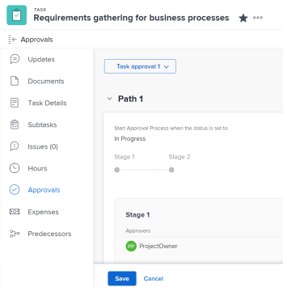

# 將新的或現有的核准流程與工作建立關聯

本文說明如何將核准流程與工作專案相關聯。 如需將核准與校樣或檔案相關聯的資訊，請參閱下列文章：

* [使用自動化工作流程建立進階校訂](../../review-and-approve-work/proofing/creating-proofs-within-workfront/create-automated-proof-workflow.md)
* [請求文件核准](../../review-and-approve-work/manage-approvals/request-document-approvals.md)

您可以在Adobe Workfront中將全域或單次使用的核准程式與工作專案建立關聯。 存在下列情況：

* 將現有的全域核准流程與專案、任務、問題、範本或範本任務建立關聯。 系統中所有群組都可以使用某些全域核准流程。 群組層級全域核准流程僅適用於特定群組。
* 建立單次使用的核准流程，並將其與現有專案、任務、問題、範本或範本任務相關聯。

>[!NOTE]
>
>本文使用「全域核准流程」一詞來區分「單次使用核准流程」。 全域核准流程可重複使用。
>
>「群組層級全域核准流程」一詞是指可重複用於專案的核准流程，其狀態僅與特定群組相關聯。

如需核准程式的一般資訊，請參閱[核准程式概觀](../../review-and-approve-work/manage-approvals/approval-process-in-workfront.md)。

如需建立全域核准流程的資訊，請參閱[建立工作專案的核准流程](../../administration-and-setup/customize-workfront/configure-approval-milestone-processes/create-approval-processes.md)。

## 存取需求

+++ 展開以檢視本文中功能的存取需求。

您必須具有下列存取權才能執行本文中的步驟：

<table style="table-layout:auto"> 
 <col> 
 <col> 
 <tbody> 
  <tr> 
   <td role="rowheader">Adobe Workfront計畫*</td> 
   <td> 
任何 
 </td> 
  </tr> 
  <tr> 
   <td role="rowheader">Adobe Workfront授權*</td> 
   <td> 
工作或更高
 </td> 
  </tr> 
  <tr> 
   <td role="rowheader">存取層級*</td> 
   <td> 
編輯專案、任務、問題或範本的存取權或以上許可權
 
注意：如果您還是沒有存取權，請詢問您的Workfront管理員，他們是否在您的存取層級中設定其他限制。 如需Workfront管理員如何變更存取層級的詳細資訊，請參閱<a href="../../administration-and-setup/add-users/configure-and-grant-access/create-modify-access-levels.md" class="MCXref xref">建立或修改自訂存取層級</a>。
 </td> 
  </tr> 
  <tr> 
   <td role="rowheader">物件許可權</td> 
   <td> 
管理專案、任務、問題或範本的許可權
 
如需請求其他存取權的資訊，請參閱<a href="../../workfront-basics/grant-and-request-access-to-objects/request-access.md" class="MCXref xref">請求物件</a>的存取權。
 </td> 
  </tr> 
 </tbody> 
</table>

若要瞭解您擁有的計畫、授權型別或存取權，請聯絡您的Workfront管理員。

+++

## 有關將核准流程與工作專案關聯的考量事項

除了下述考量事項外，我們建議您重新檢視Workfront中核准流程的一般考量事項。 如需詳細資訊，請參閱[核准程式總覽](../../review-and-approve-work/manage-approvals/approval-process-in-workfront.md)。

<!--
  <li data-mc-conditions="QuicksilverOrClassic.Draft mode">Approvals can only be associated with the status of a project, task, or issue in Workfront.</li>
  -->

<!--
  <li data-mc-conditions="QuicksilverOrClassic.Draft mode"> 
Each approval process corresponds with a status option in the Workfront system. When you change the status of a work item, an attached approval for that status requires the status change to be confirmed before the new status can be assigned to the item.
 
(NOTE: the two drafted bullets have been moved to the approval-process-in-workfront article)
 </li>
  -->

* 您必須先建立專案、任務、問題、範本或範本任務，核准流程才能與它們相關聯。
* 當您將核准流程附加至狀態為已通過且目前為專案的專案時，將不會觸發核准流程，且不會傳送任何通知給核准者。

  **範例：**&#x200B;如果任務處於「完成」狀態，而您附加了與「完成」狀態關聯的核准程式，則不會觸發核准。

* 當您將核准流程附加至專案的第一個狀態時（透過使用任務和專案的範本、使用問題的「佇列設定」設定，或定義新任務的專案的「任務設定」），如果重新呼叫已提交的核准，則會略過核准流程。 在此情況下，核准者不會收到任何通知。

  如需有關撤銷核准的詳細資訊，請參閱[檢視核准](../../review-and-approve-work/manage-approvals/view-approvals.md)。

  >[!TIP]
  >
  >任務或問題的第一個狀態為「新增」。 專案的第一個狀態是您的Workfront管理員在系統中的專案偏好設定中選取的狀態。 如需詳細資訊，請參閱[設定全系統的專案偏好設定](../../administration-and-setup/set-up-workfront/configure-system-defaults/set-project-preferences.md)。

* 核准程式與物件的關聯不會記錄在該物件的「更新」區域中。
* 您不能將核准流程與父系任務相關聯。
* 將使用者、團隊或角色新增為核准者，並不會自動授予他們與該核准相關聯的物件許可權。 他們會在觸發核准步驟時獲得物件的許可權。 否則，物件必須先與他們共用，他們才能做出核准決定。

以下小節說明將核准流程關聯至專案、任務或問題的不同方法。

## 將全域核准流程與工作專案建立關聯 {#associate-a-global-approval-process-with-a-work-item}

您可以將全域核准流程與工作專案（專案、任務、問題、範本、範本任務）建立關聯。

只要與您所屬的群組或系統中的所有群組共用，您就可以存取任何全域核准流程。

<!--The global approval process must be available to the group associated with the work item or to all groups in the system.-->

>[!NOTE]
>
>您可以將專案核准流程附加至範本，將任務核准流程附加至範本任務。 執行此動作後，當有人使用範本建立專案時，核准流程就會分別變成專案或任務核准流程。 附加到範本或範本任務的一次性使用核准流程仍然是專案和任務的一次性使用核准流程。

如需Workfront管理員如何設定系統中所有群組的全域核准程式，以及群組管理員如何建立群組的核准的相關資訊，請參閱[建立工作專案的核准程式](../../administration-and-setup/customize-workfront/configure-approval-milestone-processes/create-approval-processes.md)。

>[!NOTE]
>
>您也可以修改全域核准流程，以符合您的特定需求。 如需詳細資訊，請參閱本文章的[修改用於特定物件](#modify-a-global-approval-process-for-use-on-a-specific-object)的全域核准程式。

若要將現有的全域核准流程與專案、任務、問題、範本或範本任務建立關聯：

1. 移至您要關聯核准流程的工作專案。
1. 按一下左側面板中的&#x200B;**核准**。

   您可能需要按一下「**顯示更多**」，然後按一下「**核准**」。

   任務](assets/approvals-section-on-task-highlighted-nwe-350x246.png)上的

   隨即顯示選取的核准流程。

1. 展開&#x200B;**使用現有**&#x200B;下拉式功能表，並選取現有的核准程式。

   

   隨即顯示選取的核准流程。

   

1. 按一下「**儲存**」。
1. （選擇性）如果要修改附加至專案的現有核准，請按一下「編輯核准流程」。 這會將全域核准流程變更為單一使用核准流程。 如需詳細資訊，請參閱本文章的[修改用於特定物件](#modify-a-global-approval-process-for-use-on-a-specific-object)的全域核准程式。

## 修改用於特定物件的全域核准流程 {#modify-a-global-approval-process-for-use-on-a-specific-object}

您的Workfront管理員或群組管理員會建立供您使用的全域核准程式，如[建立工作專案的核准程式](../../administration-and-setup/customize-workfront/configure-approval-milestone-processes/create-approval-processes.md)中所述。

修改附加到專案的全域核准流程與修改單一使用核准流程相同。

您可以修改全域核准流程，以符合專案、任務或與其關聯問題的任何特定需求。

>[!IMPORTANT]
>
>當您修改全域核准流程時，它會變成單次使用的核准流程，只能用於您修改它的物件。 全域核准程式維持不變。
>
>修改全域核准流程時，請考量下列限制：
>
>* 僅針對您與核准流程相關聯的專案、任務或問題修改核准流程。
>* 管理員對原始全域核准流程所做的任何未來變更都不會反映在您修改的全域核准流程中。
>

若要修改已附加至專案的核准流程，請執行下列步驟：

1. 新增全域核准流程至專案、任務或問題。

   如需指示，請參閱本文中的[將全域核准程式與工作專案建立關聯](#associate-a-global-approval-process-with-a-work-item)一節。

   >[!IMPORTANT]
   >
   >在新增核準時，請確定您按一下&#x200B;**儲存**。

1. 新增全域核准程式後，請按一下核准頁面右上角的&#x200B;**編輯**&#x200B;圖示。 此動作會將全域或群組層級核准流程轉換為單次使用核准流程。
1. 對現有核准流程進行任何變更。 如需詳細資訊，請參閱本文章的[將單一使用核准程式與專案、任務、問題、範本或範本任務建立關聯](#associate-a-single-use-approval-process-with-a-project-task-issue-template-or-template-task)。
1. 按一下[儲存]****，然後再次按一下[儲存]****，確認您要將全域核准程式轉換為僅供此物件使用的一次性核准程式。

## 將單一使用核准流程與專案、任務、問題、範本或範本任務建立關聯 {#associate-a-single-use-approval-process-with-a-project-task-issue-template-or-template-task}

您可以建立僅用於特定專案、任務或問題的單一使用核准流程。

您也可以將一次性使用核准流程與範本或範本任務建立關聯，以便該流程可用於從範本建立的專案和任務。

>[!NOTE]
>
>您可以將單一使用核准流程與專案、任務、問題、範本或範本任務的任何系統層級或群組層級狀態相關聯。 如需Workfront狀態的詳細資訊，請參閱[建立或編輯狀態](../../administration-and-setup/customize-workfront/creating-custom-status-and-priority-labels/create-or-edit-a-status.md)。

以這種方式建立核准流程，可讓您建立符合您需求的自訂核准流程。 但是，核准流程不能與未來的其他工作專案相關聯。

或者，您可以修改特定料號的全域核准流程，該流程也會變成單一用途核准流程。 如需詳細資訊，請參閱本文章的[修改用於特定物件](#modify-a-global-approval-process-for-use-on-a-specific-object)的全域核准程式。

若要建立單一使用核准程式，請執行下列步驟：

1. 前往您要與核准程式產生關聯的專案、任務、問題、範本或範本任務。
1. 按一下左側面板中的&#x200B;**核准**。

   您可能需要按一下&#x200B;**顯示更多** > **核准**。

   任務](assets/approvals-section-on-task-highlighted-nwe-350x246.png)上的

1. 完成文章[建立工作專案的核准程式](../../administration-and-setup/customize-workfront/configure-approval-milestone-processes/create-approval-processes.md)中「建立工作專案的系統層級或群組層級全域核准程式」一節中的步驟6。

   <!--
   
(NOTE: overtime, ensure step 6 is still accurate here)&nbsp;

   -->

   >[!TIP]
   >
   >附加一次性使用核准程式後，它在範本和範本任務的編輯方塊內的核准程式欄位中顯示為「`<Custom>`」。 如需有關編輯範本或範本任務的資訊，請參閱下列文章：
   >
   >* [編輯專案範本](../../manage-work/projects/create-and-manage-templates/edit-templates.md)
   >* [編輯範本任務](../../manage-work/projects/create-and-manage-templates/edit-template-task.md)

   <!--
   >
(NOTE: this will need to be removed when they bring the new Edit Template/ Template Task boxes to NWE) 
   >
   -->

## 從工作專案移除或刪除核准流程

您可以移除全域或群組層級的核准流程，也可以從先前與其關聯的專案、任務或問題中刪除單一使用核准流程。

存在下列情況： 

* 移除全域或群組層級核准程式不會刪除核准。 核准仍可供日後使用。
* 刪除單一使用者核准程式將會從Workfront中刪除該程式，且無法將其復原。

若要從工作專案移除或刪除核准流程，請執行下列動作：

1. 前往您要移除先前新增之核准程式的專案、任務、問題、範本或範本任務。
1. 按一下左側面板中的&#x200B;**核准**。

   您可能需要按一下&#x200B;**顯示更多** > **核准**。

   任務](assets/approvals-section-on-task-highlighted-nwe-350x246.png)上的。
   * **單一使用核准的刪除**&#x200B;圖示。

1. 按一下&#x200B;**移除**&#x200B;或&#x200B;**刪除**&#x200B;確認。

   核准程式會從工作專案移除。

## 自動將核准流程與工作專案建立關聯

您可以使用下列工作流程，自動將核准程式與工作專案產生關聯：

* 針對專案與任務，您可以使用範本建立核准流程的關聯。 您可以將現有的核准流程附加至「範本核准」標籤或「範本任務核准」標籤。 如需將現有核准與工作專案建立關聯的資訊，請參閱本文中的[將全域核准程式與工作專案建立關聯](#associate-a-global-approval-process-with-a-work-item)。
* 針對現有專案的新任務，您可以在「編輯專案」方塊的「任務設定」區域中，建立全域核准流程或群組層級全域核准流程的關聯。 如需相關資訊，請參閱文章[編輯專案](../../manage-work/projects/manage-projects/edit-projects.md)中的「任務設定」一節。
* 對於問題，您可以將現有核准程式與請求佇列建立關聯，以便將核准與每個新增至專案的新問題建立關聯。 如需有關設定請求佇列的資訊，請參閱[建立請求佇列](../../manage-work/requests/create-and-manage-request-queues/create-request-queue.md)。
