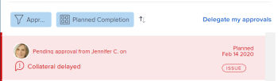

# 撤回提交的批准

您可以回調以下任何提交審批的對象：

* 專案
* 任務
* 問題
* 時程表
* 文件
* 存取要求

## 存取需求

您必須具備下列存取權，才能執行本文中的步驟：

<table style="table-layout:auto"> 
 <col> 
 <col> 
 <tbody> 
  <tr> 
   <td role="rowheader">Adobe Workfront計畫*</td> 
   <td> 
任何
 </td> 
  </tr> 
  <tr> 
   <td role="rowheader">Adobe Workfront授權*</td> 
   <td> 
要求或更高版本
 </td> 
  </tr> 
  <tr> 
   <td role="rowheader">訪問級別配置*</td> 
   <td> 
查看或更高程度地訪問項目、任務、問題、工時單、文檔
 
注意：如果您仍無權存取，請洽詢您的Workfront管理員，他們是否在您的存取層級設定其他限制。 如需Workfront管理員如何修改您的存取層級的詳細資訊，請參閱 <a href="../../administration-and-setup/add-users/configure-and-grant-access/create-modify-access-levels.md" class="MCXref xref">建立或修改自訂存取層級</a>.
 </td> 
  </tr> 
  <tr> 
   <td role="rowheader">物件權限</td> 
   <td> 
查看或更高權限訪問與批准關聯的對象 
 
有關請求其他訪問的資訊，請參閱 <a href="../../workfront-basics/grant-and-request-access-to-objects/request-access.md" class="MCXref xref">請求對對象的訪問 </a>.
 </td> 
  </tr> 
 </tbody> 
</table>

&#42;若要了解您擁有的計畫、授權類型或存取權，請聯絡您的Workfront管理員。

## 專案

當您撤回項目批准時，項目將恢復在啟動批准過程之前的狀態。

如果您重新調用與項目的開始狀態關聯的批准，則會繞過批准流程，而項目將保持在開始狀態。

>[!NOTE]
>
>您可以使用模板將項目或任務的第一個狀態與審批流程關聯。 如需將核准新增至範本的詳細資訊，請參閱  [編輯專案範本](../../manage-work/projects/create-and-manage-templates/edit-templates.md).

要撤回您提交的項目批准，請執行以下操作：

1. 按一下 **首頁** 圖示  在Adobe Workfront的左上角。

   >[!NOTE]
   您的Workfront管理員可能會對環境中的「首頁」圖示進行下列變更：
   * 以自訂的影像取代，以說明您的組織。 在此情況下，圖示看起來會與本文所顯示的不同。
   * 將連結至該頁面的頁面取代為其他頁面。 在此情況下，按一下 **主菜單**  在頁面的右上角，然後按一下 **首頁**.

1. 在 **工作清單** ，導航到 **我提交的批准** 分組。

1. 按一下 **專案** 在工作清單中批准。

   這會開啟「工作清單」右側的項目。

   

1. 按一下 **召回** 右上角。

## 任務

當您重新調用任務批准時，該任務將返回到在啟動批准流程之前的狀態。

如果您重新調用與任務的開始狀態關聯的批准，則會繞過批准進程，任務將保持在開始狀態。

>[!NOTE]
您可以使用模板將項目或任務的第一個狀態與審批流程關聯。 如需將核准新增至範本的詳細資訊，請參閱 [編輯專案範本](../../manage-work/projects/create-and-manage-templates/edit-templates.md).

要回調您提交的任務批准，請執行以下操作：

1. 按一下 **首頁** 圖示  在Adobe Workfront的左上角。

   >[!NOTE]
   您的Workfront管理員可能會對環境中的「首頁」圖示進行下列變更：
   * 以自訂的影像取代，以說明您的組織。 在此情況下，圖示看起來會與本文所顯示的不同。
   * 將連結至該頁面的頁面取代為其他頁面。 在此情況下，按一下 **主菜單**  在頁面的右上角，然後按一下 **首頁**.

1. 在 **工作清單** ，導航到 **我提交的批准** 分組。

1. 按一下 **任務** 在工作清單中批准。

   這將開啟「工作清單」右側的任務。

   

1. 按一下 **召回** 右上角。

## 問題

當您撤回發行批准時，發行將恢復為在啟動批准流程之前的狀態。

如果您重新調用與問題的開始狀態關聯的批准，則會繞過批准過程，而問題將保持在開始狀態。

>[!NOTE]
您可以使用範本，將問題的第一個狀態與核准程式建立關聯。 如需建立請求佇列的詳細資訊，請參閱 [建立請求佇列](../../manage-work/requests/create-and-manage-request-queues/create-request-queue.md).

1. 按一下 **首頁** 圖示  在Adobe Workfront的左上角。

   >[!NOTE]
   您的Workfront管理員可能會對環境中的「首頁」圖示進行下列變更：
   * 以自訂的影像取代，以說明您的組織。 在此情況下，圖示看起來會與本文所顯示的不同。
   * 將連結至該頁面的頁面取代為其他頁面。 在此情況下，按一下 **主菜單**  在頁面的右上角，然後按一下 **首頁**.

1. 在 **工作清單** ，導航到 **我提交的批准** 分組。

1. 按一下 **問題** 在工作清單中批准。

   這會開啟「工作清單」右側的問題。

   

1. 按一下 **召回** 右上角。

## 時程表

當您撤回工時單批准時，工時單將返回到提交以進行批准之前的狀態。

1. 按一下 **首頁** 圖示  在Adobe Workfront的左上角。

   >[!NOTE]
   您的Workfront管理員可能會對環境中的「首頁」圖示進行下列變更：
   * 以自訂的影像取代，以說明您的組織。 在此情況下，圖示看起來會與本文所顯示的不同。
   * 將連結至該頁面的頁面取代為其他頁面。 在此情況下，按一下 **主菜單**  在頁面的右上角，然後按一下 **首頁**.

1. 在 **工作清單** ，導航到 **我提交的批准** 分組。

1. 按一下 **工時單** 在工作清單中批准。

   這會開啟工作清單右側的時間表。

   

1. 按一下 **召回** 右上角。

## 文件

要撤回文檔批准，您必須手動從批准中刪除一個或多個用戶。

1. 按一下 **首頁** 圖示  在Adobe Workfront的左上角。

   >[!NOTE]
   您的Workfront管理員可能會對環境中的「首頁」圖示進行下列變更：
   * 以自訂的影像取代，以說明您的組織。 在此情況下，圖示看起來會與本文所顯示的不同。
   * 將連結至該頁面的頁面取代為其他頁面。 在此情況下，按一下 **主菜單**  在頁面的右上角，然後按一下 **首頁**.

1. 在 **工作清單** ，導航到 **我提交的批准** 分組。

1. 按一下 **檔案** 在工作清單中批准。

   這將開啟「工作清單」右側的文檔。

   

1. 按一下 **管理核准** 右上角。 這會開啟「管理核准」方塊。
1. 按一下 **移除** 表徵圖內嵌在「管理核准」方塊內的使用者名稱。 刪除所有用戶以完全撤回文檔批准。

   

## 存取要求

1. 按一下 **首頁** 圖示  在Adobe Workfront的左上角。

   >[!NOTE]
   您的Workfront管理員可能會對環境中的「首頁」圖示進行下列變更：
   * 以自訂的影像取代，以說明您的組織。 在此情況下，圖示看起來會與本文所顯示的不同。
   * 將連結至該頁面的頁面取代為其他頁面。 在此情況下，按一下 **主菜單**  在頁面的右上角，然後按一下 **首頁**.

1. 在 **工作清單** ，導航到 **我提交的批准** 分組。

1. 按一下 **存取要求** 在工作清單中批准。

   這會開啟「工作清單」右側的訪問請求。

   

1. 按一下 **召回** 右上角。
