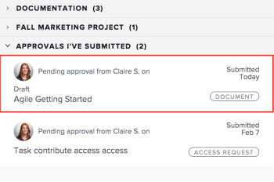

# 撤回已提交的核准

您可以召回下列任何提交核准的物件：

* 專案
* 任務
* 問題
* 時程表
* 文件
* 存取要求

## 存取需求

您必須具有下列存取權才能執行本文中的步驟：

<table style="table-layout:auto"> 
 <col> 
 <col> 
 <tbody> 
  <tr> 
   <td role="rowheader">Adobe Workfront計畫*</td> 
   <td> 
任何
 </td> 
  </tr> 
  <tr> 
   <td role="rowheader">Adobe Workfront授權*</td> 
   <td> 
要求或更高版本
 </td> 
  </tr> 
  <tr> 
   <td role="rowheader">存取層級設定*</td> 
   <td> 
檢視專案、任務、問題、時程表、檔案的或更高存取權
 
注意：如果您還是沒有存取權，請詢問您的Workfront管理員，他們是否在您的存取層級中設定其他限制。 如需有關Workfront管理員如何修改您的存取層級的資訊，請參閱 <a href="../../administration-and-setup/add-users/configure-and-grant-access/create-modify-access-levels.md" class="MCXref xref">建立或修改自訂存取層級</a>.
 </td> 
  </tr> 
  <tr> 
   <td role="rowheader">物件許可權</td> 
   <td> 
檢視或更高的核准相關物件存取許可權 
 
如需請求其他存取許可權的詳細資訊，請參閱 <a href="../../workfront-basics/grant-and-request-access-to-objects/request-access.md" class="MCXref xref">要求物件的存取權 </a>.
 </td> 
  </tr> 
 </tbody> 
</table>

&#42;若要瞭解您擁有的計畫、授權型別或存取權，請聯絡您的Workfront管理員。

## 專案

當您撤回專案核準時，專案會回到開始核准程式前的狀態。

如果您召回與專案開始狀態關聯的核准，則會略過核准流程，且專案會保持開始狀態。

>[!NOTE]
>
>您可以使用範本，將專案或任務的第一個狀態與核准流程相關聯。 如需將核准新增至範本的詳細資訊，請參閱  [編輯專案範本](../../manage-work/projects/create-and-manage-templates/edit-templates.md).

若要撤銷您提交的專案核准，請執行下列步驟：

1. 按一下 **首頁** 圖示  Adobe Workfront左上角。

   >[!NOTE]
   >
   您的Workfront管理員可能會對您環境中的「首頁」圖示進行下列變更：
   >
   * 以自訂的影像取代，以說明您的組織。 在此情況下，圖示看起來將會與本文中顯示的有所不同。
   * 使用其他頁面取代連結至該頁面的頁面。 在此情況下，請按一下 **主要功能表**  然後按一下「 」 **首頁**.

1. 在 **工作清單** 區域，導覽至 **我已提交的核准** 分組。

1. 按一下 **專案** 在工作清單中核准。

   這會開啟工作清單右側的專案。

   

1. 按一下 **恢復** 在右面板的右上角。

## 任務

當您恢復任務核準時，任務會回到開始核准程式前的狀態。

如果您回想與工作開始狀態關聯的核准，則會略過核准程式，且工作仍維持在開始狀態。

>[!NOTE]
>
您可以使用範本，將專案或任務的第一個狀態與核准流程相關聯。 如需將核准新增至範本的詳細資訊，請參閱 [編輯專案範本](../../manage-work/projects/create-and-manage-templates/edit-templates.md).

若要撤銷您提交的任務核准，請執行下列步驟：

1. 按一下 **首頁** 圖示  Adobe Workfront左上角。

   >[!NOTE]
   >
   您的Workfront管理員可能會對您環境中的「首頁」圖示進行下列變更：
   >
   * 以自訂的影像取代，以說明您的組織。 在此情況下，圖示看起來將會與本文中顯示的有所不同。
   * 使用其他頁面取代連結至該頁面的頁面。 在此情況下，請按一下 **主要功能表**  然後按一下「 」 **首頁**.

1. 在 **工作清單** 區域，導覽至 **我已提交的核准** 分組。

1. 按一下 **任務** 在工作清單中核准。

   這會開啟「工作清單」右側的任務。

   

1. 按一下 **恢復** 在右面板的右上角。

## 問題

當您恢復問題核準時，問題會回到開始核准流程前的狀態。

如果您回想與問題的開始狀態關聯的核准，則會略過核准流程，且問題仍維持在開始狀態。

>[!NOTE]
>
您可以使用範本，將問題的第一個狀態與核准流程相關聯。 如需建立請求佇列的詳細資訊，請參閱 [建立請求佇列](../../manage-work/requests/create-and-manage-request-queues/create-request-queue.md).

1. 按一下 **首頁** 圖示  Adobe Workfront左上角。

   >[!NOTE]
   >
   您的Workfront管理員可能會對您環境中的「首頁」圖示進行下列變更：
   >
   * 以自訂的影像取代，以說明您的組織。 在此情況下，圖示看起來將會與本文中顯示的有所不同。
   * 使用其他頁面取代連結至該頁面的頁面。 在此情況下，請按一下 **主要功能表**  然後按一下「 」 **首頁**.

1. 在 **工作清單** 區域，導覽至 **我已提交的核准** 分組。

1. 按一下 **問題** 在工作清單中核准。

   這會開啟工作清單右側的問題。

   

1. 按一下 **恢復** 在右面板的右上角。

## 時程表

當您撤回時程表核準時，時程表會回到提交以供核准前的狀態。

1. 按一下 **首頁** 圖示  Adobe Workfront左上角。

   >[!NOTE]
   >
   您的Workfront管理員可能會對您環境中的「首頁」圖示進行下列變更：
   >
   * 以自訂的影像取代，以說明您的組織。 在此情況下，圖示看起來將會與本文中顯示的有所不同。
   * 使用其他頁面取代連結至該頁面的頁面。 在此情況下，請按一下 **主要功能表**  然後按一下「 」 **首頁**.

1. 在 **工作清單** 區域，導覽至 **我已提交的核准** 分組。

1. 按一下 **時間表** 在工作清單中核准。

   這會開啟工作清單右側的時程表。

   

1. 按一下 **恢復** 在右面板的右上角。

## 文件

若要撤銷檔案核准，您必須手動從核准中移除一或所有使用者。

1. 按一下 **首頁** 圖示  Adobe Workfront左上角。

   >[!NOTE]
   >
   您的Workfront管理員可能會對您環境中的「首頁」圖示進行下列變更：
   >
   * 以自訂的影像取代，以說明您的組織。 在此情況下，圖示看起來將會與本文中顯示的有所不同。
   * 使用其他頁面取代連結至該頁面的頁面。 在此情況下，請按一下 **主要功能表**  然後按一下「 」 **首頁**.

1. 在 **工作清單** 區域，導覽至 **我已提交的核准** 分組。

1. 按一下 **檔案** 在工作清單中核准。

   這會開啟「工作清單」右側的檔案。

   

1. 按一下 **管理核准** 在右面板的右上角。 如此將可開啟「管理核准」方塊。
1. 按一下 **移除** 圖示與使用者名稱內嵌在管理核准方塊中。 移除所有使用者以完全撤回檔案核准。

   

## 存取要求

1. 按一下 **首頁** 圖示  Adobe Workfront左上角。

   >[!NOTE]
   >
   您的Workfront管理員可能會對您環境中的「首頁」圖示進行下列變更：
   >
   * 以自訂的影像取代，以說明您的組織。 在此情況下，圖示看起來將會與本文中顯示的有所不同。
   * 使用其他頁面取代連結至該頁面的頁面。 在此情況下，請按一下 **主要功能表**  然後按一下「 」 **首頁**.

1. 在 **工作清單** 區域，導覽至 **我已提交的核准** 分組。

1. 按一下 **存取要求** 在工作清單中核准。

   這會開啟工作清單右側的存取要求。

   

1. 按一下 **恢復** 在右面板的右上角。
