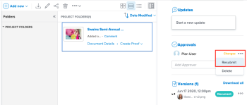

# 請求文檔批准

您可以向管理員或其他使用者申請Adobe Workfront中檔案的核准。 如果您的Workfront管理員已啟用此功能，您也可以向沒有Workfront帳戶的人員要求核准檔案，如 [配置系統安全首選項](../../administration-and-setup/manage-workfront/security/configure-security-preferences.md).

## 存取需求

您必須具備下列存取權，才能執行本文中的步驟：

<table style="table-layout:auto"> 
 <col> 
 <col> 
 <tbody> 
  <tr> 
   <td role="rowheader">Adobe Workfront計畫*</td> 
   <td> 
任何
 </td> 
  </tr> 
  <tr> 
   <td role="rowheader">Adobe Workfront授權*</td> 
   <td> 
審核或更高版本
 </td> 
  </tr> 
  <tr> 
   <td role="rowheader">訪問級別配置*</td> 
   <td> 
查看或更高程度地訪問項目、任務、問題、模板、Portfolio、程式、報告、控制面板以及日曆、文檔
 
注意：如果您仍無權存取，請洽詢您的Workfront管理員，他們是否在您的存取層級設定其他限制。 如需Workfront管理員如何修改您的存取層級的詳細資訊，請參閱 <a href="../../administration-and-setup/add-users/configure-and-grant-access/create-modify-access-levels.md" class="MCXref xref">建立或修改自訂存取層級</a>.
 </td> 
  </tr> 
  <tr> 
   <td role="rowheader">物件權限</td> 
   <td> 
管理對與請求訪問或批准關聯的對象的訪問 
 
有關請求其他訪問的資訊，請參閱 <a href="../../workfront-basics/grant-and-request-access-to-objects/request-access.md" class="MCXref xref">請求對對象的訪問 </a>.
 </td> 
  </tr> 
 </tbody> 
</table>

&#42;若要了解您擁有的計畫、授權類型或存取權，請聯絡您的Workfront管理員。

## 請求文檔批准

1. 轉到包含文檔的項目、任務或問題，然後選擇 **檔案**.
1. 查找所需的文檔。

1. 向下捲動至 **核准** ，然後開始在 **新增核准者** 框。 您可以依名稱新增Workfront使用者，或透過電子郵件新增外部使用者。

1. 如果您的Adobe Workfront管理員已啟用與未使用Workfront的人員共同作業的功能，如 [配置系統安全首選項](../../administration-and-setup/manage-workfront/security/configure-security-preferences.md)，您可以輸入其電子郵件地址來包含這些地址。

   您無法向團隊或群組請求核准。

1. 重複上一步以添加其他批准者。

## 在新版本上重新提交審批

上傳新版本時，檔案核准決策不會自動重設。 例如，如果您的文檔獲得批准並進行了更改，則決策將顯示「更改」作為決策，即使您上傳了具有指定更改的新版本也是如此。 如果您人工重新提交審批，則可以清除新版本的決策。

1. 轉到包含文檔的項目、任務或問題，然後選擇 **檔案**.
1. 查找所需的文檔。

1. 向下捲動至 **核准** 按一下「摘要」中的「更多」表徵圖，然後按一下「重新提交」。

   

## 刪除文檔批准請求

1. 轉到包含文檔的項目、任務或問題，然後選擇 **檔案**.
1. 查找所需的文檔。

1. 向下捲動至 **核准** 區段，然後按一下 **更多** 與核准者名稱內嵌的功能表，然後選取 **刪除**.

   核准請求會移除，核准者會收到通知，告知其不再需要核准。 其與核准相關的共用存取權也會遭到移除。

## 傳送提醒給核准者

您可以傳送訊息以提醒核准者您正在等候其意見。

1. 轉到包含文檔的項目、任務或問題，然後選擇 **檔案**.
1. 查找所需的文檔。

1. 向下捲動至 **核准** 區段，然後按一下 **更多** 與核准者名稱內嵌的功能表，然後選取 **提醒**.

   核准者會收到通知，通知他們核准仍待處理。 如果已啟用，他們也可能會收到電子郵件提醒。
