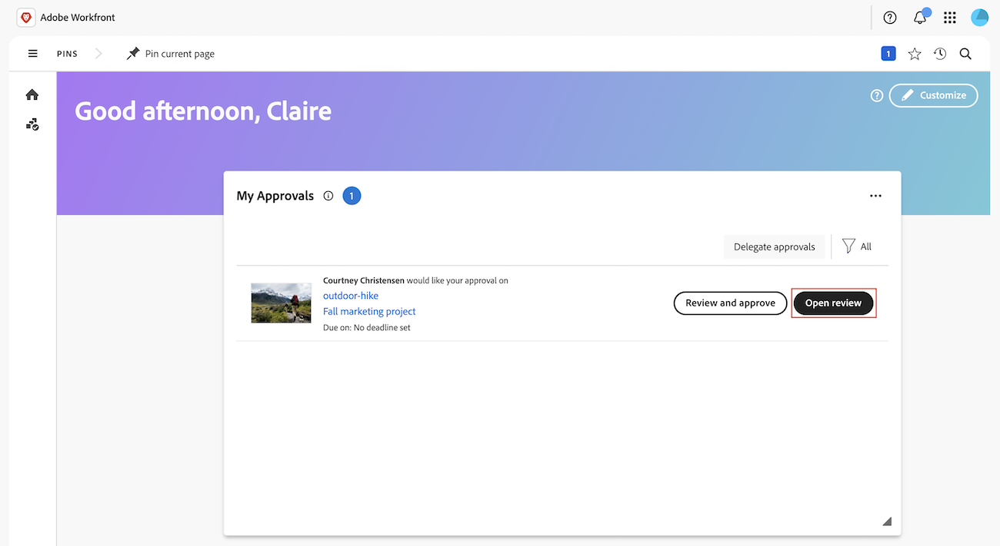
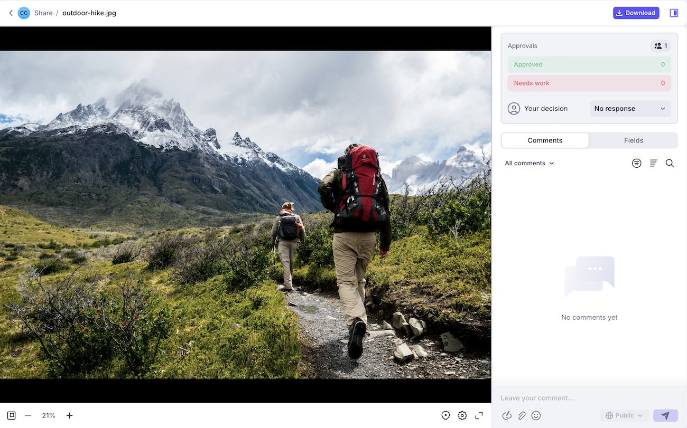

# 開始使用Frame.io整合

Workfront與Frame.io整合可讓創意人員、行銷人員和利害關係人透過順暢的工作流程保持一致。 存取即時更新、避免重複工作，並確保資產在啟動前獲得核准。

如需Frame.io的詳細資訊，請參閱[開始使用Frame.io](https://support.frame.io/en/collections/49298-getting-started)。

您必須在Workfront執行個體中設定Workfront和Frame.io整合。 如需詳細資訊，請參閱[Frame.io整合總覽](/help/quicksilver/review-and-approve-work/native-integrations/frame-io/frame-int-overview.md#integration-requirements)。

<!--## Integration requirements

* Workfront and Frame.io must be deployed to the same Identity Management system (IMS) organization.

* Users can belong to only one Workfront instance within the IMS organization.

* The Workfront instance must be enabled on the Adobe Unified Experience.

* The integration is configured by Adobe Professional Services. -->

## Workfront中的工作啟動和規劃

專案專員可以在Workfront中建立專案並計畫工作。 在啟用Frame.io整合的執行個體中建立的專案，會利用Adobe企業儲存空間，可在Adobe生態系統中儲存和管理資產。

如果您的組織有Frame.io Enterprise授權，在Workfront中建立的專案也會顯示在Frame.io中，讓使用者可在任一產品中互動和上傳資產。

如需Adobe Enterprise Storage或Frame.io中專案的詳細資訊，請參閱

* [Workspace總覽：專案](https://help.frame.io/en/articles/9101001-workspace-overview#h_d9f8654895)
* [Adobe企業儲存空間概覽](/help/quicksilver/review-and-approve-work/esm-overview.md)

## 檢閱及核准資產

資產完成後，專案協調員可在Workfront中啟動正式的稽核及核准流程。

建立核准工作流程後，稽核者和核准者可以使用Frame.io檢視器新增註解並標籤資產。 他們也可以在Frame.io檢視器中做出核准決定。

如需關於設定專案的詳細資訊，請參閱

* [建立專案](/help/quicksilver/manage-work/projects/create-projects/create-project.md)
* [Frame.io整合概述](/help/quicksilver/review-and-approve-work/native-integrations/frame-io/frame-int-overview.md)

### 在Workfront中啟動正式稽核和核准

專案專員可建立一次性稽核和核准或可再次核准的範本。 他們可以指派稽核者、核准者，或兩者的組合：

* **檢閱者**&#x200B;可以新增註解及標籤資產。 完成後，他們可以將其稽核標籤為完成。 資產不需要將稽核標籤為完成，才能在核准程式中前進。
* **核准者**&#x200B;可以新增註解及標籤資產。 他們必須決定推進核准程式。

#### 建立稽核和核准工作流程

可將稽核者和核准者新增至一次性核准工作流程或可重複使用的核准範本：

* **單次使用核准**：在資產所在的專案或任務中，專案協調員可以指派稽核者和核准者，並設定完成期限。 系統會透過電子郵件提醒檢閱者和核准者：截止日期前72小時、截止日期前24小時，然後於截止日期本身。

  如需詳細資訊，請參閱[建立檔案檢閱或核准要求](/help/quicksilver/review-and-approve-work/document-reviews-and-approvals/manage-document-approvals/create-a-document-approval.md)。

* **核准範本**：在Workfront設定區域中，專案專員可以建立可繼續使用的核准範本。 在範本中，使用者可以新增稽核者和核准者，並指定完成時間範圍。 將核准範本套用至資產時，截止日期是從指定的時間範圍計算。

  建立範本後，可將其套用至資產，以在Workfront中開始正式的稽核和核准流程。

  如需詳細資訊，請參閱[建立核准範本](/help/quicksilver/review-and-approve-work/document-reviews-and-approvals/manage-document-approvals/create-approval-template.md)。

  

### 在Frame.io檢視器中檢閱和核准資產

在Workfront中啟動稽核和核准工作流程後，稽核者和核准者可以存取Frame.io檢視器以新增註釋、標籤資產並做出決定。

如需詳細資訊，請參閱[使用Frame.io檢視器檢閱並核准](/help/quicksilver/review-and-approve-work/document-reviews-and-approvals/review-with-frame.md)。

#### 存取Frame.io檢視器

使用者可透過下列方式存取Frame.io檢視器：

* Workfront電子郵件通知
* Workfront首頁區域中的我的核准Widget

>[!NOTE]
>
>系統會透過電子郵件通知外部Workfront使用者，並要求他們建立Frame.io登入頁面，以檢閱和核准資產。

開啟框架檢視器

#### 新增評論及標籤資產

註解和資產標示會顯示在Frame.io檢視器中。 如需使用Frame.io檢視器的詳細資訊，請參閱[在您的媒體上發表評論](https://help.frame.io/en/articles/9105251-commenting-on-your-media)。

#### 做出決定

所有複查活動完成後，核准者必須執行下列其中一項決定：

* **核准**：資產不需要變更，而且已可供使用。
* **需要工作**：資產需要變更，而且尚未準備好使用。 完成指定的變更後，必須將資產上傳為新版本，並經過另一輪核准。<!--is the same approval workflow automatically applied? Does the coordinator have to do anything to get the approval going? -->

檢閱者可在Workfront內將其檢閱標籤為完成，但這並非資產在核准程式中前進的必要條件。

如需Workfront中決定的詳細資訊，請參閱[檔案決定狀態概觀](/help/quicksilver/review-and-approve-work/document-reviews-and-approvals/manage-document-approvals/document-approval-status.md)。

### 追蹤檢閱和核准量度

專案專員可以在Workfront首頁區域或畫布儀表板中的自訂報告監視所有執行中核准的進度：

* **自訂儀表板**：在「畫布儀表板」區域中建立報告儀表板，以顯示有關具有整合式核准功能的檢閱和核准的高階和詳細資訊。 如需如何開始使用的詳細資訊，請參閱[建立報告儀表板以供檢閱和核准](/help/quicksilver/review-and-approve-work/document-reviews-and-approvals/create-review-and-approval-dashboard.md)。
* **檔案核准量度首頁Widget**：顯示2個圖表，其中包含平均核准時間和決定的相關資訊，以及擱置和逾期核准的清單檢視。
  