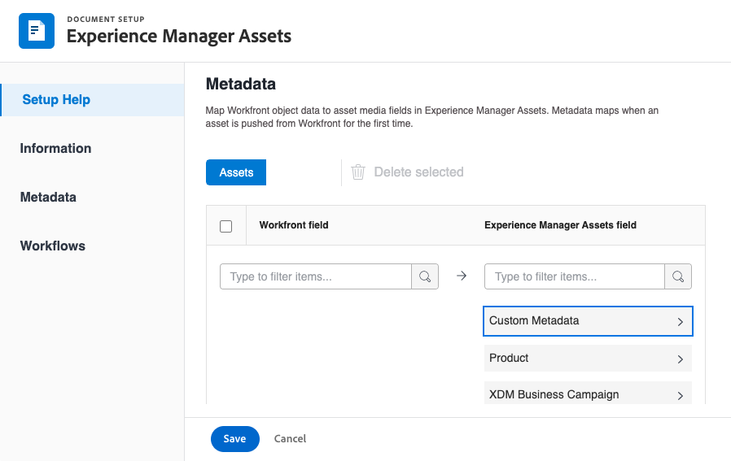
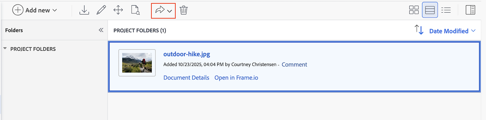

# 使用Adobe Experience Manager與Frame.io整合

您可以使用&#x200B;[!DNL Experience Manager Assets]來管理和儲存&#x200B;經過檢閱和核准週期的數位資產。 此整合可讓您運用Adobe Experience Manager、Frame.io和Workfront的功能，簡化您的內容管理和共同作業程式。

## 設定Experience Manager Assets整合

您可以在&#x200B;[!DNL Experience Manager Assets]中將您的工作與您的內容連結：

* 將資產和中繼資料從[!DNL Adobe Workfront]推送到[!DNL Experience Manager Assets]&#x200B;
* 促進版本設定使用案例
* 追蹤資產的中繼資料
* 在[!DNL Workfront]和[!DNL Experience Manager Assets]之間同步專案中繼資料

>[!NOTE]
>
>您也可以將多個[!DNL Experience Manager Assets]存放庫連線至一個[!UICONTROL Workfront]環境，或將多個[!DNL Workfront]環境連線至跨組織ID的一個[!DNL Experience Manager Assets]存放庫。 針對您要設定的每項整合，請依照本文的設定指示操作。

## 存取需求

+++ 展開以檢視本文中功能的存取需求。

<table>
  <tr>
   <td>Adobe Workfront套件
   </td>
   <td> 
Prime或Ultimate

    
Workflow Ultimate

   </td>
  </tr>
    <tr>
   <td>Adobe Workfront授權
   </td>
   <td>
  
若要設定整合：

   
標準

   
規劃

若要傳送檔案至Experience Manager Assets：

   
投稿人或以上

   
要求或更高版本

   </td>
  </tr>
  </tr>
    <tr>
   <td>Adobe Experience Manager授權
   </td>
   <td>標準
   </td>
  </tr>
  <tr>
   <td>其他產品
   </td>
   <td>您必須有[!DNL Experience Manager Assets as a Cloud Service]，而且您必須以使用者的身分新增到產品中。
   </td>
  </tr>
   <tr>
   <td>存取層級設定
   </td>
   <td>您必須是[!DNL Workfront]管理員。
   </td>
  </tr>
</table>

如需有關此表格的詳細資訊，請參閱Workfront檔案中的[存取需求](/help/quicksilver/administration-and-setup/add-users/access-levels-and-object-permissions/access-level-requirements-in-documentation.md)。

+++

## 先決條件

開始之前，

* 您必須在[!DNL Workfront]中將[!DNL Adobe Experience Manager Assets]和[!DNL Adobe Admin Console]與組織ID相關聯。 如需詳細資訊，請參閱[平台式管理差異([!DNL Adobe Workfront]/[!DNL Adobe Business Platform])](/help/quicksilver/administration-and-setup/get-started-wf-administration/actions-in-admin-console.md)。
* 您的Workfront執行個體必須使用Adobe企業儲存空間。

## 設定整合資訊

{{step-1-to-setup}}

1. 在左側面板中選取&#x200B;**[!UICONTROL 檔案]**，然後選取&#x200B;**[!UICONTROL [!DNL Experience Manager]整合]**。
1. 選取&#x200B;**[!UICONTROL 新增[!DNL Experience Manager]整合]**。
1. 在&#x200B;**[!UICONTROL 名稱]**&#x200B;欄位中，輸入您希望使用者在Workfront和Experience Manager Assets中與此整合互動時看到的名稱。
1. 在&#x200B;**[!UICONTROL 導覽URL]**&#x200B;欄位中，系統會自動填入導覽URL。 此唯讀URL是用來從[!DNL Experience Manager]主功能表[!UICONTROL 連結至您組織的]執行個體，以進行快速存取。
1. 從&#x200B;**[!UICONTROL [!DNL Experience Manager]Assets存放庫]**&#x200B;下拉式功能表中選擇存放庫。 系統會自動填入與您的使用者設定檔所指派之組織ID相關聯的任何[!DNL Experience Manager]存放庫。
   

1. 按一下&#x200B;**[!UICONTROL 儲存]**&#x200B;或移至本文中的[設定中繼資料（選用）](#set-up-metadata-optional)區段。

   >[!IMPORTANT]
   >
   >由於整合的複雜性，您在儲存初始設定後無法變更存放庫。

## 設定中繼資料（選用）

您可以將[!DNL Workfront]物件資料對應至[!DNL Experience Manager] Assets中的資產媒體欄位。

>[!NOTE]
>
>您只能在一個方向對應中繼資料：從[!DNL Workfront]到[!DNL Experience Manager]。 從[!DNL Workfront]連結至[!DNL Experience Manager]的檔案的中繼資料無法傳輸至[!DNL Workfront]。

### 設定中繼資料欄位

開始對應中繼資料欄位之前，您必須先在Workfront和Experience Manager Assets中設定中繼資料欄位。

若要設定中繼資料欄位：

1. 依照[!DNL Experience Manager Assets]設定Adobe[與 [!DNL Workfront]  [!DNL Experience Manager Assets]之間的資產中繼資料對應，在](https://experienceleague.adobe.com/zh-hant/docs/experience-manager-cloud-service/content/assets/integrations/configure-asset-metadata-mapping)中設定中繼資料結構描述。

1. 在Workfront中設定自訂表單欄位。 [!DNL Workfront]有許多您可以使用的內建自訂欄位。 不過，您也可以建立自己的自訂欄位，如[建立自訂表單](/help/quicksilver/administration-and-setup/customize-workfront/create-manage-custom-forms/form-designer/design-a-form/design-a-form.md)中所述。

+++ **展開以檢視有關支援的Workfront和Experience Manager Assets欄位的詳細資訊** 

**Experience Manager Assets標籤**

您可以將任何Workfront支援的欄位對應到Experience Manager Assets中的標籤。 若要這麼做，您必須確保Experience Manager Assets中的標籤值符合Workfront。

* 標籤和Workfront欄位值在拼字和格式上必須是完全相符的。
* 對應至Workfront assets標籤的Experience Manager欄位值必須全部小寫，即使Experience Manager Assets中的標籤似乎包含大寫字母。
* Workfront欄位值不得包含空格。
* Workfront中的欄位值也必須包含Experience Manager Assets標籤的資料夾結構。
* 若要將多個單行文字欄位對應到標籤，請在中繼資料對應的Workfront端輸入標籤值清單（以逗號分隔），並在Experience Manager Assets端輸入`xcm:keywords`。 每個欄位值對應至個別標籤。 您可以使用計算欄位，將多個Workfront欄位合併為單一逗號分隔文字欄位。
* 您可以透過在下拉式清單、單選按鈕或核取方塊欄位中輸入逗號分隔的可用值清單，來對應該欄位的值。

>[!INFO]
>
>**範例**：若要比對此處資料夾結構中所顯示的標籤，Workfront中的欄位值為`landscapes:trees/spruce`。 請注意Workfront欄位值中的小寫字母。
>
>如果您希望標籤成為標籤樹中最左邊的專案，它後面必須跟一個冒號。 在此範例中，若要對應到景觀標籤，Workfront中的欄位值將是`landscapes:`。
>
>AEM中的

在Experience Manager Assets中建立標籤後，標籤會顯示在中繼資料區段的「標籤」下拉式清單下。 若要將欄位連結至標籤，請在中繼資料對應區域的Experience Manager Assets欄位下拉式清單中選取`xcm:keywords`。

如需Experience Manager Assets中標籤的詳細資訊，包括如何建立和管理標籤，請參閱[管理標籤](https://experienceleague.adobe.com/zh-hant/docs/experience-manager-64/administering/contentmanagement/tags)。

**Experience Manager Assets自訂中繼資料結構描述欄位**

您可以將內建和自訂Workfront欄位對應到Experience Manager Assets中的自訂中繼資料結構欄位。

在Experience Manager Assets中建立的自訂中繼資料欄位，會整理在中繼資料設定區域的各自區段中。

<!-- 
link to documentation about creating schema - waiting on response from Anuj about best article to link to
-->

**Workfront欄位**

您可以將內建和自訂Workfront欄位對應至Experience Manager Assets。 Workfront和Experience Manager Assets之間的下列欄位值大小寫和拼字必須相符：

* 下拉式欄位
* 多選欄位

>[!TIP]
>
> 若要檢查欄位值是否完全相符，請前往
>
> * Workfront中的「設定>自訂Forms」或物件中的欄位
> * Assets > Experience Manager Assets中的中繼資料結構

+++

### 對應資產的中繼資料

中繼資料會在資產第一次從[!DNL Workfront]推送時進行對應。 具有內建或自訂欄位的檔案會在第一次將資產傳送到[!DNL Experience Manager Assets]時自動對應到指定的欄位。

若要對應資產的中繼資料：

<!--
1. Select **[!UICONTROL Assets]** above the metadata table.
-->
1. 在&#x200B;**[!UICONTROL [!DNL Workfront]欄位]**&#x200B;欄位中，選擇內建或自訂Workfront欄位。

   >[!NOTE]
   >
   >您可以將單一[!DNL Workfront]欄位對應到多個[!UICONTROL Experience Manager Assets]欄位。 您無法將多個[!DNL Workfront]欄位對應到單一[!DNL Experience Manager Assets]欄位。
   ><!--To map a Workfront field to an Experience Manager Assets tag, see -->

1. 在[!DNL Experience Manager Assets]欄位中，搜尋預先填入的類別，或在搜尋欄位中輸入至少兩個字母以存取其他類別。
1. 視需要重複步驟2和3。
   
1. 按一下[儲存]&#x200B;[!UICONTROL **&#x200B;**]&#x200B;或移至本文中的[物件中繼資料同步][區段。](#object-metadata-sync)

### 物件中繼資料同步

在[!DNL Experience Manager]中變更欄位時，對應至[!DNL Workfront]投資組合、方案、專案、任務、問題和檔案欄位的[!DNL Workfront]欄位會自動更新。

啟用此選項後，任何已推送至Adobe Experience Manager的資產都會在Workfront的「檔案詳細資訊」頁面上顯示檔案Adobe Experience Manager中繼資料的即時檢視。

1. 啟用&#x200B;**[!UICONTROL 同步處理物件中繼資料]**&#x200B;欄位，然後按一下&#x200B;**儲存**。

>[!IMPORTANT]
>
>使用者必須在[!DNL Experience Manager]中擁有物件中資產的寫入存取權，中繼資料才能在更新時同步。

## 傳送檔案至Experience Manager Assets或Assets Essentials

您可以從Workfront傳送檔案至Experience Manager Assets或Assets Essentials。 從Workfront上傳並傳送到Assets Essentials的檔案仍會計入您的整體檔案儲存空間。

透過此整合傳送至Experience Manager的Assets大小限製為&#x200B;**5 GB**。

<!--In the Preview environment, Assets sent to Experience Manager through this integration have a size limit of **30 GB**.-->

從Workfront傳送資產至Experience Manager Assets或Assets Essentials時，會先對應中繼資料欄位。 設定為對應父物件的任何中繼資料也會一併傳送。 如需設定中繼資料對應的詳細資訊，請參閱[設定Experience Manager Assets as a Cloud Service整合](/help/quicksilver/administration-and-setup/configure-integrations/configure-aacs-integration.md)或[設定Experience Manager Assets Essentials整合](/help/quicksilver/documents/adobe-workfront-for-experience-manager-assets-essentials/setup-asset-essentials.md)。

>[!INFO]
>
>**範例**&#x200B;當您第一次傳送附加至專案的資產時，中繼資料會對應至Experience Manager Assets或Assets Essentials，以及父物件（例如投資組合和方案）的任何對應中繼資料。

### 從Workfront傳送檔案

當使用者將檔案從Workfront傳送到Experience Manager Assets或Assets Essentials時，對應的中繼資料會沿著檔案傳輸。 傳送檔案後，在Workfront中對檔案中繼資料所做的變更不會反映在Assets或Assets Essentials中。 如果Workfront中的對應欄位已變更，您必須將包含更新後中繼資料的新版檔案傳送至Assets或Assets Essentials。

若要傳送檔案：

1. 前往Workfront中的&#x200B;**檔案**&#x200B;區域，並選取您要傳送的檔案。
1. 按一下「**傳送至**」，然後選擇您的管理員設定的Experience Manager整合。

   >[!NOTE]
   >
   >Workfront管理員可以選擇任何名稱來進行這項整合，因此可能不會特別提及Assets或Assets Essentials。

   

1. 選擇要將資產移至何處，然後按一下&#x200B;**選取資料夾**。
1. 當您找到想要的目的地，請按一下[儲存]。**&#x200B;**

### 傳送新版本

您可以將新版本新增至先前已上傳至Workfront的檔案。 如需詳細資訊，請參閱[上傳檔案的新版本](/help/quicksilver/documents/managing-documents/upload-new-document-version.md)。 上傳最新版本後，您可以將其傳送到Assets Essentials。 如果Workfront中的對應欄位已變更，新版本會在傳送時更新Assets Essentials中的中繼資料。

>[!IMPORTANT]
>
>上傳新版本至Workfront之前，建議您重新命名檔案。 如果您上傳的檔案名稱與舊版完全相同的新版本，則只能從Workfront下載最新版本。 所有版本均可從Experience Manager Assets或Assets Essentials下載，無論檔案名稱為何。<!--Is this still a thing with ESM?-->

若要傳送最新版本：

1. 前往Workfront中的&#x200B;**檔案**&#x200B;區域，然後找到檔案。
1. 選取「**傳送至**」，然後選擇您的管理員設定的Experience Manager整合。

   >[!NOTE]
   >
   >Workfront管理員可以選擇任何名稱來進行這項整合，因此可能沒有特別提及Assets或Assets Essentials。

   

1. 按一下「**儲存**」。新版本會儲存在與舊版本相同的位置。
