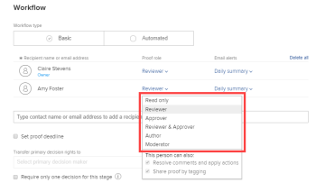

# 使用基本工作流程建立進階校訂

<!-- Audited: 1/2024 -->

使用基本工作流程，您可以讓多個稽核者檢閱校樣，但他們不會整理到不同階段。 您新增的所有檢閱者都可以在您建立校訂後立即存取校訂。

## 存取需求

+++ 展開以檢視本文中功能的存取需求。

<table style="table-layout:auto"> 
 <col> 
 <col> 
 <tbody> 
  <tr> 
   <td role="rowheader">Adobe Workfront套件</td> 
   <td>
   
任何

    </td> 
  </tr> 
  <tr> 
   <td role="rowheader">Adobe Workfront授權</td> 
   <td>
   
標準

    
工作或計畫
 </td> 
  </tr> 
  <tr> 
   <td role="rowheader">校樣權限設定檔 </td> 
   <td>經理或以上</td> 
  </tr> 
  <tr> 
   <td role="rowheader">存取層級設定</td> 
   <td> 
編輯檔案的存取權
 </td> 
  </tr> 
 </tbody> 
</table>

如需詳細資訊，請參閱Workfront檔案中的[存取需求](/help/quicksilver/administration-and-setup/add-users/access-levels-and-object-permissions/access-level-requirements-in-documentation.md)。

+++

## 使用基本工作流程建立進階校訂

1. 前往您要校訂的專案、任務或問題，然後按一下「**檔案**」標籤。
1. 按一下&#x200B;**新增** >校訂，上傳內容，然後完成下列區段。

   或

   將游標停留在現有檔案上，然後按一下&#x200B;**建立校訂** > **進階校訂**，並處理下列區段。

## 設定工作流程並新增稽核者

1. 在工作流程型別區段中，選擇&#x200B;**基本**。
1. 指定您要新增的使用者，然後選擇校訂角色。

   

1. 下表列出每個角色及其關聯的許可權。

   <table border="1" cellspacing="15" cellpadding="1"> 
    <col> 
    <col> 
    <col> 
    <col> 
    <col> 
    <col> 
    <col> 
    <col> 
    <col> 
    <col> 
    <col> 
    <col> 
    <col> 
    <col> 
    <thead> 
     <tr> 
      <th> 
 
 </th> 
      <th> 
<strong>檢視校訂</strong> 
 </th> 
      <th> 
<strong>新增標籤</strong> 
 </th> 
      <th> 
<strong>新增註解</strong> 
 </th> 
      <th> 
<strong>如果沒有回覆，請編輯自己的評論</strong> 
 </th> 
      <th> 
<strong>做出決定</strong> 
 </th> 
      <th> 
<strong>刪除其他人的評論</strong> 
 </th> 
      <th>解決評論</th> 
      <th>套用動作至註解</th> 
      <th> 
<strong>編輯校訂</strong> 
 </th> 
      <th>與他人共用校訂</th> 
      <th>建立新版本</th> 
      <th> 
<strong>在首頁區域檢視核准要求</strong> 
 </th> 
      <th>新增檢閱者</th> 
     </tr> 
    </thead> 
    <tbody> 
     <tr> 
      <td> 
<strong>唯讀</strong> 
 </td> 
      <td> 
✓
 </td> 
      <td> 
 
 </td> 
      <td> 
 
 </td> 
      <td> 
 
 </td> 
      <td> 
 
 </td> 
      <td> 
 
 </td> 
      <td> </td> 
      <td>✓</td> 
      <td> 
 
 </td> 
      <td>✓</td> 
      <td> </td> 
      <td> </td> 
      <td> </td> 
     </tr> 
     <tr> 
      <td> 
<strong>審閱者</strong> 
 </td> 
      <td> 
✓
 </td> 
      <td> 
✓
 </td> 
      <td> 
✓
 </td> 
      <td> 
✓
 </td> 
      <td> 
 
 </td> 
      <td> 
 
 </td> 
      <td> </td> 
      <td>✓</td> 
      <td> 
 
 </td> 
      <td>✓</td> 
      <td> </td> 
      <td> </td> 
      <td> </td> 
     </tr> 
     <tr> 
      <td> 
<strong>核准者</strong> 
 </td> 
      <td> 
✓
 </td> 
      <td> 
 
 </td> 
      <td> 
 
 </td> 
      <td> 
 
 </td> 
      <td> 
✓
 </td> 
      <td> 
 
 </td> 
      <td> </td> 
      <td>✓</td> 
      <td> 
 
 </td> 
      <td>✓</td> 
      <td> </td> 
      <td> 
✓
 </td> 
      <td> </td> 
     </tr> 
     <tr> 
      <td> 
<strong>檢閱者和核准者</strong> 
 </td> 
      <td> 
✓
 </td> 
      <td> 
✓
 </td> 
      <td> 
✓
 </td> 
      <td> 
✓
 </td> 
      <td> 
✓
 </td> 
      <td> 
 
 </td> 
      <td> </td> 
      <td>✓</td> 
      <td> 
 
 </td> 
      <td>✓</td> 
      <td> </td> 
      <td> 
✓
 </td> 
      <td> </td> 
     </tr> 
     <tr> 
      <td> 
<strong>作者</strong> 
 </td> 
      <td> 
✓
 </td> 
      <td> 
✓
 </td> 
      <td> 
✓
 </td> 
      <td> 
✓
 </td> 
      <td> 
✓
 </td> 
      <td> 
 
 </td> 
      <td>✓</td> 
      <td>✓</td> 
      <td> 
✓
 </td> 
      <td>✓</td> 
      <td>✓</td> 
      <td> </td> 
      <td>✓</td> 
     </tr> 
     <tr> 
      <td> 
<strong>仲裁者</strong> 
 </td> 
      <td> 
✓
 </td> 
      <td> 
✓
 </td> 
      <td> 
<strong>✓</strong> 
 </td> 
      <td> 
✓
 </td> 
      <td> 
✓
 </td> 
      <td> 
✓
 
 
 </td> 
      <td>✓</td> 
      <td>✓</td> 
      <td> 
✓
 </td> 
      <td>✓</td> 
      <td>✓</td> 
      <td>✓</td> 
      <td>✓</td> 
     </tr> 
    </tbody> 
   </table>

1. 新Workfront計畫上的使用者可以將作者或版主角色授予系統中的任何使用者。 舊版計畫中的使用者可以將作者或版主角色授予系統中擁有校訂授權的任何使用者。
1. （可選）在下拉式功能表仍開啟的情況下，選取功能表底部可用的任何其他許可權：

   <table style="table-layout:auto"> 
    <col> 
    <col> 
    <tbody> 
     <tr> 
      <td role="rowheader">解決評論並套用動作 </td> 
      <td> 
允許Workfront使用者執行下列動作：
 
       <ul> 
        <li>解決註解已解決之後，如<a href="../../../review-and-approve-work/proofing/reviewing-proofs-within-workfront/comment-on-a-proof/resolve-proof-comments.md" class="MCXref xref">解決校訂註解</a>中所述。</li> 
        <li>套用動作至註解，如<a href="../../../review-and-approve-work/proofing/reviewing-proofs-within-workfront/comment-on-a-proof/use-actions-on-comments-in-viewer.md" class="MCXref xref">對校訂註解使用動作</a>中所述。 </li> 
       </ul> </td> 
     </tr> 
     <tr> 
      <td role="rowheader">透過標記共用校訂</td> 
      <td> 
允許檢閱者將任何Workfront使用者新增到校訂中，如<a href="../../../review-and-approve-work/proofing/reviewing-proofs-within-workfront/comment-on-a-proof/tag-users-to-share-proof.md" class="MCXref xref">標籤使用者共用校訂</a>中所述。
 
注意：  
如果這兩個選項無法使用（變暗），則使用者已有許可權設定檔，可允許解析評論、將動作套用至評論和標籤任何使用者。 
 
如果選項未顯示，則表示您新增的人員並非Workfront授權持有者。
 
 </td> 
     </tr> 
    </tbody> 
   </table>

1. 對您已新增到校樣的任何其他使用者重複步驟1到3。
1. 針對您共用的每個使用者，在&#x200B;**電子郵件警示**&#x200B;下拉式清單中，選取此使用者在校訂上發表評論及做出決定時收到的電子郵件警示型別：

   <table style="table-layout:auto"> 
    <col> 
    <col> 
    <tbody> 
     <tr> 
      <td role="rowheader">所有活動</td> 
      <td>每次校訂上發生任何活動（例如新評論、回覆或決定）時，Workfront都會傳送電子郵件給檢閱者。 
這是管理校訂流程之人員的絕佳選項，因為可讓他們檢視活動發生的情形。 

使用者不會收到有關其活動的電子郵件警報。
</td> 
     </tr> 
     <tr> 
      <td role="rowheader">回覆我的評論</td> 
      <td>只有當某人明確回覆其評論時（這不包括他們自己的評論），才會傳送電子郵件給稽核者。 這表示如果校訂上的某人發表新評論，則不會通知檢閱者。
建議將此設定提供給校訂上的客戶，這樣他們就不會收到校訂上任何其他評論的通知，而只會在回覆他們自己的評論時收到通知。

雖然具有此電子郵件警報設定的檢閱者不會收到其他新評論的通知，但他們仍可在校訂檢視器中檢視校訂上的所有評論。

如需有關註解的資訊，請參閱<a href="../../../review-and-approve-work/proofing/reviewing-proofs-within-workfront/comment-on-a-proof/view-proof-comments.md" class="MCXref xref">檢視並回覆校訂註解</a>。
</td> 
     </tr> 
     <tr> 
      <td role="rowheader">決策</td> 
      <td>Workfront只會在有人做出決定時，才會傳送電子郵件給稽核者。
這對於管理核准流程的人員（例如專案經理）非常有用，他們需要監視校訂的進度並檢視哪些使用者已做出決定。

除非您在提交決定時選取電子郵件確認選項，否則不會通知您自己的決定。
</td> 
     </tr> 
     <tr> 
      <td role="rowheader">最終決策</td> 
      <td>當校訂的最後一位核准者做出決定時，Workfront會傳送電子郵件。
設計人員經常會使用此警示，他們通常不需要參與實際的稽核討論。 做出最終決定時，設計人員會收到通知，然後可以對任何必要的變更採取行動。

此警示對於必須在複查程式完成後才收到通知的部門主管來說也很有用。
</td> 
     </tr> 
     <tr> 
      <td role="rowheader">每小時摘要</td> 
      <td>Workfront每小時會傳送電子郵件給稽核者，其中包含該小時發生的所有評論、回覆和決定的摘要。
只有當您以外的活動發生在過去一小時內，才會傳送電子郵件。 

此警報是檢視專案概觀的好地方。

此摘要的範例使用案例是資深檢閱者，他需要專案的概觀，但不需要立即收到校訂上所有活動的通知。
</td> 
     </tr> 
     <tr> 
      <td role="rowheader">每日摘要</td> 
      <td>Workfront會傳送一封電子郵件，其中包含所有評論、回覆和決定，且僅限於您擁有活動以外的日期。
此警報是檢視專案摘要的好方法，而不會在一天中忙於多次更新。

此摘要的範例使用案例是部門負責人，他想要監控專案的整體進度。

如需詳細資訊，請參閱<a href="../../../review-and-approve-work/proofing/reviewing-proofs-within-workfront/manage-notifications-for-proof-comments.md" class="MCXref xref">管理校訂評論和決定的通知</a>。
</td> 
     </tr> 
     <tr data-mc-conditions=""> 
      <td role="rowheader">無電子郵件</td> 
      <td>Workfront不會傳送任何電子郵件警示。 這對於僅供參考而新增到校訂中且不需要通知任何變更的人員非常有用。
系統預設值為「每日」摘要（亦顯示為「未設定」）。 如果您或您的稽核者未進行任何其他變更，則您的所有校樣都會具有此設定。
</td> 
     </tr> 
    </tbody> 
   </table>

1. 繼續[設定以下校訂的電子郵件設定](#configure-email-settings-for-the-proof)。

## 設定校訂的電子郵件設定 {#configure-email-settings-for-the-proof}

1. 在&#x200B;**電子郵件通知**&#x200B;區段中，選取是否要傳送電子郵件通知和自訂訊息給您在[建立進階校樣時，使用本文前面的「基本」工作流程](#workflow)：

   <table>
   <tbody>
   <tr>
   <td>將此校訂通知收件者</td>
   <td>選取此選項即可傳送電子郵件通知給使用者。 在<strong>工作流程</strong>區段中選取<strong>基本共用</strong>時，會在建立校訂時傳送電子郵件通知。 在<strong>工作流程</strong>區段中選取<strong>自動化工作流程</strong>時，當校訂進入使用者關聯的自動化工作流程階段時，會傳送電子郵件通知。</td>
   </tr>
   <tr>
   <td>新增自訂訊息</td>
   <td>選取此選項以在通知中包含自訂訊息。 您可以指定主旨和訊息內文。 訊息內文可包含RTF格式，例如粗體、專案符號和超連結。</td>
   </tr>
   </tbody>
   </table>

1. 繼續進行[在下方設定校訂設定](#configure-proof-settings)。

## 設定校訂設定 {#configure-proof-settings}

1. 在&#x200B;**校訂設定**&#x200B;區段中，選取下列任一選項：

   <table style="table-layout:auto"> 
    <col> 
    <col> 
    <tbody> 
     <tr> 
      <td role="rowheader">需要登入 — 校訂只能與其他使用者共用</td> 
      <td>停用此選項（預設）時，具有URL的任何人都能夠檢視校訂。  選取此選項時：
       <ul>
        <li>只有Workfront Proof使用者能檢視校訂。</li>
        <li>使用者無法登入校訂，除非他們已新增到校訂中。</li>
        <li>無法啟用訂閱。</li>
       </ul></td> 
     </tr> 
     <tr> 
      <td role="rowheader">此證明只需一個決定</td> 
      <td>選取此選項時，稽核會在其中一位決策者做出決定後完成。 此選項預設為停用。</td> 
     </tr> 
     <tr> 
      <td role="rowheader">需要以電子方式簽署決策</td> 
      <td>使用者必須在就校訂做出決定時指定其使用者名稱和密碼。</td> 
     </tr> 
     <tr> 
      <td role="rowheader">完成所有必要的決定時鎖定校訂</td> 
      <td>啟用此設定時，完成所有決定後才會鎖定校訂狀態。 當最終核准者做出決定時，狀態會自動從已解除鎖定變更為已鎖定。 此選項預設為停用。</td> 
     </tr> 
     <tr> 
      <td role="rowheader">下載原始檔案</td> 
      <td>選取此選項時，稽核者可下載從中建立校訂的原始檔案。 取消選取此選項時，「下載」圖示不再顯示。 此選項預設為啟用。</td> 
     </tr> 
     <tr> 
      <td role="rowheader">透過公開URL或內嵌代碼共用校訂</td> 
      <td>選取此選項時，可透過公用URL或內嵌程式碼共用校訂。</td> 
     </tr> 
     <tr> 
      <td role="rowheader">透過公開URL或內嵌程式碼訂閱校訂</td> 
      <td>選取此選項時，未明確新增到校訂的人員可以訂閱校訂。 訂閱校訂的人員會獲得您在以下設定中定義的角色和電子郵件：
       <ul>
        <li><strong>訂閱者角色：</strong>指派給所有訂閱校訂的檢閱者的預設校訂角色。 </li>
        <li><strong>訂閱者的電子郵件警示設定：</strong>指派給所有訂閱校訂的稽核者的預設電子郵件警示。</li>
       </ul>

        <ul>
         <li><strong>需要透過電子郵件連結存取校訂：</strong>設定訂閱者是否收到包含校訂連結的電子郵件。 您可以選取<strong>無電子郵件</strong> （存取校訂不需要電子郵件連結）、<strong>僅校訂通知電子郵件</strong> （訂閱者會透過電子郵件收到校訂的連結，而不需要任何驗證）或<strong>驗證和校訂通知電子郵件</strong> （訂閱者會透過電子郵件收到校訂的連結，必須按一下連結才能存取校訂，此選項的目的是確保人員已輸入他們有權存取的正確電子郵件地址）。</li>
        </ul>
注意：  如果校訂已附加自動化工作流程，則所有訂閱都將向校訂所有者產生確認電子郵件，以便他們決定應將人員新增到哪個階段。 

</td> 
     </tr> 
    </tbody> 
   </table>

1. 按一下&#x200B;**建立校訂**。

   Workfront開始產生所選檔案或網站的校訂。 根據檔案大小和型別，檔案上傳的延遲時間可能會有所不同。 請耐心等候，因為產生較大的檔案需要更長的時間。 您可以離開頁面，Workfront會繼續產生您的檔案。 檔案上傳大小上限為4GB。

1. 產生校訂後，按一下&#x200B;**開啟校訂**&#x200B;以啟動校訂檢視器。

   

   未在其帳戶中啟用校訂的使用者仍可檢視檔案並對校訂進行評論。
