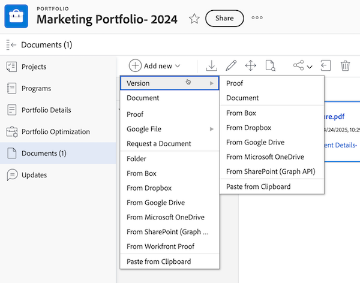

# 建立新版本的校訂

<!-- Audited: 4/2025 -->

管理作品多個版本或修訂版本的意見反應可能是一項挑戰。 Adobe Workfront可讓您建立和比較多個版本的校樣，藉此簡化此程式。

建立新版本的校訂時，請考慮下列資訊：

* 您可以授予使用者檢視某個版本的許可權，但不能授予另一個版本的許可權。 反之，如果您與使用者共用較新版本，除非您返回並授予他們存取先前版本的許可權，否則該使用者無法看到較舊版本。
* 您必須有校訂的編輯許可權才能建立新版本。

  如需詳細資訊，請參閱[在Workfront Proof中管理校訂角色](../../../workfront-proof/wp-work-proofsfiles/share-proofs-and-files/manage-proof-roles.md)和[在Workfront Proof中的校訂許可權設定檔](../../../workfront-proof/wp-acct-admin/account-settings/proof-perm-profiles-in-wp.md)。

  如需共用校訂版本的相關資訊，請參閱  [在Workfront Proof中共用校訂](../../../workfront-proof/wp-work-proofsfiles/share-proofs-and-files/share-proof.md)。

>[!IMPORTANT]
>
>如果在Adobe Workfront中建立校訂，也必須在Workfront中建立該校訂的任何新版本。 如果校訂是在Workfront Proof中建立，則無法在Workfront中建立新版本的校訂。

## 存取需求

+++ 展開以檢視本文中功能的存取需求。

<table style="table-layout:auto"> 
 <col> 
 <col> 
 <tbody> 
  <tr> 
   <td role="rowheader">Adobe Workfront套件</td> 
   <td> 
任何
 </td> 
  </tr> 
  <tr> 
   <td role="rowheader">Adobe Workfront授權</td> 
   <td> 
標準
 
   
工作或計畫

   </td> 
  </tr> 
  <tr> 
   <td role="rowheader">校樣權限設定檔 </td> 
   <td>經理或以上</td> 
  </tr> 
  <tr> 
   <td role="rowheader">存取層級設定</td> 
   <td> 
編輯檔案的存取權
 </td> 
  </tr> 
 </tbody> 
</table>

如需詳細資訊，請參閱Workfront檔案中的[存取需求](/help/quicksilver/administration-and-setup/add-users/access-levels-and-object-permissions/access-level-requirements-in-documentation.md)。

+++

## 在Workfront中建立新的校訂版本

有幾種方式可以在Workfront中上傳新的校訂版本。 預設校樣設定可能會或不會延續自上一個版本，端視您選取的方法而定：

* **上傳檔案時自動產生校訂**：如果您已在使用者設定檔中啟用此設定，當您拖放新版本時，預設校訂設定不會延續。
* **建立校訂>簡單**：如果您選取此選項，預設校訂設定不會延續到先前的版本。
* **新增>版本>校訂**：如果您選取此選項，預設校訂設定會延續到先前的版本。
* **建立校訂>進階**：如果您選取此選項，預設校訂設定會延續到先前的版本。

若要建立新版本的校訂：

1. 開啟包含校樣的檔案清單。
1. 從電腦的檔案系統中，將新檔案拖放到校樣上。

   或

   選取列出校訂的列，按一下&#x200B;**新增** > **版本**，然後按一下您要用來新增新版本的校訂的選項。

   

## 從校訂檢視器建立新的校訂版本(僅限Workfront Proof)

如果您使用獨立Workfront Proof，您可以建立包含單一檔案或網頁擷取的新版校訂。 

>[!NOTE]
>
>如果您的帳戶採用Enterprise計畫，且您上傳多個檔案或網頁擷取，系統會自動將它們合併為單一新版本。 如需詳細資訊，請參閱[建立多頁校訂](../../../review-and-approve-work/proofing/creating-proofs-within-workfront/create-multi-page-proof.md)。

若要在Workfront Proof中建立新版本的校訂：

1. 開啟校訂。
1. 在左上角，按一下&#x200B;**版本**&#x200B;下拉式功能表，然後在出現的方塊中按一下&#x200B;**+新版本**。 新校訂版本頁面隨即開啟。

   

1. 在&#x200B;**新增檔案**&#x200B;區段中，從電腦拖放檔案，或按一下&#x200B;**瀏覽**&#x200B;並選取檔案，將檔案上傳為新的校訂版本。

   或

   透過輸入URL將網頁擷取為新版本的校訂。

   >[!NOTE]
   >
   >拖放功能僅適用於完全支援HTML5的瀏覽器。 這不包括Internet Explorer 7到9和Safari。

1. （選擇性）選取校訂標題並為版本輸入新的&#x200B;**校訂名稱**。

1. 在&#x200B;**工作流程**&#x200B;區段中，進行下列任何變更以為此校訂版本新增稽核者（這將取代先前版本的稽核者）：

   * （選擇性）將版本的&#x200B;**所有者**&#x200B;變更為您帳戶中的其他使用者。

     如需詳細資訊，請參閱Workfront Proof中的[校訂許可權設定檔](../../../workfront-proof/wp-acct-admin/account-settings/proof-perm-profiles-in-wp.md)。

   * （選擇性）使用&#x200B;**輸入連絡人名稱或電子郵件地址來新增收件者**&#x200B;方塊，將稽核者新增至版本。 然後，您可以為每個收件者選取&#x200B;**校訂角色**&#x200B;和&#x200B;**電子郵件警示**&#x200B;型別。

     如需詳細資訊，請參閱[將群組新增到校訂](../../../workfront-proof/wp-mnguserscontacts/groups/add-groups.md)和[在Workfront Proof中管理校訂角色](../../../workfront-proof/wp-work-proofsfiles/share-proofs-and-files/manage-proof-roles.md)。

     >[!NOTE]
     >
     >如果校訂建立者或擁有者在其個人設定中預設停用已製作校訂的電子郵件，則即使在新校訂頁面上勾選&#x200B;**將此校訂通知收件者**&#x200B;方塊，他們也不會收到任何已製作校訂或新校訂電子郵件。 如需詳細資訊，請參閱[在Workfront Proof中設定電子郵件通知設定](../../../workfront-proof/wp-emailsntfctns/email-alerts/config-email-notification-settings-wp.md)、[校訂製作電子郵件](../../../workfront-proof/wp-emailsntfctns/proof-notifications-and-reminders/proof-made-email.md)和[新校訂電子郵件](../../../workfront-proof/wp-emailsntfctns/proof-notifications-and-reminders/new-proof-email.md)。

   * （選用）設定校訂期限。

   * （選擇性和條件性）在&#x200B;**將主要決策權轉移到**&#x200B;下拉式清單中選取新的主要決策者。

   * （選擇性）選取&#x200B;**此階段**&#x200B;僅需要一個決定，以移除將使用者設定為新的主要決策者的選項。

1. 在&#x200B;**電子郵件通知**&#x200B;區段中，選取下列任一設定：

   * （選擇性） **將此校訂通知收件者**：選取此選項以通知新版本的稽核者。 您的選取專案將記錄在&#x200B;**校訂詳細資料**&#x200B;頁面的&#x200B;**活動**&#x200B;區段。 如需詳細資訊，請參閱[在Workfront Proof中管理校訂詳細資訊](../../../workfront-proof/wp-work-proofsfiles/manage-your-work/manage-proof-details.md)。

   * （條件式與選擇式） **新增自訂主旨與訊息**：選取此選項可將自訂主旨行與訊息新增至電子郵件通知。

1. 在&#x200B;**組織**&#x200B;區段中，選取下列任一設定：

   * 將一個或多個標籤套用到校樣。 如需詳細資訊，請參閱[在Workfront Proof中建立及管理標籤](../../../workfront-proof/wp-work-proofsfiles/organize-your-work/create-and-manage-tags.md)。

   * 將版本新增至資料夾。 資料夾將會從舊版的校樣中複製。 如果您選取不同的資料夾，則會移動整個校訂（包括所有版本）。 如需詳細資訊，請參閱[在Workfront Proof中管理資料夾](../../../workfront-proof/wp-work-proofsfiles/organize-your-work/manage-folders.md)。

   * 帳單管理員和管理員可以在&#x200B;**設定**&#x200B;標籤中，將資料夾欄位設為整個帳戶的必要欄位。

1. 在&#x200B;**校訂設定**&#x200B;區段中，選取下列任一設定：

   * 需要使用者登入才能檢視校訂。
   * 需要在證明上以電子方式簽章（僅限企業方案）。
   * 完成所有決定時鎖定校訂。
   * 允許下載原始檔案。
   * 允許公開共用證明。
   * 允許訂閱校訂。

     在此區段中所做的選擇將顯示在&#x200B;**校訂詳細資料**&#x200B;頁面（可以編輯某些欄位）中。 如需詳細資訊，請參閱[在Workfront Proof中管理校訂詳細資訊](../../../workfront-proof/wp-work-proofsfiles/manage-your-work/manage-proof-details.md)。

<!--
<h2 data-mc-conditions="QuicksilverOrClassic.Draft mode">Create a new version of a proof from the proofing viewer</h2>
-->

<!--

To create a new version from the proofing viewer

-->

<!--
<ol data-mc-conditions="QuicksilverOrClassic.Draft mode">
<li value="1">Open the proof.</li>
<li value="2"> 
Click the <strong>Version</strong> drop-down menu in the upper-left corner, then click <strong>+ New version</strong> in the box that appears.
 
On the <strong>New proof version of</strong> page that appears, you can see all the reviewers from the previous version, including their roles and email notification settings. You can easily edit the roles and notifications of existing reviewers or remove existing reviewers from the new version on this page.
 </li>
<li value="3"> 
Under <strong>Add files</strong>, upload a file as a new version of the proof by dragging and dropping from your computer or by clicking <strong>browse</strong> and selecting the file you want. You can type a&nbsp;<strong>Proof name</strong>&nbsp;for the version or leave this box blank to&nbsp;use the same filename with a version number added on the end.
 
Or 
 
Capture a web page as a new version of the proof by typing a URL
 <note type="note">
Drag and drop is available only with browsers that fully support HTML5. This excludes Internet Explorer 7 through 9 and Safari.
 
</note> </li>
<li value="4"> 
Under <strong>Workflow</strong>, make any of the following changes to specify the reviewers for this version of the proof.
 
Reviewers from the previous version are replaced by the reviewers you add.

<ul>
<li>Change the <strong>Owner</strong> of the version to another user in your account. For information about owner permissions, see <a href="../../../workfront-proof/wp-acct-admin/account-settings/proof-perm-profiles-in-wp.md" class="MCXref xref">Proof Permissions Profiles in Workfront Proof</a>.</li>
<li> 
Using the <strong>Type contact name or email address to add a recipient box</strong>, add reviewers to the version. You can specify a <strong>Proof role</strong> and an <strong>Email alerts</strong> type for each recipient.
 
For information about adding groups to the proof, see&nbsp;<a href="../../../workfront-proof/wp-mnguserscontacts/groups/add-groups.md" class="MCXref xref">Add Groups to a Proof</a>.&nbsp;For information about roles, see <a href="../../../workfront-proof/wp-work-proofsfiles/share-proofs-and-files/manage-proof-roles.md" class="MCXref xref">Manage Proof Roles in Workfront Proof</a>.
 <note type="note">
If the creator or owner of&nbsp;&nbsp;the proof has
<a href="../../../workfront-proof/wp-emailsntfctns/proof-notifications-and-reminders/proof-made-email.md" class="MCXref xref">The Proof Made email</a> disabled by default (in their personal settings), they won't receive any Proof made or New proof emails even if the Notify people by email box is checked on the New proof page. For information about email notifications, see
<a href="../../../workfront-proof/wp-emailsntfctns/email-alerts/config-email-notification-settings-wp.md" class="MCXref xref">Configure email notification settings in Workfront Proof</a>.&nbsp;See also
<a href="../../../workfront-proof/wp-emailsntfctns/proof-notifications-and-reminders/proof-made-email.md" class="MCXref xref">The Proof Made email</a> and
<a href="../../../workfront-proof/wp-emailsntfctns/proof-notifications-and-reminders/new-proof-email.md" class="MCXref xref">New proof email</a>.
 
</note> </li>
<li>Set a proof deadline for the version.</li>
<li>Hover over a reviewer's name to see any decisions he or she made on a previous version.</li>
</ul> </li>
<li value="5">Under <strong>Email notification</strong>, do any of the following:
<ul>
<li>Specify whether you want to notify the reviewers of the new version. Your selection will be logged in the Proof activity section on the Proof details page.</li>
<li>Add a custom subject and message.</li>
</ul></li>
<li value="6">Under Proof settings, make any of the changes below:
<ul>
<li>Require login on the proof</li>
<li>Require electronic signatures on the proof (Enterprise plan only)</li>
<li>Lock the proof when all decisions are made</li>
<li>Allow or block download of original file</li>
<li>Public sharing of the proof,&nbsp;including public sharing settings</li>
<li>Subscription to the proof The selections made in this section will be shown in the Proof details page.</li>
</ul></li>
</ol>
-->

## 關於新版本訊息

如果舊版校樣中包含自訂主旨/訊息，則預設會顯示在新版本頁面上。 您可以：

* 編輯主旨和訊息。
* 取消選取「透過電子郵件通知人員」方塊，表示不會傳送任何電子郵件給稽核者，通知他們他們有要稽核的新版本。

  >[!NOTE]
  >
  >這不會受到您個人設定中儲存的任何預設自訂主旨/訊息的影響。

如果您在個人設定中儲存了預設主旨和訊息，這將決定預設在新版本頁面上顯示的訊息：

* 如果您使用標準電子郵件通知檢閱者先前的校訂版本（例如，無自訂主旨/訊息），您的預設自訂主旨/訊息（您的個人設定）將顯示在新版本頁面上。 然後，您可以編輯自訂主旨和訊息，或取消選取「透過電子郵件通知人員」方塊，這表示不會向您的稽核者傳送電子郵件，通知他們他們有要稽核的新版本。
* 如果您未將先前的校訂版本通知給檢閱者（例如沒有標準或自訂電子郵件），「新版本」頁面預設不會包含訊息。 若要將新版本通知給檢閱者，請按一下「傳送訊息」連結，此連結將顯示您的預設自訂主旨/訊息（根據您的個人設定）。 之後，您可以視需要編輯自訂主旨和訊息。

如果您未在個人設定中儲存預設主旨和訊息，下列內容將會顯示在「新版本」頁面上：

* 如果您使用標準電子郵件（例如無自訂主旨/訊息）通知檢閱者先前的校訂版本，依預設將會在新版本頁面上選取「透過電子郵件通知人員」選項。 若要新增自訂訊息，請按一下連結。
* 如果您未將先前的校訂版本通知給檢閱者（例如沒有標準或自訂電子郵件），「新版本」頁面預設不會包含任何訊息。 若要通知檢閱者新版本，請按一下「傳送訊息」連結。 然後，您可以按一下「新增自訂訊息」連結，以新增自訂主旨和訊息。
