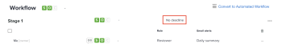

# 設定現有基本校訂的截止日期

基本校訂建立後，您可以為其設定單一截止日期。

## 存取需求

+++ 展開以檢視本文中功能的存取需求。

您必須具有下列存取權才能執行本文中的步驟：

<table style="table-layout:auto"> 
 <col> 
 <col> 
 <tbody> 
  <tr> 
   <td role="rowheader">Adobe Workfront計畫*</td> 
   <td> 
目前計畫：Pro或更高版本
 
或
 
舊版計畫：選擇或Premium
 
如需有關不同方案的校訂存取許可權的詳細資訊，請參閱<a href="/help/quicksilver/administration-and-setup/manage-workfront/configure-proofing/access-to-proofing-functionality.md" class="MCXref xref">存取Workfront中的校訂功能</a>。
 </td> 
  </tr> 
  <tr> 
   <td role="rowheader">Adobe Workfront授權*</td> 
   <td> 
目前計畫：工作或計畫
 
舊版計畫：任何（您必須為使用者啟用校訂）
 </td> 
  </tr> 
  <tr> 
   <td role="rowheader">校樣權限設定檔 </td> 
   <td>經理或以上</td> 
  </tr> 
  <tr> 
   <td role="rowheader">校樣角色</td> 
   <td>作者或經理</td> 
  </tr> 
  <tr> 
   <td role="rowheader">存取層級設定*</td> 
   <td> 
編輯檔案的存取權
 
如需請求其他存取權的資訊，請參閱<a href="../../../../workfront-basics/grant-and-request-access-to-objects/request-access.md" class="MCXref xref">請求物件</a>的存取權。
 </td> 
  </tr> 
 </tbody> 
</table>

&#42;若要瞭解您擁有的計畫、角色或校訂許可權設定檔，請連絡您的Workfront或Workfront Proof管理員。

+++

## 設定現有基本校訂的截止日期

1. 前往包含檔案的專案、任務或問題，然後選取「**檔案**」。
1. 尋找您需要的證明。
1. 按一下&#x200B;**校訂工作流程**。
1. 在&#x200B;**工作流程**&#x200B;區域中，選取&#x200B;**無截止日期**。

   

1. 選擇日期並指定時間，然後按一下畫面上的任何位置。
1. 選擇是否要通知稽核者新的截止日期。
