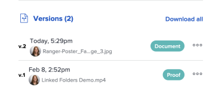

# 檢視校訂版本

您可以檢視舊版的校訂。

## 存取需求

+++ 展開以檢視本文中功能的存取需求。

您必須具有下列存取權才能執行本文中的步驟：

<table style="table-layout:auto"> 
 <col> 
 <col> 
 <tbody> 
  <tr> 
   <td role="rowheader">Adobe Workfront計畫*</td> 
   <td> 
目前計畫：Pro或更高版本
 
或
 
舊版計畫：選擇或Premium
 
如需有關不同方案的校訂存取許可權的詳細資訊，請參閱<a href="/help/quicksilver/administration-and-setup/manage-workfront/configure-proofing/access-to-proofing-functionality.md" class="MCXref xref">存取Workfront中的校訂功能</a>。
 </td> 
  </tr> 
  <tr> 
   <td role="rowheader">Adobe Workfront授權*</td> 
   <td> 
目前計畫：工作或計畫
 
舊版計畫：任何（您必須為使用者啟用校訂）
 </td> 
  </tr> 
  <tr> 
   <td role="rowheader">校樣權限設定檔 </td> 
   <td>經理或以上</td> 
  </tr> 
  <tr> 
   <td role="rowheader">存取層級設定*</td> 
   <td> 
編輯檔案的存取權
 
如需請求其他存取權的資訊，請參閱<a href="../../../../workfront-basics/grant-and-request-access-to-objects/request-access.md" class="MCXref xref">請求物件</a>的存取權。
 </td> 
  </tr> 
 </tbody> 
</table>

&#42;若要瞭解您擁有的計畫、角色或校訂許可權設定檔，請連絡您的Workfront或Workfront Proof管理員。

+++

## 檢視所有校訂版本的清單

1. 前往檔案清單，並選取校訂。
1. 在[摘要]中，捲動至檢視&#x200B;**所有版本**&#x200B;區段。 您可以在這裡檢視校訂的所有版本。

   的復本

## 預覽先前的校訂版本

下載無法預覽的檔案（例如XLSX和DOC）。

1. 前往檔案清單，然後選取校訂。
1. 在摘要中，向下捲動至&#x200B;**版本**，按一下&#x200B;**更多**&#x200B;功能表，然後選取&#x200B;**預覽**。

   摘要中的

## 檢視先前的校訂版本

在Workfront中擁有檔案檢視存取許可權的任何使用者都可以檢視校訂檔案的過去版本。 使用者不需要擁有校訂授權。

1. 前往包含檔案的專案、任務或問題，然後選取「**檔案**」。
1. 尋找您需要的證明。
1. 在摘要中，向下捲動至&#x200B;**版本**，按一下&#x200B;**更多**&#x200B;功能表，然後選取&#x200B;**開啟校訂**。

   摘要中的
