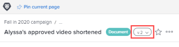

# 檢視和管理校訂版本詳細資料

您可以檢視和管理校訂詳細資訊。

## 存取權要求

+++ 展開以檢視這篇文章中所述功能的存取權要求。

<table style="table-layout:auto"> 
 <col> 
 <col> 
 <tbody> 
  <tr> 
   <td role="rowheader">Adobe Workfront 封裝</td> 
   <td> 
任何
 </td> 
  </tr> 
  <tr> 
   <td role="rowheader">Adobe Workfront授權</td> 
   <td> 
   
標準

   
工作或計畫
 
   </td> 
  </tr> 
  <tr> 
   <td role="rowheader">校樣權限設定檔 </td> 
   <td>經理或以上</td> 
  </tr> 
  <tr> 
   <td role="rowheader">存取層級設定</td> 
   <td> 
編輯檔案的存取權
 </td> 
  </tr> 
 </tbody> 
</table>

如需詳細資訊，請參閱Workfront檔案中的[存取需求](/help/quicksilver/administration-and-setup/add-users/access-levels-and-object-permissions/access-level-requirements-in-documentation.md)。

+++

## 檢視和管理先前校訂版本的詳細資料

1. 在檔案清單中，將滑鼠停留在包含校訂的列上，然後按一下&#x200B;**檔案詳細資料**。
1. 在「檔案詳細資訊」頁面頂端附近，按一下名稱旁邊的下拉式功能表，然後按一下您要檢視及管理的版本名稱。

   

   除了檢視版本的詳細資訊之外，您還可以變更版本，例如其名稱、中繼資料和校訂設定（如果是檔案校訂）。

## 檢視先前版本的校訂詳細資訊

使用者必須擁有校訂授權，才能檢視校訂檔案過去版本的校訂詳細資訊。

1. 前往包含檔案的專案、任務或問題，然後選取「**檔案**」。
1. 尋找您需要的證明。
1. 在[摘要]的&#x200B;**版本**&#x200B;區域中，按一下版本，然後按一下出現的下拉式清單中的&#x200B;**詳細資料**。

1. 在檔案詳細資訊頁面上，按一下左側面板中的&#x200B;**校訂工作流程**&#x200B;以執行下列任一項作業：

   * 新增自動化工作流程。 如需詳細資訊，請參閱文章中的區段。
   * 共用校訂的公用URL。 如需詳細資訊，請參閱[在Adobe Workfront中共用校訂](../../../../review-and-approve-work/proofing/managing-proofs-within-workfront/share-a-proof-in-workfront.md)中的[共用校訂連結](../../../../review-and-approve-work/proofing/managing-proofs-within-workfront/share-a-proof-in-workfront.md#share)。
   * 檢視校訂上發生的所有活動。
   * 向校訂上的檢閱者傳送提醒訊息。

1. 按一下「**完成**」。
