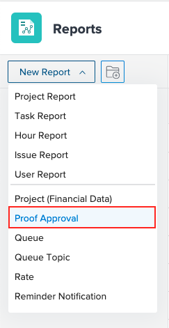

# 使用校樣核准報表

您可以使用校樣核准報表來檢視環境中校樣的相關資訊。

## 存取需求

您必須具備下列條件：

<table style="table-layout:auto"> 
 <col> 
 <col> 
 <tbody> 
  <tr> 
   <td role="rowheader"> 
Workfront計畫*
 </td> 
   <td>任何</td> 
  </tr> 
  <tr> 
   <td role="rowheader"> 
Adobe Workfront授權概述*
 </td> 
   <td> 
計劃
 </td> 
  </tr> 
  <tr data-mc-conditions=""> 
   <td role="rowheader"><strong>存取層級*</strong> </td> 
   <td> 
編輯對以下項目的訪問：
 
    <ul> 
     <li> 
建立報表、控制面板和日曆
 </li> 
     <li> 
建立篩選、檢視和群組
 </li> 
    </ul> 
注意：如果您仍無權存取，請洽詢您的Workfront管理員，他們是否在您的存取層級設定其他限制。 如需Workfront管理員如何變更您的存取層級的詳細資訊，請參閱 <a href="../../../administration-and-setup/add-users/configure-and-grant-access/create-modify-access-levels.md" class="MCXref xref">建立或修改自訂存取層級</a>.
 </td> 
  </tr> 
 </tbody> 
</table>

&#42;若要了解您擁有的計畫、授權類型或存取權，請聯絡您的Workfront管理員。

## 使用校樣核准報表

1. 按一下 **主菜單** 圖示  在Adobe Workfront的右上角，然後按一下 **報表**.
1. 按一下 **新增報表**，然後捲動以選取 **證明核准**.

   

1. （選用）新增任何其他欄位。
1. 按一下 **儲存+關閉**.

## 其他欄位

您可以將下列欄位新增至校樣核准報表：

* **決策日期**:顯示核准者對校樣作出決定的日期。 您也可以在校樣的「打印摘要」中找到此日期。
* **核准者階段**:顯示當前階段資訊。
* **工作流程範本**:顯示附加至校樣的任何工作流程範本。 如果沒有附加任何模板，則列為空。
* **等待決定**:若符合下列條件，則顯示true以指出在最新版本上未符合決策：

   * 校樣尚未封存
   * 核准者所在的階段處於作用中狀態
   * 證明正在等待批准

* **校樣截止日期**:顯示校樣的截止日期。 每個階段都必須指定一個截止日期，才能填入此欄位。 欄位會顯示最近啟動階段的截止時間。

 
