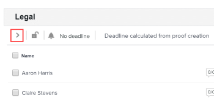

# 在校訂上檢視自動化工作流程階段

您可以方便地追蹤設定了「自動化工作流程」的校訂進度。 您可以檢視、修改、新增、開始和鎖定校樣上已在階段完成的工作。

如需有關使用自動化工作流程新增階段和使用者到校訂的資訊，請參閱[在校訂上將階段和使用者新增到自動化工作流程](../../../review-and-approve-work/proofing/managing-proofs-within-workfront/add-stages-users-to-automated-workflow-proof.md)。

## 存取需求

+++ 展開以檢視本文中功能的存取需求。

您必須具有下列存取權才能執行本文中的步驟：

<table style="table-layout:auto"> 
 <col> 
 <col> 
 <tbody> 
  <tr> 
   <td role="rowheader">Adobe Workfront計畫*</td> 
   <td> 
目前計畫：Pro或更高版本
 
或
 
舊版計畫：選擇或Premium
 
如需有關不同方案的校訂存取許可權的詳細資訊，請參閱<a href="/help/quicksilver/administration-and-setup/manage-workfront/configure-proofing/access-to-proofing-functionality.md" class="MCXref xref">存取Workfront中的校訂功能</a>。
 </td> 
  </tr> 
  <tr> 
   <td role="rowheader">Adobe Workfront授權*</td> 
   <td> 
目前計畫：工作或計畫
 
舊版計畫：任何（您必須為使用者啟用校訂）
 </td> 
  </tr> 
  <tr> 
   <td role="rowheader">校樣權限設定檔 </td> 
   <td>經理或以上</td> 
  </tr> 
  <tr> 
   <td role="rowheader">存取層級設定*</td> 
   <td> 
編輯檔案的存取權
 
如需請求其他存取權的資訊，請參閱<a href="../../../workfront-basics/grant-and-request-access-to-objects/request-access.md" class="MCXref xref">請求物件</a>的存取權。
 </td> 
  </tr> 
 </tbody> 
</table>

&#42;若要瞭解您擁有的計畫、角色或校訂許可權設定檔，請連絡您的Workfront或Workfront Proof管理員。

+++

## 檢視自動化工作流程圖表

1. 在包含檔案的檔案清單中，暫留在包含檔案的列上，然後按一下&#x200B;**校訂工作流程**。

   「自動化工作流程」的圖表會顯示在「工作流程」標題的正下方。

   圖表上的階段標示如下：

   作用中階段

   非使用中階段\
     私人階段

     鎖定的階段

   階段之間的行描述階段之間的相依性。 非作用中階段的行會以點狀虛線，直到啟動階段為止。

   您可以將滑鼠停留在圖中的某個階段上，以顯示其進度。 如果舞台不是作用中狀態，而且您擁有編輯舞台的權利，您可以按一下[啟動舞台]按鈕![[啟動舞台]](assets/activate-stage-btn.png)來啟動舞台。 如果舞台處於作用中狀態，且您擁有編輯舞台的權利，則可以鎖定它。 如需進度列(S， O， C， D)的詳細資訊，請參閱  [在Workfront Proof中檢視校訂的進度和狀態](../../../workfront-proof/wp-work-proofsfiles/manage-your-work/view-progress-and-status-of-proof.md)。

## 檢視階段

1. 在包含檔案的檔案清單中，暫留在包含檔案的列上，然後按一下&#x200B;**校訂工作流程**。
1. 在圖表上，按一下您要檢視的階段。

   

1. 若要展開階段的詳細資訊，請按一下其名稱下方的側面箭頭。

   

## 檢視所有階段

若要檢視自動化工作流程中的所有階段：

1. 按一下頁面頂端的[變更檢視]按鈕，然後按一下&#x200B;**檢視所有階段**。

   區段中會列出「自動化工作流程」的所有階段，但詳細資訊會隱藏。

1. 若要展開舞台的詳細資訊，請按一下舞台名稱下方的側面箭頭。

## 詳細檢視所有階段

若要檢視自動化工作流程的所有階段，並展開其詳細資訊：

1. 按一下頁面頂端的[變更檢視]按鈕，然後按一下&#x200B;**詳細檢視所有階段**。
1. 若要檢視階段的詳細資訊，請按一下其名稱下方的向下箭頭。
