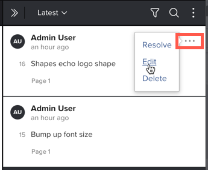

# 編輯校訂評論

將回覆新增至評論後，便無法編輯評論。 此限制會維持註解執行緒的完整性。 編輯註解時，建立註解的時間不受影響。

## 存取權要求

+++ 展開以檢視這篇文章中所述功能的存取權要求。

<table style="table-layout:auto"> 
 <col> 
 <col> 
 <tbody> 
  <tr> 
   <td role="rowheader">Adobe Workfront 封裝</td> 
   <td> 
任何
 </td> 
  </tr> 
  <tr> 
   <td role="rowheader">Adobe Workfront授權*</td> 
   <td> 
任何
 </td> 
  </tr> 
  <tr> 
   <td role="rowheader">校樣權限設定檔 </td> 
   <td>主管</td> 
  </tr> 
  <tr> 
   <td role="rowheader">存取層級設定*</td> 
   <td> 
編輯檔案的存取權
</td> 
  </tr> 
 </tbody> 
</table>

如需詳細資訊，請參閱Workfront檔案中的[存取需求](/help/quicksilver/administration-and-setup/add-users/access-levels-and-object-permissions/access-level-requirements-in-documentation.md)。

+++

## 編輯校訂評論

您可以編輯對校樣所做的任何評論。 此外，下列使用者可以編輯其他使用者所做的註解：

* 校訂所有者
* 校訂建立者
* 具有監督員設定檔許可權的使用者
* 具有作者或版主校訂角色的使用者

若要編輯校訂評論：

1. 前往包含檔案的專案、任務或問題，然後選取「**檔案**」。
1. 尋找您需要的校訂，然後按一下&#x200B;**開啟校訂**。

1. （視條件而定）如果註解區域未開啟，請按一下右上角的&#x200B;**檢視註解**。
1. 將滑鼠停留在您要編輯的註解上，按一下出現的&#x200B;**更多**&#x200B;圖示，然後按一下&#x200B;**編輯**。

1. 

1. 在註解中進行任何變更，然後按一下&#x200B;**貼文**。

   >[!NOTE]
   >
   >「已編輯」標籤會出現在註解上。 當檢閱者停留在上面時，您的名稱以及變更的日期和時間就會出現。 如果您編輯註解多次，此資訊只會針對最近的變更顯示。 當您在[檔案]區域中選取檔案並檢視[摘要]中的&#x200B;**更新**&#x200B;索引標籤時，此標籤也會出現在註解上方。
