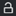

# 鎖定或解鎖校樣

在審核過程中，您隨時都可以手動鎖定和解除鎖定校樣。

## 存取需求

您必須具備下列存取權，才能執行本文中的步驟：

<table style="table-layout:auto"> 
 <col> 
 <col> 
 <tbody> 
  <tr> 
   <td role="rowheader">Adobe Workfront計畫*</td> 
   <td> 
當前計畫：Pro或更高
 
或
 
舊計畫：Premium
 
如需使用不同計畫校對存取權限的詳細資訊，請參閱 <a href="/help/quicksilver/administration-and-setup/manage-workfront/configure-proofing/access-to-proofing-functionality.md" class="MCXref xref">存取Workfront中的校對功能</a>.
 </td> 
  </tr> 
  <tr> 
   <td role="rowheader">Adobe Workfront授權*</td> 
   <td> 
當前計畫：工作或計畫
 
舊計畫：任何（您必須為使用者啟用校對）
 </td> 
  </tr> 
  <tr> 
   <td role="rowheader">證明角色</td> 
   <td>擁有者或協調者</td> 
  </tr> 
  <tr> 
   <td role="rowheader">校訂權限設定檔 </td> 
   <td>主管或管理員</td> 
  </tr> 
 </tbody> 
</table>

&#42;若要了解您擁有的計畫、角色或校樣權限設定檔，請聯絡您的Workfront或Workfront Proof管理員。

## 鎖定校樣

您可以手動鎖定校樣，以防止或允許審核者加以註解。 這與鎖定證明階段不同。

鎖定校樣：

1. 轉到包含要開啟的校樣的文檔清單。
1. 將滑鼠指標暫留在檔案上，然後按一下 **開啟校樣** 連結。

   或

   如果要開啟文檔早期版本的校樣，請按一下「更多」表徵圖  在摘要中，按一下 **開啟校樣**.

   如需「摘要」的相關資訊，請參閱 [文檔摘要概述](../../../../documents/managing-documents/summary-for-documents.md).

1. 在左側面板中，按一下 **鎖定** 圖示 .

   

## 解鎖校樣

當您需要審核者將註解新增至舊版校樣時，解鎖校樣就十分實用。 （在校樣擁有者手動解除鎖定前，一律會鎖定舊版。） 審核者將注釋添加到前一版本後，可以再次鎖定它。 如需檢視舊版校樣的相關資訊，請參閱 [在Web校對查看器中查看以前的校樣版本](../../../../workfront-proof/wp-work-proofsfiles/review-proofs-wpv/view-previous-proof-versions.md).

解鎖校樣：

1. 將滑鼠指標暫留在檔案上，然後按一下 **開啟校樣** 連結。

   或

   如果要開啟文檔早期版本的校樣，請按一下「更多」表徵圖  在摘要中，按一下 **開啟校樣**.

   如需「摘要」的相關資訊，請參閱 [文檔摘要概述](../../../../documents/managing-documents/summary-for-documents.md).

1. 在左側面板中，按一下 **解鎖** 圖示 ，然後按一下 **是，解鎖**.

   
