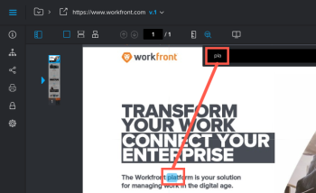

# 搜尋校訂中的內容

您可以在為下列檔案型別建立的校樣中快速找到文字：

* PDF
* Office (.doc， .docx， .odt)
* 靜態網頁

>[!NOTE]
>
>2017年4月26日之前建立的校訂可能無法搜尋。

## 存取權要求

+++ 展開以檢視這篇文章中所述功能的存取權要求。

<table style="table-layout:auto"> 
 <col> 
 <col> 
 <tbody> 
  <tr> 
   <td role="rowheader">Adobe Workfront 封裝</td> 
   <td> 
任何
 </td> 
  </tr> 
  <tr> 
   <td role="rowheader">Adobe Workfront授權</td> 
   <td> 
任何
 </td> 
  </tr> 
  <tr> 
   <td role="rowheader">校訂角色 </td> 
   <td>檢閱者、檢閱者和核准者、作者、版主</td> 
  </tr> 
  <tr> 
   <td role="rowheader">校樣權限設定檔 </td> 
   <td>經理或以上</td> 
  </tr> 
  <tr> 
   <td role="rowheader">存取層級設定</td> 
   <td> 
編輯檔案的存取權
 </td> 
  </tr> 
 </tbody> 
</table>

如需詳細資訊，請參閱Workfront檔案中的[存取需求](/help/quicksilver/administration-and-setup/add-users/access-levels-and-object-permissions/access-level-requirements-in-documentation.md)。

+++

## 搜尋校訂中的內容

1. 開啟您要搜尋的校訂。
1. 在校訂上方的工具列中，按一下&#x200B;**搜尋檔案**&#x200B;圖示。

   

1. 開始輸入您要搜尋的文字。

   當您鍵入時，搜尋工具會反白顯示檔案中的文字。

   

1. 完成輸入您要搜尋的文字，然後按一下&#x200B;**向上**&#x200B;和&#x200B;**向下**&#x200B;箭號來掃描校樣內的搜尋結果。
