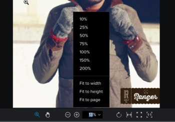

# 檢視校樣中的內容

## 存取需求

您必須具備下列存取權，才能執行本文中的步驟：

<table style="table-layout:auto"> 
 <col> 
 <col> 
 <tbody> 
  <tr> 
   <td role="rowheader">Adobe Workfront計畫*</td> 
   <td> 
當前計畫：Pro或更高
 
或
 
舊計畫：Select或Premium
 
如需使用不同計畫校對存取權限的詳細資訊，請參閱 <a href="/help/quicksilver/administration-and-setup/manage-workfront/configure-proofing/access-to-proofing-functionality.md" class="MCXref xref">存取Workfront中的校對功能</a>.
 </td> 
  </tr> 
  <tr> 
   <td role="rowheader">Adobe Workfront授權*</td> 
   <td> 
當前計畫：工作或計畫
 
舊計畫：任何（您必須為使用者啟用校對）
 </td> 
  </tr> 
  <tr> 
   <td role="rowheader">校訂權限設定檔 </td> 
   <td>管理員或更高</td> 
  </tr> 
  <tr> 
   <td role="rowheader">訪問級別配置*</td> 
   <td> 
編輯對文檔的訪問
 
有關請求其他訪問的資訊，請參閱 <a href="../../../../workfront-basics/grant-and-request-access-to-objects/request-access.md" class="MCXref xref">請求對對象的訪問 </a>.
 </td> 
  </tr> 
 </tbody> 
</table>

&#42;若要了解您擁有的計畫、角色或校樣權限設定檔，請聯絡您的Workfront或Workfront Proof管理員。

## 變更校樣的檢視

您可以在單一檢視、持續檢視或雜誌檢視中，檢視包含多個頁面的靜態校樣。

1. 轉到包含文檔的項目、任務或問題，然後選擇 **檔案**.
1. 找到您需要的校樣，然後按一下 **開啟校樣**.

1. 在校對檢視器的左上角區域，找出檢視選項。\
   

1. 按一下下列任一選項：

   <table style="table-layout:auto"> 
    <col> 
    <col> 
    <tbody> 
     <tr> 
      <td role="rowheader">單一檢視</td> 
      <td>一次只顯示單一頁面。 按一下您要檢視的頁面縮圖，或按向左和向右方向鍵以在頁面之間導覽。 </td> 
     </tr> 
     <tr> 
      <td role="rowheader">連續視圖</td> 
      <td>以單一堆疊檢視顯示所有頁面。 按一下您要檢視的頁面縮圖，或按向左和向右箭頭鍵以在連續檢視中向上或向下捲動所有頁面。 </td> 
     </tr> 
     <tr> 
      <td role="rowheader">雜誌檢視</td> 
      <td>以單一雜誌檢視（並排和堆疊）顯示所有頁面。 按一下您要檢視的頁面縮圖，或按向左和向右方向鍵以在所有頁面之間捲動。 </td> 
     </tr> 
    </tbody> 
   </table>

## 使用縮圖

縮圖面板會顯示在校對檢視器的左側。 您可以使用縮圖區域在整個校樣中導覽。 校樣包含多個頁面時，縮圖特別實用。

* [隱藏和顯示縮圖面板](#hide-and-display-the-thumbnails-panel)
* [縮放和平移縮圖檢視](#zoom-and-pan-in-the-thumbnail-view)

### 隱藏和顯示縮圖面板 {#hide-and-display-the-thumbnails-panel}

預設會顯示縮圖面板。 您可以隱藏或調整面板的大小。

1. 轉到包含文檔的項目、任務或問題，然後選擇 **檔案**.
1. 找到您需要的校樣，然後按一下 **開啟校樣**.

1. 按一下 **縮圖** 表徵圖。\
   

1. （可選）再按一下「縮圖」圖示以顯示縮圖面板。

   >[!TIP]
   >
   >您可以將滑鼠移至縮圖面板的右邊，以調整面板的大小。

### 縮放和平移縮圖檢視 {#zoom-and-pan-in-the-thumbnail-view}

縮圖面板中的縮放區域會顯示您目前檢視的校樣區域。 您可以調整縮圖區域中的縮放，也可以平移區域以查看校樣的不同部分。

要縮放和平移縮略圖視圖：

1. 轉到包含文檔的項目、任務或問題，然後選擇 **檔案**.
1. 找到您需要的校樣，然後按一下 **開啟校樣**.

1. 在縮圖面板中找到當前縮放區域。\
   縮放區域在縮圖的邊緣周圍顯示為藍色框架。

   

1. 要調整縮放區域的大小，請拖動縮放區域的右下角，直到達到所需的大小。
1. 要將縮放區域移動到校樣的另一部分，請拖動縮放區域，直到覆蓋要查看的校樣的部分為止。

## 旋轉校樣

您可以在校樣檢視器內旋轉校樣。 旋轉包含多個頁面的校樣時，會同時旋轉所有頁面。

1. 轉到包含文檔的項目、任務或問題，然後選擇 **檔案**.
1. 找到您需要的校樣，然後按一下 **開啟校樣**.

1. 按一下 **旋轉** 表徵圖。

   

   每次按一下 **旋轉** 表徵圖。

## 縮放和平移校樣

您可以在檢視校樣時調整縮放百分比。 以較大縮放百分比檢視校樣時，「平移」選項可讓您使用游標導覽至校樣的不同區域。

1. 轉到包含文檔的項目、任務或問題，然後選擇 **檔案**.
1. 找到您需要的校樣，然後按一下 **開啟校樣**.

1. 執行下列任一操作以調整校樣的縮放百分比：

   * 按一下 **縮放** 表徵圖，然後按一下校樣以更高的縮放級別查看校樣，或拖動校樣的區域以僅查看該區域。

      

   * 按一下當前縮放百分比，按一下新的縮放百分比，或按一下 **適合寬度**, **適合高度**，或 **適合頁面大小**.

      

   * 按一下 **加號** 或 **減號** 圖示來增加或減少縮放百分比。

      

1. 如果您需要平移至影片校樣的特定區域，請按一下 **潘** 圖示，然後視需要拖曳校樣。

   

   >[!TIP]
   >
   >要在「縮放」和「平移」工具之間輕鬆切換，使用「縮放」表徵圖平移時按住空格鍵。
