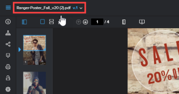

# 在校訂檢視器中檢視先前的校訂版本

您可以檢視校訂的先前版本（如果存在）。 預設會鎖定舊版。 您無法在鎖定的版本上新增註解或變更決定。

>[!NOTE]
>
>本文所述資訊僅適用於Web Proofing Viewer，且僅供檢閱視訊或靜態校訂時使用。

## 存取需求

+++ 展開以檢視本文中功能的存取需求。

您必須具有下列存取權才能執行本文中的步驟：

<table style="table-layout:auto"> 
 <col> 
 <col> 
 <tbody> 
  <tr> 
   <td role="rowheader">Adobe Workfront計畫*</td> 
   <td> 
目前計畫：Pro或更高版本
 
或
 
舊版計畫：選擇或Premium
 
如需有關不同方案的校訂存取許可權的詳細資訊，請參閱<a href="/help/quicksilver/administration-and-setup/manage-workfront/configure-proofing/access-to-proofing-functionality.md" class="MCXref xref">存取Workfront中的校訂功能</a>。
 </td> 
  </tr> 
  <tr> 
   <td role="rowheader">Adobe Workfront授權*</td> 
   <td> 
目前計畫：工作或計畫
 
舊版計畫：任何（您必須為使用者啟用校訂）
 </td> 
  </tr> 
  <tr> 
   <td role="rowheader">校樣權限設定檔 </td> 
   <td>經理或以上</td> 
  </tr> 
  <tr> 
   <td role="rowheader">存取層級設定*</td> 
   <td> 
編輯檔案的存取權
 
如需請求其他存取權的資訊，請參閱<a href="../../../../workfront-basics/grant-and-request-access-to-objects/request-access.md" class="MCXref xref">請求物件</a>的存取權。
 </td> 
  </tr> 
 </tbody> 
</table>

&#42;若要瞭解您擁有的計畫、角色或校訂許可權設定檔，請連絡您的Workfront或Workfront Proof管理員。

+++

## 在校訂檢視器中檢視先前的校訂版本

1. 前往包含檔案的專案、任務或問題，然後選取「**檔案**」。
1. 尋找您需要的校訂，然後按一下&#x200B;**開啟校訂**。

1. 在校訂檢視器的左上角，按一下校訂的名稱。

   

1. 在顯示的清單中，按一下您要檢視的版本。
1. （選擇性）若要解除鎖定版本，如果您希望使用者能夠新增評論或變更決定，如果您有許可權，請按一下左側面板中的&#x200B;**解除鎖定**&#x200B;圖示，然後按一下&#x200B;**是，解除鎖定**。 如需詳細資訊，請參閱[鎖定或解除鎖定校訂](../../../../review-and-approve-work/proofing/reviewing-proofs-within-workfront/review-a-proof/lock-or-unlock-proof.md)。
