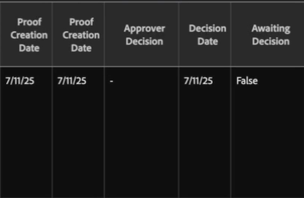

# 「核准者決定」在校訂核准報告中顯示連字型大小

## 問題

在「校訂核准報告」中，收件者的「核准者決定」欄位會顯示連字型大小(-)，即使「決定日期」欄位顯示日期且「等待決定」為False。

## 原因

「核准者決定」欄位中的連字型大小表示收件者不再擔任校訂的決策角色。 發生下列情況時：

* 收件者已新增至校訂、做出決定，且稍後從工作流程中移除。 如果收件者修訂校訂，則校訂系統會將造訪記錄為決定變更。 由於收件者不再是核准者，因此系統會將新決定記錄為連字型大小。
* 收件者的校訂角色已變更為不包含核准許可權的校訂角色，例如檢閱者。 如需每個角色在校訂上可採取之動作的詳細資訊，請參閱[校訂角色概觀](../../../review-and-approve-work/proofing/proofing-overview/proof-roles.md)。
* 收件者的校訂許可權設定檔在做出決定後已降級。

## 這對您的報告有何意義

連字型大小是有意為之。 它可告訴您系統未等待收件者核准校訂，並且收件者不再擁有校訂的決策角色。

「決定日期」欄位仍會顯示收件者最近一次決定活動的日期，但收件者的決定不再計入報告中。

如需有關建立及使用校訂核准報告的資訊，請參閱[使用校訂核准報告](../../../review-and-approve-work/proofing/managing-proofs-within-workfront/proof-approval-report.md)。

