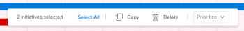

# 複製[!DNL Scenario Planner]中的方案

<!--Audited: 07/2024-->

您可以複製現有方案來建立方案。 您可以複製您建立之計畫或某人員與您共用之計畫上的方案。

## 存取需求

+++ 展開以檢視本文中功能的存取需求。

<table style="table-layout:auto"> 
 <col> 
 <col> 
 <tbody> 
  <tr> 
   <td> 
[!DNL Adobe Workfront] 計畫*
 </td> 
   <td> 
目前： [！UICONTROL Business]或更高版本

   
新增：Ultimate 

   </td> 
  </tr> 
  <tr> 
   <td> 
[!DNL Adobe Workfront] 授權*
 </td> 
   <td> 
新增：淺色或更高
 
   
目前： [！UICONTROL Review]或以上
 </td> 
  </tr> 
  <tr> 
   <td>產品* </td> 
   <td> 
   
針對目前的Workfront計畫： 

   
您必須為[!DNL Adobe Workfront Scenario Planner]購買額外的授權，才能存取本文所述的功能。
 
如需[!DNL Workfront Scenario Planner]的存取與許可權相關資訊，請參閱<a href="../scenario-planner/access-needed-to-use-sp.md" class="MCXref xref">使用[!DNL Scenario Planner]</a>所需的存取權。 
 </td> 
  </tr> 
  <tr data-mc-conditions=""> 
   <td>存取層級 </td> 
   <td> 
[！UICONTROL Edit]對的存取權 [!DNL Scenario Planner]
 </td> 
  </tr> 
  <tr data-mc-conditions=""> 
   <td> 
物件許可權 
 </td> 
   <td> 
[！UICONTROL Manage]計畫的許可權
 
如需有關請求對計畫的額外存取權的資訊，請參閱<a href="../scenario-planner/request-access-to-plan.md" class="MCXref xref">在[!DNL Scenario Planner]</a>中請求對計畫的存取權。
 </td> 
  </tr> 
 </tbody> 
</table>

*如需詳細資訊，請參閱[Workfront檔案的存取需求](/help/quicksilver/administration-and-setup/add-users/access-levels-and-object-permissions/access-level-requirements-in-documentation.md)。

+++

## 複製方案

複製行動方案時，請考量下列事項：

* 複製方案會將副本放置在與原始方案相同的計畫上。
* 複製方案會將下列資訊從原始方案複製並新增至新方案：

   * [!UICONTROL 期間]
   * [!UICONTROL 職位角色]
   * [!UICONTROL 人員]和[!UICONTROL 固定成本]
   * [!UICONTROL 計畫收益]

* 如果原始方案中存在下列資訊，則複製方案可修改計畫的下列資訊：

   * 所需的工作角色數量
   * [!UICONTROL 成本]
   * [!UICONTROL 計畫使用率]
   * 工作角色使用率
   * [!UICONTROL 淨值]

* 複製透過匯入專案建立或已發佈至專案至少一次的方案具有下列含義：

   * 不會複製與方案相關聯的專案。
   * 它不會將複製的方案連線到專案。
   * 對於已發佈至少一次的專案，它不會修改專案上的[!DNL Scenario Planner]區段。

  如需將方案發佈至專案的資訊，請參閱[在 [!DNL Scenario Planner]](../scenario-planner/publish-scenarios-update-projects.md)中發佈方案以更新或建立專案。

  如需透過匯入專案來建立方案的相關資訊，請參閱[將專案匯入 [!DNL Scenario Planner]](../scenario-planner/import-projects-to-plans.md)中的計畫。

## 複製方案

{{step1-to-scenario-planner}}

計劃清單隨即顯示。

1. 按一下計畫的名稱以開啟，然後找到您要複製的方案。
1. 選取您要複製的一或多個方案左側的方塊，然後在計畫底部出現的功能表中按一下&#x200B;**[!UICONTROL 複製]**。

   

   [!DNL Workfront]會立即複製行動方案，並將其放置在最後一個選取的行動方案下。

   所複製方案的名稱是] `<Name of original initiative>`*的*[!UICONTROL &#x200B;副本。

   >[!NOTE]
   >
   >根據您插入新方案的位置，現有方案的數量可能會變更。

1. 更新所複製方案的名稱。

   >[!TIP]
   >
   >建議您一律更新行動方案的名稱，以免再次複製行動方案時產生混淆。

1. （選用）更新新建立方案的優先順序。

   如需排定方案優先順序的資訊，請參閱[更新 [!DNL Scenario Planner]](../scenario-planner/prioritize-initiatives.md)中的方案優先順序。

1. 按一下&#x200B;**[!UICONTROL 儲存計畫]**&#x200B;以儲存變更。
