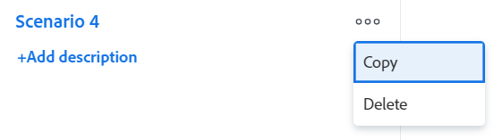

# 在 [!DNL Scenario Planner]

在規劃公司的長期戰略時，您可能一開始就沒有或想過很多資訊。 制定最終策略需要時間和實驗，而您的利害關係人可以接受。 進行「假設」分析，為您的計畫建立多個方案，可幫助您準確預測和評估潛在情況，並最終制定最佳的可能計畫。

## 存取需求

您必須具備下列條件：

<table style="table-layout:auto"> 
 <col> 
 <col> 
 <tbody> 
  <tr> 
   <td> 
[!DNL Adobe Workfront]<b> 計劃*</b> 
 </td> 
   <td>[!UICONTROL Business]或更高版本</td> 
  </tr> 
  <tr> 
   <td> 
[!DNL Adobe Workfront]<b> 授權*</b> 
 </td> 
   <td> 
[!UICONTROL Review]或更高版本
 </td> 
  </tr> 
  <tr> 
   <td><b>產品</b> </td> 
   <td> 
您必須為 [!DNL Adobe Workfront Scenario Planner] 存取本文所述功能。
 
如需有關取得 [!DNL Workfront Scenario Planner]，請參閱 <a href="../scenario-planner/access-needed-to-use-sp.md" class="MCXref xref">使用 [!DNL Scenario Planner]</a>. 
 </td> 
  </tr> 
  <tr data-mc-conditions=""> 
   <td><strong>訪問級別配置*</strong> </td> 
   <td> 
編輯 [!DNL Scenario Planner]
 
注意：如果您仍無法存取，請詢問您的 [!DNL Workfront] 管理員。 如需Workfront管理員如何變更您的存取層級的詳細資訊，請參閱 <a href="../administration-and-setup/add-users/configure-and-grant-access/create-modify-access-levels.md" class="MCXref xref">建立或修改自訂存取層級</a>.
 </td> 
  </tr> 
  <tr data-mc-conditions=""> 
   <td> 
<strong>物件權限</strong> 
 </td> 
   <td> 
計畫的[!UICONTROL管理]權限
 
有關請求對計畫進行額外訪問的資訊，請參閱 <a href="../scenario-planner/request-access-to-plan.md" class="MCXref xref">在 [!DNL Scenario Planner]</a>.
 </td> 
  </tr> 
 </tbody> 
</table>

&#42;若要了解您擁有的計畫、授權類型或存取權，請聯絡您的 [!DNL Workfront] 管理員。

## 建立藍本

方案是計畫的副本。 您可以建立所需的方案數。 不過，我們建議您將案例數保持在最低，以便輕鬆比較。

1. 按一下 **[!UICONTROL 主菜單]** 圖示 ，然後按一下 [!UICONTROL 藍本].

1. 建立計畫。

   如需建立計畫的相關資訊，請參閱 [在 [!DNL Scenario Planner]](../scenario-planner/create-and-edit-plans.md).

   您建立的第一個計畫會自動儲存為「[!UICONTROL 初始方案].&quot;

1. 按一下現有案例旁的向下箭頭，然後按一下 **[!UICONTROL 複製]** 表徵圖。

   

   這會建立與複製的案例資訊相同的新案例。 它會自動命名為「[!UICONTROL 方案2]「如果這是你計畫的第二種情況，」[!UICONTROL 方案3]「如果是第三個，以此類推。 無法更名方案。

   <!--
   <MadCap:conditionalText data-mc-conditions="QuicksilverOrClassic.Draft mode">
   (NOTE:this might change)
   </MadCap:conditionalText>
   -->

1. 以下列任何方式更新您的新案例：

   * 建立、更新或刪除方案

      >[!TIP]
      >
      >刪除方案中的方案時，只會從選定的方案中刪除方案，而不會從所有方案中刪除。

      有關建立方案的資訊，請參閱 [在 [!DNL Scenario Planner]](../scenario-planner/create-and-edit-initiatives.md).

   * 更新計畫的優先順序
   * 調整人員或預算資訊
   * 在您的方案中審核並調整計畫衝突

      有關解決衝突的資訊，請參見 [解決 [!DNL Scenario Planner]](../scenario-planner/resolve-conflicts-in-sp.md).

1. 按一下 **[!UICONTROL 保存計畫]** 來儲存變更。

## 比較情境

建立方案後，您可以比較它們，為組織尋找最佳方案。

1. 轉到要比較方案的計畫。
1. 按一下 **[!UICONTROL 比較方案]**. 藍本比較頁面隨即顯示。

   計畫的所有現有方案都以並排卡格式顯示。 初始案例一律會先列出，且為靜態。

   

1. （選用）捲動至右側以檢視所有案例卡片。

   藍本卡片上會顯示下列資訊：

   <table style="table-layout:auto"> 
    <col> 
    <col> 
    <tbody> 
     <tr> 
      <td>方案名稱</td> 
      <td> 
由Workfront自動產生的名稱，無法編輯。 例如，「[!UICONTROL初始方案]」、「[!UICONTROL方案2]」等。 
 </td> 
     </tr> 
     <tr> 
      <td>方案說明</td> 
      <td>手動輸入項目，您可在其中說明方案的詳細資訊。 </td> 
     </tr> 
     <tr> 
      <td>可用作業角色</td> 
      <td>計畫期間計畫預算中可用的職務職責數。 </td> 
     </tr> 
     <tr> 
      <td>必要職位角色</td> 
      <td>根據您的計畫需要的工作角色數。 </td> 
     </tr> 
     <tr> 
      <td>預算</td> 
      <td>在此方案中為計畫定義的總預算。 有關計畫的預算資訊，請參閱 <a href="../scenario-planner/plans-overview.md" class="MCXref xref">中的計畫概覽 [!DNL Scenario Planner]</a>. </td> 
     </tr> 
     <tr> 
      <td>成本</td> 
      <td>與方案上的舉措相關的成本。 有關成本的資訊，請參閱 <a href="../scenario-planner/initiatives-overview.md" class="MCXref xref">計畫概覽 [!DNL Scenario Planner]</a>. </td> 
     </tr> 
     <tr> 
      <td>使用情況</td> 
      <td>此方案中計畫的[!UICONTROL預算利用率]百分比。 有關[!UICONTROL預算利用率]百分比的資訊，請參見 <a href="../scenario-planner/plans-overview.md" class="MCXref xref">中的計畫概覽 [!DNL Scenario Planner]</a>. </td> 
     </tr> 
     <tr> 
      <td>淨值</td> 
      <td>此案例中計畫的[!UICONTROL淨值]。 有關計畫的[!UICONTROL淨值]的資訊，請參見 <a href="../scenario-planner/plans-overview.md" class="MCXref xref">中的計畫概覽 [!DNL Scenario Planner]</a>. </td> 
     </tr> 
     <tr> 
      <td>方案</td> 
      <td>此情境中計畫的計畫數。</td> 
     </tr> 
     <tr> 
      <td>衝突</td> 
      <td>在此方案的計畫中顯示任何類型衝突的方案數。 有關方案衝突的資訊，請參見 <a href="../scenario-planner/resolve-conflicts-in-sp.md" class="MCXref xref">解決 [!DNL Scenario Planner]</a>. </td> 
     </tr> 
    </tbody> 
   </table>

   >[!NOTE]
   >
   >當初始藍本和其他藍本之間的資訊不同時，與初始藍本相比，在已更改的值旁會顯示向上或向下箭頭，以指示該值的增加或減少。
   >
   >
   >
   >
   >例如，預算、工作角色數、方案數可能從一個方案更改為另一個方案。

1. 按一下藍本的名稱以存取它並進行變更。

   如需詳細資訊，請參閱 [建立藍本](#create-scenarios) 一節。

1. 按一下 **[!UICONTROL 新增說明]** 為方案新增說明

   或

   按一下說明欄位以更新，然後按一下畫面上的任意位置以儲存變更。

1. （選用）按一下 **[!UICONTROL 更多]** 功能表  to **[!UICONTROL 複製]** 或 **[!UICONTROL 刪除]** 案例。

   

   複製案例時，該案例會自動顯示在卡片頁面上，並根據此模式重新命名：&quot;[!UICONTROL 藍本] `<next number in order>`.&quot;

1. （條件性）如果您按一下 **[!UICONTROL 刪除]**，按一下 **[!UICONTROL 是，刪除它]** 確認。

   無法恢復已刪除的方案。

   有關刪除方案的資訊，請參閱 [刪除 [!DNL Scenario Planner]](../scenario-planner/delete-plans.md).

1. 按一下 **[!UICONTROL 保存計畫]** 以保存您的方案和計畫。
