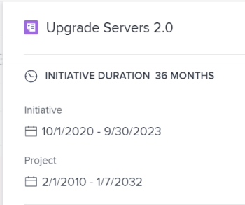

# 將專案匯入[!DNL Scenario Planner]中的計畫

您可以將現有專案匯入計畫。 匯入的專案會轉換為方案，您可以在計畫中管理它們，就像管理新方案一樣。 原始專案仍會連結至新方案。

<!--

(NOTE: add information about what happens when you import projects and where the info from projects show up;

- the hours/ FTE come from WorkPerDay

- if a task has a Duration of 0, the FTE should be 0 for that asignee but it should still come across) 

-->

## 存取需求

您必須具備下列條件：

<table style="table-layout:auto"> 
 <col> 
 <col> 
 <tbody> 
  <tr> 
   <td> 
[!DNL Adobe Workfront]<b>計畫*</b> 
 </td> 
   <td>[！UICONTROL Business]或更高版本</td> 
  </tr> 
  <tr> 
   <td> 
[!DNL Adobe Workfront]<b>授權*</b> 
 </td> 
   <td> 
[！UICONTROL Review]或更高版本
 </td> 
  </tr> 
  <tr> 
   <td><b>產品</b> </td> 
   <td> 
您必須為[!DNL Adobe Workfront Scenario Planner]購買額外的授權，才能存取本文所述的功能。
 
如需有關取得[!DNL Workfront Scenario Planner]的資訊，請參閱<a href="../scenario-planner/access-needed-to-use-sp.md" class="MCXref xref">使用[!DNL Scenario Planner]</a>所需的存取權。 
 </td> 
  </tr> 
  <tr data-mc-conditions=""> 
   <td><strong>存取層級設定*</strong> </td> 
   <td> 
[！UICONTROL Edit]或以上版本的 [!DNL Scenario Planner]
 
注意：如果您還是沒有存取權，請詢問您的[!DNL Workfront]管理員是否對您的存取層級設定了其他限制。 如需[!DNL Workfront]管理員如何變更您的存取層級的詳細資訊，請參閱<a href="../administration-and-setup/add-users/configure-and-grant-access/create-modify-access-levels.md" class="MCXref xref">建立或修改自訂存取層級</a>。
 </td> 
  </tr> 
  <tr data-mc-conditions=""> 
   <td> 
<strong>物件許可權</strong> 
 </td> 
   <td> 
[！UICONTROL Manage]計畫的許可權
 
如需請求對計畫的額外存取權的相關資訊，請參閱<a href="../scenario-planner/request-access-to-plan.md" class="MCXref xref">在Scenario Planner</a>中請求對計畫的存取權。
 </td> 
  </tr> 
 </tbody> 
</table>

&#42;若要瞭解您擁有的計畫、授權型別或存取權，請連絡您的[!DNL Workfront]管理員。

## 將專案匯入計畫中作為新方案的考量事項

* 您必須先建立專案，才能將專案作為新方案匯入計畫。

  <!--
  
(NOTE: no caveats for project statuses yet, mentioned in the import steps as a tip) 

  -->

* 您必須擁有專案至少[!UICONTROL 檢視]許可權，才能將其匯入計畫中作為新方案。
* 您可以將相同專案匯入多個計畫。
* 您要匯入的專案必須包含計畫時間範圍內的日期。 您無法匯入計劃開始日期為[!UICONTROL 計畫完成日期]或計畫結束日期為[!UICONTROL 計劃開始日期]的專案。
* 您無法一次匯入超過100個專案。
* 有些專案資訊也會匯入計畫，成為方案資訊。 如需有關哪些專案資訊已匯入計畫並成為方案資訊的資訊，請參閱本文章中匯入計畫](#project-information-imported-into-the-plan)的[專案資訊。
* 連結專案上發生的變更不會影響計畫上的方案。
* 發生在計畫上方案上的變更不會自動影響連結的專案。方案變更只有在您從計畫發佈方案時才會影響連結的專案。 如需有關發佈方案如何影響連結專案的資訊，請參閱[在 [!DNL Scenario Planner]](../scenario-planner/publish-scenarios-update-projects.md)中發佈方案以更新或建立專案。
* 刪除透過匯入專案建立的方案不會刪除專案。
* 刪除連結至方案的專案不會刪除方案。

## 專案資訊已匯入計畫 {#project-information-imported-into-the-plan}

將專案匯入計畫時，也會將某些專案資訊匯入計畫，使其成為方案資訊。 下表顯示將專案匯入計畫時，哪些專案資訊會成為方案資訊：

<!--

(NOTE: add what happens if you import a 5 year project to a 1 year plan - how does this display?) 

-->

<table style="table-layout:auto"> 
 <col> 
 <col> 
 <tbody> 
  <tr> 
   <td>專案資訊</td> 
   <td>方案資訊 </td> 
  </tr> 
  <tr> 
   <td>專案名稱</td> 
   <td>方案名稱</td> 
  </tr> 
  <tr> 
   <td>專案計畫日期</td> 
   <td> 
行動方案開始和結束月份。
 
如果專案在月中開始或結束，匯入的日期會延長到涵蓋計畫中的整個月。 例如，如果專案計畫日期為2020年3月20日至5月5日，則匯入方案的日期為2020年3月至5月。
 
如果「計劃開始日期」或「完成日期」超過計畫的期間，則會有視覺化指示表示匯入的方案在計畫之前或之後開始。 
 </td> 
  </tr> 
  <tr> 
   <td>指派給任務和問題的職位角色</td> 
   <td> 
方案工作角色。 
 
注意：   
如果使用者在專案生命週期中變更角色，則匯入的角色取決於您匯入專案時指派的狀態。 存在下列情況：
 
     <ul> 
      <li> 
如果指派給任務或問題的使用者在將其指派標示為[！UICONTROL完成]之後變更了角色，則[!DNL Workfront]會將該使用者在將其指派標示為[！UICONTROL完成]之前所履行的角色匯入行動方案。
 </li> 
      <li> 
如果指派給任務或問題的使用者在專案存留期間變更了角色，但他們在任務或問題上的指派未在匯入專案時標籤為[！UICONTROL完成]，則[!DNL Workfront]僅匯入指派使用者的目前角色。 
 </li> 
     </ul> 
如需指派狀態的相關資訊，請參閱Adobe[!DNL Workfront]術語的<a href="../workfront-basics/navigate-workfront/workfront-navigation/workfront-terminology-glossary.md" class="MCXref xref">辭彙表</a>中的「指派狀態」。 
 
 </td> 
  </tr> 
  <tr> 
   <td>與指派給任務或問題的工作角色相關的專案[！UICONTROL計畫時數]</td> 
   <td> 
根據計畫是設定為使用FTE或時數，專案上任務的[！UICONTROL計畫時數]會在計畫上變成 [！UICONTROL必要的FTE] 或[！UICONTROL需要時數]。 
 
如需設定計畫以使用FTE或時數的詳細資訊，請參閱<a href="../scenario-planner/create-and-edit-plans.md" class="MCXref xref">在[!DNL Scenario Planner]</a>中建立和編輯計畫。 
 
請考量下列事項：
 
    <ul> 
     <li> 
[!DNL Workfront] 使用指派給任務和問題的工作角色，或指派給任務或問題的使用者在專案上相關聯的工作角色，並將它們作為所需工作角色轉移到新方案。 
 </li> 
     <li> 
當計畫設定為使用FTE時，與專案任務和問題上的工作角色關聯的計畫時數首先轉換為FTE。 然後會將此FTE指派給方案的工作角色。 計畫時數在[!DNL Workfront]中平均分配。 如果任務或問題跨多個月，方案期間每個月的計畫時數金額會轉換為每月FTE，並傳輸到方案的每個月。
 
Example: </b>"><b>範例： </b>例如，如果在9月將任務指派給工作角色80個計畫時數，則匯入的工作角色在9月為方案顯示0.5 FTE。 
 </li> 
     <li> 
[!DNL Workfront] 使用下列公式計算與方案關聯的「必要職務」角色的FTE：
 
<code>Required Job Role FTE (initiative) = Job Role assignment Planned Hours (</code><code>from tasks and issues on the project)/ 160</code> 
 
提示： [!DNL Scenario Planner]假設一個月有160個工作小時。
 
例如，如果專案具有1200分鐘的持續時間並且專案上的工作角色與600分鐘的規劃時數相關聯，則其FTE為0.5。匯入專案時，新建立方案上的必要工作角色FTE為方案每個月的0.5。 
 </li> 
     <li>當工作角色指派給專案上零計畫時數的任務時，方案工作角色的必要FTE預設為零。 <!--
       <MadCap:conditionalText data-mc-conditions="QuicksilverOrClassic.Draft mode">
         (NOTE: this used to be 1, not zero in Production) 
       </MadCap:conditionalText>
      --></li> 
     <li>當工作角色指派給具有零[！UICONTROL持續時間]專案上的任務時，行動方案工作角色的必要FTE 或時數預設為零，即使任務具有計畫時數。 </li> 
    </ul> </td> 
  </tr> 
 </tbody> 
</table>

## 將專案匯入計畫

>[!IMPORTANT]
>
>將專案匯入計畫後，它們就會成為計畫中的方案。 雖然這兩個專案已連結，但它們作為獨立圖元存在，更新它們時不會自動相互影響。
>
>會發生下列情況：
>
>* 將專案匯入計畫後，專案的變更絕不會影響方案。這些變更包括職位角色分配的變更。
>
>  <!--
>  
(NOTE: this might change if projects will ever affect initiatives automatically) 
>
>  -->
>
>* 只有當您發佈方案至對應的專案時，對方案所做的變更才會影響專案上[!DNL Scenario Planner]區域中的資訊。 否則，它們不會影響專案任務和問題的[!UICONTROL 計畫時數]資訊。
>
>  如需有關發佈方案如何影響連結專案的資訊，請參閱[在Scenario Planner](../scenario-planner/publish-scenarios-update-projects.md)中發佈方案以更新或建立專案。
>

1. 按一下[!DNL Workfront]右上角的&#x200B;**[!UICONTROL 主要功能表]** ，然後按一下[!DNL Scenarios]以存取[!DNL Scenario Planner]。

1. 按一下您要匯入專案之計畫的名稱。
1. 按一下&#x200B;**[!UICONTROL 新方案]**，然後按一下&#x200B;**[!UICONTROL 匯入專案]**。

   [!UICONTROL 匯入專案]方塊隨即顯示。 日期包含在計畫時間範圍內的專案會顯示在清單中。

   

   >[!TIP]
   >
   >任何狀態的專案都會顯示在清單中。

   <!--
   
(NOTE: the status of the projects in the import projects UI might change; right now it's ALL statuses)

   -->

1. （選擇性）按一下&#x200B;**[!UICONTROL 篩選圖示]** 並從清單中選取可用的篩選，以減少清單上的專案數量。 依預設，專案清單是使用者目前選取的專案篩選器在專案清單中篩選。

1. （選擇性）按一下&#x200B;**[!UICONTROL 搜尋圖示]** ，然後新增顯示在熒幕上任何欄位的關鍵字。 包含搜尋字詞的專案會自動顯示在清單中，且所有專案都會隱藏。

1. （視條件而定）按一下&#x200B;**[!UICONTROL X圖示]**&#x200B;以移除搜尋並顯示所有專案。
1. 選取最多100個專案，然後按一下&#x200B;**[!UICONTROL 匯入]**。

   專案會匯入為新方案。

   請注意下列事項：

   * 方案名稱的右側會顯示專案圖示。
   * 如果專案時間表超過計畫的持續時間，方案列會在左側（當「開始日期」早於計畫日期時）或右側（當「結束日期」晚於計畫日期時）以尖角邊界結束。

     

   * 月數和職位角色已更新以符合專案的月數和職位角色。

   >[!TIP]
   >
   >與工作角色相關的成本會在方案層級更新，且不會從專案匯入。

1. 按一下代表新方案的列，開啟右側的方案詳細資訊面板。

   

   在&#x200B;**[!UICONTROL 方案期間]**&#x200B;區域中，檢閱下列資訊：

   <table style="table-layout:auto"> 
    <col> 
    <col> 
    <tbody> 
     <tr> 
      <td role="rowheader">[！UICONTROL方案期間]</td> 
      <td>這是行動方案的持續時間（月數）。 </td> 
     </tr> 
     <tr> 
      <td role="rowheader">[！UICONTROL方案]</td> 
      <td>方案的開始和結束日期。 </td> 
     </tr> 
     <tr> 
      <td role="rowheader">[！UICONTROL專案]</td> 
      <td> 
連結專案的[！UICONTROL計劃開始]和[！UICONTROL完成日期]。
 
提示：如果[！UICONTROL專案]資訊遺失，專案就會被刪除。
 </td> 
     </tr> 
    </tbody> 
   </table>

1. 編輯方案名稱。 依預設，其會符合專案名稱。
1. （可選）執行下列任一項作業：

   * 更新&#x200B;**[!UICONTROL 必要工作角色]**&#x200B;區段中的工作角色
   * 更新&#x200B;**[!UICONTROL 成本]**&#x200B;區段中的&#x200B;**[!UICONTROL 固定成本]**

   * 按一下&#x200B;**[!UICONTROL 更新可用的工作角色]**&#x200B;或&#x200B;**[!UICONTROL 更新可用的預算]**，以解決新方案與計畫上的其他方案之間的衝突。

1. （視條件而定）按一下&#x200B;**[!UICONTROL 套用]**，將變更儲存至您的方案。
1. 按一下&#x200B;**[!UICONTROL 儲存計畫]**，將變更儲存至您的計畫。
1. （可選）若要將您對方案所做的變更更新回其匯入來源專案，請從計畫發佈專案。 如需有關發佈計畫的資訊，請參閱[在 [!DNL Scenario Planner]](../scenario-planner/publish-scenarios-update-projects.md)中發佈方案以更新或建立專案。
1. （選用）按一下專案圖示以存取連結的專案。

   
