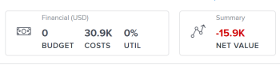

# 中的計畫概覽 [!DNL Scenario Planner]

此 [!DNL Scenario Planner] 除了 [!DNL Adobe Workfront] 授權。 如需 [!DNL Workfront Scenario Planner]，請參閱 [此 [!DNL Scenario Planner] 概述](../scenario-planner/scenario-planner-overview.md).

身為業務經理，您可以使用 [!DNL Adobe Workfront Scenario Planner] 概述貴組織的近期和長期未來戰略，概述其一年、三年或五年計畫。

## 存取需求

若要使用 [!DNL Adobe Workfront Scenario Planner] 您必須具備下列存取權：

<table style="table-layout:auto"> 
 <col> 
 <col> 
 <tbody> 
  <tr> 
   <td role="rowheader"> 
<a href="https://www.workfront.com/plans" target="_blank">[!DNL Adobe Workfront] 計劃</a>*
 </td> 
   <td>[!UICONTROL Business]或更高版本</td> 
  </tr> 
  <tr> 
   <td role="rowheader"> 
許可證類型*
 </td> 
   <td> 
[!UICONTROL Review]或更高版本。 如需詳細資訊，請參閱 <a href="../administration-and-setup/add-users/access-levels-and-object-permissions/wf-licenses.md" class="MCXref xref">[!DNL Adobe Workfront] 授權概述</a>.
 </td> 
  </tr> 
  <tr> 
   <td role="rowheader">產品</td> 
   <td> 
您必須為 [!DNL Adobe Workfront Scenario Planner] 存取本文所述功能。
 
如需有關取得 [!DNL Workfront Scenario Planner]，請參閱 <a href="../scenario-planner/access-needed-to-use-sp.md" class="MCXref xref">使用 [!DNL Scenario Planner]</a>. 
 </td> 
  </tr> 
  <tr data-mc-conditions=""> 
   <td role="rowheader">存取層級*</td> 
   <td> 
[!UICONTROL View]或更高版本對 [!DNL Scenario Planner]
 
注意：如果您仍無權存取，請洽詢您的Workfront管理員，他們是否在您的存取層級設定其他限制。 如需Workfront管理員如何變更您的存取層級的詳細資訊，請參閱 <a href="../administration-and-setup/add-users/configure-and-grant-access/create-modify-access-levels.md" class="MCXref xref">建立或修改自訂存取層級</a>.
 </td> 
  </tr> 
  <tr data-mc-conditions=""> 
   <td role="rowheader"> 
物件權限
 </td> 
   <td> 
計畫的[!UICONTROL View]權限或更高版本<!--
      <MadCap:conditionalText data-mc-conditions="QuicksilverOrClassic.Draft mode">
        (NOTE: this might change if they have permissions for initiatives/ scenarios, etc) 
      </MadCap:conditionalText>
     -->
 
有關請求對計畫進行額外訪問的資訊，請參閱 <a href="../scenario-planner/request-access-to-plan.md" class="MCXref xref">在 [!DNL Scenario Planner]</a>.
 </td> 
  </tr> 
 </tbody> 
</table>

*若要了解您擁有的計畫、授權類型或存取權，請聯絡您的 [!DNL Workfront] 管理員。

## 計畫概觀

<!--

(NOTE: add information about utilization percentage for job roles - per this story?? - https://hub.workfront.com/task/5eb0784900083e1f2cabb60d6e0d04d3/overview)

-->

您可以識別每個高階組織結果，並將其新增為 [!DNL Workfront Scenario Planner]. 計畫是 [!DNL Scenario Planner]. 為了更方便地實現計畫，您可以將計劃分為幾個計畫，以指明各個組織單位在完成計畫時需要採取哪些步驟。

然後，您可以將活動與實際項目聯繫起來，以指明實際工作因素如何影響到實際完成計畫。 本文提供有關計畫的一般資訊。 有關計畫的資訊，請參閱 [計畫概覽 [!DNL Scenario Planner]](../scenario-planner/initiatives-overview.md).

您可以定義完成在計畫上確定的工作所需的人工和財務資源。 您還可以查看計畫中的計畫所需的人工和財務資源，以便完成這些計畫。

您可以估計並複核每個計畫的以下資訊：

* 估計可用於執行計畫的任務角色的類型和數量。
* 估計貴公司完成計畫所需的預算。
* 根據與方案關聯的所需任務角色，複查每個任務角色的利用率百分比。
* 根據與計畫相關的成本複核計畫預算的利用率百分比。
* 在任何指定時間點複查計畫的淨值。
* 當您選擇不同的方案時，計畫層資訊會更改。 每個方案都有不同的預算和人員資訊。

有關建立計畫的資訊，請參閱文章 [在 [!DNL Scenario Planner]](../scenario-planner/create-and-edit-plans.md).

如需建立藍本的詳細資訊，請參閱 [在 [!DNL Scenario Planner]](../scenario-planner/create-and-compare-scenarios-for-a-plan.md).

## 計畫的考量事項

建立計畫時，請考慮下列事項：

* 您可以為團隊、整個部門，甚至整個公司建立計畫。 計畫是大型規劃單位，概括了公司的高層戰略。
* 最短的計畫可以有1年的期限。 最長的計畫可以有5年的期限。
* 你不能對計畫做實際工作。 您可以粗略估計您是否擁有開始計畫工作所需的資源和預算。 例如，如果貴公司想在新位置擴展並購買新辦公室，則首先可以在高層管理層的計畫中列出完成這一任務所需的步驟。
* 您可以建立同一計畫的多個方案。 當原始計畫有太多衝突的計畫時，您將希望建立幾個方案，在這些方案中您可以編輯計畫或預算和成本，以了解完成計畫的理想情況。 當計畫在同一時間範圍內嘗試使用相同的資源時，它們可能會相互衝突。 然後，您可以比較情況，以了解哪些情況最合理，以及貴公司應採用哪些情況，然後才開始添加實際工作以完成此工作。 如需建立藍本的詳細資訊，請參閱文章 [在 [!DNL Scenario Planner]](../scenario-planner/create-and-compare-scenarios-for-a-plan.md).
* 您可以向計畫添加多個計畫，以指明較小的規劃單元將如何幫助完成計畫。 例如，當您計畫擴展到特定市場時，您可以在部門級別實施多項計畫，最終有助於實現組織各級的擴展。 有關建立方案的資訊，請參閱文章 [在 [!DNL Scenario Planner]](../scenario-planner/create-and-edit-initiatives.md).
* 建立計畫時，您是唯一可以檢視計畫的人。 您必須與其他使用者一起建立計畫，如果他們至少擁有 [!DNL Scenario Planner] 在其存取層級。

## 計畫的職務職責資訊

您可以複查計畫的職務職責一般資訊，以指明計畫可用的職務職責數量以及完成計畫所需的職務職責數量。 您可以在 [!UICONTROL 作業角色] 框中。

您可以在作業角色方塊中檢視下列項目：

| 信息 | 說明 |
|---|---|
| FTE/小時指標 | ([!UICONTROL FTE])或([!UICONTROL 小時])「 」旁的指標[!UICONTROL 工作角色]&quot;標題指示計畫是設定為使用FTE還是建立時小時。 計畫、所有方案和計畫都使用此單元。 |
| [!UICONTROL 可用] | 當前方案可用的職務角色FTE或小時數。 |
| 必要 | 當前方案中所有計畫所需的工作角色FTE或小時數，以便完成這些任務。 |

有關訪問計畫和查看有關作業角色的詳細資訊的資訊，請參閱 [在 [!DNL Scenario Planner]](../scenario-planner/create-and-edit-plans.md).

## 計畫的財務資訊

您可以複核有關計畫的財務資訊，特別是計畫預算、如何使用該預算以及計畫的淨值。 計畫的淨值以其計畫的淨值為基礎。 您可以在 [!UICONTROL 財務] 和 [!UICONTROL 摘要] 框。

您可以在 [!UICONTROL 財務] 和 [!UICONTROL 摘要] 框中，請按一下：

<table style="table-layout:auto"> 
 <col> 
 <col> 
 <tbody> 
  <tr> 
   <td role="rowheader"> 
[!UICONTROL預算] 
 
 
 </td> 
   <td>這是貴公司決定可用於執行計畫的金額。 Workfront在計畫期間內平均分配每月的預算。 預算通常設定為一年，但也可設定為3或5年期間。 「財務」框標題左側括弧中的貨幣表示系統的貨幣。 </td> 
  </tr> 
  <tr> 
   <td role="rowheader">[!UICONTROL成本]</td> 
   <td> 
這是計畫中所有舉措的總費用。 Workfront使用下列公式計算計畫的成本：
 
<code>Plan Costs = SUM(Initiative Costs)</code> 
 
有關計畫成本計算方式的資訊，請參閱 <a href="../scenario-planner/create-and-edit-initiatives.md" class="MCXref xref">在 [!DNL Scenario Planner]</a>. 
 </td> 
  </tr> 
  <tr> 
   <td role="rowheader">UTIL（預算利用率百分比）</td> 
   <td> 
這是與計畫關聯的成本與為計畫定義的預算之間的計算百分比。 
 
[!DNL Workfront] 使用以下公式計算計畫的預算利用率百分比： 
 
<code>Utilization percentage = (Plan Costs* 100))/ Plan Budget</code> 
 
成本按下列公式計算：
 
<code>Plan Costs = SUM(Initiatives People Costs, Initiatives Fixed Costs)</code> 
 
提示：利用率百分比四捨五入，小數點為一。 
 </td> 
  </tr> 
  <tr> 
   <td role="rowheader"> 
[!UICONTROL淨值]區域 在[!UICONTROL摘要]框中
 
 
 </td> 
   <td> 
這是計畫中所有計畫的所有淨值的計算。 
 
Workfront使用下列公式計算計畫的淨值： 
 
<code>Plan Net Value = SUM(Initiative Planned Benefit - People Costs)</code> 
 
或
 
<code>Plan Net Value = SUM(Initiative Net Value)</code> 
 
有關計畫淨值的資訊，請參閱文章 <a href="../scenario-planner/initiatives-overview.md" class="MCXref xref">計畫概覽 [!DNL Scenario Planner]</a>.
 </td> 
  </tr> 
 </tbody> 
</table>

有關訪問計畫和查看計畫詳細財務資訊的資訊，請參閱 [在 [!DNL Scenario Planner]](../scenario-planner/create-and-edit-plans.md).

