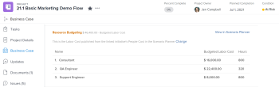

# 透過在[!DNL Scenario Planner]中發佈方案來更新或建立專案

從[!DNL Adobe Workfront Scenario Planner]發佈情境會完成下列作業：

* 從情境上的方案建立專案，並將它們連結在一起。
* 使用已連結方案中的資訊，更新已連結至情境上方案的專案。 當您將專案匯入計畫時，專案也可以連結到方案。 如需詳細資訊，請參閱[將專案匯入 [!DNL Scenario Planner]](../scenario-planner/import-projects-to-plans.md)中的計畫

## 存取需求

+++ 展開以檢視本文中功能的存取需求。 

<table style="table-layout:auto"> 
 <col> 
 <col> 
 <tbody> 
  <tr> 
   <td> 
[!DNL Adobe Workfront] 封裝
 </td> 
   <td> 
   
Workfront Ultimate

<b>附註</b>

如果您有不同的Workfront套件，請洽詢您的Workfront代表。

   </td> 
  </tr> 
  <tr> 
   <td> 
[!DNL Adobe Workfront] 授權
 </td> 
   <td> 
[!UICONTROL Light]或更高
 
   
[!UICONTROL Review]或更高版本
 </td> 
  </tr> 
    <tr> 
   <td>存取層級設定</td> 
   <td> 
[!DNL Scenario Planner]與&lbrack;！UICONTROL專案的[!UICONTROL Edit]存取權
</td> 
  </tr> 
  <tr> 
   <td> 
物件許可權 
 </td> 
   <td> <ul> 
     <li>計畫的[!UICONTROL Manage]許可權 </li> 
     <li>已發佈專案的[!UICONTROL Manage]許可權</li> 
    </ul>  </td> 
  </tr> 
 </tbody> 
</table>

如需有關存取Scenario Planner的詳細資訊，請參閱[使用 [!DNL Scenario Planner]](../scenario-planner/access-needed-to-use-sp.md)所需的存取。

如需Workfront存取需求的相關資訊，請參閱[Workfront檔案的存取需求](/help/quicksilver/administration-and-setup/add-users/access-levels-and-object-permissions/access-level-requirements-in-documentation.md)。

+++

<!--Old:

<table style="table-layout:auto"> 
 <col> 
 <col> 
 <tbody> 
  <tr> 
   <td> 
[!DNL Adobe Workfront] plan*
 </td> 
   <td> <ul></li>
   <li>
New: Ultimate 
</li>
   
The Scenario Planner is not available for the new Workfront Select or Workfront Prime plans. 

   <li>
Current: [!UICONTROL Business] or higher
</ul>
   </td> 
  </tr> 
  <tr> 
   <td> 
[!DNL Adobe Workfront] license*
 </td> 
   <td> 
New: Light or higher
 
   
Current: [!UICONTROL Review] or higher
 </td> 
  </tr> 
  <tr> 
   <td>Product* </td> 
   <td> <ul><li>
For the new Workfront plans:

 Adobe Workfront</li>

   <li>
For the current Workfront plans: 

   
Adobe Workfront
 
Adobe Workfront Scenario Planner
</li></ul>
   
   
For more information, see <a href="../scenario-planner/access-needed-to-use-sp.md" class="MCXref xref">Access needed to use the [!DNL Scenario Planner]</a>. 
 </td> 
  </tr> 
  <tr data-mc-conditions=""> 
   <td>Access level </td> 
   <td> 
[!UICONTROL Edit] access for the [!DNL Scenario Planner] and [!UICONTROL Projects]
</td> 
  </tr> 
  <tr data-mc-conditions=""> 
   <td> 
Object permissions 
 </td> 
   <td>  <ul> 
     <li>[!UICONTROL Manage] permissions for the plan </li> 
     <li>[!UICONTROL Manage] permissions for published projects</li> 
    </ul> 
For information on requesting additional access to a plan, see <a href="../scenario-planner/request-access-to-plan.md" class="MCXref xref">Request access to a plan in the [!DNL Scenario Planner]</a>.
 </td> 
  </tr> 
 </tbody> 
</table>-->

## 先決條件

開始之前：

* 您必須先建立和儲存計畫，才能從中發佈方案。
* 必須在「設定」的「專案偏好設定」區域中啟用「允許使用者建立專案，而不使用範本設定」 。 如需詳細資訊，請參閱[設定全系統的專案偏好設定](/help/quicksilver/administration-and-setup/set-up-workfront/configure-system-defaults/set-project-preferences.md)。

## 將方案發佈至專案的相關考量事項

* 您只能從計畫發佈一個情境。
* 一個行動方案只能連結至一個專案。
* 當行動方案屬於不同計畫時，一個專案可連結至多個行動方案。

  >[!TIP]
  >
  >當專案存在於多個計畫中，而您從所有計畫發佈資訊至專案時，最新的發佈會覆寫專案上現有的[!DNL Scenario Planner]資訊。

* 如果透過將專案匯入計畫而在計畫上建立了方案，則發佈方案也會以方案資訊更新連結的專案。

  >[!TIP]
  >
  >您可以將相同專案匯入多個計畫。 發佈可能會覆寫連結至多個方案的專案上的方案資訊。

  如需透過匯入專案來建立方案的相關資訊，請參閱[將專案匯入 [!DNL Scenario Planner]](../scenario-planner/import-projects-to-plans.md)中的計畫。

* 對專案所做的任何變更都不會轉移到連結的方案。

## 發佈行動方案

>[!IMPORTANT]
>
>如果您對計畫上的方案進行任何變更，包括解決衝突，則必須重新發佈方案，才能在專案上顯示新資訊。 只有當您發佈對應的方案時，此資訊才會顯示在連結至方案的專案上。 如需解決方案之間衝突的資訊，請參閱[解決 [!DNL Scenario Planner]](../scenario-planner/resolve-conflicts-in-sp.md)中的方案衝突

{{step1-to-scenario-planner}}

1. （選擇性和條件式）如果您想要從現有計畫發佈，請按一下計畫右上角的&#x200B;**[!UICONTROL 篩選器]**&#x200B;圖示，並選取下列其中一個選項：

   <table style="table-layout:auto"> 
    <col> 
    <col> 
    <tbody> 
     <tr> 
      <td role="rowheader">[!UICONTROL All]</td> 
      <td>顯示您所擁有或與您共用的所有計畫。 這是預設值。 </td> 
     </tr> 
     <tr> 
      <td role="rowheader">[!UICONTROL 我的計畫]</td> 
      <td>顯示您建立的計畫。</td> 
     </tr> 
     <tr> 
      <td role="rowheader">[!UICONTROL 已共用給我]</td> 
      <td> 
顯示您未建立但與您共用的計畫。
 
重要：您必須擁有與您共用之計畫的[!UICONTROL 管理]許可權，才能發佈計畫。 
 </td> 
     </tr> 
    </tbody> 
   </table>

   

1. （選擇性）按一下&#x200B;**[!UICONTROL 搜尋]**&#x200B;圖示並開始輸入計畫的名稱，以便在清單中快速找到它。
1. （視條件而定）若要從新計畫發佈，請建立計畫。

   如需有關建立計畫的資訊，請參閱[在 [!DNL Scenario Planner]](../scenario-planner/create-and-edit-plans.md)中建立和編輯計畫。

1. （選擇性）按一下現有計畫的名稱，並為計畫建立新案例。

   如需有關為計畫建立案例的資訊，請參閱[在 [!DNL Scenario Planner]](../scenario-planner/create-and-compare-scenarios-for-a-plan.md)中建立和比較計畫案例。

1. （選用）更新現有計畫或新計畫的方案，或建立新計畫。

   如需關於建立方案的資訊，請參閱[在 [!DNL Scenario Planner]](../scenario-planner/create-and-edit-initiatives.md)中建立和編輯方案。

1. 按一下&#x200B;**[!UICONTROL 儲存計畫]**。
1. 從&#x200B;**[!UICONTROL 初始情境]**&#x200B;下拉式功能表中選取您要發佈的情境，然後按一下右上角的&#x200B;**[!UICONTROL 移至發佈]** 。

   或

   按一下「**[!UICONTROL 比較案例]**」，將游標暫留在您要發佈的案例卡片上，然後按一下「**[!UICONTROL 移至發佈]**」。

   此時會顯示[!UICONTROL 發佈方案]頁面，顯示情境中所有方案的清單。 如果先前已發佈任何方案，則專案圖示會顯示在方案的名稱之後，且清單中會填入&#x200B;**[!UICONTROL 上次發佈]**&#x200B;日期。

   >[!TIP]
   >
   >透過匯入專案所建立的方案在其名稱的右側也會顯示專案圖示

   

1. （選擇性和條件式）如果您想要從現有計畫發佈，請按一下計畫右上角的&#x200B;**[!UICONTROL 篩選器]**&#x200B;圖示，並選取下列其中一個選項：

   <table style="table-layout:auto"> 
    <col> 
    <col> 
    <tbody> 
     <tr> 
      <td role="rowheader">[!UICONTROL All]</td> 
      <td>顯示所選情境的所有方案。 </td> 
     </tr> 
     <tr> 
      <td role="rowheader">[!UICONTROL 已發佈]</td> 
      <td>顯示您或其他使用者先前發佈的方案。 </td> 
     </tr> 
     <tr> 
      <td role="rowheader">[!UICONTROL 已取消發佈]</td> 
      <td> 
顯示未發佈的方案。 
 </td> 
     </tr> 
    </tbody> 
   </table>

   

1. （選擇性）按一下&#x200B;**[!UICONTROL 搜尋]**&#x200B;圖示，然後開始輸入方案名稱以在清單中快速找到。
1. 選取一或多個要發佈的方案，並從這些方案建立或更新專案，然後按一下&#x200B;**[!UICONTROL 發佈方案]**。

   這會從每個選取的方案建立新專案，或是更新現有的連線專案（如果發佈的方案已連結至專案）。

   >[!TIP]
   >
   >新專案與已發佈方案的名稱相同。

1. （視條件而定）執行下列任一項作業：

   * 如果您已發佈一個方案，請按一下&#x200B;**[!UICONTROL 檢視關聯的專案]**&#x200B;以開啟從方案建立或更新的專案。
   * 如果您發佈多個方案，請按一下[檢視關聯的專案] **&#x200B;**&#x200B;以開啟從方案發佈的專案清單。 根據預設，[!DNL Workfront]會將[!DNL Scenario Planner]專案篩選器套用至專案清單。 最近發佈的專案會顯示在清單頂端。

     發佈行動方案後的

1. 移至下列區域以檢視專案上的方案資訊：

   * **[!UICONTROL 更新]區段**：已發佈更新以表示專案是從方案建立或更新的。 更新包含建立或更新專案的方案名稱，以及包含該方案的計畫的連結名稱。 您可以按一下更新中的計畫名稱，以在[!DNL Scenario Planner]中開啟計畫。

     

   * **[!UICONTROL 專案詳細資料]區段[!UICONTROL 的]總覽**&#x200B;區域：此區域中已建立新的[!DNL Scenario Planner]區段，其中包含連結的方案的資訊。

     專案詳細資料上的

     下列方案資訊發佈在[!DNL Scenario Planner]專案詳細資料[!UICONTROL 區段的]區域：

     <table style="table-layout:auto"> 
      <col> 
      <col> 
      <tbody> 
       <tr> 
        <td role="rowheader">[!UICONTROL 方案期間] </td> 
        <td>專案連結至方案時，對應方案的持續時間。 此欄位不可編輯。 </td> 
       </tr> 
       <tr> 
        <td role="rowheader">[!UICONTROL 上次發佈日期] </td> 
        <td>從對應方案上次發佈專案的日期。 </td> 
       </tr> 
       <tr> 
        <td role="rowheader">[!UICONTROL 方案開始日期] </td> 
        <td>當專案連結至方案時，方案開始月份的第一天。 </td> 
       </tr> 
       <tr> 
        <td role="rowheader">[!UICONTROL 方案結束日期] </td> 
        <td>專案連結至方案時，方案結束月份的最後一天。 </td> 
       </tr> 
       <tr> 
        <td role="rowheader">[!UICONTROL FTE和時數中的行動方案工作角色] </td> 
        <td> 
方案之相關職務角色及其時間配置的相關資訊。 其中包括：
 
         <ul> 
          <li>工作角色名稱</li> 
          <li>FTE數量</li> 
          <li> 
所有FTE的小時數
 
您可以使用時數或FTE來預估計畫或方案所需的工作角色數量。
 
如需詳細資訊，請參閱<a href="../scenario-planner/create-and-edit-plans.md" class="MCXref xref">在Scenario Planner</a>中建立和編輯計畫。 
 </li> 
         </ul> 
      
<b>秘訣</b>

     如果方案中每個月的工作角色數量不同，此欄位會顯示方案所需的最大角色數量。 例如，如果您在1月需要1名顧問，在2月需要2名，則欄會顯示2FTE以及所有月份2個FTE的對應時數金額。
 </td>
     </tr> 
      </tbody> 
     </table>

     >[!NOTE]
     >
     >所有擁有專案[!UICONTROL 檢視]存取權的使用者都可以在[!DNL Scenario Planner]總覽[!UICONTROL 區域中看到]區段。 您可以使用版面配置範本來控制此區域是否顯示在[!UICONTROL 詳細資料]區段中。 如果使用者沒有關聯的版面配置範本，預設會顯示此區域。
     >
     >   
     >   
     >   * 如需有關使用配置範本新增或移除[!UICONTROL 詳細資料]區段中的區域的資訊，請參閱[使用配置範本自訂[!UICONTROL 詳細資料]檢視](../administration-and-setup/customize-workfront/use-layout-templates/customize-details-view-layout-template.md)。
     >   * 如需在[!UICONTROL 專案詳細資料]的[!UICONTROL 總覽]區域中檢視資訊的詳細資訊，請參閱專案[[!UICONTROL 總覽]區域[!UICONTROL 中的]管理](../manage-work/projects/manage-projects/understand-project-overview-area.md)資訊。
     >   
     >

   * **[!UICONTROL 工作負載平衡器]或專案的工作清單中的[!UICONTROL 角色配置]面板**：除了專案上的角色配置之外，還會填入此區域中行動方案上的角色配置相關資訊。

     如需詳細資訊，請參閱[協調專案與方案之間的資源配置總覽](../scenario-planner/overview-reconcile-allocations-between-projects-initiatives.md)。

     

     對專案日期或資源所做的任何變更，都不會影響對應的方案或專案上包含方案資訊的任何區域。

   * **專案[!UICONTROL 之]商業案例[!UICONTROL 的]資源預算**&#x200B;區域：專案[!DNL Scenario Planner]商業案例[!UICONTROL 的]資源預算[!UICONTROL 區域新增了使用]資訊管理專案資源的新選項。

     如需詳細資訊，請參閱[業務案例[!UICONTROL 中使用]的 [!DNL Scenario Planner]](../manage-work/projects/define-a-business-case/budget-resources-in-business-case-use-scenario-planner.md)預算資源。

     

1. （選擇性）在您發佈情境後，檢閱[!DNL Scenario Planner]中的下列資訊：

   * 已發佈的情境會成為您從中發佈方案後的第一個情境。
   * 將情境發佈至少一次後，您就無法再從任何其他情境發佈。
   * 從情境中發佈至少一個方案後，[!UICONTROL 前往發佈]選項會從所有其他情境中移除。
   * 綠色指標會顯示在計畫中已發佈方案的專案圖示旁。

     已發佈行動方案的

   * 綠色「已發佈」指標會顯示在情境頂端和情境卡片，而情境卡片會填入「已發佈」欄位，指出情境中已發佈的行動方案數目。

     

     >[!TIP]
     >
     >如果刪除從情境方案發佈的所有專案，則會移除已發佈情境的指示。 如需詳細資訊，請參閱[刪除專案](../manage-work/projects/manage-projects/delete-projects.md)。

1. （可選）更新方案資訊並重複上述程式以重新發佈方案並更新連結專案上的方案資訊。

   如需有關編輯方案的資訊，請參閱[在 [!DNL Scenario Planner]](../scenario-planner/create-and-edit-initiatives.md)中建立和編輯方案。

