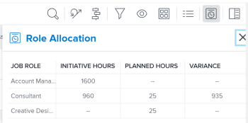

# 更新或建立專案，方法是在 [!DNL Scenario Planner]

從 [!DNL Adobe Workfront Scenario Planner] 完成下列操作：

* 從方案上的方案建立專案，並將其連結在一起。
* 使用連結計畫提供的資訊更新已與方案相關的項目。 當您將項目導入計畫時，也可以將項目連結到計畫。 如需詳細資訊，請參閱 [將專案匯入至 [!DNL Scenario Planner]](../scenario-planner/import-projects-to-plans.md)

## 存取需求

您必須具備下列條件：

<table style="table-layout:auto"> 
 <col> 
 <col> 
 <tbody> 
  <tr> 
   <td> 
[!DNL Adobe Workfront] 計劃*
 </td> 
   <td>[!UICONTROL Business]或更高版本</td> 
  </tr> 
  <tr> 
   <td> 
[!DNL Adobe Workfront] 授權*
 </td> 
   <td> 
[!UICONTROL Review]或更高版本
 </td> 
  </tr> 
  <tr> 
   <td>產品 </td> 
   <td> 
您必須為 [!DNL Adobe Workfront Scenario Planner] 存取本文所述功能。
 
如需有關取得 [!DNL Workfront Scenario Planner]，請參閱 <a href="../scenario-planner/access-needed-to-use-sp.md" class="MCXref xref">使用 [!DNL Scenario Planner]</a>. 
 </td> 
  </tr> 
  <tr data-mc-conditions=""> 
   <td> 

 
存取層級*
 </td> 
   <td> 
    <ul> 
    <li>[!UICONTROL編輯]訪問 [!DNL Scenario Planner] 和專案</li></ul>

<b>附註</b>

如果您仍無法存取，請詢問您的 [!DNL Workfront] 管理員。 若要了解 [!DNL Workfront] 管理員可以更改您的訪問級別，請參閱 <a href="../administration-and-setup/add-users/configure-and-grant-access/create-modify-access-levels.md" class="MCXref xref">建立或修改自訂存取層級</a>.
 </td>
</tr> 
  <tr data-mc-conditions=""> 
   <td> 
物件權限
 </td> 
   <td> 
    <ul> 
     <li>計畫的[!UICONTROL管理]權限 </li> 
     <li>已發佈專案的[!UICONTROL管理]權限</li> 
    </ul> 
如需要求對專案進行額外存取的詳細資訊，請參閱 <a href="../workfront-basics/grant-and-request-access-to-objects/request-access.md" class="MCXref xref">請求對對象的訪問 </a>.
 
有關請求對計畫進行額外訪問的資訊，請參閱 <a href="../scenario-planner/request-access-to-plan.md" class="MCXref xref">在 [!DNL Scenario Planner]</a>.
 </td> 
  </tr> 
 </tbody> 
</table>

&#42;若要了解您擁有的計畫、授權類型或存取權，請聯絡您的 [!DNL Workfront] 管理員。

如需存取 [!DNL Workfront Scenario Planner]，請參閱 [使用 [!DNL Scenario Planner]](../scenario-planner/access-needed-to-use-sp.md).

## 必要條件

開始之前：

* 您必須先建立並儲存計畫，才能從中發佈方案。

## 將方案發佈至專案的考量事項

* 您只能從計畫發佈一個案例。
* 一個計畫只能與一個項目相連。
* 當計畫屬於不同計畫時，一個項目可以連結到多個計畫。

   >[!TIP]
   >
   >當一個項目存在於多個計畫中，並且您從所有計畫發佈資訊到項目時，最新的發佈會覆蓋現有的 [!DNL Scenario Planner] 專案資訊。

* 如果通過將項目導入計畫而在計畫上建立了倡議，則發佈倡議也將更新與倡議資訊相連結的項目。

   >[!TIP]
   >
   >您可以將相同的專案匯入多個計畫。 發佈可能會覆寫連結至多個方案之專案的方案資訊。

   有關通過導入項目來建立方案的資訊，請參閱 [將專案匯入至 [!DNL Scenario Planner]](../scenario-planner/import-projects-to-plans.md).

* 對項目所做的任何更改都不會轉給連結的計畫。

## 發佈行動方案

>[!IMPORTANT]
>
>如果對計畫的方案進行任何更改，包括解決衝突，則必須重新發佈方案，以便在項目上顯示新資訊。 只有當您發佈相應的方案時，才會在連結到方案的項目上顯示此資訊。 有關解決方案之間衝突的資訊，請參見 [解決 [!DNL Scenario Planner]](../scenario-planner/resolve-conflicts-in-sp.md)

1. 按一下 **[!UICONTROL 主菜單]** 圖示  在Workfront的右上角，然後按一下 **[!UICONTROL 藍本]**
1. （可選和條件性）如果您要從現有計畫發佈，請按一下 **[!UICONTROL 篩選]** 圖示  在計畫的右上角，選擇以下選項之一：

   <table style="table-layout:auto"> 
    <col> 
    <col> 
    <tbody> 
     <tr> 
      <td role="rowheader">[!UICONTROL全部]</td> 
      <td>顯示您擁有或已與您共用的所有計畫。 這是預設值。 </td> 
     </tr> 
     <tr> 
      <td role="rowheader">[!UICONTROL我的計畫]</td> 
      <td>顯示您建立的計畫。</td> 
     </tr> 
     <tr> 
      <td role="rowheader">[!UICONTROL與我共用]</td> 
      <td> 
顯示您未建立但已與您共用的計畫。
 
重要：您必須擁有與共用之計畫的[!UICONTROL管理]權限，才能發佈計畫。 
 </td> 
     </tr> 
    </tbody> 
   </table>

   

1. （選用）按一下 **[!UICONTROL 搜尋]** 圖示  然後開始鍵入計畫名稱，以便快速在清單中找到它。
1. （條件性）若要從新計畫發佈，請建立計畫。

   如需建立計畫的相關資訊，請參閱 [在 [!DNL Scenario Planner]](../scenario-planner/create-and-edit-plans.md) .

1. （可選）按一下現有計畫的名稱，然後為計畫建立新方案。

   有關建立計畫方案的資訊，請參閱 [在 [!DNL Scenario Planner]](../scenario-planner/create-and-compare-scenarios-for-a-plan.md).

1. （可選）更新現有或新計畫的方案或建立新計畫的方案。

   有關建立方案的資訊，請參閱 [在 [!DNL Scenario Planner]](../scenario-planner/create-and-edit-initiatives.md).

1. 按一下 **[!UICONTROL 保存計畫]**.
1. 從中選取您要發佈的案例 **[!UICONTROL 初始方案]** 下拉式功能表，然後按一下 **[!UICONTROL 前往發佈]**  在右上角。

   或

   按一下 **[!UICONTROL 比較方案]**，將滑鼠指標暫留在您要發佈的藍本卡片上，然後按一下 **[!UICONTROL 前往發佈]** .

   此 [!UICONTROL 發佈方案] 頁面隨即顯示，其中顯示藍本中所有方案的清單。 如果先前已發佈任何計畫，則項目表徵圖  會顯示在其名稱和 **[!UICONTROL 上次發佈]** 日期會填入清單中。

   >[!TIP]
   >
   >匯入專案所建立的方案也會顯示專案圖示  對名字的權利

   

1. （可選和條件性）如果您要從現有計畫發佈，請按一下 **[!UICONTROL 篩選]** 圖示  在計畫的右上角，選擇以下選項之一：

   <table style="table-layout:auto"> 
    <col> 
    <col> 
    <tbody> 
     <tr> 
      <td role="rowheader">[!UICONTROL全部]</td> 
      <td>顯示所選方案的所有方案。 </td> 
     </tr> 
     <tr> 
      <td role="rowheader">[!UICONTROL已發佈]</td> 
      <td>顯示您或其他使用者之前發佈的方案。 </td> 
     </tr> 
     <tr> 
      <td role="rowheader">[!UICONTROL取消發佈]</td> 
      <td> 
顯示未發佈的方案。 
 </td> 
     </tr> 
    </tbody> 
   </table>

   

1. （選用）按一下 **[!UICONTROL 搜尋]** 圖示  然後開始鍵入計畫的名稱，以便快速在清單中找到它。
1. 選取一或多個要發佈的方案，並從這些方案建立或更新專案，然後按一下 **[!UICONTROL 發佈方案]**.

   如果已發佈的方案已連結到項目，則從每個選定的方案建立新項目或更新現有的已連接項目。

   >[!TIP]
   >
   >新項目的名稱與已發佈的計畫相同。

1. （條件性）執行下列其中一項作業：

   * 如果您發佈了一個計畫，請按一下 **[!UICONTROL 請參閱相關專案]** 開啟從方案建立或更新的項目。
   * 如果您發佈了多個方案，請按一下 **[!UICONTROL 請參閱相關專案]** 開啟從方案發佈的項目清單。 [!DNL Workfront] 應用 [!DNL Scenario Planner] 依預設，專案會篩選為專案清單。 最近發佈的專案會顯示在清單頂端。

      

1. 轉到以下領域以查看有關項目的計畫資訊：

   * **此 [!UICONTROL 更新] 節**:更新會發佈，以指出該項目是從計畫建立或更新的。 更新包含建立或更新項目的方案名稱以及包含方案的計畫的連結名稱。 您可以在更新中按一下計畫名稱，以在 [!DNL Scenario Planner].

      

   * **此 [!UICONTROL 概述] 區域 [!UICONTROL 專案詳細資料] 節**:新 [!DNL Scenario Planner] 此區域中建立的節包含連結方案的資訊。

      

      以下計畫資訊發佈於 [!DNL Scenario Planner] 區域 [!UICONTROL 專案詳細資料] 小節：

      <table style="table-layout:auto"> 
      <col> 
      <col> 
      <tbody> 
       <tr> 
        <td role="rowheader">[!UICONTROL計畫持續時間] </td> 
        <td>項目與計畫連結時相應計畫的持續時間。 此欄位不可編輯。 </td> 
       </tr> 
       <tr> 
        <td role="rowheader">[!UICONTROL上次發佈日期] </td> 
        <td>上次從相應計畫發佈項目的日期。 </td> 
       </tr> 
       <tr> 
        <td role="rowheader">[!UICONTROL計畫起始日期] </td> 
        <td>計劃開始月的第一天，即項目與計畫相連。 </td> 
       </tr> 
       <tr> 
        <td role="rowheader">[!UICONTROL計畫終止日期] </td> 
        <td>計畫結束月份的最後一天，即項目與計畫相關聯。  </td> 
       </tr> 
       <tr> 
        <td role="rowheader">[!UICONTROL計畫FTE和小時中的職務角色] </td> 
        <td> 
有關相關職務角色及其為計劃分配的時間的資訊。 這包括：
 
         <ul> 
          <li>作業角色名稱</li> 
          <li>FTE數</li> 
          <li> 
所有FTE的小時數
 
您可以使用小時數或FTE來估計計畫或計畫所需的職務職責數量。
 
如需詳細資訊，請參閱 <a href="../scenario-planner/create-and-edit-plans.md" class="MCXref xref">在方案計畫員中建立和編輯計畫</a>. 
 </li> 
         </ul> 
      
<b>筆尖</b>

      如果方案中每個月的職務角色數不同，則此欄位將顯示方案所需的最大角色數。 例如，如果1月需要1名顧問，2月需要2名顧問，則列將顯示2FTE以及所有月份2名FTE的相應小時數。
 </td>
      </tr> 
      </tbody> 
     </table>

      >[!NOTE]
      >
      >具有 [!UICONTROL 檢視] 專案的存取權可檢視 [!DNL Scenario Planner] 區段 [!UICONTROL 概述] 的上界。 您可以控制此區域是否顯示在 [!UICONTROL 詳細資料] 區段。 如果使用者沒有與其相關聯的版面範本，此區域預設會顯示。
      >
      >   
      >   
      >   * 如需新增或移除 [!UICONTROL 詳細資料] 區段，請參閱 [自訂 [!UICONTROL 詳細資料] 使用版面範本檢視](../administration-and-setup/customize-workfront/use-layout-templates/customize-details-view-layout-template.md).
      >   * 如需有關檢視 [!UICONTROL 概述] 區域 [!UICONTROL 專案詳細資料]，請參閱 [[!UICONTROL 管理] 項目中的資訊 [!UICONTROL 概述] 區域](../manage-work/projects/manage-projects/understand-project-overview-area.md).

   * **此 [!UICONTROL 角色分配] 面板 [!UICONTROL 工作負載平衡器] 或項目任務清單**:除了項目上的角色分配外，在此領域填充了有關計畫上的角色分配資訊。

      如需詳細資訊，請參閱 [協調項目和舉措之間資源分配的概覽](../scenario-planner/overview-reconcile-allocations-between-projects-initiatives.md).

      

      對項目日期或資源的任何更改不會影響相應的計畫或項目中包含計畫資訊的任何區域。

   * **此 [!UICONTROL 資源預算] 區域 [!UICONTROL 業務案例] 的**:使用管理專案資源的新選項 [!DNL Scenario Planner] 資訊會新增至 [!UICONTROL 資源預算] 區域 [!UICONTROL 業務案例] 的URL。

      如需詳細資訊，請參閱 [預算資源 [!UICONTROL 業務案例] 使用 [!DNL Scenario Planner]](../manage-work/projects/define-a-business-case/budget-resources-in-business-case-use-scenario-planner.md).

      

1. （選用）檢閱以下資訊： [!DNL Scenario Planner] 發佈案例後：

   * 發佈的方案會是您從中發佈方案後的第一個方案。
   * 發佈案例至少一次後，就無法從任何其他案例發佈。
   * 此 [!UICONTROL 前往發佈] 從方案中至少發佈一個方案後，會從所有其他方案中移除選項。
   * 在計畫中已發佈方案的專案圖示旁會顯示綠色指標。

      

   * 綠色的「已發佈」指標會顯示在藍本頂端和藍本卡片上，而「已發佈」欄位會填入藍本卡片上，指出藍本中已發佈的方案數量。

      

      >[!TIP]
      >
      >如果從方案的方案發佈的所有項目都被刪除，則會刪除已發佈方案的指示。 如需詳細資訊，請參閱 [刪除專案](../manage-work/projects/manage-projects/delete-projects.md).

1. （可選）更新有關計畫的資訊，並重複上述過程，重新發佈計畫，更新有關連結項目的計畫資訊。

   如需編輯活動的資訊，請參閱 [在 [!DNL Scenario Planner]](../scenario-planner/create-and-edit-initiatives.md).

