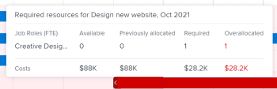
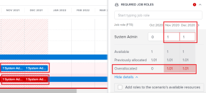

# 解決[!DNL Scenario Planner]中的方案衝突

當方案彼此衝突時，它們會爭奪相同的資源。 您可用於情境的資源不足以涵蓋情境中所有方案所需的所有資源。

這可能發生在以下任何情況下：

* 方案所需的工作角色數量大於計畫預算的角色數量。
* 方案的成本大於可用於計畫的預算金額。

## 存取需求

+++ 展開以檢視本文中功能的存取需求。

<table style="table-layout:auto"> 
 <col> 
 <col> 
 <tbody> 
  <tr> 
   <td> 
[!DNL Adobe Workfront] 計畫*
 </td> 
   <td> <ul></li>
   <li>
新增： Ultimate 
</li>
   
新的Workfront Select或Workfront Prime計畫無法使用「情境規劃工具」。 

   <li>
目前： [!UICONTROL Business]或更高版本
</ul>
   </td> 
  </tr> 
  <tr> 
   <td> 
[!DNL Adobe Workfront] 授權*
 </td> 
   <td> 
新增：淺色或更高
 
   
目前： [!UICONTROL Review]或以上
 </td> 
  </tr> 
  <tr> 
   <td>產品* </td> 
   <td> <ul><li>
針對新的Workfront計畫：

 Adobe Workfront</li>

   <li>
針對目前的Workfront計畫： 

   
Adobe Workfront
 
Adobe Workfront情境規劃工具
</li></ul>

如需詳細資訊，請參閱<a href="../scenario-planner/access-needed-to-use-sp.md" class="MCXref xref">使用[!DNL Scenario Planner]</a>所需的存取權。 
 </td> 
  </tr> 
  <tr data-mc-conditions=""> 
   <td>存取層級 </td> 
   <td> 
[!UICONTROL Edit]對的存取權 [!DNL Scenario Planner]
 </td> 
  </tr> 
  <tr data-mc-conditions=""> 
   <td> 
物件許可權 
 </td> 
   <td> 
[!UICONTROL Manage]計畫的許可權
 
如需有關請求對計畫的額外存取權的資訊，請參閱<a href="../scenario-planner/request-access-to-plan.md" class="MCXref xref">在[!DNL Scenario Planner]</a>中請求對計畫的存取權。
 </td> 
  </tr> 
 </tbody> 
</table>

*如需詳細資訊，請參閱[Workfront檔案的存取需求](/help/quicksilver/administration-and-setup/add-users/access-levels-and-object-permissions/access-level-requirements-in-documentation.md)。

+++

## 解決衝突概觀

* 衝突也可以理解為工作角色或案例預算的過度配置。
* 當[!DNL Workfront]偵測到衝突時，與方案期間衝突月份對應的列會以紅色顯示。 這可能發生在以下任何情況下：

   * 在所有先前的行動方案已使用計畫的預算資源後，行動方案每月所需的工作角色數量大於計畫預算的角色數量。
   * 在所有先前的計畫已使用計畫的預算來支付其成本之後，計畫的每月成本會大於計畫的可用預算。

>[!TIP]
>
>根據預設，[!DNL Scenario Planner]假設您已針對0個工作角色編列預算，且除非您另有指定，否則案例的$0或等值專案將以您系統的貨幣表示。 職務角色的數目表示職務角色預算的FTE （全職相當值）或時數。
>
>對於「情境規劃工具」中的所有計算，Workfront會使用以下值： 1 FTE = 8小時。
>
>如需有關更新計畫和預算的可用角色的資訊，請參閱[在 [!DNL Scenario Planner]](../scenario-planner/create-and-edit-plans.md)中建立和編輯計畫。

* 您可以執行下列其中一項作業來解決衝突：

   * 自動從情境上的方案新增缺少的必要資源。 本文說明如何使用此選項解決衝突。
   * 藉由編輯計畫，調整案例的工作角色與預算資源。 如需詳細資訊，請參閱[在 [!DNL Scenario Planner]](../scenario-planner/create-and-edit-plans.md)中建立和編輯計畫。

## 解決方案之間的衝突

1. 移至您要解決衝突的計畫。

   如需有關建立計畫的資訊，請參閱[在 [!DNL Scenario Planner]](../scenario-planner/create-and-edit-plans.md)中建立和編輯計畫。

   如需關於建立方案的資訊，請參閱[在 [!DNL Scenario Planner]](../scenario-planner/create-and-edit-initiatives.md)中建立和編輯方案。

1. （選擇性）從&#x200B;**[!DNL Initial scenario]**&#x200B;下拉式功能表中，選取您要檢閱的情境。

   >[!TIP]
   >
   >一個計畫可能具有數個情境。 檢視計畫的衝突時，[!DNL Workfront]指的是目前所選情境上可用的資源，以及該情境行動方案所需的資源。 如需情境的相關資訊，請參閱[在 [!DNL Scenario Planner]](../scenario-planner/create-and-compare-scenarios-for-a-plan.md)中建立和比較計畫情境。

1. 確定已啟用&#x200B;**[!UICONTROL 顯示衝突]**。 預設為啟用。

   

   第一個衝突方案會以紅色顯示衝突的月份，而方案名稱旁邊會顯示警告圖示。

   從第一個衝突方案開始的所有方案背景，會在計畫圖表中以紅色顯示。

   當方案顯示衝突時，表示至少有一個特定角色的工作角色數、產生的成本或兩者超過為特定月份的計畫定義的職位角色數或預算。

   計畫上的

1. 請執行下列任一項作業，以進一步瞭解可能存在的衝突：

   * 將滑鼠停留在方案名稱旁的警告圖示上，即可瞭解您是否擁有工作角色或預算衝突。

     

     當游標停留在警告圖示上時，根據您是過度配置職務角色還是高估方案成本，您可能會看到下列其中一個選項：

      * 顯示職位角色衝突詳細資料
      * 顯示預算衝突詳細資料
      * 顯示工作角色和預算詳細資訊

   * 依月份檢視計畫時，將滑鼠移至計畫時間表中的一個月上，即可檢視該月所需的資源，以及該月的衝突是人員還是成本相關。

     

     在計畫層次複查下列每月資訊：

      * 針對該月規劃的所有方案當月可用、必要和過度配置的工作角色數量
      * 針對該月規劃的所有行動方案，該月的可用、必要和過度分配成本

        >[!TIP]
        >
        >[!UICONTROL 可用]成本為該案例當月的預算。

   * 將滑鼠指標停留在方案的紅色列上達一個月，以顯示有關該月衝突的其他資訊方塊。

     

     在方案層級的「其他資訊」方塊中，檢閱下列欄位：

     <table style="table-layout:auto"> 
      <col> 
      <col> 
      <tbody> 
       <tr> 
        <td role="rowheader">衝突發生的月份</td> 
        <td>顯示在其他資訊方塊的標題中。</td> 
       </tr> 
       <tr> 
        <td role="rowheader">方案名稱</td> 
        <td>顯示在其他資訊方塊的標題中。</td> 
       </tr> 
       <tr> 
        <td role="rowheader">[!UICONTROL 職位角色]</td> 
        <td> 
與所選月份過度配置的此方案相關聯的工作角色。 下列欄顯示所選月份所需的每個職務角色資訊，這些資訊與該月份可用的職務角色數量衝突：
 
         <ul> 
          <li> 
<strong>[!UICONTROL 可用]</strong>：從案例中選取的月份可用的每個職務角色數目。
 </li> 
          <li> 
<strong>[!UICONTROL 必要]</strong>：方案在所選月份所需的每個職務角色數目。
 </li> 
          <li> 
<strong>[!UICONTROL 過度配置]：</strong>方案所需的數目與情境中可用的數目之間的差異。 
 </li> 
         </ul> 
提示：有時[!UICONTROL Available]角色的數目會符合或高於[!UICONTROL Required]角色的數目，但[!DNL Scenario Planner]仍會顯示過度配置。 這表示有較高等級的行動方案已使用同一月計畫上可用的職務角色。 
 </td> 
       </tr> 
       <tr> 
        <td role="rowheader">成本</td> 
        <td> 
所選月份的方案成本。 下列欄位會顯示所選月份所需成本與可用預算的資訊：
 
         <ul> 
          <li> 
<strong>[!UICONTROL 可用]</strong>：可從計畫取得所選月份的預算。
 </li> 
          <li> 
<strong>[!UICONTROL 必要]</strong>：與所選月份此方案相關的成本。
 </li> 
          <li> 
<strong>[!UICONTROL 超額分配]：</strong>方案成本與計畫可用預算之間的差異。 
 </li> 
         </ul> 
秘訣：有時[!UICONTROL Available]成本與所選月份的主動方案[!UICONTROL Required]成本相符或更高，[!DNL Scenario Planner]仍顯示成本過度分配。 這表示有較高等級的行動方案已使用同一月計畫上的可用預算。 
 </td> 
       </tr> 
      </tbody> 
     </table>

1. 執行下列任一項作業以開啟方案詳細資訊面板，並檢視有關衝突發生位置及解決衝突的詳細資訊：

   * 按一下方案名稱旁的警告圖示。
   * 按一下方案列。
   * 按一下方案名稱右側的&#x200B;**[!UICONTROL 更多]**&#x200B;圖示，然後按一下&#x200B;**[!UICONTROL 編輯]**。

     方案詳細資訊面板會顯示在右側。

     當您的方案沒有足夠的可用人員或預算時，下列區段旁會顯示一個紅色警告圖示：

   * [!UICONTROL 必要的工作角色]
   * [!UICONTROL 成本]

1. （視條件而定）若方案有工作角色衝突，請移至&#x200B;**[!UICONTROL 必要工作角色]**&#x200B;區段，檢視方案所需的所有工作角色。 識別可能過度配置的工作角色。 檢視方案每個月每個工作角色所需的FTE或時數。 包含具有超額分攤之月份的FTE或小時數的方塊會顯示為紅色大綱。

   

1. （可選）在方案時間軸中的月份旁按一下向右箭頭，以檢視哪些額外月份顯示工作角色衝突。

   

1. （選擇性）按一下顯示衝突的工作角色下的&#x200B;**[!UICONTROL 顯示詳細資料]**，以檢視衝突在哪裡出現，並反白計畫圖表區域中衝突的月份。 隨即顯示每個工作角色的其他資訊。

   每個工作角色會顯示以下欄位：

   <table style="table-layout:auto"> 
    <col> 
    <col> 
    <tbody> 
     <tr> 
      <td role="rowheader">[!UICONTROL 可用]</td> 
      <td> 
計畫內每個月可用的職務角色數量。 
 </td> 
     </tr> 
     <tr> 
      <td role="rowheader">[!UICONTROL 先前已配置]</td> 
      <td>已從計畫預算配置給特定月份中較高等級方案的工作角色數量。 </td> 
     </tr> 
     <tr> 
      <td role="rowheader">[!UICONTROL 過度配置]</td> 
      <td> 
方案上所需職務角色的數量與較高等級方案後計畫中可用數量之間的差異也使用了一些角色。 Workfront會使用下列公式計算[!UICONTROL 過度配置]職務角色的數目：
 
<code>Overallocated roles = (Roles Previously Allocated to higher initiatives + Required roles for current initiative) - Monthly available roles from the plan</code> 
 </td> 
     </tr> 
    </tbody> 
   </table>

   >[!TIP]
   >
   >在計畫圖表上，配置工作角色的月份會顯示每個需要這些角色的方案所需的名稱和角色數量。 您必須選取[!UICONTROL 月]檢視才能檢視工作角色的名稱

   

1. 執行下列任一項作業以解決工作角色衝突：

   * 手動將方案每月的工作角色數量調整為較低數字。
   * 將滑鼠停留在工作角色的名稱上，然後按一下&#x200B;**[!UICONTROL 刪除]圖示** ，即可從方案移除工作角色。
   * 選取&#x200B;**[!UICONTROL 將角色新增至方案的可用資源]**，然後按一下&#x200B;**[!UICONTROL 套用]**。

     這會將缺少的工作角色FTE或時數新增至情境的[!UICONTROL 可用]欄位。

     >[!NOTE]
     >
     >您為解決衝突而新增的角色會修改所選案例的[!UICONTROL 可用]工作角色，而非計畫中的所有案例。

     在計畫的時間表中會顯示該月的向上綠色箭頭，表示該月已新增更多資源至計畫。 您必須選取[!UICONTROL 月]檢視才能檢視此指標。

   * （依條件）關閉詳細資料面板，並儘可能優先讓方案從計畫接收預算資源。 如需有關更新方案優先順序的資訊，請參閱情境規劃工具[&#128279;](../scenario-planner/prioritize-initiatives.md)中的更新方案優先順序。

1. （選擇性）按一下&#x200B;**[!UICONTROL 隱藏詳細資料]**&#x200B;以關閉其他詳細資料方塊，然後按一下&#x200B;**[!UICONTROL 套用]**&#x200B;以儲存您對工作角色所做的變更。

1. （有條件）若方案發生成本衝突，請移至方案詳細資料面板中的&#x200B;**[!UICONTROL 成本]**&#x200B;區段，以檢閱方案期間每個月的成本。 確定計畫的預算中哪幾個月可能沒有足夠的資金來支付所選方案的成本。 可用預算不足的方塊會以紅色大綱顯示。
1. （可選）按一下方案時間表中月份旁邊的右箭頭，以檢視預算不足以涵蓋成本的其他月份。

   

1. （選擇性）按一下成本資訊下方的&#x200B;**[!UICONTROL 顯示詳細資料]**，以檢視衝突在哪裡出現，並反白計畫圖表上衝突的月份。 系統會針對每種成本型態顯示下列額外欄位：

   <table style="table-layout:auto"> 
    <col> 
    <col> 
    <tbody> 
     <tr> 
      <td role="rowheader">[!UICONTROL 可用]</td> 
      <td> 
計畫預算中每個月的可用成本。 
 </td> 
     </tr> 
     <tr> 
      <td role="rowheader">[!UICONTROL 先前已配置]</td> 
      <td>已從計畫預算中分配給較高等級方案的金額。 </td> 
     </tr> 
     <tr> 
      <td role="rowheader">[!UICONTROL 過度配置]</td> 
      <td> 
方案所需成本與較高等級方案後計畫預算中可用資金量之間的每月差額也使用一些可用預算。 [!DNL Workfront]使用下列公式計算「超額分配」成本的數目：
 
<code>Overallocated costs = (Costs Previously Allocated to higher initiatives + Required costs for the current initiative) - Monthly available budget from the plan</code> 
 
[!DNL Workfront] 使用下列公式計算目前方案每個月的所需成本：
 
<code>Required initiative costs = Initiative Fixed Costs + Initiative People Costs</code> 
 </td> 
     </tr> 
    </tbody> 
   </table>

   >[!TIP]
   >
   >在計畫圖表上，成本不足的月份會顯示方案仍需要的角色名稱和數量。 您必須選取「月份」檢視才能檢視成本金額。

   

   >[!NOTE]
   >
   >如果您在建立計畫時停用計畫[!UICONTROL 預算]方塊的[!UICONTROL 包含人員成本]設定，則任何情境中都不會針對任何方案顯示[!UICONTROL 人員成本]行。 在這種情況下，Workfront不會將人員成本帶入計算中，以判斷成本衝突。 如需有關建立計畫的資訊，請參閱[在 [!DNL Scenario Planner]](../scenario-planner/create-and-edit-plans.md)中建立和編輯計畫。

1. 執行下列任一項作業以解決成本衝突：

   * 手動將方案每個月的[!UICONTROL 固定成本]數目調整為較低的數目。
   * 在&#x200B;**[!UICONTROL 必要工作角色]**&#x200B;區段中，儘可能以人員成本預算手動調整當月的工作角色數量。 這樣可以減少人員成本。

     >[!TIP]
     >
     >您無法手動調整人員成本。

   * 選取&#x200B;**[!UICONTROL 將金額加入情境的預算]**，然後按一下&#x200B;**[!UICONTROL 套用]**。

     這會將不足的金額新增至案例缺少該金額的月份預算，這也會更新整體案例預算。

     >[!NOTE]
     >
     >您新增以解決成本衝突的金額，會修改所選案例的預算，而非計畫中所有案例的預算。

   * （依條件）關閉詳細資料面板，並儘可能優先讓方案從計畫接收預算資源。 如需有關更新方案優先順序的資訊，請參閱 [!DNL Scenario Planner][&#128279;](../scenario-planner/prioritize-initiatives.md)中的更新方案優先順序。

1. 當您變更[成本]區段時，按一下[套用]&#x200B;**&#x200B;**。
1. 按一下&#x200B;**[!UICONTROL 儲存計畫]**&#x200B;以儲存變更。

