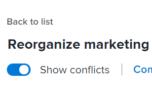
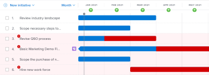

# 解決 [!DNL Scenario Planner]

當各項舉措相互衝突時，它們就在爭奪相同的資源。 您可用於方案的資源不足以覆蓋方案中所有方案所需的所有資源。

在下列任何情況下都可能發生此情況：

* 計畫所需的工作角色數大於計畫預算的角色數。
* 該計畫的費用大於計畫可用的預算額。

## 存取需求

您必須具備下列條件：

<table style="table-layout:auto"> 
 <col> 
 <col> 
 <tbody> 
  <tr> 
   <td> 
[!DNL Adobe Workfront]<b> 計劃*</b> 
 </td> 
   <td>[!UICONTROL Business]或更高版本</td> 
  </tr> 
  <tr> 
   <td> 
[!DNL Adobe Workfront]<b> 授權*</b> 
 </td> 
   <td> 
[!UICONTROL Review]或更高版本
 </td> 
  </tr> 
  <tr> 
   <td><b>產品</b> </td> 
   <td> 
您必須為 [!DNL Adobe Workfront Scenario Planner] 存取本文所述功能。
 
如需有關取得 [!DNL Workfront Scenario Planner]，請參閱 <a href="../scenario-planner/access-needed-to-use-sp.md" class="MCXref xref">使用 [!DNL Scenario Planner]</a>. 
 </td> 
  </tr> 
  <tr data-mc-conditions=""> 
   <td><strong>訪問級別配置*</strong> </td> 
   <td> 
[!UICONTROL Edit]或更高版本 [!DNL Scenario Planner]
 
注意：如果您仍無法存取，請詢問您的 [!DNL Workfront] 管理員。 若要了解 [!DNL Workfront] 管理員可以更改您的訪問級別，請參閱 <a href="../administration-and-setup/add-users/configure-and-grant-access/create-modify-access-levels.md" class="MCXref xref">建立或修改自訂存取層級</a>.
 </td> 
  </tr> 
  <tr data-mc-conditions=""> 
   <td> 
<strong>物件權限</strong> 
 </td> 
   <td> 
計畫的[!UICONTROL管理]權限
 
有關請求對計畫進行額外訪問的資訊，請參閱 <a href="../scenario-planner/request-access-to-plan.md" class="MCXref xref">在 [!DNL Scenario Planner]</a>.
 </td> 
  </tr> 
 </tbody> 
</table>

&#42;若要了解您擁有的計畫、授權類型或存取權，請聯絡您的Workfront管理員。

## 解決衝突概述

* 衝突也被理解為工作角色或方案預算的過度分配。
* 當 [!DNL Workfront] 檢測衝突，在方案持續時間內與衝突月份相對應的欄以紅色顯示。 在下列任何情況下都可能發生此情況：

   * 每個方案每月所需的職務數目大於所有先前方案使用計畫預算資源後為計畫預算的職務數目。
   * 在所有先前的倡議都使用計畫預算支付費用後，該倡議的每月費用比該計畫可用的預算還多。

>[!TIP]
>
>依預設， [!DNL Scenario Planner] 假設您已為0個工作角色編入預算，且已為某個案例以系統貨幣$0或等於$0，除非您另有指定。 職務職責數指示職務職責的FTE（全職等值）或預算小時數。
>
>對於方案計畫器中的所有計算，Workfront使用以下值：1 FTE = 8小時。
>
>有關更新計畫和預算的可用職責的資訊，請參閱 [在 [!DNL Scenario Planner]](../scenario-planner/create-and-edit-plans.md).

* 您可以執行以下操作之一來解決衝突：

   * 自動從方案的方案中新增遺漏的必要資源。 本文說明如何使用此選項來解決衝突。
   * 通過編輯計畫調整方案的任務職責和預算資源。 如需詳細資訊，請參閱 [在 [!DNL Scenario Planner]](../scenario-planner/create-and-edit-plans.md).

## 解決方案之間的衝突

1. 轉到要解決衝突的計畫。

   如需建立計畫的相關資訊，請參閱 [在 [!DNL Scenario Planner]](../scenario-planner/create-and-edit-plans.md).

   有關建立方案的資訊，請參閱 [在 [!DNL Scenario Planner]](../scenario-planner/create-and-edit-initiatives.md).

1. （選用）從 **[!DNL Initial scenario]** 下拉式功能表中，選取您要檢閱的案例。

   >[!TIP]
   >
   >計畫可能有多種情況。 當看到計畫的衝突時， [!DNL Workfront] 是指所選藍本上目前可用的資源，以及該藍本舉措上所需的資源。 如需藍本的相關資訊，請參閱 [在 [!DNL Scenario Planner]](../scenario-planner/create-and-compare-scenarios-for-a-plan.md).

1. 確保 **[!UICONTROL 顯示衝突]** 啟用。 預設會啟用。

   

   第一個衝突的方案顯示衝突為紅色的月份，方案名稱旁會顯示警告表徵圖。

   從第一個衝突的方案開始的所有方案的背景以紅色顯示在計畫圖表上。

   當方案顯示衝突時，這意味著至少一個特定職責的職務職責數、已發生的成本或兩者均超過為特定月份的計畫定義的職務職責數或預算。

   

1. 執行下列任一操作，以進一步了解可能存在的衝突：

   * 將滑鼠移到方案名稱旁的警告圖示上，可了解您是具有工作角色還是預算衝突。

      

      根據您是否過度分配了職務職責或高估了計畫的成本，在將游標暫留在警告表徵圖上時，您可能會看到以下選項之一：

      * 顯示職位角色衝突詳細資料
      * 顯示預算衝突詳細資料
      * 顯示任務角色和預算詳細資訊
   * 按月查看計畫時，將滑鼠移到計畫時間表中的某個月上，以查看該月的必需資源，以及該月的衝突是人員衝突還是與成本相關衝突。

      

      在計畫層查看以下每月資訊：

      * 該月計畫的所有計畫的可用、必需和分配過多的工作角色數
      * 該月計畫的所有計畫的可用、必需和超額分配成本

         >[!TIP]
         >
         >此 [!UICONTROL 可用] 成本是該月的方案預算。
   * 將滑鼠指標暫留在方案的紅色長條上一個月，以顯示該月所發生衝突的其他資訊方塊。

      

      在計畫層查看附加資訊框中的以下欄位：

      <table style="table-layout:auto"> 
      <col> 
      <col> 
      <tbody> 
       <tr> 
        <td role="rowheader">發生衝突的月份</td> 
        <td>顯示在其他資訊框的標題中。</td> 
       </tr> 
       <tr> 
        <td role="rowheader">方案名稱</td> 
        <td>顯示在其他資訊框的標題中。</td> 
       </tr> 
       <tr> 
        <td role="rowheader">[!UICONTROL作業角色]</td> 
        <td> 
與此方案關聯的工作角色，在選定月份被過度分配。 以下列顯示選定月份所需的每個職務角色的資訊，這些角色與該月可用職務角色的數量衝突：
 
         <ul> 
          <li> 
<strong>[!UICONTROL可用]</strong>:所選月份方案中可用的每個作業角色的數量。
 </li> 
          <li> 
<strong>[!UICONTROL必要]</strong>:所選月份內計畫所需的每個工作職責數。
 </li> 
          <li> 
<strong>[!UICONTROL過分分配]:</strong> 方案所需數量與方案中可用數量之間的差異。 
 </li> 
         </ul> 
提示：有時，[!UICONTROL Available]角色的數量會與[!UICONTROL Required]角色的數量相符或高於，但 [!DNL Scenario Planner] 仍顯示超額分配。 這表示在同月計畫中，已使用可用職務的更高級別計畫。 
 </td> 
       </tr> 
       <tr> 
        <td role="rowheader">成本</td> 
        <td> 
所選月份的計畫成本。 以下列顯示所選月份所需成本和可用預算的資訊：
 
         <ul> 
          <li> 
<strong>[!UICONTROL可用]</strong>:所選月份的計畫中可用的預算。
 </li> 
          <li> 
<strong>[!UICONTROL必要]</strong>:選定月份與此計畫相關的成本。
 </li> 
          <li> 
<strong>[!UICONTROL過分分配]:</strong> 計畫費用與計畫可用預算之間的差額。 
 </li> 
         </ul> 
提示：有時，[!UICONTROL可用]成本與選定月份的計畫的[!UICONTROL必需]成本匹配或高於 [!DNL Scenario Planner] 仍顯示成本的過度分配。 這意味著，在同月計畫中，已經使用了可用預算的更高級別舉措。 
 </td> 
       </tr> 
      </tbody> 
     </table>

1. 執行以下操作之一以開啟方案詳細資訊面板並查看衝突發生位置的詳細資訊並解決衝突：

   * 按一下方案名稱旁的警告圖示。
   * 按一下方案的欄。
   * 按一下 **[!UICONTROL 更多]** 圖示  按一下計畫名稱右側的 **[!UICONTROL 編輯]**.

      方案詳細資訊面板顯示在右側。

      如果您的方案沒有足夠的人員或預算，則下列小節旁會顯示紅色警告表徵圖：

   * [!UICONTROL 必要職位角色]
   * [!UICONTROL 成本]

1. （有條件）若為有工作角色衝突的倡議，請前往 **[!UICONTROL 必需的作業角色]** 部分，查看計畫所需的所有工作角色。 確定可能被過度分配的作業角色。 檢查計畫每個月中每個職務職責所需的FTE或小時數。 紅色大綱中顯示的框，其中FTE或小時數是具有超額分配的月份。

   

1. （可選）按一下計畫時間表中月份旁邊的右箭頭，查看哪些額外月份顯示工作角色衝突。

   

1. （選用）按一下 **[!UICONTROL 顯示詳細資訊]** 在顯示衝突的作業角色下，查看衝突的出現位置，並在計畫的圖表區域中突出顯示衝突的月份。 會針對每個作業角色顯示其他資訊。

   每個作業角色的欄位如下：

   <table style="table-layout:auto"> 
    <col> 
    <col> 
    <tbody> 
     <tr> 
      <td role="rowheader">[!UICONTROL可用]</td> 
      <td> 
計畫中每月可用的職務角色數。 
 </td> 
     </tr> 
     <tr> 
      <td role="rowheader">[!UICONTROL先前分配]</td> 
      <td>已從計畫預算分配給特定月份的高級計畫的職務角色數。 </td> 
     </tr> 
     <tr> 
      <td role="rowheader">[!UICONTROL過分分配]</td> 
      <td> 
計畫上所需職務的數量與高級計畫之後計畫中可用數量之間的差異也使用了其中的一些職責。 Workfront使用下列公式計算[!UICONTROL Overlocated]作業角色的數量：
 
<code>Overallocated roles = (Roles Previously Allocated to higher initiatives + Required roles for current initiative) - Monthly available roles from the plan</code> 
 </td> 
     </tr> 
    </tbody> 
   </table>

   >[!TIP]
   >
   >在計畫圖表中，分配職務職責的月份顯示每個計畫所需的職責名稱和數量。 您必須選取 [!UICONTROL 月] 查看作業角色的名稱

   

1. 執行以下操作之一以解決作業角色衝突：

   * 手動將方案每個月的工作職責數量調整為較低數量。
   * 將滑鼠指標暫留在作業角色的名稱上，然後按一下 **[!UICONTROL 刪除] 圖示**  從計畫中刪除作業角色。
   * 選擇 **[!UICONTROL 將角色新增至方案的可用資源]**，然後按一下 **[!UICONTROL 套用]**.

      這會將缺少的工作角色FTE數或小時數添加到方案的 [!UICONTROL 可用] 欄位。

      >[!NOTE]
      >
      >您為解決衝突而添加的角色將修改 [!UICONTROL 可用] 所選方案的作業角色，而不是計畫中所有方案的作業角色。

      向上指的綠色箭頭  在計畫時間軸中顯示該月，以指示該月的計畫中已添加更多資源。 您必須選取 [!UICONTROL 月] 檢視以查看此指標。

   * （有條件）關閉詳細資訊面板，並盡可能優先從計畫接收預算資源。 有關更新方案優先順序的資訊，請參閱 [更新方案計畫器中的方案優先順序](../scenario-planner/prioritize-initiatives.md).

1. （選用）按一下 **[!UICONTROL 隱藏詳細資訊]** 要關閉其他詳細資訊框，請按一下 **[!UICONTROL 套用]** 以保存您對作業角色所做的更改。

1. （有條件）若為有成本衝突的舉措，請前往 **[!UICONTROL 成本]** 方案詳細資訊小組中的一節，以審查方案期間每個月的費用。 確定哪些月份的計畫預算可能沒有足夠的資金來支付選定計畫的費用。 可用預算不足的框以紅色大綱顯示。
1. （可選）按一下計畫時間表中月份旁邊的右箭頭，查看預算不足以支付成本的其他月份。

   

1. （選用）按一下 **[!UICONTROL 顯示詳細資訊]** 在成本資訊下，查看衝突出現的位置，並在計畫圖表上突出顯示衝突的月份。 每種成本類型會顯示以下其他欄位：

   <table style="table-layout:auto"> 
    <col> 
    <col> 
    <tbody> 
     <tr> 
      <td role="rowheader">[!UICONTROL可用]</td> 
      <td> 
計畫每月預算中的可用成本。 
 </td> 
     </tr> 
     <tr> 
      <td role="rowheader">[!UICONTROL先前分配]</td> 
      <td>已從計畫預算中分配給更高級別計畫的資金數額。 </td> 
     </tr> 
     <tr> 
      <td role="rowheader">[!UICONTROL過分分配]</td> 
      <td> 
計畫所需費用與計畫預算中較高級別舉措後可用資金數額之間的月差，也使用了一些可用預算。 [!DNL Workfront] 使用以下公式計算超額分配成本的數量：
 
<code>Overallocated costs = (Costs Previously Allocated to higher initiatives + Required costs for the current initiative) - Monthly available budget from the plan</code> 
 
[!DNL Workfront] 使用以下公式計算每月當前方案的必需成本：
 
<code>Required initiative costs = Initiative Fixed Costs + Initiative People Costs</code> 
 </td> 
     </tr> 
    </tbody> 
   </table>

   >[!TIP]
   >
   >在計畫圖表中，成本不足的月份顯示計畫所需的名稱和角色數。 必須選擇「月」視圖才能查看成本金額。

   

   >[!NOTE]
   >
   >如果您已停用 [!UICONTROL 包括人員成本] 計畫的設定 [!UICONTROL 預算] 框， [!UICONTROL 人員成本] 在任何情況下，不會針對任何方案顯示行。 在此情況下，Workfront不會將人員成本納入計算中，以判斷成本衝突。 如需建立計畫的相關資訊，請參閱 [在 [!DNL Scenario Planner]](../scenario-planner/create-and-edit-plans.md).

1. 執行以下任一操作以解決成本衝突：

   * 手動調整 [!UICONTROL 固定成本] 每個月的計畫數量減少。
   * 在 **[!UICONTROL 必需的作業角色]** 部分，如果可能，使用「人員成本」預算手動調整該月的職務數。 這可減少人員成本。

      >[!TIP]
      >
      >您不能手動調整人員成本。

   * 選擇 **[!UICONTROL 將金額新增至方案的預算]**，然後按一下 **[!UICONTROL 套用]**.

      這會在方案缺少的月份預算中增加不足的金額，而這也會更新整體方案預算。

      >[!NOTE]
      >
      >您為解決成本衝突而添加的金額修改了選定方案的預算，而不是計畫中所有方案的預算。

   * （有條件）關閉詳細資訊面板，並盡可能優先從計畫接收預算資源。 有關更新方案優先順序的資訊，請參閱 [更新 [!DNL Scenario Planner]](../scenario-planner/prioritize-initiatives.md).

1. 按一下 **[!UICONTROL 套用]** 對「成本」部分進行任何更改時。
1. 按一下 **[!UICONTROL 保存計畫]** 來儲存變更。

