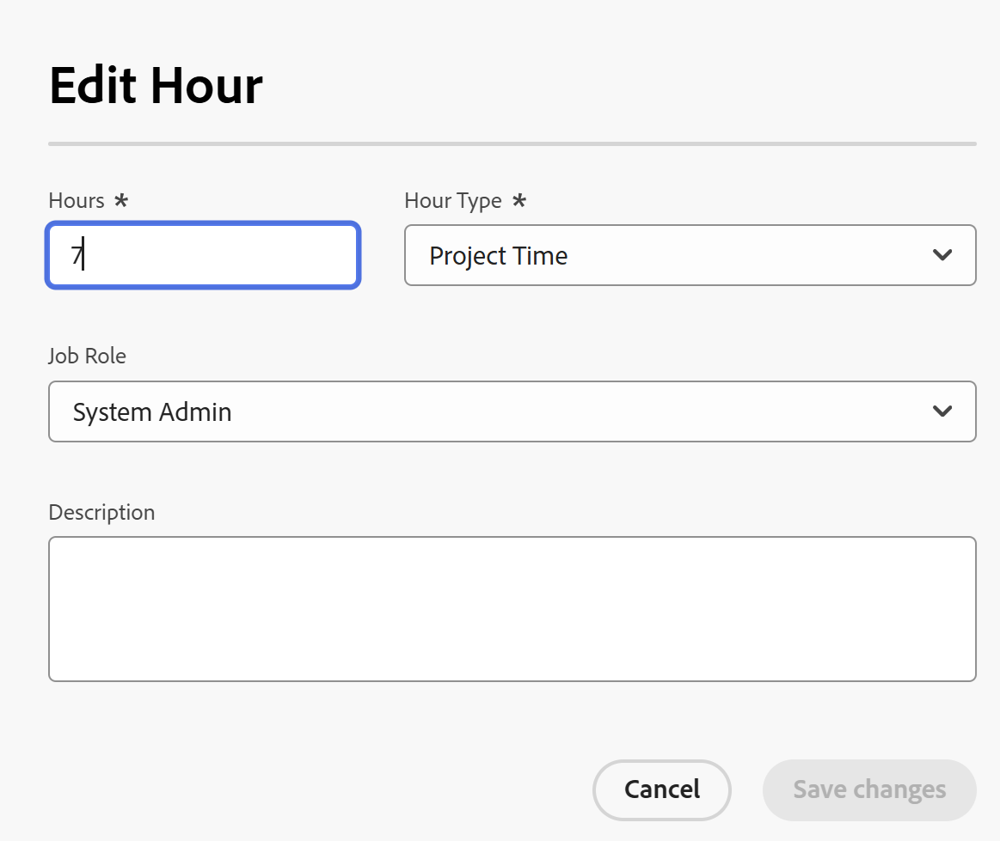

# 記錄時間

{{highlighted-preview}}

<!--Audited: 5/2025-->

<!--remove all preview and production references if any-->
<!--update screen shots for the general hour entries and the mixed selection of hours at production, if they fixed the bugs -->

您可以在Adobe Workfront中記錄工作專案的時間，以指出您花在工作專案上的小時數。 您也可以記錄與工作無關的時間，例如假期、病假或會議時間。 您的記錄時間會顯示在您的時程表中。

如需您可以登入Workfront時數型別的詳細資訊，請參閱[管理時數型別](../../administration-and-setup/set-up-workfront/configure-timesheets-schedules/hour-types.md)。

## 存取權要求

+++ 展開以檢視這篇文章中所述功能的存取權要求。

<table style="table-layout:auto"> 
 <col> 
 <col> 
 <tbody> 
  <tr> 
   <td>Adobe Workfront 封裝</td> 
   <td> 
任何
 </td> 
  </tr> 
  <tr> 
   <td role="rowheader">Adobe Workfront授權</td> 
   <td> 
   <ul><li>
在任務、問題、專案或時程表的一般時數上記錄小時數的輕度或更高
</li>
   <li>
在專案上記錄時數的標準
</li></ul>

或： 

<ul><li>
檢閱或更高版本以在時程表中記錄一般時數
</li>
   <li>
在專案、任務或問題上記錄小時數的工作或更高
</li></ul> </td> 
  </tr> 
  <tr> 
   <td>存取層級設定</td> 
   <td> 
編輯您記錄時間的工作專案型別的存取權 
 
例如，您需要編輯問題的存取權，以記錄問題的時間
 </td>
  </tr> 
  <tr> 
   <td>物件許可權</td>
   <td> 
在您記錄時間的工作專案上貢獻或更高許可權，包括記錄時數的許可權
 </td>
  </tr> 
 </tbody> 
</table>

如需詳細資訊，請參閱Workfront檔案中的[存取需求](/help/quicksilver/administration-and-setup/add-users/access-levels-and-object-permissions/access-level-requirements-in-documentation.md)。

+++

## 在Workfront中記錄時間時的注意事項

* 您可以記錄專案、任務或問題的時間，也可以直接在時程表中記錄時間。

  如需關於建立時程表的資訊，請參閱[建立單一使用時程表](../../timesheets/create-and-manage-timesheets/create-tmshts.md)。

* 所有透過非時程表工具記錄的時間都會顯示在相應時段的時程表中。
* 非目前專案上的任務和問題不會預先填入時程表中。
* 時程表記錄的時間會立即套用至任務、問題或專案。
* 時程表包含所有記錄日期的總時間。 週末一律包括在內，即使時間表計算已設定為將其排除（如[設定全系統專案偏好設定](../../administration-and-setup/set-up-workfront/configure-system-defaults/set-project-preferences.md)中所述）。
* 時程表中最多可顯示45個專案。 如果超過45個專案的日期符合時程表時間範圍，則只會顯示最近更新的專案。
* 計入計費計費記錄中的小時專案會變暗且無法在時程表中編輯。 如需詳細資訊，請參閱[建立付費記錄](../../manage-work/projects/project-finances/create-billing-records.md)。
* 依預設，個人任務不會顯示在時程表中。 個人任務只有在記錄時間時才會顯示在時程表中。 在您將時間登入個人任務後，您可以將任務釘選到時程表中，如果它保持釘選狀態，將保留在時程表中。 如需詳細資訊，請參閱[從首頁區域建立工作專案和專案](../../workfront-basics/using-home/using-the-home-area/create-work-items-in-home.md)。

## 記錄時間 {#log-time-section}

您可以在Workfront中的下列區域記錄時間：

* [時程表](#timesheet)
* [首頁](#home)
* [專案、任務或問題](#project-task-or-issue)
* [摘要面板](#summary-panel)
* [展示板](#boards)
* [行動應用程式](#mobile-app)

### 時程表 {#timesheet}

#### 在時程表上記錄時間 {#log-time-on-a-timesheet}

您可以將時間記錄到時程表中的以下專案：

* 預先填入的任務、問題和專案會自動顯示，根據Workfront管理員設定時程表偏好設定的方式。 如需關於如何預先填入時程表的資訊，請參閱[設定時程表和小時喜好設定](../../administration-and-setup/set-up-workfront/configure-timesheets-schedules/timesheet-and-hour-preferences.md)。

  只有指派給您的任務和問題會預先填入您的時程表中。 指派給您的團隊或工作角色的任務和問題不會自動填入您的時程表。

  在指派給您團隊的專案上按一下「處理它」會指派該專案給您，該專案將顯示在您的時程表中。

* 您手動新增的任務、問題或專案。
* 已在Workfront其他位置記錄時間的任務、問題或專案。
* 一般時間（休假、訓練、管理時間）。

>[!NOTE]
>
>檢閱指派給時程表設定檔的使用者可以檢視時程表區域並記錄一般時數。 但是，他們無法將時數記錄在任何任務或指派給他們的問題出現在時程表中。

若要在時程表上記錄時間：

{{step1-click-main-menu}}

1. 按一下&#x200B;[!UICONTROL **時程表**]。 依預設會顯示您目前的時程表。
   

1. （選擇性）按一下&#x200B;**全熒幕**&#x200B;圖示以全熒幕模式顯示時程表，然後按一下&#x200B;**退出全熒幕** 圖示以返回時程表。

   <!-- drafted for the resize columns in timesheet story: 1. (optional) Click on the separator lines between weeks or between the time frame area and the work item area to resize the columns of the timesheet.-->

1. （選擇性）若要將專案、任務或問題新增至時程表，請按一下時程表左上角的&#x200B;**新增專案**&#x200B;下拉式功能表，然後按一下&#x200B;**新增專案**、**新增任務**&#x200B;或&#x200B;**新增問題**。

   專案、任務或問題清單隨即顯示。

   <!--drafted for full screen mode for add projects story - align it with the rest of the steps when you enable this:: 1. (Optional) Click the **full-screen** icon  to display the list of objects in full-screen mode.-->

1. （選擇性）按一下搜尋圖示，以使用要新增至時程表的關鍵字來搜尋特定專案。

1. （選擇性）展開篩選、檢視或群組下拉式功能表，以套用或自訂其中一個功能表，並檢視您想要的專案資訊。

1. 在清單中選取一或多個專案，然後按一下[新增]。**&#x200B;**

   如果您一次新增的專案少於50個，這些專案會新增到時程表中。 任務和問題會列在專案名稱下。

   >[!NOTE]
   >
   >將任務或問題新增到時程表時，也會新增專案。

1. （視條件而定）如果您一次新增50個或更多專案，會顯示一則確認訊息，顯示新增至時程表的專案數量。

   按一下&#x200B;**全部新增**&#x200B;以新增所有專案
或
按一下&#x200B;**取消**&#x200B;停止新增選取的專案，然後按一下&#x200B;**取消**&#x200B;關閉專案清單。

   任務和問題會列在專案名稱下。

   >[!NOTE]
   >
   >您手動新增到時程表的專案已釘選，並將停留在目前和未來的時程表中，直到您手動取消釘選這些專案以將其移除為止。 如需有關取消固定專案以從時程表中移除專案的資訊，請繼續進行步驟10。

   <!--(ensure this stays accurate)-->

1. （選擇性）按一下專案名稱旁的&#x200B;**摺疊** 或&#x200B;**展開** 圖示，以顯示或隱藏專案的任務和問題清單。

   >[!TIP]
   >
   >   使用標準QWERTY鍵盤時，按一下時程表中專案名稱后，請按下列按鍵組合以收合或展開專案：
   >   * 若要展開專案並顯示其工作專案，請執行下列動作：
   >     * Windows電腦的Shift + Alt +向上鍵
   >     * Mac電腦的Shift + Option +向上鍵
   >   * 若要收合專案並隱藏其工作專案，請執行下列動作：
   >     * Windows電腦的Shift + Alt +向下鍵
   >     * Mac電腦的Shift + Option +向下鍵。

1. （選擇性）若要手動釘選自動顯示在時間表上的專案，請將游標移至專案名稱上，然後按一下&#x200B;**釘選**&#x200B;圖示。

   >[!TIP]
   >
   >   按一下時程表中的專案後使用標準QWERTY鍵盤時，請按下列按鍵組合以釘選專案：
   >   * Option + P (適用於Windows和Mac電腦)。

1. （選用）按一下搜尋圖示並開始輸入關鍵字，以在時程表中尋找專案、任務或問題。

1. （視條件而定）如果您的Workfront或群組管理員已啟用&#x200B;**手動將工作角色指派至時數專案**&#x200B;設定，請從下拉式選單中選取工作角色。 依預設，系統會顯示指派給工作專案時所指定的角色。 如果您在物件上未被指派角色，您的「主要角色」會顯示為預設值。 如需此設定的詳細資訊，請參閱文章[設定時程表和小時偏好設定](../../administration-and-setup/set-up-workfront/configure-timesheets-schedules/timesheet-and-hour-preferences.md)。

   

1. （選用）按一下&#x200B;**+**&#x200B;圖示以新增其他列，然後從[!UICONTROL 小時型別]欄的下拉式功能表中選取新的小時型別，以記錄不同小時型別的時間。

   

   >[!TIP]
   >
   >   視您的作業系統或瀏覽器而定，在使用標準QWERTY鍵盤時，請按下列按鍵組以新增另一列：
   >   * Ctrl + Option + + （適用於Windows電腦）
   >   * Mac電腦的Cmd + Option + +

   可用時數型別取決於系統、專案和使用者層級已定義的專案，如[定義時數型別和可用性](define-hour-types-and-availability.md)中所述。

   時程表關閉後無法變更時數型別。

   >[!TIP]
   >
   >如果您先前記錄時間，而您選取的小時型別現在已停用，則記錄時間的整列會變暗。 選擇另一個時數型別並重新整理頁面會從下拉式清單中移除已停用的時數型別選項，因此您無法為該時數型別新增額外時數。
   >
   >如果您想要將停用的小時型別保持與過去記錄時間相關聯，請考慮為您要記錄額外時間的工作專案新增一行，並選擇新的小時型別。

1. 按一下工作角色旁的&#x200B;**刪除**&#x200B;圖示以將其移除。 同時也會移除角色記錄的任何時間。

   >[!TIP]
   >
   >   視您的作業系統或瀏覽器而定，在使用標準QWERTY鍵盤時，請按下列按鍵來刪除列：
   >   * Ctrl + Option + - （適用於Windows電腦）
   >   * Cmd + Option + — 適用於Mac電腦

1. 在時程表的時間表區段中，指定您要登入任何指定日期的時間長度，然後按一下小時方塊外部以儲存小時專案。 時數會自動儲存。 您記錄時間的列會以淺藍色反白顯示，而小時輸入方塊則會以深藍色外框。

   

   您以小時或天為單位記錄時間。 此設定是由擁有計畫授權的使用者或系統管理員所設定，如[設定時間是以小時還是以天為單位記錄](../../timesheets/config-timesheet-prefs/config-time-logged-hrs-days.md)中所述。

   >[!IMPORTANT]
   >
   >如果發生下列任一情況，您必須手動儲存時程表：
   >
   >* 與您先前記錄的時間關聯的工作角色已變更，且&#x200B;**手動將工作角色指派到時數專案**&#x200B;設定已停用。 新日期的記錄時間將它與不同的工作角色相關聯。
   >   
   >   如果角色已變更，且已啟用&#x200B;**手動將工作角色指派到時數專案**&#x200B;設定，您可以記錄時間或更新角色，而您的變更會自動儲存。
   >
   >* 指派給任務或問題的工作角色與時程表所有者使用<!--or assigned to them_ this last  piece came from a Support note but but sure what role it's referring to. Leaving it out for now.-->記錄時間的工作角色不同。
   >
   >當兩個角色之間不再有衝突專案時，時程表會自動節省時間。
   >

1. （可選）在時程表標題的加班欄位中指定加班的金額。

   >[!TIP]
   >
   >您無法記錄的加班時數大於時程表上目前的總時數。 例如，如果您目前為止在時程表中記錄7小時，則無法記錄8小時的加班。

1. （選擇性）按一下&#x200B;**註解**&#x200B;為您的小時專案新增註解。

   

   >[!TIP]
   >
   >   按一下小時輸入方塊後使用標準QWERTY鍵盤時，請按下列按鍵組合以開啟註解方塊：
   >   * Shift + F2 (適用於Windows和Mac電腦)。

1. 按一下&#x200B;**完成**&#x200B;以儲存註解。

   >[!TIP]
   >
   >   使用標準QWERTY鍵盤時，從註解方塊內，按下列按鍵組合以儲存註解：
   >   * Windows電腦的Ctrl + Enter。
   >   * Mac電腦的Cmd + Return。

1. （選擇性）按一下工具列中的「顯示註解&#x200B;**」**，在工作專案下顯示時數專案註解。

   

   >[!TIP]
   >
   >   您對時程表所做的所有變更都會自動儲存。

1. （選擇性）按一下任務或問題的列，然後按一下時程表右上角的&#x200B;**開啟摘要**，以新增更新或更新有關任務或問題的資訊。 「摘要」面板會在右側開啟。

   

   您的更新將顯示在與記錄時間關聯的工作項的更新區域。

   >[!TIP]
   >
   >您無法評論專案或一般時間小時專案。

1. 按一下&#x200B;[!UICONTROL **關閉摘要**]&#x200B;以關閉摘要面板並返回時程表。

1. （選擇性）按一下左側面板中的&#x200B;[!UICONTROL **更新**]，然後將更新新增至時程表。 如需Workfront更新的詳細資訊，請參閱[更新工作](../../workfront-basics/updating-work-items-and-viewing-updates/update-work.md)。

   

1. （選用）返回&#x200B;**時程表**&#x200B;區域以關閉或提交您的時程表。

   * **關閉**：完成更新時程表後將其關閉。 只有在您的時程表未與核准者關聯時，才可使用此選項。

   * **提交以供核准：**&#x200B;只有在時程表上有核准者時，才能使用此選項。 儲存您的變更並提交以待核准。 如果尚未獲得核准，您可以在關閉時程表後按一下&#x200B;**撤銷**&#x200B;以開啟時程表。 如需詳細資訊，請參閱[提交時程表以供核准](../../timesheets/create-and-manage-timesheets/submit-timesheet-for-approval.md)。

   * **拒絕**：當您是時程表核准者，且時程表已提交給您核準時，就會顯示此選項。 按一下時程表會將時程表的狀態變更為「已拒絕」，而時程表仍會保持開啟狀態。

   * **核准**：當您是時程表核准者，且時程表已提交給您核準時，就會顯示此選項。 按一下時程表，會將時程表的狀態變更為已批准，並關閉時程表。

   >[!TIP]
   >
   >當您是系統管理員並且時間表與核准者相關聯時，拒絕和核准選項也會顯示在您的時間表上。

1. （視條件而定）如果您已關閉或已提交時程表以供核准，請按一下下列其中一個選項：

   * **重新開啟**：此選項適用於您已關閉且沒有核准者的時程表，或已核准的時程表。 重新開啟時程表以修改小時輸入項。
   * **撤銷**：此選項適用於已提交核准但尚未核准或拒絕的時程表。 按一下&#x200B;**撤銷**&#x200B;以重新開啟時程表並修改小時專案。

#### 從時程表移除專案

您可以從時程表中移除小時專案或專案（專案、任務或問題）。

若要從時程表中移除小時專案：

1. 移至時程表，並尋找您要移除的小時輸入項。
1. 將輸入的小時數取代為0
或
移除時數並將其取代為0，然後按Enter鍵。

   時數會移除，而時程表會自動儲存。

如果您尚未記錄專案（專案、任務或問題）的時間，且您已手動新增專案（如本文中[在時程表上記錄時間](#log-time-on-a-timesheet)區段中的步驟4-8所述），您可以透過取消釘選專案從時程表中移除該專案（專案、任務或問題）。<!--ensure this stays accurate-->

您無法根據Workfront系統或群組中設定為預先填入時程表的時程表偏好設定，自動移除時程表中包含的專案（如[設定時程表和小時偏好設定](../../administration-and-setup/set-up-workfront/configure-timesheets-schedules/timesheet-and-hour-preferences.md)中所述）。 當專案的日期在時程表的時間範圍以外時，專案會停止預先填入時程表。

若要從時程表中移除手動新增的專案：

1. 確保未針對專案記錄任何時間。
1. 按一下專案旁的&#x200B;**取消釘選**&#x200B;圖示，以從時程表中取消釘選專案。

   >[!TIP]
   >
   >   按一下時程表中的專案後使用標準QWERTY鍵盤時，請按下列按鍵組合以取消釘選專案：
   > * Option + P (適用於Windows和Mac電腦)。

   在您重新整理頁面後，專案會從時程表中移除。

### 首頁 {#home}

您可以在「首頁」中記錄專案特定時間。

如需有關使用首頁區域的一般資訊，請參閱[使用首頁區域](../../workfront-basics/using-home/using-the-home-area/use-the-home-area.md)。

<!--#### Log time on a work item from the new Home area-->

您可以使用「首頁」區域的「摘要」面板，將時間記錄到任何介面工具中的任務和問題。 如需詳細資訊，請參閱本文中的[摘要面板](#summary-panel)一節。

此外，若要在「我的工作」小工具中記錄專案的時間：

1. 移至&#x200B;**首頁**&#x200B;區域。
1. 將&#x200B;**我的工作** Widget新增至您的首頁。
1. （選擇性）在清單中選取任務、問題或請求，然後按一下&#x200B;**處理它**。
1. 暫留在您要記錄時間的任務或問題上，然後按一下任務資訊右側的&#x200B;**記錄時間**&#x200B;圖示。

   顯示&#x200B;**記錄時間**&#x200B;方塊。

   

1. 指定下列資訊：

   * **小時型別**：如果小時型別與預設顯示的型別不同，請從下拉式功能表中選取小時型別。

     根據系統中設定的小時型別，此處提供的選項可能會有所不同。 如需有關設定時數型別的詳細資訊，請參閱[定義時數型別和可用性](../../timesheets/create-and-manage-timesheets/define-hour-types-and-availability.md)。

   * **工作角色**： （視條件而定）如果您的Workfront或群組管理員已啟用&#x200B;**手動將工作角色指派到時數專案**&#x200B;設定，請從下拉式選單中選取&#x200B;**工作角色**。 依預設，系統會顯示指定給物件時所指定的角色。 如果您在物件上未被指派角色，則您的「主要角色」將顯示為預設值。 如需此設定的詳細資訊，請參閱文章[設定時程表和小時偏好設定](../../administration-and-setup/set-up-workfront/configure-timesheets-schedules/timesheet-and-hour-preferences.md)。

   * 在每週行事曆中，輸入專案、任務或問題的小時數。

1. 按一下&#x200B;**記錄時間**。

   記錄時間會顯示在物件的「小時」區段和您的時程表中。

   記錄時間方塊中的&#x200B;**總時數**&#x200B;欄位會顯示所有使用者針對專案、任務或問題記錄的所有時數。

<!--#### Log time on a work item from the legacy Home area

1. In the **Work List** area, select the item where you want to log time.
1. In the right panel, click **Log Time**.  
  
     

1. In the **Enter Hours** drop-down menu, select the appropriate hour type.  
   Hour types are available depending on what has been defined at the system, project, and user levels, as described in [Define hour types and availability](../../timesheets/create-and-manage-timesheets/define-hour-types-and-availability.md).
1. (Conditional) If your Workfront or group administrator has enabled the **Assign job roles to hour entries manually** setting, select a job role from the drop-down menu. The role specified when you are assigned to the work item displays by default. If you are not assigned a role on the object, your Primary Role displays as the default. For more information on this setting, see the article [Configure timesheet and hour preferences](../../administration-and-setup/set-up-workfront/configure-timesheets-schedules/timesheet-and-hour-preferences.md).
1. Specify the time you want to log, then click **Log Time**.

   The logged time displays in the object's Hours section, nad in your timesheet. -->

### 專案、任務或問題 {#project-task-or-issue}

您可以在下列區段中記錄專案、任務或問題的專案特定時間：

* [更新區段](#updates-section)
* [「小時」部分](#hours-section)

#### 更新區段{#updates-section}

若要在專案、任務或問題的更新區段中記錄時間，您必須具備下列條件：

* 正確的存取和許可權，如本文的[存取需求](#access-requirements)一節中所述。 如果您的存取層級為輕量級，而且您正在記錄專案的時間，您也必須擁有專案的「貢獻」或更高許可權才能存取「記錄時數」。 如需有關授與專案許可權的詳細資訊，請參閱[共用專案](/help/quicksilver/workfront-basics/grant-and-request-access-to-objects/share-a-project.md)。

* 如果您想要直接將時間記錄到專案，您的Workfront管理員必須在系統區域的&#x200B;[!UICONTROL **時程表和時數**]> [!UICONTROL **偏好設定**]&#x200B;下直接啟用專案上的記錄時間。

  如需允許使用者直接將時數記錄到專案的詳細資訊，請參閱[設定時程表和時數偏好設定](../../administration-and-setup/set-up-workfront/configure-timesheets-schedules/timesheet-and-hour-preferences.md)。

若要在專案、任務或問題的更新區段中記錄時間：

1. 前往專案、任務或問題。
1. 在左側面板中，選取&#x200B;**更新**。
1. 按一下&#x200B;**記錄時間**。<!-- did Anna B change the casing for this button? If yes and if she changed it for the other areas, update screen shot too-->

   記錄時間對話方塊隨即顯示。

   >[!TIP]
   >
   >   如果您的設定檔偏好設定為以天數記錄時間，則會顯示「輸入天數」方塊。
   >   
   >   在「輸入天數」方塊的右上角，會顯示一天包含多少小時。

   

1. 指定下列資訊：

   * **小時型別**：如果小時型別與預設顯示的型別不同，請從下拉式功能表中選取小時型別。

     根據系統中設定的小時型別，此處提供的選項可能會有所不同。 如需有關設定時數型別的詳細資訊，請參閱[定義時數型別和可用性](../../timesheets/create-and-manage-timesheets/define-hour-types-and-availability.md)。

   * **工作角色**： （視條件而定）如果您的Workfront或群組管理員已啟用&#x200B;**手動將工作角色指派到時數專案**&#x200B;設定，請從下拉式選單中選取&#x200B;**工作角色**。 依預設，系統會顯示指定給物件時所指定的角色。 如果您在物件上未被指派角色，則您的「主要角色」將顯示為預設值。 如需此設定的詳細資訊，請參閱文章[設定時程表和小時偏好設定](../../administration-and-setup/set-up-workfront/configure-timesheets-schedules/timesheet-and-hour-preferences.md)。

   * 在每週行事曆中，輸入專案、任務或問題的小時數。

1. 按一下&#x200B;**記錄時間**。

   記錄時間會顯示在物件的「小時」區段和您的時程表中。

   記錄時間方塊中的&#x200B;**總時數**&#x200B;欄位會顯示所有使用者針對專案、任務或問題記錄的所有時數。

#### 「小時」部分{#hours-section}

您必須是Workfront管理員，才能在時數區段中記錄專案、任務和問題的時間。

或

您必須具備下列所有條件：

* 具有時程表和時數之系統管理存取權的標準或計畫授權，或具有專案編輯存取權的輕度授權。 如需授與時程表和時數之管理存取權的詳細資訊，請參閱[授與使用者對特定區域的管理存取權](../../administration-and-setup/add-users/configure-and-grant-access/grant-users-admin-access-certain-areas.md)。 對時程表和時數的系統管理存取權不適用於輕度授權。
* 貢獻或更高的許可權給存取記錄時數的專案。 如需有關授與專案許可權的詳細資訊，請參閱[在Adobe Workfront中共用專案](../../workfront-basics/grant-and-request-access-to-objects/share-a-project.md)。
* 如果您想要直接將時間記錄到專案，您的Workfront管理員必須在設定區域的&#x200B;**時程表和時數>偏好設定**&#x200B;區段中，直接啟用專案上的記錄時間設定。 如需允許使用者直接將時數記錄到專案的詳細資訊，請參閱[設定時程表和時數偏好設定](../../administration-and-setup/set-up-workfront/configure-timesheets-schedules/timesheet-and-hour-preferences.md)。

若要在專案、任務或問題的時數區段中記錄時間：

1. 前往專案、任務或問題。
1. 在左側面板中，按一下&#x200B;**小時**。
1. 按一下&#x200B;**記錄時間**。

   顯示&#x200B;**記錄時間**&#x200B;方塊。

   ![在任務的[小時]區段記錄時間](assets/log-time-box-in-hours-section-on-task.png)

1. 指定下列資訊：

   * **所有者：**&#x200B;依預設，您的名稱會顯示在此欄位中。\
     如果您記錄其他使用者的時數，請指定其名稱。

   * **小時型別**：如果小時型別與預設顯示的型別不同，請從下拉式功能表中選取小時型別。

     根據系統中設定的小時型別，此處提供的選項可能會有所不同。

     如需有關設定時數型別的詳細資訊，請參閱[定義時數型別和可用性](../../timesheets/create-and-manage-timesheets/define-hour-types-and-availability.md)。

   * **工作角色**： （視條件而定）如果您的Workfront或群組管理員已啟用&#x200B;**手動將工作角色指派到時數專案**&#x200B;設定，請從下拉式選單中選取&#x200B;**工作角色**。 依預設，系統會顯示指定給物件時所指定的角色。 如果您在物件上未被指派角色，則您的「主要角色」將顯示為預設值。 如需此設定的詳細資訊，請參閱文章[設定時程表和小時偏好設定](../../administration-and-setup/set-up-workfront/configure-timesheets-schedules/timesheet-and-hour-preferences.md)。
   * **每週行事曆**：輸入專案、任務或問題的小時數。
   * **附註**：新增附註以說明時數的用途。 這會儲存為&#x200B;**小時附註**&#x200B;或&#x200B;**小時說明**。

1. 按一下&#x200B;**記錄時間**。

   記錄時間會顯示在物件的「小時」區段和您的時程表中。

   記錄時間方塊中的&#x200B;**總時數**&#x200B;欄位會顯示所有使用者針對專案、任務或問題記錄的所有時數。

### 摘要面板

您可以在「摘要」面板中記錄任務和問題的時間。
如需詳細資訊，請參閱[摘要概觀](../../workfront-basics/the-new-workfront-experience/summary-overview.md)。

### 展示板 {#boards}

您可以在Workfront展示板上記錄已連線卡片上的時間。 這是與任務或問題的記錄時間相同的程式，且卡片上記錄的小時會儲存在連線的任務或問題上。
如需詳細資訊，請參閱[使用主機板上的連線卡](/help/quicksilver/agile/get-started-with-boards/connected-cards.md)。

### 行動應用程式 {#mobile-app}

您可以從Workfront行動應用程式記錄時間。
如需詳細資訊，請參閱適用於Android的[Adobe Workfront](/help/quicksilver/workfront-basics/mobile-apps/using-the-workfront-mobile-app/workfront-for-android.md)或適用於iOS的[Adobe Workfront](/help/quicksilver/workfront-basics/mobile-apps/using-the-workfront-mobile-app/workfront-for-ios.md)。

## 在清單和報告中編輯記錄時數

>[!CAUTION]
>
>* 您無法修改屬於已關閉時程表的小時輸入項。 您必須先重新開啟時程表，然後變更小時專案資訊。
>* 當您將不計入收入的型別變更為計入收入的另一種型別時，也會發生專案財務的變更。 將時數型別從計入收入的型別變更為不計入收入的型別也會更新專案的財務。
>
>如需詳細資訊，請參閱[管理時數型別](/help/quicksilver/administration-and-setup/set-up-workfront/configure-timesheets-schedules/hour-types.md)。
>

您可以在下列區域編輯記錄時數：

* 您在其中新增時數的所有區域，包括未完成的時程表
* 小時清單和報告。

在清單或報告中編輯小時專案時，可以編輯小時專案的下列元素：

* 小時數
* 時數類型
* 與小時專案關聯的工作角色
* 小時輸入項的說明

根據您編輯的時數專案型別，可在時數清單或報告中編輯下列欄位：

* 編輯專案特定時數時：

   * 小時數
   * 時數型別。 您只能將時數型別變更為專案特定型別。
   * 工作角色指派。 只有在「設定」中啟用工作角色指派時，您才能變更工作角色指派。 如需詳細資訊，請參閱[設定時程表和小時喜好設定](/help/quicksilver/administration-and-setup/set-up-workfront/configure-timesheets-schedules/timesheet-and-hour-preferences.md)
   * 時數專案的說明。

  

* 編輯一般時數時：

   * 小時數。
   * 時數型別。 您只能將時數型別變更為一般型別。
   * 時數專案的說明。

>[!TIP]
>
> 您無法變更工作角色指派的時數，因為一般時數無法與角色建立關聯。

<!--update the screen shot at production - we should not see the job role field for general hours-->

* 當您大量編輯一般和專案特定時數的組合時：

   * 小時數。
   * 時數專案的說明。

>[!TIP]
>
>* 您無法變更時數型別，因為一般時數型別無法變更為專案特定型別，且專案特定時數型別無法變更為一般型別。
>* 您無法變更工作角色指派，因為一般時數無法與角色建立關聯。

<!--update the screen shot at production - we should not see the job role and the hour type fields for mixed hour types-->

若要編輯時數報表或清單中的時數型別：

1. 前往小時清單或報告。
1. 按一下一個或多個小時專案左側的方塊以選取它們。
1. 按一下清單頂端的&#x200B;**編輯圖示** 。

   **編輯小時**&#x200B;或&#x200B;**編輯小時**&#x200B;方塊開啟。
1. 更新下列任一可用欄位：

   * 小時。 這是必填欄位。
   * 時數型別。 這是必填欄位。
   * 職務角色
   * 說明

   >[!TIP]
   >
   >   並非所有欄位都可用，這取決於與所選小時專案關聯的小時型別。

1. 按一下&#x200B;**儲存變更**。

   會更新小時輸入項資訊。
如果您選取了超過一個小時條目並修改小時欄位，則會將相同的時數分配給所有選定的小時條目。 所有所選時數專案的原始時數會以新值取代。

