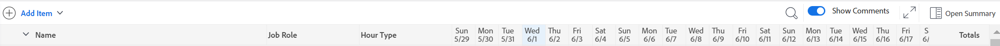

# 時程表配置總覽

<!-- Audited: 12/2023 -->

<!--The highlighted information on this page refers to functionality not yet generally available. It is available only in the Preview environment for all customers or in Production for customers who enabled fast releases. 

For information about fast releases, see [Enable or disable fast releases for your organization](/help/quicksilver/administration-and-setup/set-up-workfront/configure-system-defaults/enable-fast-release-process.md).

For information about the current release schedule, see [Second Quarter 2024 release overview](/help/quicksilver/product-announcements/product-releases/24-q2-release-activity/24-q2-release-overview.md).-->

本文說明Adobe Workfront中時程表的配置，讓您更瞭解如何自訂及利用時程表來記錄時間。

時程表和小時偏好設定控制要在時程表上顯示的內容。 本文提供所有可用選項的概觀。 如需選取選項的詳細資訊，請參閱[設定時程表和小時喜好設定](../../administration-and-setup/set-up-workfront/configure-timesheets-schedules/timesheet-and-hour-preferences.md)。

如需如何在時程表上記錄時間的詳細資訊，請參閱[記錄時間](../../timesheets/create-and-manage-timesheets/log-time.md)。

以下為時程表的區域：

* [時程表標題](#timesheet-header)
* [左側面板](#the-left-panel)
* [工作專案](#work-items)
* [工具欄](#toolbar)
* [時程表頁尾](#timesheet-footer)
* [工作角色](#job-role)
* [時數類型](#hour-type)
* [更新左側面板中的區域](#updates-area-in-the-left-panel)
* [摘要面板](#summary-panel)
* [時間範圍和小時輸入區域](#time-frame-and-hour-entry-area)
* [小時輸入註解](#hour-entry-comments)
* [時數](#hours)
* [總計](#totals)

## 時程表標題

時程表標題包含下列資訊：

* 時程表的時間範圍。
* 包含以下專案的「動作」區域：
   * 星形圖示可將時程表新增至您的最愛清單。
   * 更多圖示和允許您刪除時程表的刪除選項。
* 時程表所有者的名稱。
* 針對時程表中顯示的專案所記錄的時數總計。
* 加班小時數。 這是手動專案，只有在時程表上啟用&#x200B;**加班**&#x200B;設定時才會顯示。 如需詳細資訊，請參閱[編輯時程表資訊](../create-and-manage-timesheets/edit-timesheets.md)。

>[!TIP]
>
>您無法記錄的加班時數大於時程表上目前的總時數。 例如，如果您目前為止在時程表中記錄7小時，則無法記錄8小時的加班。

* 時程表狀態。

## 左側面板

您可以存取左側面板中的下列區段：

* **時程表**：顯示實際時程表。
* **更新**：顯示時程表的評論和系統更新。 如需詳細資訊，請參閱本文左面板[&#128279;](#updates-area-in-the-left-panel)中的更新區域。

## 工作專案

工作專案是您想要記錄時間的專案、任務和問題。 按一下標題列中的向下箭頭會收合下方所列的專案與任務和問題。 按一下專案名稱旁的向下箭頭會收合該專案的工作專案。

在時程表外記錄時間，或在時程表時間範圍內計畫的專案的任務、問題和專案會自動顯示在這裡。

## 工具欄

工具列包含下列選項：

* **新增專案**&#x200B;按鈕可讓您新增專案、任務或問題。
* 快速篩選圖示可搜尋時程表中的任務或問題。
* **顯示註解**&#x200B;設定可讓您檢視或隱藏專案、任務或問題時數專案所記錄的時數註解。
* 以全熒幕模式顯示時程表的全熒幕圖示。
* **開啟摘要** （或&#x200B;**關閉摘要**）按鈕可開啟或關閉摘要面板，以檢視任務或問題的其他資訊。 此按鈕不適用於專案。

如需詳細資訊，請參閱[記錄時間](../create-and-manage-timesheets/log-time.md)。

## 時程表頁尾

您可以按一下此區域中的&#x200B;**提交核准**、**關閉**、**核准**&#x200B;和&#x200B;**拒絕**&#x200B;按鈕，以關閉或拒絕時程表核准。

此區域也包含上次儲存時程表的時間相關資訊。 您對時程表中的資訊所做的所有變更都會自動儲存。

## 職務角色

您可以選取不同的工作角色來與小時專案建立關聯。 您的Workfront管理員必須手動啟用&#x200B;**將工作角色指派給時數專案**&#x200B;設定。 當您被指派任務或問題時，預設會顯示為您指定的工作角色。 如果您未被指派任務或問題的工作角色，則您的主要角色將顯示為預設值。 如需詳細資訊，請參閱[設定時程表和小時喜好設定](../../administration-and-setup/set-up-workfront/configure-timesheets-schedules/timesheet-and-hour-preferences.md)。

您可以為不同角色的相同工作專案記錄多個小時專案。 如需詳細資訊，請參閱[記錄時間](../create-and-manage-timesheets/log-time.md)。

## 時數類型

您可以選取不同的小時型別，以便與每個專案的小時專案產生關聯。 此欄位僅在Workfront管理員為您的環境啟用時顯示。 如需詳細資訊，請參閱[設定時程表和小時喜好設定](../../administration-and-setup/set-up-workfront/configure-timesheets-schedules/timesheet-and-hour-preferences.md)。

您可以為不同的小時型別記錄同一工作專案的多個小時專案。 如需詳細資訊，請參閱[記錄時間](../create-and-manage-timesheets/log-time.md)。

## 更新左側面板中的區域

您可以在時程表上發表評論，與時程表核准者或其他使用者在時程表左側面板的更新區段中溝通。

對時程表所做的任何評論都會顯示在此區域中。

## 摘要面板

您可以存取時程表中顯示的任務或問題的摘要面板。 從這裡，您可以對任務和問題發表評論，或更新其資訊。 如需詳細資訊，請參閱[摘要概觀](../../workfront-basics/the-new-workfront-experience/summary-overview.md)。

您在時程表摘要面板中為工作專案輸入的評論會顯示在任務或問題的更新區域中。 摘要面板不適用於專案。

## 時間範圍和小時輸入區域

時程表的時間範圍會顯示在工作專案的右側。

您可以建立一週、兩週或四周的時程表。

時間範圍會以整週為單位顯示。 指定時程表時間範圍以外的天數會變暗。 您無法記錄超出時程表時間範圍的天數。

如需詳細資訊，請參閱[建立單一使用時程表](../create-and-manage-timesheets/create-tmshts.md)或[建立、編輯和指派時程表設定檔](../create-and-manage-timesheets/create-timesheet-profiles.md)。

<!--drafted for the resize columns in timesheets story - make this blurb a TIP when the story is released: 
You can resize the columns that display different weeks, the time frame, or the work item areas by dragging and dropping the vertical lines that separate them.-->

## 小時輸入註解

您可以為新增到時程表的每個小時專案新增註解。

您在時數專案註解方塊中輸入的註解會顯示在您記錄工具列中&#x200B;**顯示註解**&#x200B;設定啟用時間的每個工作專案下的時程表中。

## 時數

時程表提供每個工作專案的輸入欄位和時程表範圍中的日期，以記錄處理專案所花費的時間。 當您記錄時間時，您記錄時間以淺藍色醒目提示的專案和時數方塊的外框會以深藍色顯示。

## 總計

檢閱在時程表上輸入的所有時數總和，依日（在時程表標題中）以及依物件（在最後一欄）摘要。
