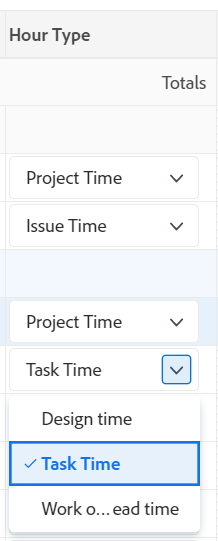

# 了解工時單佈局

本文說明Adobe Workfront中時單的版面配置，讓您更清楚了解如何自訂及使用時單來記錄時間。

工時單和工時首選項控制工時單上顯示的內容。 本文概述所有可用選項。 如需詳細資訊，請參閱 [配置工時單和小時首選項](../../administration-and-setup/set-up-workfront/configure-timesheets-schedules/timesheet-and-hour-preferences.md).

有關如何登錄時間表的資訊，請參見 [記錄時間](../../timesheets/create-and-manage-timesheets/log-time.md).

以下是工時單的區域：

* [時間表標題](#timesheet-header)
* [左側面板](#the-left-panel)
* [工作項目](#work-items)
* [工具欄](#toolbar)
* [時間表頁尾](#timesheet-footer)
* [工作角色](#job-role)
* [時數類型](#hour-type)
* [左側面板的更新區域](#updates-area-in-the-left-panel)
* [摘要面板](#summary-panel)
* [時間範圍和小時進入區域](#time-frame-and-hour-entry-area)
* [小時條目注釋](#hour-entry-comments)
* [時數](#hours)
* [總計](#totals)

## 時間表標題

工時單標題包括以下資訊：

* 時間表的時間範圍。
* 「動作」區域包含下列項目：
   * 一個星形表徵圖，用於將時間表添加到收藏夾清單中。
   * 帶有「刪除」選項的「更多」表徵圖，可從中刪除工時單。
* 工時單所有者的名稱。
* 工時表中顯示的項記錄的總小時數。
* 加班小時數。 這是手動輸入，只有在 **加班** 在時間表上啟用了設定。 如需詳細資訊，請參閱 [編輯工時單資訊](../create-and-manage-timesheets/edit-timesheets.md).

>[!TIP]
>
>不能記錄比工時單上當前總小時數更多的加班小時數。 例如，如果到目前為止在工時單上記錄了7小時，則無法記錄8小時的加班。

* 時間表狀態。

## 左側面板

您可以存取左側面板中的下列區段：

* **工時單**:顯示實際工時單。
* **更新**:顯示時間表的注釋和系統更新。 如需詳細資訊，請參閱 [左側面板的更新區域](#updates-area-in-the-left-panel) 一節。

## 工作項目

工作項目是您要記錄時間的項目、任務和問題。 按一下標題列中的向下箭頭，可收合專案以及下方列出的工作和問題。 按一下專案名稱旁的向下箭頭，可折疊該專案的工作項目。

在時間表之外記錄時間的任務、問題和項目，或在時間表的時間範圍內計畫的項目，自動顯示在此處。

## 工具欄

工具列包含下列選項：

* 可在其中添加項目、任務或問題的「添加項目」按鈕。
* 快速篩選表徵圖，用於搜索工時單中的任務或問題。
* 此 **顯示注釋** 允許您查看或隱藏針對項目、任務或問題小時條目記錄的小時備注的設定。
* 全螢幕表徵圖，可以在全螢幕模式下顯示時間表。
* **開啟摘要** (或 **關閉摘要**)按鈕，您可以在其中開啟或關閉「摘要」面板，以查看有關任務或問題的其他資訊。 這不適用於專案。

如需詳細資訊，請參閱 [記錄時間](../create-and-manage-timesheets/log-time.md).

## 時間表頁尾

您可以按一下此區域中的「提交以進行批准」、「關閉」、「批准」和「拒絕」按鈕，以關閉或拒絕工時表審批。

此區域還包含有關上次保存時間表的資訊。 您對工時單中的資訊所做的所有更改都會自動保存。

## 職務角色

您可以選擇不同的作業角色以與小時條目關聯。 您的Workfront管理員必須啟用手動設定「將作業角色指派給小時項目」 。 當您被分配給任務時，預設會顯示為您指定的作業角色或問題。 如果未在任務或問題上分配作業角色，則預設會顯示您的主要角色。 如需詳細資訊，請參閱文章 [配置工時單和小時首選項](../../administration-and-setup/set-up-workfront/configure-timesheets-schedules/timesheet-and-hour-preferences.md).

您可以為不同角色記錄相同工作項目的多個小時項目。 如需詳細資訊，請參閱 [記錄時間](../create-and-manage-timesheets/log-time.md).

## 時數類型

您可以選擇不同的小時類型以與每個項目上的小時條目相關聯。 只有在Workfront管理員為您的環境啟用此欄位時，才會顯示此欄位。 如需詳細資訊，請參閱文章 [配置工時單和小時首選項](../../administration-and-setup/set-up-workfront/configure-timesheets-schedules/timesheet-and-hour-preferences.md).

您可以記錄不同小時類型的同一工作項的多個小時條目。 如需詳細資訊，請參閱 [記錄時間](../create-and-manage-timesheets/log-time.md).

## 左側面板的更新區域

您可以對工時單進行注釋，以便與您的工時單批准者或左側面板的「更新」部分中的其他用戶進行通信。

在時間表上作出的任何注釋都顯示在該區域，位於時間表的底部。 此區域顯示在工時單下方和工時單頁腳上方。 如需詳細資訊，請參閱 [查看和管理工時單上的注釋](../create-and-manage-timesheets/view-and-manage-comments-timesheets.md).

## 摘要面板

您可以對時間表中顯示的任務或問題的「摘要」面板訪問進行注釋。 您可以從這裡對任務和問題發表評論，或更新其資訊。 如需詳細資訊，請參閱 [摘要概觀](../../workfront-basics/the-new-workfront-experience/summary-overview.md).

在工時單「摘要」面板中為工作項輸入的注釋將顯示在任務或問題的「更新」區域中。 「摘要」面板不適用於專案。

## 時間範圍和小時進入區域

工時單的時間範圍顯示在工作項的右側。

您可以建立一、二或四周的工時單。

時間範圍會以整周增量顯示。 指定時間表時間範圍以外的天數將呈灰色。 不能記錄時間表時間範圍之外的天數。

如需詳細資訊，請參閱 [建立單次使用工時單](../create-and-manage-timesheets/create-tmshts.md) 或 [建立、編輯和分配工時單配置檔案](../create-and-manage-timesheets/create-timesheet-profiles.md).

<!--drafted for the resize columns in timesheets story - make this blurb a TIP when the story is released: 
You can resize the columns that display different weeks, the time frame, or the work item areas by dragging and dropping the vertical lines that separate them.-->

## 小時條目注釋

您可以為添加到工時單的每小時條目添加註釋。

您在工時錄入備注框中輸入的備注顯示在工時單中，並顯示在您記錄工時的每個工作項下 **顯示注釋** 設定。

## 時數

工時單為每個工作項和工時單範圍的日期提供輸入欄位，以記錄用於物料的逗留時間。 在記錄時間時，以淺藍色記錄突出顯示的時間項和以深藍色列出的小時框。

## 總計

複查在工時單上輸入的所有工時的總和，按日匯總（在工時單的標題中）以及按對象匯總（在最後一列中）。
