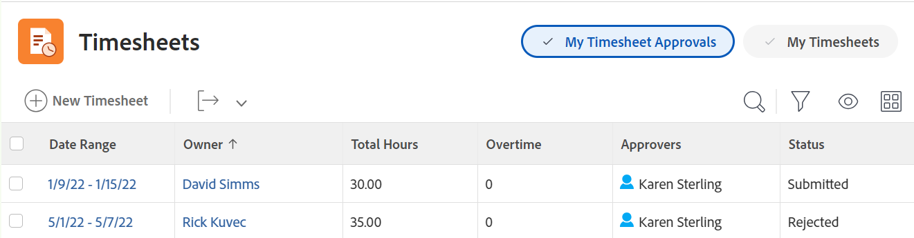

# 時程表總覽

<!-- Audited: 12/2023 -->

您可以使用時程表來追蹤Adobe Workfront內外您花在工作上的時間。

您可以在工作專案上記錄專案時間，例如專案、任務和問題。 任務、問題和專案的登入時間會自動顯示在您的時程表中。

您也可以在一般時間下，將非工作相關專案（例如會議、培訓或離公司時間）的非專案時間直接記錄到您的時程表中。

如需有關如何在Workfront中記錄時間的詳細資訊，請參閱[記錄時間](../../timesheets/create-and-manage-timesheets/log-time.md)。

>[!TIP]
>
>如果您是Workfront或群組管理員，可以建立時程表並將其與使用者建立關聯。 如需關於建立時程表的資訊，請參閱[建立和管理時程表：文章索引](../create-and-manage-timesheets/create-and-manage-timesheets.md)。

## 瞭解專案時間與非專案時間

時程表為使用者提供追蹤專案和非專案工作時間的簡單方式：

* **專案時間：**&#x200B;直接從您要追蹤時間的任務或專案取得。

  透過時程錶針對任務、問題和專案記錄的小時與各自的工作專案產生關聯，以準確表示在專案和任務上所花費的精力。 如果沒有準確的時間輸入，如果您的資料用於計費目的，可能會不準確。

  此外，當資源直接在任務上記錄時數時，當使用者存取時程表時，問題和專案會自動出現。 這是假設時程表日期範圍跨越記錄時數的日期。

* **非專案時間：**&#x200B;直接在使用者時程表上。 如需如何在Workfront中追蹤時間的詳細資訊，請參閱   [記錄時間](../../timesheets/create-and-manage-timesheets/log-time.md)。

  在時程表中，您可以記錄休假時數、病假時數、運輸時數、維修或維護裝置時數，或您希望建立的任何一般管理時數型別。

## 存取時程表區域中的時程表

依預設，所有使用者都可以使用時程表區域。 Workfront管理員可視需要在版面配置範本中變更此設定。 如需詳細資訊，請參閱[使用配置範本自訂主功能表](/help/quicksilver/administration-and-setup/customize-workfront/use-layout-templates/customize-main-menu.md)。

若要存取時程表：

{{step1-to-timesheets}}

您的所有時程表以及您預設有權顯示的時程表。 如需Adobe Workfront中時程表配置的相關資訊，請參閱[時程表配置總覽](../../timesheets/timesheets/timesheet-layout.md)。

1. 按一下右上角的以下選項之一，以顯示您的時程表：

   * **我的時程表**，只顯示您的時程表。

   

   * **我的時程表核准**&#x200B;只顯示您核准的時程表。

     

1. （選用）更新時程表清單頂端的檢視、篩選和群組。 如需詳細資訊，請參閱[報告元素：篩選器、檢視和群組](../../reports-and-dashboards/reports/reporting-elements/reporting-elements-overview.md)。

1. 按一下時程表的&#x200B;**日期範圍**&#x200B;以開啟。

   每個時程表都會顯示您已記錄時間的所有任務、問題和專案。 時程表也會顯示最多45個指派給您的任務和問題，其日期在時程表的時間範圍內，但您可能尚未記錄時間。 系統會選取45個最近更新的專案以顯示於時程表中。

   如需詳細資訊，請參閱[設定時程表和小時喜好設定](../../administration-and-setup/set-up-workfront/configure-timesheets-schedules/timesheet-and-hour-preferences.md)。
