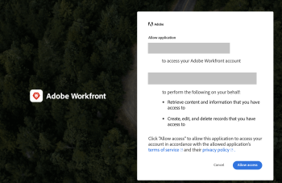

# 使用授權碼流程設定及使用貴組織的自訂OAuth 2應用程式

若要與Workfront整合，並允許您的用戶端應用程式代表使用者與Workfront通訊，您必須：

* 建立OAuth2應用程式
* 設定第三方應用程式
* 連結至您使用者的授權頁面
* 設定授權碼流程：使用者登入Workfront執行個體，並同意允許用戶端應用程式代表其連線至Workfront。 因此，您會取得授權碼，與存取權和重新整理權杖進行交換。
* 設定重新整理代號流程：在此流程中，您會使用重新整理Token，在舊存取Token過期時取得新的存取Token。

## 建立OAuth2應用程式

如需建立OAuth2應用程式的指示，請參閱 [使用使用者憑證建立OAuth2應用程式（授權程式碼流程）](../../administration-and-setup/configure-integrations/create-oauth-application.md#create3) in [建立OAuth2應用程式以進行Workfront整合](../../administration-and-setup/configure-integrations/create-oauth-application.md)

## 連結至您使用者的授權頁面

您的使用者需登入，才能在自己的帳戶中授權此整合。 授權的頁面有特定格式，如此處所述。 使用此資訊可判斷應用程式的授權頁面位址，並提供此位址或連結給使用者。

* 貴組織網域的完整URL。 範例:

   ```
   https://myorganization.my.workfront.com
   ```


* `client_id`:這是您在Workfront中建立OAuth2應用程式時產生的用戶端ID。

* `redirect_uri`:這是您在建立應用程式時輸入的重新導向URL。 當使用者為其帳戶授權應用程式後，會將您的使用者導向至此頁面。

* `response_type`:這必須具有值 `code`.

因此，授權頁面的URL為：

```
https://<URL of your organization's domain>/integrations/oauth2/authorize?client_id=<Your ClientID>&redirect_uri=<Your redirect URL>&response_type=code
```

>[!NOTE]
>
>建議您建立按鈕或其他連結，供您的使用者點按，以導向至本頁面。

## 設定第三方應用程式

第三方應用程式可能需要配置。 下表包含有關配置第三方應用程式時可能需要的欄位的資訊。

<table style="table-layout:auto"> 
 <col> 
 <col> 
 <tbody> 
  <tr> 
   <td role="rowheader">授權URI</td> 
   <td> <p><code>https://&lt;the full URL of your organization's domain&gt;/integrations/oauth2/authorize</code> </p> <p class="example" data-mc-autonum="<b>Example: </b>"><span class="autonumber"><span><b>範例: </b></span></span><code> https://myorganization.my.workfront.com/integrations/oauth2/authorize</code> </p> </td> 
  </tr> 
  <tr> 
   <td role="rowheader">代號URL</td> 
   <td> <p><code>https://&lt;the full URL of your organization's domain&gt;/integrations/oauth2/api/v1/token</code> </p> <p class="example" data-mc-autonum="<b>Example: </b>"><span class="autonumber"><span><b>範例: </b></span></span><code>https://myorganization.my.workfront.com/integrations/oauth2/api/v1/token</code> </p> </td> 
  </tr> 
  <tr> 
   <td role="rowheader">範圍</td> 
   <td>您不需要指定範圍。 </td> 
  </tr> 
 </tbody> 
</table>

## 設定授權碼流程


若要使用OAuth2登入您的使用者，請使用下列程式：

1. 使用者開啟授權頁面時，會重新導向至Workfront登入頁面，讓使用者可以登入Workfront。 如果使用者有SSO設定，將會開啟身分提供者登入頁面。

   如果使用者已在相同瀏覽器上登入Workfront，或使用者成功登入Workfront，系統會將使用者重新導向至同意畫面：

   

1. 如果使用者允許存取，則頁面會重新導向至 `redirect_url`. 重新導向必須包含下列查詢參數：

* `code`:取得存取/重新整理Token所需的授權程式碼。
* `domain`:您組織的網域。 範例：in `myorganization.my.workfront.com`，網域為 `myorganization`.
* `lane`:請求的通道。 範例：in `myorganization.preview.workfront.com`，車道是 `preview`.

   >[!IMPORTANT]
   >
   >此 `code` 只有2分鐘有效。 因此，您必須在該時間內取得重新整理和存取Token。

1. 當您有程式碼時，可以將程式碼連同用戶端應用程式憑證傳送至 `/integrations/oauth2/api/v1/token` 端點。

   完整的Token要求URL為

   ```
   https://<URL of your organization's domain></span>/integrations/oauth2/api/v1/token
   ```

   **範例：**  對Token端點進行CURL呼叫的範例：

   範例1

   ```
      curl --location --request POST '**<workfront host>**/integrations/oauth2/api/v1/token' \
      --header 'Authorization: Basic **<base64(client_id:client_secret)>**' \
      --header 'Content-Type: application/json' \
      --data-raw '{
      "code": "**<code>**",
      "grant_type": "**authorization_code**",
      "redirect_uri": "**<redirect_url>**"
      }'
   ```

   範例2

   ```
      curl --location --request POST '**<workfront host>**/integrations/oauth2/api/v1/token' \
      --header 'Content-Type: application/x-www-form-urlencoded' \
      --data-urlencode 'grant_type=**authorization_code**' \
      --data-urlencode 'redirect_uri=**<redirect_url>**' \
      --data-urlencode 'code=**<code>**' \
      --data-urlencode 'client_id=**<client_id>**' \
      --data-urlencode 'client_secret=**<client_secret>**'  
   ```


   >[!IMPORTANT]
   >
   > 在Workfront中註冊應用程式時，會產生用戶端密碼。 您應將其儲存在安全位置，因為如果丟失，則無法恢復。

   當所有傳遞的參數皆正確時，Token端點會傳回下列裝載：

   ```
   {
      "token_type": "sessionID",
      "access_token": "string", // the value of sessionID
      "refresh_token": "string",
      "expires_in": 0,
      "wid": "string"
   }
   ```

   存取權杖與相同 ```sessionID```，而且會以與一般相同的方式過期 ```sessionID```

   >[!IMPORTANT]
   >
   > 將重新整理代號儲存在安全位置。 您需要它，才能在舊的重新整理代號過期時取得新的重新整理代號。 Workfront不會儲存您的重新整理Token。

1. 現在，當您擁有存取權杖時，可以對Workfront進行API呼叫

   ```
   curl --request GET 'https://<workfront host>/attask/api/v14.0/proj/search \
   --header 'sessionID: <access_token>'
   ```

## 設定刷新訪問權杖


若要重新整理access_token，我們再次需要對Token端點執行「POST」呼叫。 這次，我們會傳送不同的表單資料，如下所示：

```
curl --location --request POST '<workfront host>/integrations/oauth2/api/v1/token' \
--header 'Authorization: Basic <base64(client_id:client_secret)>' \
--header 'Content-Type: application/json' \
--data-raw '{
   "grant_type": "refresh_token",
   "refresh_token": "<refresh_token>"
}'

###### OR

curl --location --request POST '<workfront host>/integrations/oauth2/api/v1/token' \
--header 'Content-Type: application/x-www-form-urlencoded' \
--data-urlencode 'grant_type=refresh_token' \
--data-urlencode 'redirect_uri=<redirect_url>' \
--data-urlencode 'refresh_token=<refresh_token>' \
--data-urlencode 'client_id=<client_id>' \
--data-urlencode 'client_secret=<client_secret>'
```

它會傳回下列結果：

```
{
  "token_type": "sessionID",
  "access_token": "string", // the value of sessionID
  "refresh_token": "string",
  "expires_in": 0,
  "wid": "string"
}
```

同樣地，存取權杖是 `sessionID` 可用來向Workfront提出API要求。
