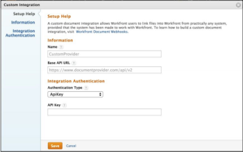

# 註冊Webhook整合

{{highlighted-preview}}

Adobe Workfront管理員可透過導覽至Workfront中的「設定>檔案>自訂整合」，為其公司新增自訂webhook整合。 在「設定」的「自訂整合」頁面中，管理員可以檢視現有檔案Webhook整合的清單。 您可以在此頁面新增、編輯、啟用和停用整合。

若要新增整合，請按一下[新增自訂整合]。****

## 可用欄位

新增整合時，管理員將在下列欄位中輸入值。

<table style="table-layout:auto"> 
 <col> 
 <col> 
 <thead> 
  <tr> 
   <th>欄位名稱</th> 
   <th>說明</th> 
  </tr> 
 </thead> 
 <tbody> 
  <tr> 
   <td>名稱</td> 
   <td>此整合的名稱。</td> 
  </tr> 
  <tr> 
   <td>基底 API URL</td> 
   <td> 
回撥API的位置。 呼叫外部系統時，Workfront僅會將端點名稱附加至此位址。 例如，如果管理員輸入基本API URL " https://www.mycompany.com/api/v1 "，Workfront將使用以下URL來取得檔案的中繼資料：https://www.mycompany.com/api/v1/metadata?id=1234。
 </td> 
  </tr> 
  <tr> 
   <td>要求引數</td> 
   <td> 
要附加到每個API呼叫的querystring的選用值。 例如，access_type=offline。 
 </td> 
  </tr> 
  <tr> 
   <td>驗證類型</td> 
   <td>OAuth2或ApiKey</td> 
  </tr> 
  <tr> 
   <td>驗證 URL</td> 
   <td> 
（僅限OAuth2）用於使用者驗證的完整URL。 Workfront會在OAuth布建程式過程中，將使用者導覽至此位址。 注意： Workfront會將「state」引數附加至查詢字串。 提供者必須透過將此附加至Workfront重新導向URI，將其傳回Workfront。
 </td> 
  </tr> 
  <tr> 
   <td>權杖端點 URL</td> 
   <td> 
（僅限OAuth2）用於擷取OAuth2 Token的完整API URL。 這是由webhook提供者或外部檔案提供者所託管
 </td> 
  </tr> 
  <tr> 
   <td>用戶端 ID</td> 
   <td>（僅限OAuth2）此整合的OAuth2使用者端ID</td> 
  </tr> 
  <tr> 
   <td>用戶端密碼</td> 
   <td> 
（僅限OAuth2）此整合的OAuth2使用者端密碼
 </td> 
  </tr> 
  <tr> 
   <td>Workfront 重新導向 URI</td> 
   <td>（僅限OAuth2）這是唯讀欄位，由Workfront產生。 此值可用來向外部檔案提供者註冊此整合。 注意：如上述驗證URL所述，提供者在執行重新導向時，必須將"state"引數及其值附加至查詢字串。</td> 
  </tr> 
  <tr> 
   <td>ApiKey</td> 
   <td> 
（僅限ApiKey）用來對webhook提供者進行授權的API呼叫。 webhook提供者所發行的API金鑰。
 </td> 
  </tr> 
  <tr class="preview"> 
   <td>啟用大型檔案的區塊上傳</td> 
   <td> 
選取此核取方塊可為25 MB以上的檔案啟用多部分（區塊）上傳。 若未選取，無論檔案大小，都會以單一請求上傳檔案。
 </td> 
  </tr> 
  <tr class="preview"> 
   <td>區塊上傳臨界值 (MB)</td> 
   <td> 
分割大型檔案以供上傳時，每個區塊的大小上限（以MB為單位）。 接受最多100 MB的值。
 </td> 
  </tr> 
 </tbody> 
</table>
