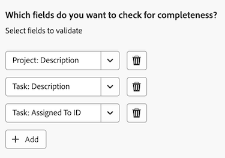
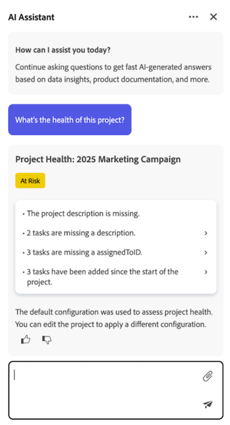

# 專案健康情況概觀

>[!IMPORTANT]
>
>專案健康狀態功能目前僅適用於參與Beta階段的使用者。

Adobe Workfront的專案運作狀態功能利用AI Assistant的強大功能，立即為您提供專案執行方式、需要您關注的領域以及如何避免可能會耗費您時間和金錢的問題的評估。

AI助理可以產生下列物件的專案健康情況評估：

* 單一專案
* 單一計畫
* 多個專案

如需AI助理的詳細資訊，請參閱[AI助理概述](/help/quicksilver/workfront-basics/ai-assistant/ai-assistant-overview.md)。

+++ 展開以檢視本文中功能的存取需求。

<table style="table-layout:auto"> 
<col> 
</col> 
<col> 
</col> 
<tbody> 
<tr> 
   <td role="rowheader">
Adobe Workfront套件
</td> 
   <td> 

選取或更高 
 

工作流程選取或以上

   </td> 
<tr> 
 <tr> 
   <td role="rowheader">
Adobe Workfront授權
</td> 
   <td> 

標準
 
   </td> 
   </tr> 
  </tr> 
  <tr> 
   <td role="rowheader">
存取層級設定
</td> 
   <td>
您必須是系統管理員才能管理專案健康情況設定 

   
編輯專案的存取權以套用專案健康情況設定 

     
檢視專案的存取權以檢視專案健康情況設定 

  </td> 
  </tr>  
    </tr>  
</tbody> 
</table>

如需有關此表格的詳細資訊，請參閱Workfront檔案中的[存取需求](/help/quicksilver/administration-and-setup/add-users/access-levels-and-object-permissions/access-level-requirements-in-documentation.md)。
+++

## 註冊Project Health測試版

為了利用專案健康狀態，您的組織必須啟用AI助理。

若要為貴組織啟用AI助理和專案健康狀態，必須套用下列所有專案：

* 貴組織必須已移轉至Adobe IMS (Identity Management系統)。
* 貴組織必須有Select、Prime或Ultimate Workfront計畫
* 必須啟用Adobe Unified Experience。
* Adobe必須有已簽署的Adobe Gen AI合約檔案。
* Workfront管理員必須為貴組織中的使用者啟用AI助理。 AI助理是透過存取層級啟用。
* 在「設定>系統>偏好設定」的「AI偏好設定」區段中，必須同時選取「啟用AI」和「專案健康狀態」選項。

  

如需詳細資訊，請參閱[AI助理概述](/help/quicksilver/workfront-basics/ai-assistant/ai-assistant-overview.md)和[設定系統偏好設定](/help/quicksilver/administration-and-setup/manage-workfront/security/configure-security-preferences.md)。

## 如何計算專案健康狀態

AI Assistant可指派一個可用的專案健康狀態，讓您快速評估專案的整體狀況：

* 達成目標
* 有風險
* 陷入困境

此狀態是使用專案元件計算的，例如專案進度、低估的工作等等。 如需用來測量專案健全狀態的元件完整清單，請參閱[專案和方案狀態清單](#project-and-program-states-list)區段。

系統會為每個專案元件指派介於(0-100)的數字風險分數，然後取平均值以建立整體專案健康狀態：

* 鎖定目標（75或以上）：專案效能在預期的臨界值內。
* 有風險(50-74)：偵測到可能會影響專案效能的新問題。
* 發生問題（49或以下）：專案效能低於可接受的臨界值，需要立即處理。

>[!NOTE]
>
>* AI助理目前只會評估所選專案的資料。
>* 跨專案或歷史分析尚未包含在專案健康情況計算中。

### 計算專案之專案健康狀況的範例

在第一個範例中，系統會評估4個專案元件，其個別風險分數計算如下：

* 2達成目標（90個風險分數）
* 1有風險（45個風險分數）
* 1個陷入困境（20個風險分數）

當您平均這些分數時，結果是61。 使用上面列出的專案健康情況條件，這會將此專案置於風險狀態。

在下一個範例中，1天的排程變更已在專案時間表的前段發生。 在此案例中，AI Assistant會評估變更的時間以及相對於專案整體期間的影響：

* 在60天的專案時間表早期，1天的排程轉換是次要的，通常分數為「準時」。
* 在專案完成日期附近的1天排程轉換更具破壞性，可能會獲得「有風險」或「存在問題」評分。

由於變更是次要的，且發生在專案時間表的前面，這會將專案置於「準時」狀態。

如果專案的時間表內發生多個排程變更，系統會對這些變更進行評分，然後在將其套用至專案健康狀態計算之前計算平均值。

## 瞭解專案狀態與專案狀況之間的差異

專案狀態與專案運作狀態在Workfront中是類似的概念，並且擁有相同的預設名稱來說明專案狀態或狀態（達成目標、有風險和存在問題），但它們有不同的用途。

專案狀況僅根據計畫、預計和估計日期，提供專案目前執行方式的基本快照。 可由專案所有者手動設定，或由Workfront根據專案任務自動設定。 或者，專案健全性可提供更全面的功能，並評估其他因素，讓您更深入瞭解其效能。

如需專案條件的詳細資訊，請參閱[自訂條件](/help/quicksilver/administration-and-setup/customize-workfront/create-manage-custom-conditions/custom-conditions.md)。

## 專案和方案狀態清單

下表包含在產生專案健康狀態評估時，AI助理將指派您的專案或方案的可用狀態劃分。

<table>
    <tr>
        <td><b>專案狀態</b></td>
        <td><b>定義</b></td>
        <td><b>因素</b></td>
    </tr>
    <tr>
        <td>達成目標</td>
        <td>當以下因素的平均風險等級處於健康臨界值內時，就會指派此專案。
        </td>
        <td> 
        <ul><li>範圍蔓延</li>
        <li>缺少欄位</li>
        <li>排程變更</li>
        <li>低估的工作</li>
        <li>專案進度</li>
        <li>逾期任務</li>
        <li>預算</li>
        </ul></td>
    </tr>
    <tr>
        <td>有風險</td>
        <td>當以下因素的平均風險等級剛好低於健康臨界值時，就會指派此專案。</td>
        <td>
        <ul><li>範圍蔓延</li>
        <li>缺少欄位</li>
        <li>排程變更</li>
        <li>低估的工作</li>
        <li>專案進度</li>
        <li>逾期任務</li>
        <li>預算</li>
        </ul></td>
    </tr>
    <tr>
        <td>陷入困境</td>
        <td>當下列因素的平均風險等級低於健康臨界值時，就會指派此專案。</td>
        <td>
        <ul><li>範圍蔓延</li>
        <li>缺少欄位</li>
        <li>排程變更</li>
        <li>低估的工作</li>
        <li>專案進度</li>
        <li>逾期任務</li>
        <li>預算</li>
        </ul></td>
    </tr>
    </tr>
   </table>

## AI助理提示清單

以下是一份提示清單，可供您用來要求AI評估為專案、方案或帳戶中的所有專案產生專案健康情況評估。

<table>
    <tr>
        <td><b>位置</b></td>
        <td><b>提示</b></td>
    </tr>
    <tr>
        <td>特定專案詳細資訊頁面</td>
        <td><em>此專案的狀況如何？</em></td>
    </tr>
    <tr>
        <td>Workfront中的任何頁面 </td>
        <td><em>[專案名稱]的狀況如何？</em></td>
    </tr>
    <tr>
        <td>Workfront中的任何頁面 </td>
        <td><em>我的專案狀況如何？</em></td>
    </tr>
       <tr>
        <td>特定計畫詳細資訊頁面</td>
        <td><em>此方案的健康情況如何？</em></td>
    </tr>
       <tr>
        <td>Workfront中的任何頁面 </td>
        <td><em>[計畫名稱]計畫的健康情況如何？</em></td>
    </tr>
   </table>

## 管理專案健康情況設定

專案健康狀態設定包含特定條件，可決定如何計算專案健康狀態。 建立設定後，您可以將其套用至專案。

>[!NOTE]
>
>您必須是系統管理員才能管理專案健康情況設定。

{{step-1-to-setup}}

1. 按一下左側面板中的&#x200B;**專案偏好設定**，然後在出現的下拉式清單中選取&#x200B;**專案狀況**。

1. 在頁面的右上角，選取&#x200B;**新組態**。

1. （選擇性）在組態詳細資訊頁面上，將&#x200B;*未命名的組態*&#x200B;取代為新組態&#x200B;**名稱**。

1. 在&#x200B;**您要在專案狀況中包含哪些因素**&#x200B;區段中，取消選取您在決定專案狀況條件時不想要包含的任何因素：
   * **範圍變化**：專案範圍自開始以來已擴展多少。

   * **必要欄位**：如果缺少任何必要欄位（例如專案描述）。 這些必填欄位決定專案完整性，並在&#x200B;**您要檢查哪些欄位是否完整？下方的**&#x200B;設定區段。

   * **排程變更**：自專案啟動後，已發生多少個排程變更。

   * **任務估計**：任務工作的估計精確度（例如，專案中目前沒有逾期任務）。

   * **任務待執行工作**：專案的工作進度與專案時間表比較。

   * **逾期工作**：目前有多少工作已逾期。

   * **成本**：如果專案目前超出預算。

1. 在&#x200B;**中，您的專案何時正式開始？**&#x200B;區段，從下拉式清單中選取代表專案開始的事件。

1. 在&#x200B;**中，您如何估計專案的工作範圍？**&#x200B;區段，選取隨著專案範圍增加而增加的專案係數。

1. 在&#x200B;**您要檢查完整性的欄位中？**&#x200B;區段，選取一或多個要檢查以判斷專案完整性的欄位。

   

1. 按一下右上角的&#x200B;**儲存**。

## 套用專案健康情況設定

管理員建立專案健康情況設定後，擁有編輯存取權的使用者可以將其套用至專案。

{{step1-to-projects}}

1. 在&#x200B;**專案**&#x200B;頁面上，選取專案。

1. 按一下專案名稱右側的&#x200B;**更多**&#x200B;圖示，然後選取&#x200B;**編輯**。 **編輯專案**&#x200B;側面板隨即開啟。

1. 在左側面板中，選取&#x200B;**專案設定**。

1. 在&#x200B;**專案健康狀態設定**&#x200B;欄位中，選取您要套用至此專案的設定。

   

1. 按一下面板左下角的&#x200B;**儲存**。

## 產生專案或方案的專案健康情況評估

如果您擁有專案或方案的檢視存取權，可以使用AI助理產生其專案健康情況評估。

如果您正在產生專案的評鑑，您可在專案頁面中完成，或是在詢問助理專案執行方式時參考專案名稱。

如果您正在產生方案的評估，您可以從方案詳細資訊頁面進行產生。

>[!NOTE]
>
>專案開始之前，無法為專案產生專案健康情況評估。 您可以設定在專案設定中觸發專案開始的事件。

如需詳細資訊，請參閱本文中的下列章節： [管理專案健康狀態設定](#manage-project-health-configurations)。

1. 導覽至您要產生專案健康情況評估的專案或方案。

1. 在專案/方案詳細資訊頁面上，按一下畫面右上角的&#x200B;**AI助理**&#x200B;圖示。 AI助理隨即開啟。

1. 在&#x200B;**詢問有關Workfront的問題**&#x200B;欄位中輸入下列內容： *此專案的狀況如何？*

   或

   在&#x200B;**詢問有關Workfront的問題**&#x200B;欄位中輸入下列內容： *此程式的狀況如何？*

   >[!NOTE]
   >
   >如果您是從Workfront中的其他頁面存取AI小幫手，您可以輸入&#x200B;*專案[專案名稱]的狀況如何？*&#x200B;或&#x200B;*計畫[計畫名稱]的狀況如何？*  
   >如需您可以輸入的目前提示的完整清單，請參閱本文中的下列章節： [AI助理提示清單](#ai-assistant-prompts-list)。

1. 按一下&#x200B;**傳送**&#x200B;圖示。 「專案健康情況評估」會產生，並顯示在面板中。 徽章會顯示在每個專案健康狀態評估的頂端，反映專案的目前狀態。

   

   如果您要為投資組合產生評估，將會列出多個徽章，顯示方案中每個專案的狀況。 如需有關徽章標籤的詳細資訊，請參閱本文中的下列章節： [專案和方案狀態清單](#project-and-program-states-list)。

1. （選擇性）按一下其中一個評估點以展開其詳細資料。

1. （選擇性）在展開的詳細資訊模式中，按一下工作連結以開啟工作詳細資訊。

   

1. 檢閱專案健康情況詳細資訊後，按一下AI助理右上角的&#x200B;**關閉**&#x200B;圖示。

## 為多個專案產生專案健康情況評估

您可以針對您目前擁有檢視存取權（或以上存取權）的所有專案，產生合併專案健康情況評估。

如果專案已開始，專案才會包含在合併的專案健康狀態評估中。 您可以設定在專案設定中觸發專案開始的事件。 如需詳細資訊，請參閱本文中的下列章節： [管理專案健康狀態設定](#manage-project-health-configurations)。

1. 按一下畫面右上角的&#x200B;**AI小幫手**&#x200B;圖示。 AI助理隨即開啟。

1. 在&#x200B;**詢問有關Workfront的資訊**&#x200B;欄位中輸入下列內容： *我的專案狀況如何？*

   如需您可以輸入的目前提示的完整清單，請參閱本文中的下列章節： [AI助理提示清單](#ai-assistant-prompts-list)。

1. 按一下&#x200B;**傳送**&#x200B;圖示。 「專案健康情況評估」會產生，並顯示在面板中。

   

   為多個專案產生評估時，AI助理會根據專案目前執行的方式將結果分組。

1. （可選）按一下其中一個專案健康情況徽章以展開專案清單，然後選取特定專案的連結，以移至該專案的詳細資訊頁面。

1. 檢閱專案的健康情況詳細資訊後，按一下AI助理右上角的&#x200B;**關閉**&#x200B;圖示以關閉專案。

<!--

## Build a Project Health table report in a Canvas Dashboard

>[!IMPORTANT]
>
>The Canvas Dashboards feature is currently only available for users participating in the beta stage. For more information, see [Canvas Dashboards beta information](/help/quicksilver/product-announcements/betas/canvas-dashboards-beta/canvas-dashboards-beta-information.md). 

You can add a table report to a Canvas Dashboard in order to easily visualize your Project Health data in a table format.  

### Prerequisites 

You must create a dashboard before you can build a table report. 

For more, see [Create a Canvas Dashboard](/help/quicksilver/reports-and-dashboards/canvas-dashboards/create-dashboards/create-dashboards.md).

### Build a Project Health table report 

There are many configuration options available for building a Project Health table report. In this section, we'll walk you through the process of creating one that displays the following columns: 

* **Name**: Contains the project name. 
* **Project Health Analysis**: Contains a summary of the Project Health assessment. 
* **Project Health Created At**: Contains the date/time when the Project Health assessment was last generated. 
* **Project Health Label**: Contains the project's label (e.g. On Target, At Risk, or In Trouble).

{{step1-to-dashboards}}

1. In the left panel, click **Canvas Dashboards**. 
1. In the upper-right corner, click **New Dashboard**. 
1. In the **Create dashboard** box, enter the dashboard's **Name** and **Description**. 
1. Click **Create**. 
1. In the **Add report** box, select **Create report**. 
1. On the left side, select **Table**. 
1. In the upper-right corner, click **Create report**. 
1. (Optional) Follow the steps below to configure the **Details**  section: 
    1. Enter a report **Name**. 
    1. Enter a report **Description**. 
1. Follow the steps below to configure the **Build table**  section: 
    1. In the left panel, click the **Table columns** icon. 
    1. Click **Add column**, then select **Project** > **Name**. 
    1. Click **Add column**, then select **Project** > **Project Health** > **Health Analysis**. 
    1. Click **Add column**, then select **Project** > **Project Health** > **Created At**. 
    1. Click **Add column**, then select **Project** > **Project Health** > **Health Label**. 

1. Follow the steps below to configure the **Filter**  section: 
    1. In the left panel, click the **Filter** icon. 
    1. Select **Edit filter**. 
    1. Click **Add condition** and then specify the field you want to filter by and the modifier that defines what kind of condition the field must meet. The column appears in the preview section on the right.
    1. (Optional) Click **Add filter group** to add another set of filtering criteria. The default operator between the sets is AND. Click the operator to change it to OR. 

1. Follow the steps below to configure the **Drilldown Group Settings**  section: 
    1. In the left panel, click the **Group Settings** icon. 
    1. Click the **Add grouping** button and then select the field you want to create as a grouping. The grouping column appears in the preview section on the right. 

1. Click **Save** to create the report.

-->
