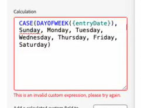

# 使用AI助理產生或修訂計算欄位公式

您可以使用「AI輔助程式」，根據您提供的提示產生公式。 您也可以解決計算欄位中無效自訂運算式的錯誤。

## 存取需求

您必須具有下列存取權才能執行本文中的步驟：

<table style="table-layout:auto"> 
 <col> 
 <col> 
 <tbody> 
  <tr> 
   <td role="rowheader">Adobe Workfront計畫</td> 
   <td>
新增：Prime或Ultimate

       
或

       
目前：無法使用
</td>
  </tr> 
  <tr> 
   <td role="rowheader">Adobe Workfront授權</td> 
   <td>
新增：標準

       
或

       
目前：無法使用
</td>
  </tr> 
 </tbody> 
</table>

如需有關此表格的詳細資訊，請參閱Workfront檔案中的[存取需求](/help/quicksilver/administration-and-setup/add-users/access-levels-and-object-permissions/access-level-requirements-in-documentation.md)。

## 先決條件

* 您的Workfront管理員必須為貴組織啟用AI助理。

  如需詳細資訊，請參閱AI助理總覽一文中的[ AI助理的必要條件](/help/quicksilver/workfront-basics/ai-assistant/ai-assistant-overview.md#prerequisites-to-ai-assistant)。
* 您的Workfront管理員必須為您的存取層級啟用AI助理。

  如需詳細資訊，請參閱[啟用或停用AI助理](/help/quicksilver/workfront-basics/ai-assistant/enable-or-disable-assistant.md)。

<!--## Generate a calculated field expression-->

## 修訂計算欄位運算式

在自訂表單產生器中建立計算欄位時，如果公式無效，則欄位下方會顯示錯誤訊息。

AI助理可以協助您將公式修訂為有效的計算欄位運算式。

若要修訂無效的計算欄位運算式：

1. 按一下熒幕右上角附近的&#x200B;**AI小幫手**&#x200B;圖示。
1. 在「AI助理員」面板底部附近的提示區域中，輸入如下提示：
   `Rewrite this formula to remove the invalid expression error`
1. 從自訂表單產生器複製無效的運算式，然後貼到提示區域。
1. 按&#x200B;**Enter**。

   AI Assistant可能需要一些時間來產生修訂公式，這取決於公式的大小或複雜性。
1. 在AI助理面板中檢視修訂後的公式。
1. （可選）從「AI助理員」面板複製修訂後的公式，並將其貼到自訂表單產生器的計算欄位中。

>[!NOTE]
>
>我們建議測試計算欄位，以確保其會擷取預期結果。

如需Workfront中計算欄位的詳細資訊，請參閱[將計算欄位新增至表單](/help/quicksilver/administration-and-setup/customize-workfront/create-manage-custom-forms/form-designer/design-a-form/add-a-calculated-field.md)。

