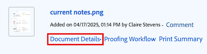

# 共用檔案

Workfront管理員可控制誰可以在「設定」的「存取層級」區域中檢視或編輯檔案。 如需詳細資訊，請參閱[授與檔案的存取權](../../administration-and-setup/add-users/configure-and-grant-access/grant-access-documents.md)。

使用者也可以分享他們已上傳或有權存取的檔案，給予其他人檢視或管理檔案的許可權。

* 許可權會套用至個別專案，並定義使用者可採取的動作。
* 上傳檔案的人會自動取得完整控制權（管理許可權）。
* 若要共用整個資料夾，請參閱[共用檔案資料夾](../../workfront-basics/grant-and-request-access-to-objects/share-a-document-folder.md)。

>[!NOTE]
>
>如果您的Workfront執行個體使用Adobe企業儲存空間，則無法共用個別檔案。 而是您要授予專案層級的存取權。 請記住，共用專案可授予對敏感專案資訊的存取權，例如財務資訊，這取決於選擇的許可權級別。

## 存取需求

+++ 展開以檢視本文中功能的存取需求。 

您必須具備下列專案才能共用物件：

<table style="table-layout:auto"> 
 <col> 
 <col> 
 <tbody> 
  <tr> 
   <td role="rowheader">Adobe Workfront計畫</td> 
   <td> 
任何 
 </td> 
  </tr> 
  <tr> 
   <td role="rowheader">Adobe Workfront授權</td> 
   <td> 
新增：標準
 
   或
   
目前：工作或以上

   </td> 
  </tr> 
  <tr> 
   <td role="rowheader">存取層級設定</td> 
   <td> 
檢視您要共用之物件的存取許可權或以上許可權
 </td> 
  </tr> 
  <tr> 
   <td role="rowheader">物件許可權</td> 
   <td> 
檢視您要共用之物件的許可權或更高的許可權
</td> 
  </tr> 
 </tbody> 
</table>

如需詳細資訊，請參閱Workfront檔案中的[存取需求](/help/quicksilver/administration-and-setup/add-users/access-levels-and-object-permissions/access-level-requirements-in-documentation.md)。

+++

## 共用檔案

依預設，將檔案上傳至Workfront的使用者擁有檔案管理許可權。

{{step1-to-documents}}

1. 在&#x200B;**檔案**&#x200B;頁面上，暫留在您要共用的檔案上，然後按一下出現的&#x200B;**檔案詳細資料**&#x200B;連結。 **檔案詳細資料**&#x200B;頁面隨即開啟。

   

1. 按一下檔名稱右側的&#x200B;**更多**&#x200B;圖示，然後按一下&#x200B;**共用**。 **共用[檔名稱]**&#x200B;對話方塊開啟。

   

1. 在&#x200B;**授與檔案存取權**&#x200B;欄位中，開始輸入您要共用檔案的使用者、團隊、角色、群組或公司的名稱，然後當名稱出現在下拉式清單中時按一下該名稱。

   >[!TIP]
   >
   >您只能與作用中使用者、團隊、角色或公司共用檔案。

1. （選擇性）選取&#x200B;**誰有存取權**&#x200B;下拉式清單，並選取檔案的存取層級：

   * **只有受邀者才能存取：**&#x200B;只有受邀加入檔案的使用者才能存取（預設）。
   * **系統中的每個人都可以檢視**：系統中的所有使用者都可以在沒有邀請的情況下檢視檔案。

1. （選擇性）若要公開檔案，請按一下齒輪圖示，然後按一下與&#x200B;**內嵌的方塊**。 **複製公開連結**&#x200B;按鈕會出現在對話方塊底部。

1. 按一下使用者名稱右側的下拉式清單，並選取他們對於此檔案的許可權層級：

   * **檢視**：使用者可以檢閱和共用檔案。
   * **管理**：使用者擁有檔案的完整存取權，但沒有管理許可權，這些許可權是在存取層級授予的（也包含所有檢視許可權）。

1. （選擇性）按一下您已授與的許可權層級旁的進階選項圖示，以設定檔案的特定許可權。

   

1. （選擇性）若要關閉檔案子物件的繼承許可權，請按一下&#x200B;**關閉**&#x200B;內嵌&#x200B;**繼承許可權**。

1. （視條件而定）若要複製可讓您與外部使用者共用檔案的公用連結，請按一下&#x200B;**複製公用連結**。

   >[!CAUTION]
   >
   >建議您將包含機密資訊的檔案與外部使用者共用時務必謹慎。 這可讓他們檢視資訊，而不需要身為Workfront使用者或屬於您的組織。

1. 按一下「**儲存**」。

## 大量共用檔案

{{step1-to-documents}}

1. 在&#x200B;**檔案**&#x200B;頁面上的&#x200B;**所有檔案**&#x200B;索引標籤中，按住鍵盤上的&#x200B;**Command** (Mac)或&#x200B;**Ctrl** (Windows)，然後按一下您要共用的每個檔案。

1. 在頁面頂端按一下&#x200B;**共用**&#x200B;圖示。 共用強制回應視窗隨即開啟。

   

1. 在&#x200B;**授與檔案存取權**&#x200B;欄位中，開始輸入您要共用檔案的使用者、團隊、角色、群組或公司的名稱，然後當名稱出現在下拉式清單中時按一下該名稱。

   >[!TIP]
   >
   >您只能與作用中使用者、團隊、角色或公司共用檔案。

1. （選擇性）選取&#x200B;**誰有存取權**&#x200B;下拉式清單，並選取檔案的存取層級：

   * **只有受邀者才能存取：**&#x200B;只有受邀加入檔案的使用者才能存取（預設）。
   * **系統中的每個人都可以檢視**：系統中的所有使用者都可以在沒有邀請的情況下檢視檔案。

1. 按一下使用者名稱右側的下拉式清單，然後選取他們對檔案的許可權層級：

   * **檢視**：使用者可以檢閱和共用檔案。
   * **管理**：使用者擁有無管理許可權之檔案的完整存取權，這些許可權是在存取層級授與的（也包含所有檢視許可權）。

1. （可選）按一下您已授與的許可權層級旁的進階選項圖示，以設定檔案的特定許可權。

   

1. 按一下「**儲存**」。

## 與Adobe企業儲存空間共用檔案

Workfront正轉換至Adobe企業儲存解決方案，以提供與Adobe Creative Cloud產品的更佳連線能力。 現有客戶將分階段移至新模型。 如需有關Adobe企業儲存體優點詳細資訊，請造訪[Adobe企業儲存體概觀](/help/quicksilver/review-and-approve-work/esm-overview.md)。

如果您的Workfront執行個體使用Adobe企業儲存空間，您無法直接共用個別檔案。 而是必須授與專案層級的存取權。

>[!IMPORTANT]
>
>共用專案也可能讓使用者存取敏感的專案資訊，例如財務資訊，視您選擇的許可權層級而定。
>
>共用前，請務必仔細檢閱許可權設定。

## 檔案許可權

許可權專屬於Workfront中的一個專案，可定義使用者可對該專案執行的動作。 如需物件許可權的相關資訊，請參閱[物件許可權共用簡介](../../workfront-basics/grant-and-request-access-to-objects/sharing-permissions-on-objects-overview.md)。

下表顯示當允許使用者檢視或管理檔案時，您可以授予他們哪些許可權：

<table border="2" cellspacing="15" cellpadding="1"> 
 <col> 
 <col> 
 <col> 
 <thead> 
  <tr> 
   <th> 
<strong>動作</strong> 
 </th> 
   <th> 
<strong>管理</strong> 
 </th> 
   <th> 
<strong>檢視</strong> 
 </th> 
  </tr> 
 </thead> 
 <tbody> 
  <tr> 
   <td scope="row">建立</td> 
   <td>✓</td> 
   <td> </td> 
  </tr> 
  <tr> 
   <td scope="row">編輯檔案詳細資訊</td> 
   <td>✓</td> 
   <td> </td> 
  </tr> 
  <tr> 
   <td scope="row">刪除*</td> 
   <td>✓</td> 
   <td> </td> 
  </tr> 
  <tr> 
   <td scope="row">下載</td> 
   <td>✓</td> 
   <td>✓</td> 
  </tr> 
  <tr> 
   <td scope="row">簽出</td> 
   <td>✓</td> 
   <td> </td> 
  </tr> 
  <tr> 
   <td scope="row">新增核准者</td> 
   <td>✓</td> 
   <td> </td> 
  </tr> 
  <tr> 
   <td scope="row">核准檔案</td> 
   <td>✓</td> 
   <td>✓</td> 
  </tr> 
  <tr> 
   <td scope="row">附加自訂表單</td> 
   <td>✓</td> 
   <td> </td> 
  </tr> 
  <tr> 
   <td scope="row">編輯自訂欄位</td> 
   <td>✓</td> 
   <td> </td> 
  </tr> 
  <tr> 
   <td scope="row">移動至（物件）</td> 
   <td>✓</td> 
   <td> </td> 
  </tr> 
  <tr> 
   <td scope="row">傳送至（整合）</td> 
   <td>✓</td> 
   <td> </td> 
  </tr> 
  <tr> 
   <td scope="row">更新/評論</td> 
   <td>✓</td> 
   <td>✓</td> 
  </tr> 
  <tr> 
   <td scope="row">上傳新版本</td> 
   <td>✓</td> 
   <td> </td> 
  </tr> 
  <tr> 
   <td scope="row">刪除版本</td> 
   <td>✓</td> 
   <td> </td> 
  </tr> 
  <tr> 
   <td scope="row">檢視檔案</td> 
   <td>✓</td> 
   <td>✓</td> 
  </tr> 
  <tr> 
   <td scope="row">預覽</td> 
   <td>✓</td> 
   <td>✓</td> 
  </tr> 
  <tr> 
   <td scope="row">證明**</td> 
   <td>✓</td> 
   <td>✓</td> 
  </tr> 
  <tr> 
   <td scope="row">產生校訂**</td> 
   <td>✓</td> 
   <td> </td> 
  </tr> 
  <tr> 
   <td scope="row">移除校訂**</td> 
   <td>✓</td> 
   <td> </td> 
  </tr> 
  <tr> 
   <td scope="row">共用*</td> 
   <td>✓</td> 
   <td>✓</td> 
  </tr> 
  <tr> 
   <td scope="row">共用系統範圍*</td> 
   <td>✓</td> 
   <td> </td> 
  </tr> 
  <tr> 
   <td scope="row">公開共用檔案*</td> 
   <td>✓</td> 
   <td> </td> 
  </tr> 
  <tr> 
   <td scope="row">與外部電子郵件地址共用</td> 
   <td> </td> 
   <td>✓</td> 
  </tr> 
  <tr> 
   <td scope="row">新增/移除</td> 
   <td>✓</td> 
   <td>✓</td> 
  </tr> 
  <tr> 
   <td scope="row">重新命名</td> 
   <td>✓</td> 
   <td> </td> 
  </tr> 
  <tr> 
   <td scope="row">連結（與整合）</td> 
   <td>✓</td> 
   <td>✓</td> 
  </tr> 
  <tr> 
   <td scope="row">取消連結（與整合）</td> 
   <td>✓</td> 
   <td> </td> 
  </tr> 
 </tbody> 
</table>

&#42;動作由檔案和檔案資料夾共用。

&#42;&#42;您必須擁有與您的Workfront帳戶相關聯的個別校訂授權，才能校訂檔案。 請聯絡您的客戶經理，瞭解如何取得校訂授權。 如需Workfront中校訂的詳細資訊，請參閱[校訂](../../review-and-approve-work/proofing/proofing.md)。

## 關於共用檔案的考量事項

除了下列考量事項外，另請參閱[物件共用許可權概觀](../../workfront-basics/grant-and-request-access-to-objects/sharing-permissions-on-objects-overview.md)。

>[!NOTE]
>
>Workfront管理員可以新增或移除系統中所有使用者的任何專案許可權，而無需擁有這些專案。

* 共用檔案類似於在Workfront中共用任何其他物件。 如需有關如何在Workfront中共用檔案的資訊，請參閱[共用物件](../../workfront-basics/grant-and-request-access-to-objects/share-an-object.md)。
* 您可以將下列許可權授與檔案：

   * 檢視
   * 管理

* 您也可以公開或全系統共用檔案。

  >[!CAUTION]
  >
  >建議您將包含機密資訊的物件與外部使用者共用時務必謹慎。 這可讓他們檢視資訊，而不需要身為Workfront使用者或屬於您的組織。

* 如果某人沒有Workfront帳戶，您可以在「將檔案存取權授予」欄位中新增其電子郵件地址，以與他共用檔案。
* 當您共用檔案時，使用者對所有檔案版本和所有檔案校訂都擁有相同的存取權。\
  如需Workfront中校訂的詳細資訊，請參閱[校訂](../../review-and-approve-work/proofing/proofing.md)區段。

* 您可以從檔案相關聯的物件繼承檔案的許可權。 您的Workfront管理員可以限制存取層級中檔案的許可權繼承。

  如需有關限制檔案繼承許可權的詳細資訊，請參閱[建立或修改自訂存取層級](../../administration-and-setup/add-users/configure-and-grant-access/create-modify-access-levels.md)。

  您可以手動移除檔案的繼承許可權。 如需詳細資訊，請參閱[從物件移除許可權](../../workfront-basics/grant-and-request-access-to-objects/remove-permissions-from-objects.md)

* 附加的檔案只會從附加它的物件繼承許可權。 如果您在物件上建立資料夾並將檔案移至資料夾，則會繼承資料夾的許可權。 但是，如果您在父項或祖項物件上建立資料夾，並將檔案移至該資料夾，則不會繼承該資料夾的許可權。