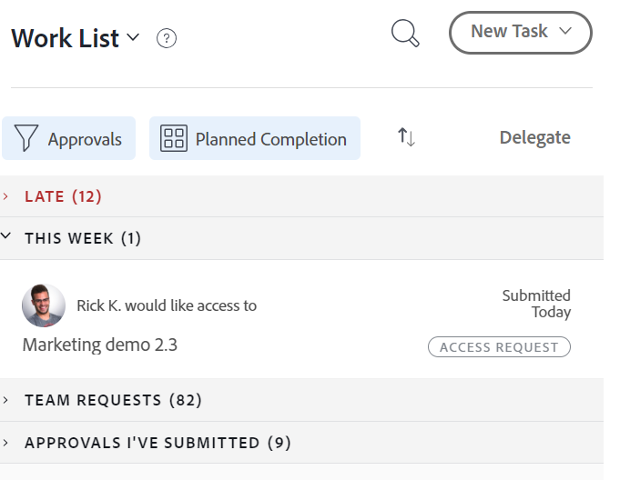

# 授予「首頁」區域中物件的存取權

使用者可以要求存取Adobe Workfront中的物件。 如需請求存取許可權的詳細資訊，請參閱  [要求存取物件](../../workfront-basics/grant-and-request-access-to-objects/request-access.md)。

如果您是物件的擁有者，則可以在首頁區域授予或拒絕專案存取權。

## 存取需求

<!--drafted for P&P:

<table style="table-layout:auto"> 
 <col> 
 <col> 
 <tbody> 
  <tr> 
   <td role="rowheader">Adobe Workfront plan*</td> 
   <td> 
Any
 </td> 
  </tr> 
  <tr> 
   <td role="rowheader">Adobe Workfront license*</td> 
   <td> 
Current license: Standard
 
   Or
   
Legacy license: Work or higher

   </td> 
  </tr> 
  <tr> 
   <td role="rowheader">Access level configurations*</td> 
   <td> 
View access or higher to projects, tasks, issues, or documents
 
<b>NOTE</b>
   
   If you still don't have access, ask your Workfront administrator if they set additional restrictions in your access level. For information on how a Workfront administrator can modify your access level, see <a href="../../administration-and-setup/add-users/configure-and-grant-access/create-modify-access-levels.md" class="MCXref xref">Create or modify custom access levels</a>.
 </td> 
  </tr> 
  <tr> 
   <td role="rowheader">Object permissions</td> 
   <td> 
View permissions or higher to projects, tasks, issues, or documents
 
For information on requesting additional access, see <a href="../../workfront-basics/grant-and-request-access-to-objects/request-access.md" class="MCXref xref">Request access to objects </a>.
 </td> 
  </tr> 
 </tbody> 
</table>

-->

您必須具有下列存取權才能執行本文中的步驟：

<table style="table-layout:auto"> 
 <col> 
 <col> 
 <tbody> 
  <tr> 
   <td role="rowheader">Adobe Workfront計畫*</td> 
   <td> 
任何
 </td> 
  </tr> 
  <tr> 
   <td role="rowheader">Adobe Workfront授權*</td> 
   <td> 
工作或更高
 </td> 
  </tr> 
  <tr> 
   <td role="rowheader">存取層級設定*</td> 
   <td> 
檢視專案、任務、問題或檔案的存取權或以上許可權
 
<b>附註</b>

如果您還是沒有存取權，請詢問您的Workfront管理員，他們是否在您的存取層級中設定其他限制。 如需Workfront管理員如何修改存取層級的詳細資訊，請參閱<a href="../../administration-and-setup/add-users/configure-and-grant-access/create-modify-access-levels.md" class="MCXref xref">建立或修改自訂存取層級</a>。
 </td>
</tr> 
  <tr> 
   <td role="rowheader">物件許可權</td> 
   <td> 
檢視專案、任務、問題或檔案的許可權或更高
 
如需請求其他存取權的資訊，請參閱<a href="../../workfront-basics/grant-and-request-access-to-objects/request-access.md" class="MCXref xref">請求物件</a>的存取權。
 </td> 
  </tr> 
 </tbody> 
</table>

&#42;若要瞭解您擁有的計畫、授權型別或存取權，請連絡您的Workfront管理員。

## 授予「首頁」區域中物件的存取權

1. 按一下Adobe Workfront左上角的&#x200B;**首頁**&#x200B;圖示。

   >[!NOTE]
   >
   >您的Workfront管理員可能會對您環境中的「首頁」圖示進行下列變更：
   >
   >* 以自訂的影像取代，以說明您的組織。 在此情況下，圖示看起來將會與本文中顯示的有所不同。
   >* 使用其他頁面取代連結至該頁面的頁面。 在此情況下，請按一下頁面右上角的&#x200B;**主要功能表** ，然後按一下&#x200B;**首頁**。

1. （視條件而定）在舊版「首頁」區域中，執行下列動作：

   1. 在&#x200B;**工作清單**&#x200B;中，選取您要在&#x200B;**核准**&#x200B;區段中管理的存取要求。

   

   請求會顯示在工作清單的右側。

   1. 在右上角，按一下授予存取權按鈕。\
      根據要求的存取型別，按鈕名稱會變更。 例如，如果要求者要求檢視存取權，按鈕會顯示&#x200B;**授與檢視存取權**。\
      

   1. （選擇性）若要授與不同於要求的存取層級存取權，請按一下授與存取權按鈕旁的箭頭，並選取新的存取權，然後按一下&#x200B;**授與&lt;許可權層級>存取權>**。\
      系統會顯示訊息，確認已授予存取權。

   1. （選擇性）按一下&#x200B;**忽略**&#x200B;以拒絕存取。\
      系統會顯示訊息，確認已忽略存取。

1. （視條件而定）從新的「首頁」區域，執行下列動作：

   1. 移至&#x200B;**等待我的核准** Widget並尋找更多存取權的要求，然後按一下&#x200B;**授與存取權**。

      

   1. （選擇性）若要授與不同層級的存取權，請按一下[授與存取權]按鈕左側的下拉式功能表，並選取新的存取權，然後按一下[授與存取權]。****

      存取請求被授予，並從核准請求清單中消失。

   1. （選擇性）按一下&#x200B;**忽略**&#x200B;以拒絕存取。 未授予存取要求，且要求會從核准要求清單中消失。

## 設定請求的電子郵件通知

您可以設定是否要收到存取請求的電子郵件通知。 您的Workfront管理員可以停用此功能（如[為系統中的每個人設定事件通知](../../administration-and-setup/manage-workfront/emails/configure-event-notifications-for-everyone-in-the-system.md)中所述）。

1. 按一下Adobe Workfront右上角的&#x200B;**主要功能表**&#x200B;圖示，然後按一下&#x200B;**設定** 。

1. 按一下「**偏好設定**」，或捲動至「偏好設定」區段。
1. 在&#x200B;**傳送電子郵件給我（當**）下拉式清單中，選取或取消選取&#x200B;**某人向我要求存取權**，這取決於您是否要在其他使用者向您要求存取權時收到電子郵件通知。

1. 按一下「**儲存變更**」。
