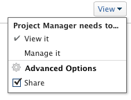

# 共用報表、控制面板和日曆

Adobe Workfront管理員會授予使用者在指派存取層級時，可檢視或編輯報表、控制面板和日曆的存取權。 如需授與報表、控制面板和日曆存取權的詳細資訊，請參閱 [授予對報表、控制面板和日曆的存取權](../../administration-and-setup/add-users/configure-and-grant-access/grant-access-reports-dashboards-calendars.md).

除了授予使用者的存取層級之外，您也可以授予使用者檢視或管理您有權存取「共用」的特定報表、控制面板或日曆的權限。 有關授予用戶對對象的共用權限的資訊，請參閱 [對象共用權限概述](../../workfront-basics/grant-and-request-access-to-objects/sharing-permissions-on-objects-overview.md).

權限是Workfront中一個項目專屬的權限，並定義可對該項目採取的動作。

如需每個存取層級的使用者可針對問題執行哪些動作的相關資訊，請參閱區段 [報表](../../administration-and-setup/add-users/access-levels-and-object-permissions/functionality-available-for-each-object-type.md#reports) 在文章中 [每種物件類型皆可使用的功能](../../administration-and-setup/add-users/access-levels-and-object-permissions/functionality-available-for-each-object-type.md).

## 共用報表、控制面板或日曆的考量事項

除了下列考量事項外，另請參閱 [對象共用權限概述](../../workfront-basics/grant-and-request-access-to-objects/sharing-permissions-on-objects-overview.md).

>[!NOTE]
>
>Workfront管理員可以為所有使用者新增或移除系統中任何項目的權限，而不是這些項目的擁有者。

* 報表、控制面板或日曆的建立者預設具有其「管理」權限。
* 共用報表、控制面板和日曆與在Workfront中共用任何其他物件類似。

   如需如何在Workfront中共用物件的詳細資訊，請參閱 [共用物件](../../workfront-basics/grant-and-request-access-to-objects/share-an-object.md).

   另請參閱下列文章，了解如何共用報表、控制面板和日曆：

   * [在Adobe Workfront中共用報表](../../reports-and-dashboards/reports/creating-and-managing-reports/share-report.md)
   * [共用控制面板](../../reports-and-dashboards/dashboards/creating-and-managing-dashboards/share-dashboard.md)
   * [共用日曆報表](../../reports-and-dashboards/reports/calendars/share-a-calendar-report.md)

* 您可以個別共用報表和控制面板，也可以大量共用。

   只能單獨共用日曆。 您無法大量共用。

* 您無法共用內建的系統報表。 您只能共用自訂報表。

   如需將系統報表儲存為新自訂報表的詳細資訊，請參閱 [建立報表副本](../../reports-and-dashboards/reports/creating-and-managing-reports/create-copy-report.md).

* 您可以授予報表、控制面板和日曆的下列權限：

   * 檢視

      

   * 管理

      

* 當您共用控制面板時，依預設，使用者擁有控制面板上所有報表、日曆和外部頁面的「檢視」權限。
* 擁有請求許可證的用戶無法查看系統範圍的報告。 如果請求者需要檢視報表，則必須個別與請求者共用報表。
* 如果報表有提示，而您公開共用，則存取報表的使用者必須登入Workfront，才能使用提示執行報表。 如果無法登入Workfront，則會在未套用提示的情況下看到報表。\
   有關限制與提示共用報表的詳細資訊，請參閱一節 [共用提示報表的限制](../../reports-and-dashboards/reports/creating-and-managing-reports/add-prompt-report.md#limitations-of-running-public-prompted-reports) 在文章中 [新增提示至報表](../../reports-and-dashboards/reports/creating-and-managing-reports/add-prompt-report.md).

* 您可以從報表或日曆中移除繼承的權限。

   如需從物件移除繼承權限的詳細資訊，請參閱 [從對象中刪除權限](../../workfront-basics/grant-and-request-access-to-objects/remove-permissions-from-objects.md).

* 您也可以公開或全系統共用報表或行事歷。

   您無法公開共用控制面板，但可以在全系統共用。

   >[!CAUTION]
   >
   >建議您在與外部使用者共用包含機密資訊的物件時，務必小心。 這可讓使用者檢視資訊，而不需要是Workfront使用者或您組織的一員。
