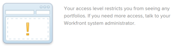

# 要求物件的存取權

您對Adobe Workfront中物件的可見性取決於您對該物件型別的存取權以及您對個別物件的許可權。

>[!NOTE]
>
>本文說明如何請求所有物件的許可權，以下物件除外：
>
>* 「Adobe Workfront情境規劃工具」中的「情境規劃工具」計畫。 如需詳細資訊，請參閱[在Scenario Planner](../../scenario-planner/request-access-to-plan.md)中要求計畫的存取權。 這需要額外的授權。
>
>* Workfront Planning中的檢視和工作區。 如需詳細資訊，請參閱[在Adobe Workfront Planning中共用許可權的總覽](/help/quicksilver/planning/access/sharing-permissions-overview.md)。 這需要額外的授權。

您的Workfront管理員會在存取層級中設定您對某個物件型別的存取權。 如需詳細資訊，請參閱[存取層級和許可權如何搭配運作](../../administration-and-setup/add-users/access-levels-and-object-permissions/how-access-levels-permissions-work-together.md)。

如果您需要Workfront中特定物件的許可權，可以請求存取許可權。 與其傳送電子郵件給Workfront管理員或物件擁有者來說明您的需求，您可以在Workfront中請求其他存取權（或許可權）。

如果有人與您共用物件的連結，您可以要求物件的初始存取權，或者您可以要求您至少檢視的物件的額外存取權。

例如，您可能有專案的檢視許可權，但您需要將任務新增至該專案。 在此情況下，您可以要求專案的Contribute許可權。

## 存取需求

+++ 展開以檢視本文中功能的存取需求。

您必須具備下列專案才能共用物件：

<table style="table-layout:auto"> 
 <col> 
 <col> 
 <tbody> 
  <tr> 
   <td role="rowheader">Adobe Workfront計畫</td> 
   <td> 
任何 
 </td> 
  </tr> 
  <tr> 
   <td role="rowheader">Adobe Workfront授權*</td> 
   <td> 
新增：標準
 
   
目前：工作或以上
 
   </td> 
  </tr> 
  <tr> 
   <td role="rowheader">存取層級設定</td> 
   <td> 
檢視您要求許可權之物件的存取權或以上許可權
 </td> 
  </tr> 
 </tbody> 
</table>

*如需詳細資訊，請參閱Workfront檔案中的[存取需求](/help/quicksilver/administration-and-setup/add-users/access-levels-and-object-permissions/access-level-requirements-in-documentation.md)。

+++

## 瞭解標準共用規則

下列標準共用規則在Workfront系統中設定為預設選項時，會自動生效。

* 指派給任務或問題的使用者擁有其Contribute存取權。
* 專案、Portfolio和方案管理員擁有其擁有的物件管理存取權。
* 對話中包含的使用者擁有對話發生之物件的檢視存取權。
* 被指派為核准者的使用者在等待核准的物件上有「檢視」存取權。
* 共用控制面板時，控制面板上的所有報告也會以相同的存取權共用給相同的使用者。
* 物件擁有者無法將存取權擴充至其對該物件的存取權之外（如管理員所定義）。

## 請求存取權

您可以要求您目前沒有存取權的物件的初始存取權，或者您可以要求您只有有限存取權的物件的額外存取權。

* [要求初始存取權](#request-initial-access)
* [要求其他存取權](#request-additional-access)

### 要求初始存取權  {#request-initial-access}

如果您尚無法存取物件，而您是從連結瀏覽至該物件，則會顯示一個畫面，通知您無權檢視資訊。

若要要求物件的初始存取權，請執行下列動作：

1. 按一下&#x200B;**要求存取權**。\
   顯示&#x200B;**要求存取**&#x200B;對話方塊。

1. （視條件而定）如果超過一位使用者擁有授予您額外存取權的適當存取權，則該使用者名稱旁邊會顯示下拉箭頭。
1. 從下拉式清單中選取您要接收存取要求的使用者。\
   下拉式清單中只會顯示10位使用者。 清單會依字母排序。\
   如需此下拉式功能表中使用者順序的詳細資訊，請參閱「要求存取」和「要求更多存取權」下拉式功能表的[階層](#hierarchy-of-the-request-access-and-request-more-access-drop-down-menus)。

1. 從下拉式清單中，選取您要求的存取型別。
1. （選擇性）在&#x200B;**P.S.**&#x200B;欄位中，指定使用者需要其他存取權原因的備註。

   

如果您沒有物件的存取層級許可權，而您嘗試透過連結存取該物件，則會顯示一個畫面，通知您聯絡Workfront管理員。

例如，如果您沒有投資組合存取權，但您獲得投資組合的連結，您會看到下列訊息：\

### 要求其他存取權 {#request-additional-access}

若要要求您已有限制存取權的物件的額外存取權：

1. 前往您要要求其他存取權的物件。

1. 按一下專案名稱右側的&#x200B;**更多**&#x200B;功能表，然後按一下&#x200B;**要求更多存取權**。

   

1. （視條件而定）如果超過一位使用者擁有授予您額外存取權的適當存取權，則該使用者名稱旁邊會顯示下拉箭頭。
1. 從下拉式清單中選取您要接收存取要求的使用者。\
   下拉式清單中只會顯示10位使用者。 清單會依字母排序。\
   如需此下拉式功能表中使用者順序的詳細資訊，請參閱「要求存取」和「要求更多存取權」下拉式功能表的[階層](#hierarchy-of-the-request-access-and-request-more-access-drop-down-menus)。

1. 從下拉式清單中，選取您要求的存取層級。
1. （選擇性）在&#x200B;**P.S.**&#x200B;欄位中，指定有關您需要額外存取權的理由的備註。
1. 按一下&#x200B;**要求存取權**。\
   

## 「要求存取權」和「要求更多存取權」下拉式功能表的階層 {#hierarchy-of-the-request-access-and-request-more-access-drop-down-menus}

* [瞭解「要求存取權」和「要求更多存取權」下拉式功能表中列出的使用者階層](#understand-the-hierarchy-of-users-listed-in-the-request-access-and-request-more-access-drop-down-menus)
* [瞭解物件的擁有者](#understand-the-owner-of-an-object)

### 瞭解「要求存取權」和「要求更多存取權」下拉式功能表中列出的使用者階層 {#understand-the-hierarchy-of-users-listed-in-the-request-access-and-request-more-access-drop-down-menus}

在物件上填入「要求存取權」或「要求更多存取權」清單時，Workfront會選取最多10名使用者的清單，這些使用者履行共用物件的各種角色，如下所述。 這些使用者可以將物件的存取權授與提出請求的使用者。\
然後產生的清單會依其名稱以遞增字母順序排序。\
Workfront會在「要求存取權」和「要求更多存取權」清單中顯示最多10名使用者。

「要求存取權」或「要求更多存取權」下拉式功能表中的使用者順序由以下規則指定：

* 清單中的第一個使用者是物件「擁有者」，如[瞭解物件的擁有者](#understand-the-owner-of-an-object)中所述。
* 然後清單會填入個別共用物件的使用者。 它們會依字母順序列出。
* 然後清單中會進一步填入使用者，這些使用者透過與其團隊、群組或公司共用而獲得所需存取權。 它們會依字母順序列出。
* 如果清單為空，則會新增Workfront管理員，以便始終有人員可向其請求存取權。 它們會依字母順序列出。
* 清單中的每個使用者都必須擁有物件的請求存取權，以及共用物件的存取權。

### 瞭解物件的擁有者 {#understand-the-owner-of-an-object}

物件的擁有者定義如下：

<table style="table-layout:auto"> 
 <col> 
 <col> 
 <thead> 
  <tr> 
   <th><strong>物件</strong> </th> 
   <th><strong>物件擁有者的定義</strong> </th> 
  </tr> 
 </thead> 
 <tbody> 
  <tr> 
   <td>專案</td> 
   <td>該所有者是專案所有者，或如果專案所有者遺失或他們沒有必要的存取權，則為父投資組合的所有者。 
他們可能與專案建立者不是同一個人。 
</td> 
  </tr> 
  <tr> 
   <td>任務</td> 
   <td>如上所述，擁有者是主要受指派人，或如果主要受指派人遺失或他們沒有必要的存取權，則為任務所在專案的擁有者。 
他們可能與任務建立者不是同一個人。 
</td> 
  </tr> 
  <tr> 
   <td>問題</td> 
   <td> 
如上所述，擁有者是問題的主要聯絡人，或如果問題遺失或他們沒有必要的存取權，則為問題所在專案的擁有者。 
 
他們可能與問題建立者不是同一個人。 
 </td> 
  </tr> 
  <tr> 
   <td>專案組合</td> 
   <td>該擁有者是Portfolio擁有者。 
他們可能與產品組合建立者不是同一個人。 
</td> 
  </tr> 
  <tr> 
   <td>文件</td> 
   <td>擁有者是檔案的擁有者（上傳檔案的使用者），如果檔案遺失或他們沒有必要的存取權，則為檔案所在物件的擁有者。</td> 
  </tr> 
  <tr> 
   <td>報告和儀表板</td> 
   <td>擁有者是建立者或報告或儀表板。 </td> 
  </tr> 
  <tr> 
   <td>行事曆</td> 
   <td>擁有者是行事曆的建立者。 依預設，所有使用者都有指派的行事曆。 他們被視為該行事曆的所有者。 </td> 
  </tr> 
  <tr> 
   <td>篩選器、視圖和分組</td> 
   <td>篩選器、檢視或分組的擁有者是建立者。 </td> 
  </tr> 
  <tr data-mc-conditions="QuicksilverOrClassic.Quicksilver"> 
   <td>計畫 </td> 
   <td> 
擁有者是計畫的建立者。 
 
這需要額外的授權。 
 
如需Workfront情境規劃工具的相關資訊，請參閱 <a href="../../scenario-planner/scenario-planner-overview.md" class="MCXref xref">情境規劃工具概觀</a>。
 </td> 
  </tr> 
  <tr data-mc-conditions="QuicksilverOrClassic.Quicksilver"> 
   <td>目標</td> 
   <td> 
擁有者是指定為擁有者的使用者。 他們可能與目標建立者不是同一個人。 
 
這需要額外的授權。 
 
如需Workfront目標的相關資訊，請參閱<a href="../../workfront-goals/goal-management/wf-goals-overview.md" class="MCXref xref">Adobe Workfront目標總覽</a>。 
 </td> 
  </tr> 
 </tbody> 
</table>

