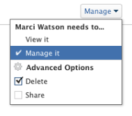

# 共用產品組合

Adobe Workfront管理員可在指派存取層級時，授予您檢視或編輯產品組合的存取權。 您必須擁有計畫許可證才能訪問編輯產品組合。 如需詳細資訊，請參閱 [授予產品組合的存取權](../../administration-and-setup/add-users/configure-and-grant-access/grant-access-portfolios.md).

除了您獲得的存取層級之外，您也可以接收權限，供可與您共用的使用者檢視或管理特定產品組合。 如需存取層級和權限的詳細資訊，請參閱 [存取層級與權限如何搭配運作](../../administration-and-setup/add-users/access-levels-and-object-permissions/how-access-levels-permissions-work-together.md).

權限是Workfront中一個項目專屬的權限，並定義使用者可對該項目採取的動作。

## 共用產品組合的考量事項

除了下列考量事項外，另請參閱 [對象共用權限概述](../../workfront-basics/grant-and-request-access-to-objects/sharing-permissions-on-objects-overview.md).

>[!NOTE]
>
>Workfront管理員可以為所有使用者新增或移除系統中任何項目的權限，而不是這些項目的擁有者。

* 產品組合的建立者預設具有其「管理」權限。
* 您可以個別共用一個產品組合，也可以同時共用數個產品組合。 共用產品組合與在Workfront中共用其他物件相同。 如需詳細資訊，請參閱 [共用物件](../../workfront-basics/grant-and-request-access-to-objects/share-an-object.md).

* 您只能授予Portfolio的「檢視」或「管理」權限。

       

* 當您共用產品組合時，預設情況下，用戶會繼承與產品組合關聯的所有子對象的相同權限。

   如需Workfront中物件階層的詳細資訊，請參閱 [了解Adobe Workfront中的物件](../../workfront-basics/navigate-workfront/workfront-navigation/understand-objects.md).

* 您可以從Portfolio中移除繼承的權限。 如需從物件移除權限的詳細資訊，請參閱 [從對象中刪除權限](../../workfront-basics/grant-and-request-access-to-objects/remove-permissions-from-objects.md).

## Portfolio權限

下表顯示當允許使用者檢視或管理Portfolio時，您可授予哪些權限：

| **動作** | **管理** | **檢視** |
|---|---|---|
| 編輯Portfolio詳細資訊 | ✓ |   |
| 檢視Portfolio | ✓ | ✓ |
| 刪除Portfolio | ✓ |   |
| 附加自訂表單 | ✓ |   |
| 編輯自訂欄位 | ✓ |   |
| 添加或刪除程式&#42; | ✓ |   |
| 新增或移除專案&#42; | ✓ |   |
| 核准專案 | ✓ |   |
| Portfolio最佳化&#42; | ✓ |   |
| 添加文檔資料夾&#42; | ✓ | ✓ |
| 添加文檔 | ✓ | ✓ |
| 更新/注釋 | ✓ | ✓ |
| 共用 | ✓ | ✓ |
| 共用全系統 |   | ✓ |

*這些權限由訪問級別和其他對象（如項目、程式、文檔）的權限控制。
